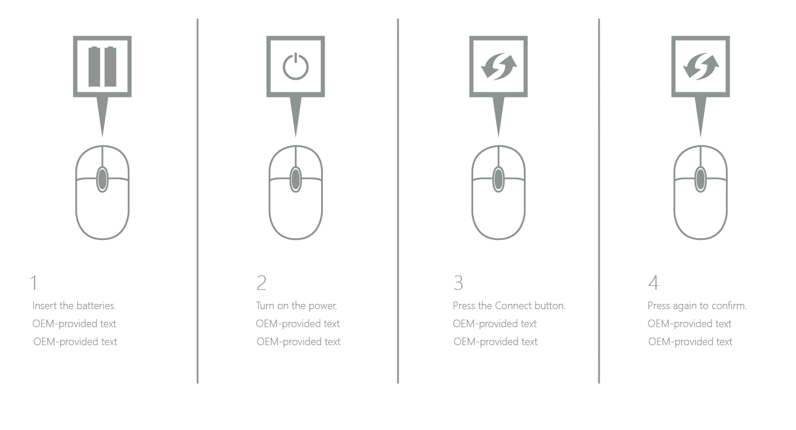
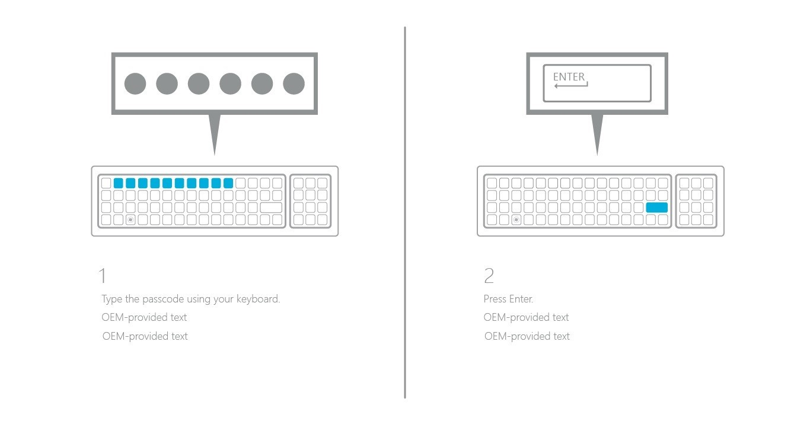

# OEM HID pairing

You can provide clear and precise Human Interface Device (HID) pairing instructions within OOBE to enable customers who buy new PCs running Windows 10 with an unpaired wireless mouse and keyboard to finish their PC setup. For this feature to work, the mouse and/or keyboard must be included with the PC, and the PC must not have any other mice or keyboards attached or connected to it. For example, laptops are not qualified for this feature.

The following conditions should be met to correctly display HID pairing screens during OOBE:

* The PC must have Bluetooth capability and Bluetooth must be turned on.
* The Bluetooth radio must be certified for Windows 10.
* For the keyboard pairing page to appear, you must ensure that no wired keyboard is connected to the PC.
* For the mouse pairing page to appear, you must ensure that no wired mouse is connected to the PC.
* Oobe.xml settings in the `<hidsetup>` section should be provided for the corresponding pairing pages.

We recommend that OEMs include Bluetooth radios with HEM to provide a working end-to-end scenario, because there is no Bluetooth support in the BIOS before Windows loads. The radio looks like a USB mouse and keyboard to the PC and takes over the Bluetooth communication to the mouse and keyboard. This lets the devices work outside of Windows and allows customers to use their paired Bluetooth mouse and keyboard during BIOS.

> [!Important]
> The OOBE.xml file that has HID pairing instructions must be used only for PCs that use the OOBE HID pairing feature. For PCs that don't use the OOBE HID pairing feature, a different OOBE.xml file that doesn’t contain the HID pairing instructions must be used. Otherwise, there’s a risk that users might go through the HID pairing experience even if they don't need to or can’t use this feature.

## Configure OOBE.xml

On PCs that ship with an unpaired wireless mouse and keyboard, the HID pairing screens are shown to the customer during the first experience, which is before language selection or any other screen that requires user input in OOBE. You can also choose to include written instructions, however, if you do this you must include those instructions in every language that ships with the PC.

To provide a thorough, reliable, and satisfactory HID pairing experience, OEMs who ship these systems must include the following Oobe.xml settings:

| Oobe.xml setting          | Description                                                       |
|:--------------------------|:------------------------------------------------------------------|
| \<mouseImagePath>         | The path to a mouse pairing instruction image. The three steps customers typically perform are inserting batteries into the mouse, turning on the power, and turning on Bluetooth.                                                                             |
| \<mouseErrorImagePath>    | The path to a mouse pairing error image. If the customer can't pair the mouse in three tries, this error screen appears.    |
| \<keyboardImagePath>      | The path to a keyboard pairing instruction image. The first three steps customers typically perform are inserting batteries into the keyboard, turning on power, and turning on Bluetooth. You can include these steps in the first image. Usually the second set of steps customers need to perform are entering a password or code and pressing Enter.                                                                                                |
| \<keyboardPINImagePath>   | The path to a keyboard pairing instruction image.                       |
| \<keyboardErrorImagePath> | The path to a keyboard pairing error image. If the customer can't pair the keyboard in five tries, this error screen appears. This should tell the customer to connect a wired keyboard.                                                                          |
| \<mouseText>              | Help text that displays at the bottom of the page.                      |
| \<mouseErrorText>         | Error that displays to users along with mouse pairing error image.      |
| \<keyboardErrorText>      | Error that displays to users along with keyboard pairing error image.   |
| \<keyboardText>           | Specifies the text to prompt the user to pair the keyboard.             |
| \<keyboardPINText>        | Specifies the prompt text for the user to enter a pin for the keyboard. |

Any text in the Oobe.xml file or files — for example, any text in the `<mouseText>` setting — is the text read by the Narrator, so make sure the text is clear, concise, and easy to understand. Cortana shares duties with Narrator, so that Cortana speaks the UI display text and Narrator speaks the instructional text.

For more information on these settings, see [Oobe.xml settings](https://docs.microsoft.com/en-us/windows-hardware/manufacture/desktop/oobexml-settings)

## Guidelines for images

We recommend that you use photorealistic images of the HID devices that ship with the system. This will help customers realize that the instructions you provide apply to the hardware they have just purchased. The illustration examples we've provided are generic. We do not use photorealistic images so our documentation does not appear to apply to any one device or hardware partner.

Generic images decrease confidence and increase confusion for customers, who want images on the screen to match the devices they're trying to use. Also, include visual instructions for the actions customers must take to pair their new hardware. For example, if the first step is to insert batteries into the device, include an image of batteries near the device.

> [!Note]
> Images must not be larger than 630 x 372 pixels. Images are scaled to fit in portrait mode or on small form factors.

These illustrations are examples of how HID pairing instructions might look:

### Example 1: Image for mouse pairing



### Example 2: Image for keyboard pairing



## XML example

```xml
<hidSetup>
       <mouseImagePath>c:\fabrikam\MouseFirstInstruction.png</mouseImagePath>
       <mouseText>Set up your Fabrikam mouse. Insert batteries, turn on, and press the Bluetooth button.</mouseText>
       <mouseErrorImagePath>c:\fabrikam\MouseError.png</mouseErrorImagePath>
       <mouseErrorText>An error has occurred. Please contact Fabrikam.</mouseErrorText>
       <keyboardImagePath>c:\fabrikam\KeyboardFirstInstruction.png</keyboardImagePath>
       <keyboardText>Set up your Fabrikam keyboard. Insert batteries, turn on, and press the Bluetooth button.</keyboardText>
       <keyboardPINImagePath>c:\fabrikam\KeyboardSecondInstruction.png</keyboardPINImagePath>
       <keyboardPINText>Enter PIN and press the Enter key.</keyboardPINText>
       <keyboardErrorImagePath>C:\fabrikam\KeyboardError.png</keyboardErrorImagePath>
       <keyboardErrorText>An error has occurred. Please contact Fabrikam.</keyboardErrorText>
</hidSetup>
```