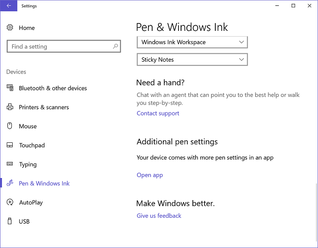

# CustomProtocol

`CustomProtocol` specifies that you are using your own advanced Pen settings application. The Pen and Windows Ink Settings page will display a link to your advanced settings app (labeled **Open app** in the screenshot below) under the heading **Additional Pen Settings**.



## Value

| Value                     | Description                                                       |
|:--------------------------|:------------------------------------------------------------------|
| *oem-app*                 | Specifies the name your advanced Pen settings application. For example, the registry entry produced by this setting could be `[HKEY_LOCAL_MACHINE\SOFTWARE\Microsoft\Windows\CurrentVersion\ClickNote\OemCustomizationSettingsApp] "CustomProtocol"="ms-surface-app"` |

## Parent Hierarchy

[Microsoft-Windows-TwinUI](microsoft-windows-twinui.md) | **CustomProtocol**

## Valid Configuration Passes

offlineServicing

## Applies To

For a list of the supported Windows editions and architectures that this component supports, see [Microsoft-Windows-TwinUI](microsoft-windows-twinui.md).

## XML Example

The following XML output shows how to set the CustomProtocol settings. Replace **bingsports** with the name of your app.

```xml
<?xml version="1.0" encoding="UTF-8"?><unattend xmlns="urn:schemas-microsoft-com:unattend">
<settings pass="offlineServicing">
<component language="neutral" xmlns:xsi="http://www.w3.org/2001/XMLSchema-instance" xmlns:wcm="http://schemas.microsoft.com/WMIConfig/2002/State" versionScope="nonSxS" publicKeyToken="31bf3856ad364e35" processorArchitecture="amd64" name="Microsoft-Windows-TwinUI">
<CustomProtocol>bingsports</CustomProtocol>
<DoubleClickBelowLockOverride>0</DoubleClickBelowLockOverride>
<LongPressBelowLockOverride>0</LongPressBelowLockOverride>
<SingleClickBelowLockOverride>0</SingleClickBelowLockOverride>
</component>
</settings>
<cpi:offlineImage xmlns:cpi="urn:schemas-microsoft-com:cpi" cpi:source="wim:d:/install.wim#Windows 10 Enterprise Technical Preview"/>
</unattend>
```