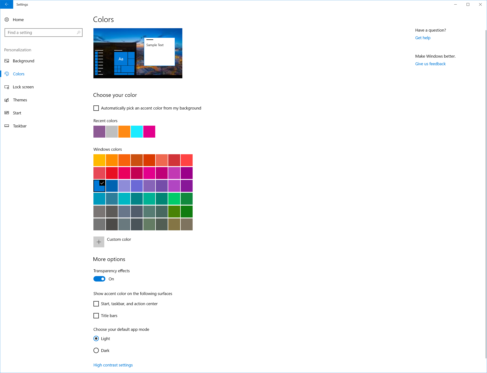

# WindowColor


`WindowColor` specifies the color of the window borders and the color of various other elements in the system, most notably colors in the Start menu, calendar fly-out, common controls, active-underline for open apps in the taskbar, and Quick Action tiles in the notification area. 

It can also control the color of additional surfaces, if the user has selected those options in the Colors section of their **Personalization** settings. The user can also choose to apply the Accent color to Start, taskbar, and action center as well as title bars (as shown below).

 

## Values


In Windows 10, there are no predefined colors. All the named colors (`Color 1` through `Color 15`) are deprecated and have no effect if set. 

There are two options for setting `WindowColor` in unattend.xml.

1.   Set `WindowColor` to `Automatic`. Use this value to select a color that’s harmonious with the color palette of the desktop wallpaper. `Automatic` sets `WindowColor` to a color that is harmonious with the color palette of the desktop wallpaper will be chosen.
The default color is a shade of blue (`0xff0078d7`).
2.   Use a custom hexidecimal color value. When using custom hexidecimal color values, the accent color is defined by the ARGB color scheme, where the value is 0x[Opacity][Red][Green][Blue], for example `0xffcc5029`. This value has an A or Alpha value of `ff` hexadecimal, then a red value of `9b`, a green value of `cc`, and a blue value of `29` hexadecimal. Any letters in the hexadecimal value should be lowercase, and the value must include the `0x` prefix. The ARGB color `0xff9bcc29` looks like this:

    

    The opacity (also known as alpha) value is ignored and has no bearing on the color. `00` is completely transparent, and `ff` is fully opaque. 
    To learn more about ARGB values, see the [Color.ToArgb Method ()](https://msdn.microsoft.com/en-us/library/system.drawing.color.toargb(v=vs.110).aspx).

Due to the large number of surfaces that are impacted by the color choice, avoid using colors that are too dark or too bright when setting `WindowColor`. The brightness of the selected color is enforced by the system to ensure readability of text. A very dark or light color will be lightened or darkened by the system. The specified `WindowColor` should have a luminosity range of 25% to 75% when converted to Hue, Saturation, and Luminosity (HSL) values. It is recommended that you use a tool that supports HSL to select your color and adjust the luminosity to be within a 25% to 75% range before you convert it to RGB to specify the WindowColor. This means that both black and white are prohibited values for WindowColor. Any color outside a luminosity value of 25% to 75% is changed by Windows. If you pick white, for instance, you will get light grey. 


### Add more custom colors

You can also add up to eight more custom colors that end users can choose as an Accent color in the Colors section of their **Personalization** settings. These additional custom colors appear as options under **Recent Colors**. If the end user chooses one of these colors, it will be applied to the same UI areas as the `WindowColor`.

>[!Note]
> If you use five or fewer custom colors, the color picker in the Settings app displays them more gracefully. If you use the full eight colors, you will see line breaks and reflow in the Settings app.

To add custom colors to the image, use the [RunSynchronous](microsoft-windows-deployment-runsynchronous) command to add AGRB hex color values to the registry. You can set keys 0 through 8. The default accent color is set in the 0 registry key: `HKLM\SOFTWARE\Microsoft\Windows\CurrentVersion\Themes\Accents\0\Theme0`


## Valid Configuration Passes


specialize

auditSystem

auditUser

oobeSystem

## Parent Hierarchy


[Microsoft-Windows-Shell-Setup](microsoft-windows-shell-setup.md) | [Themes](microsoft-windows-shell-setup-themes.md) | **WindowColor**

## Applies To


For a list of the Windows editions and architectures that this component supports, see [Microsoft-Windows-Shell-Setup](microsoft-windows-shell-setup.md).

## XML Examples


The following XML output shows how to set the default `WindowColor` to match the color palette of the desktop wallpaper.

```
<Themes>
    <ThemeName>Test</ThemeName>
    <WindowColor>Automatic</WindowColor>
    <DesktopBackground>C:\Windows\Web\Screen\img104.jpg</DesktopBackground>
</Themes>
```

## Related topics


[Themes](microsoft-windows-shell-setup-themes.md)

 

 


