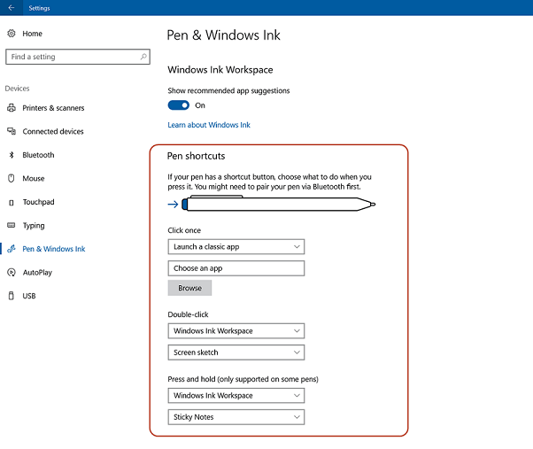

# Microsoft-Windows-TwinUI-Hide

`Microsoft-Windows-TwinUI-Hide` specifies whether to hide the Pen shortcut settings in the Pen and Windows Ink Settings page. This enables you to hide the Pen shortcut settings UI on devices that are not compatible with Pen input.



You can also hide the Pen shortcut settings using the registry. To do this, add a DWORD value of `Hide` to the following registry key:

`HKEY_LOCAL_MACHINE\SOFTWARE\Microsoft\Windows\CurrentVersion\ClickNote\OemCustomizationPenShortcuts`

## Values

| Value      | Description                                                       |
|:-----------|:------------------------------------------------------------------|
| 0          | Show the link. This is the default value.                         |
| 1          | Hide the link.                                                    |

## Parent Hierarchy

[Microsoft-Windows-TwinUI-Tasks](microsoft-windows-twinui.md) | **Hide**

## Valid Configuration Passes

offlineServicing
Specialize
oobeSystem

## Applies To

For a list of the supported Windows editions and architectures that this component supports, see [Microsoft-Windows-TwinUI](microsoft-windows-twinui.md).

## XML Example

The following XML output shows how to set the Hide setting.

```xml
<settings pass="offlineServicing">
        <component name="Microsoft-Windows-TwinUI" processorArchitecture="amd64" publicKeyToken="31bf3856ad364e35" language="neutral" versionScope="nonSxS" xmlns:wcm="http://schemas.microsoft.com/WMIConfig/2002/State" xmlns:xsi="http://www.w3.org/2001/XMLSchema-instance">
            <Hide>1</Hide>
        </component>
</settings>
```
