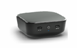

# Desktop PC

A desktop PC form factor traditionally comes in an upright tower or small desktop chassis. Listed below are a few recommended hardware configurations.

<table>
<tbody valign="top">
<tr style="vertical-align:bottom;">
<td style="width: 20%;">&nbsp;</td>
<td style="width: 20%;">

</td>
<td>
 <!--Here to add white space--> 

</td>
</tr>
<tr>
<td bgcolor="EEEEEE">
Type
</td>
<td>
Mainstream desktop
</td>
<td>
Mini PC desktop
</td>
</tr>
<tr>
<td bgcolor="EEEEEE">
Key Features
</td>
<td>
Full PC experience (Core performance, legacy ports, optical disk drive)
</td>
<td>
Full PC experience (Core performance with optimal storage)
</td>
</tr>
<tr>
<td bgcolor="EEEEEE">Operating System</td>
<td colspan="2">Windows&nbsp;10 for desktop editions (Home, Pro, Enterprise, and Education)</td>
</tr>
<tr>
<td bgcolor="EEEEEE" colspan="3">
Recommended components

</td>
</tr>
<tr>
<td bgcolor="EEEEEE">
CPU
</td>
<td>
Mid-range x86
</td>
<td>
Mid-range x86
</td>
</tr>
<tr>
<td bgcolor="EEEEEE">
RAM/Storage
</td>
<td>
4&nbsp;GB+&nbsp;/ 32&nbsp;GB+&nbsp;SSD or 500&nbsp;GB+&nbsp;HDD
</td>
<td>
4&nbsp;GB&nbsp;/ 32+&nbsp;GB&nbsp;SSD or 320&nbsp;GB+&nbsp;HDD
</td>
</tr>
<tr>
<td bgcolor="EEEEEE">
Display
</td>
<td>
Multi-monitor support
</td>
<td>
-
</td>
</tr>
<tr>
<td bgcolor="EEEEEE">
Dimensions
</td>
<td>-</td>
<td>
&lt;&nbsp;2.5&nbsp;L compact size
</td>
</tr>
<tr>
<td bgcolor="EEEEEE">
Connectivity
</td>
<td>

802.11ac

USB&nbsp;3.0

HDMI

BT

</td>
<td>

802.11ac

USB&nbsp;3.0

HDMI

BT&nbsp;LE
</td>
</tr>
</tbody>
</table>

For more guidance in selecting hardware components, see [Hardware component guidelines](../component-guidelines/components.md).
