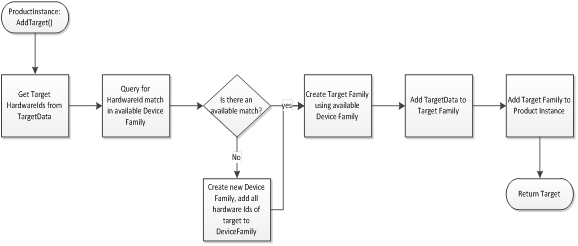

# Adding a Target to a Product Instance

Use the **ProductInstance.AddTarget()** method to add a target directly to a **ProductInstance** object. These are the required steps for adding a target:

 

 

