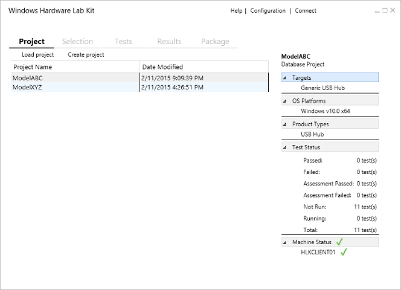

# Step 5: Create a project

After you setup your test server and clients, you're ready to create a project. A project defines what you want to test. The most common project corresponds to the device you want to submit for certification.

You can create large projects that represent a wide range of scenarios. You can also create several smaller projects and merge the results into one package.

In the remaining examples, you create a project for a device and run all associated certification tests. Then, you create a single package for submission that contains all of the passing test results.

The following image shows the Studio **Project** tab.

## To create a project

1.  In Windows HLK Studio, choose the **Project** tab, and then choose **Create project**.

2.  Replace the default project name with the name of your project, and then press Enter.

    >[!NOTE]
    >  A project should have a meaningful name that indicates its contents, for example, "Fabrikam Multi-function Device Model Z".

    When the project name appears on the page, the project is created.

The right pane displays project details. More information is displayed here once you start testing your device. You can check the status of any project by loading it and referring to this pane.

To learn more about this page, see [HLK Studio - Project Tab](..\user\hlk-studio---project-tab.md).

 

 

