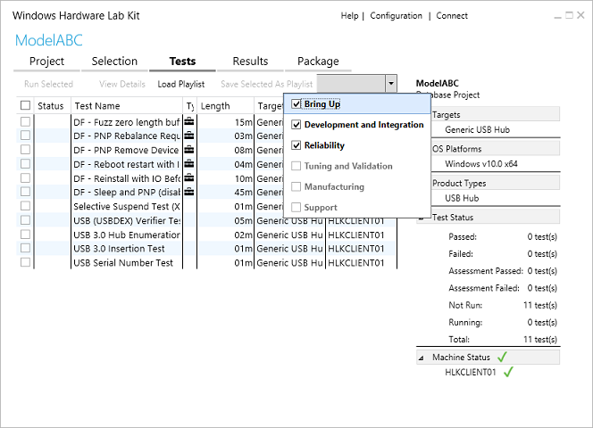
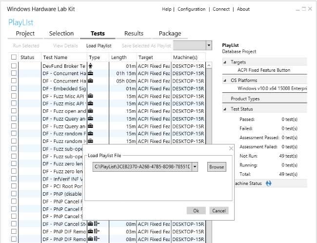

# Step 6: Select and run tests

The **Tests** tab displays all of the tests that are associated with the features found on your device. You can filter and sort the listed tests in the following ways:

-   Test Phase Categorization
    -   Bring Up
    -   Development and Integration
    -   Reliability
    -   Tuning and Validation
    -   Manufacturing
    -   Support

        >[!NOTE]
        >  In the HLK, test categories replace the level classifications previously used with the HCK. The HLK can be used throughout the product life cycle to test and measure quality at each stage of development.

         
-   Status
-   Test Name
-   Type (manual, non-distributed, special configuration, multiple machine)

    >[!NOTE]
    >  You can hover over the test type icons with your mouse for more information about the test types.

     

-   Length
-   Target
-   Machine(s)

>[!NOTE]
>  Manual tests that require user input can interrupt the test process. We recommend that you run manual tests separately from automated tests.

>[!NOTE]
>  Some tests require additional input before running. Windows HLK Studio prompts you for more info as needed.

 

The following image shows the Studio **Tests** tab.

## Playlists

Playlists are collections of tests that you can use to define various scenarios in which to test your device. The Windows Hardware Compatibility Program uses an official playlist to determine which devices meet the requirements for compatibility with Windows 10.

<iframe src="https://hubs-video.ssl.catalog.video.msn.com/embed/afc1a262-6147-448f-910c-dbb1bcb18d07/IA?csid=ux-en-us&MsnPlayerLeadsWith=html&PlaybackMode=Inline&MsnPlayerDisplayShareBar=false&MsnPlayerDisplayInfoButton=false&iframe=true&QualityOverride=HD" width="720" height="405" allowFullScreen="true" frameBorder="0" scrolling="no"></iframe>

You can load a playlist by choosing **Load Playlist** from within the **Tests** tab. You can load only one playlist at a time. To choose a different playlist, you must first unload the current playlist by choosing **Unload Playlist** from the **Tests** tab.

The following image shows the **Load Playlist File** dialog.

Once a playlist is loaded, only tests that are applicable to each target are shown in the UI.

Test results against all playlists for a specific target are kept until the target is removed from the project. When a playlist is loaded, any previous test results against that playlist are also loaded.

You can save an existing collection of tests as a playlist by choosing **Save Selected As Playlist**.

>[!IMPORTANT]
>  When using an official playlist, you must use the version of the playlist that matches the version of the kit you are using. For example, if using version 1607 of the HLK, you must also use version 1607 of the playlist.

 

## Running a test

>[!NOTE]
>  If using a playlist, be sure to load it before following these steps.

 

1.  Filter the test results by using the **View By** dropdown list.

2.  Check the box next to each test that you want to run.

3.  Run the selected tests by choosing **Run Selected**.

    If any additional input is needed, Windows HLK Studio will prompt you.

    A progress bar appears. A slight delay occurs when you run a test.

>[!NOTE]
>  To learn more about any test, select the test from the list and press **F1** key or right-click and select **Test Description**. To cancel any running test, right-click it and select **Cancel**.

 

As tests complete, the results are displayed in the **Status** column. A green checkmark means that it passed, while a red X means that it failed. The pane on the right displays project summary information, including target(s) selected, operating systems being tested, product types you qualify for, and status of all tests.

To learn more about the different options on this page, see [HLK Studio - Tests Tab](..\user\hlk-studio---tests-tab.md).

 

 

