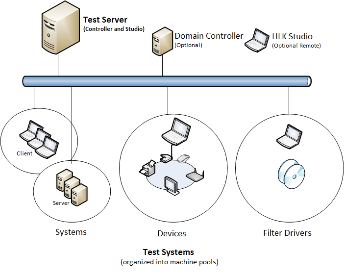

# Windows HLK Prerequisites

>[!WARNING]
>  The Windows Hardware Lab Kit (HLK) should only be installed on machines that are dedicated solely for testing purposes. Do not install any HLK component on a machine that is outside of a dedicated testing environment.

>[!IMPORTANT]
>  Controller setup will fail if .NET Framework 4.5 has not previously been installed. Be sure to [install .NET Framework 4.5](http://www.microsoft.com/en-us/download/details.aspx?id=30653) prior to controller setup.
>
>  32-bit SQL Server installations are not supported. You must uninstall any 32-bit SQL Server installation prior to installing the HLK.
>
>  SQL Server 2014 is not supported. You must uninstall any SQL Server 2014 installations prior to installing the HLK.

 

Before you begin testing, make sure that the test environment meets the necessary requirements. Windows HLK is comprised of two components: an HLK test server and one or more test systems.

-   **HLK test server.** Often referred to as the *controller*, a test server has two parts: Windows HLK Controller and Windows HLK Studio. The Controller software is the engine that manages tests that are run on test systems. The Studio software is the management tool that lets you select and schedule tests against any test system connected to the test server. Controller and Studio are installed from the Windows HLK installation source. After installation, the test server contains separate installers to install a remote Windows HLK Studio and Windows HLK Client.

    One controller governs a collection of client computers. Controllers can manage and access only the client computers that they govern.

-   **Test system.** Also referred to as a client computer, each test system can have a different configuration that's appropriate for various testing scenarios, including different hardware, operating systems, service packs, and drivers. Each test system can be associated with only one test server. You can configure each test system by running the Windows HLK Client software installer directly from a shared network location on the test server.

## Deployment scenarios

There are two deployment scenarios for Windows HLK:

-   **Domain-joined environment.** In a domain-joined environment, a domain controller is present and all computers designated for Windows HLK features are joined to the same domain controller. If you plan to deploy Windows HLK in a domain-joined environment, you need a minimum of three computers: a Windows domain controller, a Windows HLK test server, and at least one Windows HLK test system. Make sure that Microsoft Active Directory® is configured and running on the domain controller. Your domain controller and HLK test server cannot be on the same box.

-   **Workgroup environment.** A workgroup environment has no domain controller. If you plan to deploy Windows HLK in a workgroup, you need at least two computers: a test server and a test system joined to the same workgroup. **Don't** use the Default Administrator account. In this configuration, you must enable the Guest account.

In addition, consider how you want to organize lab resources to best use the Windows HLK. You need to determine the number of test servers and the number of test systems connecting to them. These decisions are partly influenced by the type of devices or systems that you want to test.

To test systems and filter drivers, you need at least 1 test server and 1 test system.

To test external devices, you need at least 1 test server, 1 test system, and the external device(s) to be tested.

You can choose to allocate fewer controllers, each with multiple clients connected to them, if you want less overhead administering the controllers and clients. A maximum of 150 clients can be connected to a single controller. Alternately, you can allocate more controllers and connect fewer clients to them. This allows any given controller to be more responsive because it has fewer clients communicating with it. For more information, see [HLK Controller and Client Organization](..\user\hlk-controller-and-client-organization.md).

The following image shows an example test environment.

## System Requirements

### Test server

<table>
<colgroup>
<col width="33%" />
<col width="33%" />
<col width="33%" />
</colgroup>
<thead>
<tr class="header">
<th>Component</th>
<th>Minimum</th>
<th>Optimum</th>
</tr>
</thead>
<tbody>
<tr class="odd">
<td>
Processor
</td>
<td>
Single Intel or AMD-based x64 platform with a speed of 2.0 GHz
</td>
<td>
Multicore or multiple x64-based processors running in x64 mode with a speed of 2.0 GHz or faster
</td>
</tr>
<tr class="even">
<td>
System memory
</td>
<td>
2 GB main memory
</td>
<td>
4 GB main memory
</td>
</tr>
<tr class="odd">
<td>
Hard disk capacity
</td>
<td>
300 GB minimum to accommodate the volume of logs that can be generated.
</td>
<td>
RAID configuration
</td>
</tr>
<tr class="even">
<td>
Network connection
</td>
<td>
100 megabits per second (Mbps)
</td>
<td>
1 gigabit per second (Gbps)
</td>
</tr>
<tr class="odd">
<td>
Operating system
</td>
<td>
English language and English local version of Windows Server 2008 R2 64-bit with service pack (SP1), Windows Server 2012, or Windows Server 2012 R2. For information, see the [Windows Server](http://go.microsoft.com/fwlink/?LinkId=236055) website.

<strong>Note</strong>  

Controller isn't supported on Windows Server 2003, Windows Server 2008, Windows Vista, Windows XP, or Windows 2000.

Controller isn't supported on an installation that has already been set up as a domain controller.

 

</td>
<td>

</td>
</tr>
</tbody>
</table>

 

### Test system

<table>
<colgroup>
<col width="50%" />
<col width="50%" />
</colgroup>
<thead>
<tr class="header">
<th>Component</th>
<th>Minimum</th>
</tr>
</thead>
<tbody>
<tr class="odd">
<td>
Processor
</td>
<td>
The recommended processor for the operating system that you install.
</td>
</tr>
<tr class="even">
<td>
System memory
</td>
<td>
Refer to the recommended processor for the operating system that you install.
</td>
</tr>
<tr class="odd">
<td>
Hard disk capacity
</td>
<td>
300 GB minimum to accommodate the test files and logs that can be generated.

The client must be unique; you can't swap drives.
</td>
</tr>
<tr class="even">
<td>
Network connection
</td>
<td>
100 Mbps
</td>
</tr>
<tr class="odd">
<td>
Operating system
</td>
<td>
Install the English language and English local version of the Windows operating system that you are testing against.

Test systems are not supported in a virtual PC or any third-party Hypervisor environment.

If you are testing against a Windows “N” edition, you must also manually install Media Feature Pack.
</td>
</tr>
<tr class="even">
<td>
Additional requirements
</td>
<td>
Many of the tests require a test system to restart—often more than once—to complete a test run. So, we recommend that you:

<ul>
<li>
Configure test systems to boot from the regular boot sector of a hard drive and not from external devices, CDs, or DVD boot discs.
</li>
</ul>

For Workgroup environments, you must enable the guest account.

<ol>
<li>
On each computer, create a new user account and add it to the Administrator group.
</li>
<li>
On each computer, log on with the administrator account you just created and enable the Guest account.
</li>
</ol>

Testing may also require:

<ul>
<li>
HLK Filters.
</li>
<li>
Test-sign drivers.
</li>
<li>
Additional source code/Readme files that are requested at the end of package creation.
</li>
</ul></td>
</tr>
</tbody>
</table>

 

### Optional remote/standalone Windows HLK Studio

<table>
<colgroup>
<col width="50%" />
<col width="50%" />
</colgroup>
<thead>
<tr class="header">
<th>Component</th>
<th>Minimum</th>
</tr>
</thead>
<tbody>
<tr class="odd">
<td>
Processor
</td>
<td>
The recommended processor for the operating system that you install.
</td>
</tr>
<tr class="even">
<td>
System memory
</td>
<td>
Refer to the recommended processor for the operating system that you install.
</td>
</tr>
<tr class="odd">
<td>
Hard disk capacity
</td>
<td>
300 GB minimum to accommodate the volume of logs that can be generated.

The client must be unique; you can't swap drives.
</td>
</tr>
<tr class="even">
<td>
Network connection
</td>
<td>
100 Mbps
</td>
</tr>
<tr class="odd">
<td>
Operating system
</td>
<td><ul>
<li>
Windows 10
</li>
<li>
Windows 8.1
</li>
<li>
Windows 8
</li>
<li>
Windows 7
</li>
</ul></td>
</tr>
</tbody>
</table>

 

 

 

