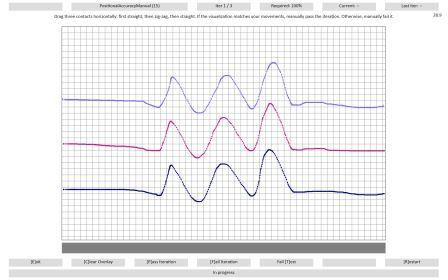
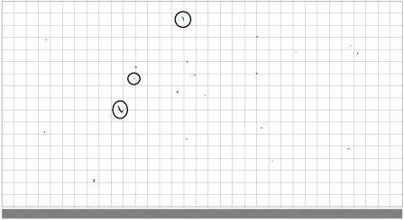
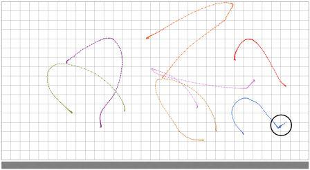

# Test.PositionalAccuracyManual

The test verifies that the device can accurately report absolute position.

## Test details

<table>
<colgroup>
<col width="50%" />
<col width="50%" />
</colgroup>
<tbody>
<tr class="odd">
<td><strong>Specifications</strong></td>
<td><ul>
<li>Device.Input.Digitizer.PrecisionTouchpad.Accuracy</li>
<li>Device.Input.Digitizer.PrecisionTouchpad.HIDCompliant</li>
</ul></td>
</tr>
<tr class="even">
<td><strong>Platforms</strong></td>
<td><ul>
<li>Windows 10 for desktop editions (Home, Pro, Enterprise, and Education) x86</li>
<li>Windows 10 for desktop editions x64</li>
</ul></td>
</tr>
<tr class="odd">
<td><strong>Supported Releases</strong></td>
<td><ul>
<li>Windows 10</li>
<li>Windows 10, version 1511</li>
<li>Windows 10, version 1607</li>
<li>Windows 10, version 1703</li>
</ul></td>
</tr>
<tr class="even">
<td><strong>Expected run time (in minutes)</strong></td>
<td>2</td>
</tr>
<tr class="odd">
<td><strong>Category</strong></td>
<td>Compatibility</td>
</tr>
<tr class="even">
<td><strong>Timeout (in minutes)</strong></td>
<td>120</td>
</tr>
<tr class="odd">
<td><strong>Requires reboot</strong></td>
<td>false</td>
</tr>
<tr class="even">
<td><strong>Requires special configuration</strong></td>
<td>false</td>
</tr>
<tr class="odd">
<td><strong>Type</strong></td>
<td>automatic</td>
</tr>
</tbody>
</table>

 

## Additional documentation

Tests in this feature area might have additional documentation, including prerequisites, setup, and troubleshooting information, that can be found in the following topic(s):

-   [Device.Input additional documentation](device-input-additional-documentation.md)

## Running the test

Before you run the test, complete the test setup as described in the test requirements: [Mouse or other Pointing Device Testing Prerequisites](mouse-or-other-pointing-device-testing-prerequisites.md).

1.  Start the test.

2.  Iteration 1:

    1.  Horizontally drag three fingers straight across 1/3 of the touchpad.

    2.  Without lifting, continue to move across the touchpad in a zig-zag pattern.

    3.  Without lifting, continue to move in a straight line across the last 1/3 of the touchpad.

    4.  Verify that the visualization matches physical finger movements and manually pass (press **P**) or fail (press **F**) the test accordingly.

        

3.  Repeat steps 1-4 vertically for the second iteration, and diagonally for the third iteration.

4.  Iteration 4:

    1.  Randomly tap 20 times on the touchpad.

    2.  Verify that the visualization matches your taps and that there is no jitter, as shown in *Figure 2 Positional Accuracy, Iteration 4*. Manually pass or fail the test accordingly.

        

        In *Figure 2 Positional Accuracy, Iteration 4*, most of the taps are fine. The top circled contact is borderline – there was travel over the contact lifetime, but not a lot. Generally, up to 1mm (half a gridline) should be considered passing, as long as most are like the middle circled contact. The bottom circled contact shows travel greater than half a grid, which should be considered a failure.

5.  Iteration 5:

    1.  Draw a curved line by using your finger.

    2.  Without slowing or changing direction, lift your finger.

    3.  Verify that the visualization matches your curves and does not jitter on lift, as shown in *Figure 3 Positional Accuracy, Iteration 5*. Manually pass or fail the test accordingly.

        

        The key criteria to look for in this iteration are *hooks*, when you lift your finger. In the circled example, the contact jittered a significant amount to the left on contact lift. Consider any hook larger than a quarter of a grid as a failure.

6.  Iteration 6:

    1.  Draw a curved line by using your finger.

    2.  Without lifting, pause for one second.

    3.  Click the physical button, and lift.

    4.  Verify the visualization matches your curves and does not jitter on lift, as shown in *Figure 4. Positional Accuracy, Iteration 6*. Manually pass or fail the test accordingly.

        

        In this test, there is extra data when the physical button is clicked, so it’s harder to judge by looking at the data itself. Instead, watch the mouse cursor as you click and lift. If it moves more than a couple of pixels as you click, consider it a failure. In the circled example, the cursor moved significantly on click and should be considered a failure.

## Troubleshooting

For generic troubleshooting of HLK test failures, see [Troubleshooting Windows HLK Test Failures](..\user\troubleshooting-windows-hlk-test-failures.md).

For troubleshooting information, see [Troubleshooting Device.Input Testing](troubleshooting-deviceinput-testing.md).

## More information

### Command syntax

<table>
<colgroup>
<col width="50%" />
<col width="50%" />
</colgroup>
<thead>
<tr class="header">
<th>Command</th>
<th>Description</th>
</tr>
</thead>
<tbody>
<tr class="odd">
<td>
<strong>ptlogo.exe Test.PositionalAccuracyManual.json</strong>
</td>
<td>
Runs the test.
</td>
</tr>
</tbody>
</table>

 

### File list

<table>
<colgroup>
<col width="50%" />
<col width="50%" />
</colgroup>
<thead>
<tr class="header">
<th>File</th>
<th>Location</th>
</tr>
</thead>
<tbody>
<tr class="odd">
<td>
ptlogo.exe
</td>
<td>
<em>&lt;testbinroot&gt;</em>\input\PrecisionTouchpad\
</td>
</tr>
<tr class="even">
<td>
config.json
</td>
<td>
<em>&lt;testbinroot&gt;</em>\input\PrecisionTouchpad\
</td>
</tr>
<tr class="odd">
<td>
Test.PositionalAccuracyManual.json
</td>
<td>
<em>&lt;testbinroot&gt;</em>\input\PrecisionTouchpad\
</td>
</tr>
</tbody>
</table>

 

 

 

