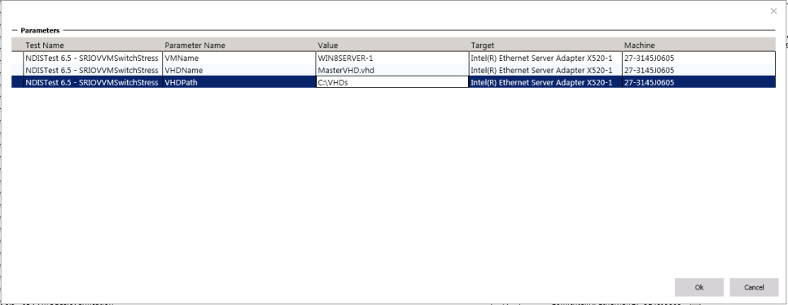

# NDISTest 6.5 - \[1 Machine\] - SRIOVBasicVerification

This test does the basic verification of the SRI-OV functionality on the miniport adapter in the presence of vSwitch. This is a single machine job and it needs additional configuration for execution.

-   The machine used for testing should have the Hyper-V server role installed. Also, make sure that you select and install the Hyper-V Module PowerShell management tools during installation.

-   Make sure you that copy a Windows 8 VHD (that you want to use for creating the VM) to the local folder (for example: C:\\VHDs) on the machine under test.

Now, you’re ready to run the SRIOVBasicVerification test.

When you select the job and click ‘Run Selected’, you will get a pop-up like the image shown below for entering additional parameters:

The values that the job expects are as follows:

-   VMName – You can give any name for the virtual machine. Please make sure that a virtual machine with the same name does not exist on the test machine already.

-   VHDName – Enter the name of the VHD that you copied to the test machine earlier. For example: Mastervhd.vhd. This vhd will not be deleted from the test machine.

-   VHDPath – Enter the path to the VHD location on the test machine (not on the controller). For example: C:\\VHDs.

## Test details

<table>
<colgroup>
<col width="50%" />
<col width="50%" />
</colgroup>
<tbody>
<tr class="odd">
<td><strong>Specifications</strong></td>
<td><ul>
<li>Device.Network.LAN.SRIOV.SRIOV</li>
</ul></td>
</tr>
<tr class="even">
<td><strong>Platforms</strong></td>
<td></td>
</tr>
<tr class="odd">
<td><strong>Supported Releases</strong></td>
<td><ul>
<li>Windows 10</li>
<li>Windows 10, version 1511</li>
<li>Windows 10, version 1607</li>
<li>Windows 10, version 1703</li>
</ul></td>
</tr>
<tr class="even">
<td><strong>Expected run time (in minutes)</strong></td>
<td>120</td>
</tr>
<tr class="odd">
<td><strong>Category</strong></td>
<td>Development</td>
</tr>
<tr class="even">
<td><strong>Timeout (in minutes)</strong></td>
<td>120</td>
</tr>
<tr class="odd">
<td><strong>Requires reboot</strong></td>
<td>false</td>
</tr>
<tr class="even">
<td><strong>Requires special configuration</strong></td>
<td>false</td>
</tr>
<tr class="odd">
<td><strong>Type</strong></td>
<td>automatic</td>
</tr>
</tbody>
</table>

 

## Additional documentation

Tests in this feature area might have additional documentation, including prerequisites, setup, and troubleshooting information, that can be found in the following topic(s):

-   [Device.Network additional documentation](device-network-additional-documentation.md)
-   [System.Server additional documentation](system-server-additional-documentation.md)

## Running the test

Before you run the test, complete the test setup as described in the test requirements: [LAN Testing Prerequisites](lan-testing-prerequisites.md).

## Troubleshooting

For generic troubleshooting of HLK test failures, see [Troubleshooting Windows HLK Test Failures](..\user\troubleshooting-windows-hlk-test-failures.md).

For troubleshooting information, see [Troubleshooting LAN Testing](troubleshooting-lan-testing.md).

## More information

### Parameters

| Parameter name                    | Parameter description                                                                                                                                    |
|-----------------------------------|----------------------------------------------------------------------------------------------------------------------------------------------------------|
| **FindSupportAdapter.vbs**        |                                                                                                                                                          |
| **VMQServerConfig.xml**           |                                                                                                                                                          |
| **VMQClientConfig.xml**           |                                                                                                                                                          |
| **LaunchNDISTestInGuest.cmd**     |                                                                                                                                                          |
| **VMP\_HWID**                     |                                                                                                                                                          |
| **VMP\_INF**                      |                                                                                                                                                          |
| **LOG\_FILE**                     |                                                                                                                                                          |
| **VMP\_PATH**                     |                                                                                                                                                          |
| **INSTALL\_VMP.VBS**              |                                                                                                                                                          |
| **queryTestDeviceID**             |                                                                                                                                                          |
| **VMName**                        | The name of the test VM. Please make sure that a VM with the same name doesn’t already exist on the test machine.                                        |
| **VHDName**                       | The name of the VHD that was copied onto the test machine earlier. For Example: Mastervhd.vhd. This vhd will not be deleted after the test has finished. |
| **VHDPath**                       | The path to the VHD location on the test machine (not on the controller). For example: C:\\VHDs.                                                         |
| **VmMemAlloc**                    |                                                                                                                                                          |
| **VmProcCount**                   |                                                                                                                                                          |
| **SRIOVBasicJob**                 |                                                                                                                                                          |
| **Test\_Card\_Identifier\_Type**  |                                                                                                                                                          |
| **Card\_Select\_Match\_Test.ps1** |                                                                                                                                                          |
| **PSWttLogger.ps1**               |                                                                                                                                                          |
| **SRIOVBasicClientConfig.xml**    |                                                                                                                                                          |

 

 

 

