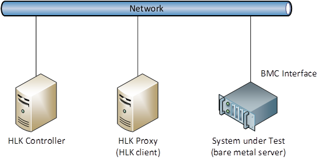

# IPMIReliability

This automated test validates the reliability of the baseboard management controller (BMC).

## Test details

<table>
<colgroup>
<col width="50%" />
<col width="50%" />
</colgroup>
<tbody>
<tr class="odd">
<td><strong>Specifications</strong></td>
<td><ul>
<li>System.Server.AzureStack.BMC.Reliability</li>
</ul></td>
</tr>
<tr class="even">
<td><strong>Platforms</strong></td>
<td><ul>
<li>Windows Server 2016 x64</li>
</ul></td>
</tr>
<tr class="odd">
<td><strong>Supported Releases</strong></td>
<td><ul>
<li>Windows 10</li>
<li>Windows 10, version 1511</li>
<li>Windows 10, version 1607</li>
<li>Windows 10, version 1703</li>
</ul></td>
</tr>
<tr class="even">
<td><strong>Expected run time (in minutes)</strong></td>
<td>3600</td>
</tr>
<tr class="odd">
<td><strong>Category</strong></td>
<td>Scenario</td>
</tr>
<tr class="even">
<td><strong>Timeout (in minutes)</strong></td>
<td>3600</td>
</tr>
<tr class="odd">
<td><strong>Requires reboot</strong></td>
<td>false</td>
</tr>
<tr class="even">
<td><strong>Requires special configuration</strong></td>
<td>false</td>
</tr>
<tr class="odd">
<td><strong>Type</strong></td>
<td>automatic</td>
</tr>
</tbody>
</table>

 

## Additional documentation

Tests in this feature area might have additional documentation, including prerequisites, setup, and troubleshooting information, that can be found in the following topic(s):

-   [System.Server additional documentation](system-server-additional-documentation.md)

## Running the test

The following hardware is required to test BMC reliability.

-   A server running the HLK controller and a test computer to act as the HLK proxy. Refer to Windows HLK prerequisites for more details.
-   A System under Test (SUT) server. You must configure the server’s baseboard management controller (BMC) with IP address settings, and enable the BMC to allow remote management using IPMI.
-   You must connect all computers to the same physical network. Note that the SUT server must have its BMC interface connected to the network.

The following diagram shows how to configure your hardware for BMC reliability testing.

## Troubleshooting

For generic troubleshooting of HLK test failures, see [Troubleshooting Windows HLK Test Failures](..\user\troubleshooting-windows-hlk-test-failures.md).

### **Error 1: Initialization failed**

An error occurred while preparing to run the test.

**Workaround:** Refer to the Test-IPMIReliability.log file to get detailed error information.

### **Error 2: Error Get**

Retrieving BMC information failed more than 5% of the tests.

**Workaround:** Refer to the Test-IPMIReliability.log file to get detailed error information.

### **Error 4: Error GetLog**

Retrieving the BMC log entries failed more than 5% of the tests.

**Workaround:** Refer to the Test-IPMIReliability.log file to get detailed error information.

### **Error 8: Error Restart**

Restarting the remote device failed more than 5% of the tests.

**Workaround:** Refer to the Test-IPMIReliability.log file to get detailed error information.

## More information

### Parameters

| Parameter name    | Parameter description                              |
|-------------------|----------------------------------------------------|
| **TargetAddress** | Name or IP address of the BMC interface            |
| **Username**      | BMC administrator name                             |
| **Password**      | BMC administrator password                         |
| **ExecutionTime** | : Number of minutes to run the test (default = 60) |

 

 

 

