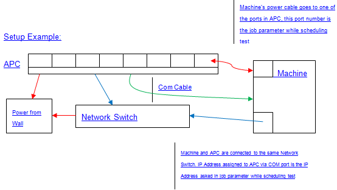

# <span id="p_hlk_test.b7df764f-ab21-4e7a-9594-e6f814711b4d"></span>Flush Test


This test leverages SNMP-controlled, programmable power strips to validate that the driver, controller, and underlying device honor the appropriate flush command by persisting data to the device.

It includes the following steps:

-   Write a known pattern directly to disk (by-passing the file system) and wait for writes to complete.

-   Send Flush command and wait for completion.

-   Immediately trigger sudden power loss.

-   On reboot, read back and verify that all data that was written to disk before the flush command.

-   Repeat cycle with a different write scenario (different size, pattern, location, etc.).

## <span id="Test_details"></span><span id="test_details"></span><span id="TEST_DETAILS"></span>Test details


<table>
<colgroup>
<col width="50%" />
<col width="50%" />
</colgroup>
<tbody>
<tr class="odd">
<td><strong>Specifications</strong></td>
<td><ul>
<li>Device.Storage.Controller.Flush.BasicFunction</li>
<li>Device.Storage.Hd.Flush.BasicFunction</li>
<li>Device.Storage.ControllerDrive.NVMe.BasicFunction</li>
</ul></td>
</tr>
<tr class="even">
<td><strong>Platforms</strong></td>
<td><ul>
<li>Windows 10 for desktop editions (Home, Pro, Enterprise, and Education) x86</li>
<li>Windows 10 for desktop editions x64</li>
<li>Windows Server 2016 x64</li>
</ul></td>
</tr>
<tr class="odd">
<td><strong>Supported Releases</strong></td>
<td><ul>
<li>Windows 10</li>
<li>Windows 10, version 1511</li>
<li>Windows 10, version 1607</li>
<li>Windows 10, version 1703</li>
</ul></td>
</tr>
<tr class="even">
<td><strong>Expected run time (in minutes)</strong></td>
<td>480</td>
</tr>
<tr class="odd">
<td><strong>Category</strong></td>
<td>Compatibility</td>
</tr>
<tr class="even">
<td><strong>Timeout (in minutes)</strong></td>
<td>28800</td>
</tr>
<tr class="odd">
<td><strong>Requires reboot</strong></td>
<td>false</td>
</tr>
<tr class="even">
<td><strong>Requires special configuration</strong></td>
<td>true</td>
</tr>
<tr class="odd">
<td><strong>Type</strong></td>
<td>automatic</td>
</tr>
</tbody>
</table>

 

## <span id="Additional_documentation"></span><span id="additional_documentation"></span><span id="ADDITIONAL_DOCUMENTATION"></span>Additional documentation


Tests in this feature area might have additional documentation, including prerequisites, setup, and troubleshooting information, that can be found in the following topic(s):

-   [Device.Storage additional documentation](device-storage-additional-documentation.md)

## <span id="Running_the_test"></span><span id="running_the_test"></span><span id="RUNNING_THE_TEST"></span>Running the test


Before you run the test, complete the test setup as described in the test requirements for the type of storage controller that you are testing. See [Storage Adapter or Controller Testing Overview](storage-adapter-or-controller-testing-overview.md) for more information.

-   Flush test should be run on the non-boot Controller. Running on the boot controller (with a non-boot drive attached) gives unexpected results because of dirty shutdown of machine. In the case of certifying SAS controllers, we highly recommend installing OS and HLK client on SATA boot controller and attaching a non-boot SAS controller to run Flush test.

-   Setup required for the test: Connect an APC power distribution unit (PDU), controllable via SNMP, to the HLK test machine.

-   Power strip should have a valid IP address associated as the test uses both the IP address and the port to initiate sudden power loss.

-   Power strip can be connected locally/remotely to machine, please see power strip manual for configuration details.

>[!WARNING]
>  For virtual testing scenarios, you'll need to enter fake data for the SNMP-related parameters (SNMP\_IP\_ADDRESS, SNMP\_PORT, SNMP\_COMMUNITY) to successfully complete the test.

 

## <span id="Troubleshooting"></span><span id="troubleshooting"></span><span id="TROUBLESHOOTING"></span>Troubleshooting


For generic troubleshooting of HLK test failures, see [Troubleshooting Windows HLK Test Failures](..\user\troubleshooting-windows-hlk-test-failures.md).

For troubleshooting information, see [Troubleshooting Device.Storage Testing](troubleshooting-devicestorage-testing.md).

### <span id="Power-strip"></span><span id="power-strip"></span><span id="POWER-STRIP"></span>Power-strip

The test requires a power-strip manufactured by APC. The power-strip must support SNMP connections under the .1.3.6.1.4.1.318.1.1.12.3.3.1.1.4 OID. To run the test, you will need the IP address of the power-strip. Please refer to the power-strip user manual for information on how to discover the IP address.

### <span id="Sudden_Power_Loss_and_BIOS_setting"></span><span id="sudden_power_loss_and_bios_setting"></span><span id="SUDDEN_POWER_LOSS_AND_BIOS_SETTING"></span>Sudden Power Loss and BIOS setting

Test runs about 21 scenarios initiating sudden power loss each time. When power-strip port is programmed for power off and delayed power on, systems may not power ON automatically as this is a BIOS setting and is usually available on desktop machines. Example: On HP Compaq DC7800 machine, In BIOS under Advanced-&gt;Power-On Options, there is a field called "After Power Loss", set it to ON.

For uninterrupted and automated way of running flush test, set the BIOS setting to power ON machine automatically when power is plugged in.

### <span id="Para-Virtualization_Storage_Drivers_and_SVVP_Certification"></span><span id="para-virtualization_storage_drivers_and_svvp_certification"></span><span id="PARA-VIRTUALIZATION_STORAGE_DRIVERS_AND_SVVP_CERTIFICATION"></span>Para-Virtualization Storage Drivers and SVVP Certification

When certifying devices in a virtual environment, HLK intentionally doesn’t consider virtual scenarios to ensure virtualization products work as closely as possible to the physical products. But, we do provide a workaround to execute Flush test in such cases. The test logs information before initiating dirty shutdown. Initiate the same manually by timing it when the log appears on the screen for all scenarios which run as part of Flush test.

Sample Log file example:

``` syntax
<SNIP>Message 4/23/2013 1:39:21.081 AM S5: Starting Random Write Scenario of 268435456 bytes (256MB). Message 4/23/2013 1:41:02.081 AM S0: Completed Sequential Write Scenario of 268435456 bytes (256MB) Message 4/23/2013 1:41:04.081 AM S5: Completed Random Write Scenario of 268435456 bytes (256MB) Message 4/23/2013 1:41:04.081 AM S4: Completed Striding Write Scenario of 268435456 bytes (256MB) Message 4/23/2013 1:41:04.081 AM S2: Completed Random Write Scenario of 268435456 bytes (256MB) Message 4/23/2013 1:41:04.081 AM S1: Completed Striding Write Scenario of 268435456 bytes (256MB) Message 4/23/2013 1:41:04.081 AM S3: Completed Sequential Write Scenario of 268435456 bytes (256MB) Message 4/23/2013 1:41:03.972 AM Flush Write Cache Message 4/23/2013 1:41:03.972 AM Flush Write Cache Complete Message 4/23/2013 1:41:03.972 AM Flush file system buffers and trigger sudden power loss<SNIP>Sudden Reboot triggered (At this time, manually trigger dirty shutdown within 2 seconds.) 
```

### <span id="Battery_Non-battery_powered_systems"></span><span id="battery_non-battery_powered_systems"></span><span id="BATTERY_NON-BATTERY_POWERED_SYSTEMS"></span>Battery/Non-battery powered systems

Flush runs only on non-battery powered systems. If you are using a desktop machine, flush is applicable. If you are using a laptop machine (we assume battery is plugged in), flush is not applicable. Below are the options available for certifying devices against systems.

-   Certifying devices on desktop machines

    -   See options for BIOS power setting above

-   Certifying devices on laptop machines

    -   Select a laptop which has a BIOS power setting, remove battery and follow steps for running tests

    -   Or, Put laptop motherboard in a desktop casing (i.e., just like a desktop machine) and follow steps for running tests



## <span id="More_information"></span><span id="more_information"></span><span id="MORE_INFORMATION"></span>More information


These scenarios send a flush command to the device as soon as all outstanding I/O complete for a given scenario. Power loss occurs immediately after the flush command completes. If any data from the scenario did not persist to disk, the test will fail. The logo test will run each of these 21 scenarios.

1.  Flush and Reboot after 512MB of Syncronous Sequential Writes

    -   Small writes (512B – 4KB)

    -   Large writes (768KB – 1MB)

    -   Pseudorandom-sized writes (512B – 1MB)

2.  Flush and Reboot after 512MB of Syncronous Random Writes

    -   Small writes (512B – 4KB)

    -   Large writes (768KB – 1MB)

    -   Pseudorandom-sized writes (512B – 1MB)

3.  Flush and Reboot after 512MB of Syncronous Striding Writes

    -   Small writes (512B – 4KB)

    -   Large writes (768KB – 1MB)

    -   Pseudorandom-sized writes (512B – 1MB)

4.  Flush and Reboot after 1GB of Asyncronous Sequential Writes via 4 threads

    -   Small writes (512B – 4KB)

    -   Large writes (768KB – 1MB)

    -   Pseudorandom-sized writes (512B – 1MB)

5.  Flush and Reboot after 1GB of Asyncronous Random Writes via 4 threads

    -   Small writes (512B – 4KB)

    -   Large writes (768KB – 1MB)

    -   Pseudorandom-sized writes (512B – 1MB)

6.  Flush and Reboot after 1GB of Asyncronous Striding Writes via 4 threads

    -   Small writes (512B – 4KB)

    -   Large writes (768KB – 1MB)

    -   Pseudorandom-sized writes (512B – 1MB)

7.  Flush and Reboot after 1.5GB of Asyncronous Random, Sequential, and Striding Writes via 6 threads

    -   Small writes (512B – 4KB)

    -   Large writes (768KB – 1MB)

    -   Pseudorandom-sized writes (512B – 1MB)

### <span id="Command_syntax"></span><span id="command_syntax"></span><span id="COMMAND_SYNTAX"></span>Command syntax

<table>
<colgroup>
<col width="50%" />
<col width="50%" />
</colgroup>
<thead>
<tr class="header">
<th>Command option</th>
<th>Description</th>
</tr>
</thead>
<tbody>
<tr class="odd">
<td><p>/d</p></td>
<td><p>The device to test. Example: /Device &lt;physical device path&gt;</p></td>
</tr>
<tr class="even">
<td><p>/l</p></td>
<td><p>Log name to output. '.wtl' is appended automatically. By default, log name is 'storio'. Example: /l storio_flush_001</p></td>
</tr>
<tr class="odd">
<td><p>/p</p></td>
<td><p>The power manager to use. Example: /p SuddenReboot</p></td>
</tr>
<tr class="even">
<td><p>/seed</p></td>
<td><p>Seed for reproducing the same scenarios. Example: /seed 1234</p></td>
</tr>
<tr class="odd">
<td><p>/v</p></td>
<td><p>The level of logging verbosity. Larger values cause more verbose output. Example: /Verbosity 4</p></td>
</tr>
<tr class="even">
<td><p>/sync</p></td>
<td><p>Force scenarios to execute syncronousely. By default, each scenario runs asynchronously (in a separate thread)</p></td>
</tr>
<tr class="odd">
<td><p>/flush</p></td>
<td><p>Send flush after all I/O completes to force data to persist to disk.</p></td>
</tr>
<tr class="even">
<td><p>/test</p></td>
<td><p>1 or more scenarios to run. Each scenario runs in its own thread. Example: /test sw,sw,sw,xr. Runs 3 threads of sequential writes and one thread of random writes.</p></td>
</tr>
<tr class="odd">
<td><p>/validate</p></td>
<td><p>1 or more scenarios to validate. Scenarios are validated synchronously. Example: /validate sw,sw,sw,xr. Validates 3 sequential write scenarios and a random write scenario.</p></td>
</tr>
<tr class="even">
<td><p>/totalsize</p></td>
<td><p>Total amount of I/O to do (per scenario). Default=256MB. Example: /totalsize 256MB. May also specify size per scenario thread: /totalsize 256MB,128MB,1GB,1GB</p></td>
</tr>
<tr class="odd">
<td><p>/iomin</p></td>
<td><p>Minimum size of each I/O to do. Default=4KB. Example: /iomin 32KB</p></td>
</tr>
<tr class="even">
<td><p>/iomax</p></td>
<td><p>Maximum size of each I/O to do. Default=1MB. Example: /ioman 256KB</p></td>
</tr>
<tr class="odd">
<td><p>/queuedepth</p></td>
<td><p>Number of overlapping I/O for a scenario thread. Default=0. Example: / queuedepth 16. May also specifiy queue depth per scenario thread: /queuedepth 1,4,16,32.</p></td>
</tr>
</tbody>
</table>

>[!NOTE]
>  
For command-line help for this test binary, type `/h`

 

### <span id="File_list"></span><span id="file_list"></span><span id="FILE_LIST"></span>File list

<table>
<colgroup>
<col width="50%" />
<col width="50%" />
</colgroup>
<thead>
<tr class="header">
<th>File</th>
<th>Location</th>
</tr>
</thead>
<tbody>
<tr class="odd">
<td><p>storio.exe</p></td>
<td><p><em>&lt;[testbinroot]&gt;</em>\nttest\driverstest\storage\wdk</p></td>
</tr>
</tbody>
</table>

 

### <span id="Parameters"></span><span id="parameters"></span><span id="PARAMETERS"></span>Parameters

| Parameter name         | Parameter description                                   |
|------------------------|---------------------------------------------------------|
| **WDKDeviceID**        | Device to test                                          |
| **StorageDriveLetter** | Assigned by Create Storage Parameters                   |
| **SNMP\_IP\_ADDRESS**  | IP Address of APC Remote PDU                            |
| **SNMP\_PORT**         | Port of APC Remote PDU outlet                           |
| **SNMP\_COMMUNITY**    | Community of APC Remote PDU (e.g. private)              |
| **Verbosity**          | Logging verbosity: 3=default, 4=verbose, 5=very verbose |
| **Destructive**        | (0,1) 0=Passive, 1=Destructive                          |
| **DiskDeviceObjLink**  | Assigned by Create Storage Parameters                   |

 

 

 


