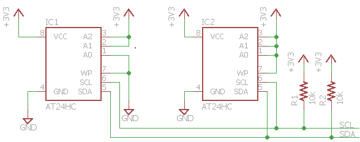

# <span id="p_hlk_test.ca91c2d2-4615-4a1b-928e-587ab2b69b04"></span>I2C WinRT Read Tests (EEPROM Required)


The I2C tests do functional and stress testing of I2C controllers exposed to usermode through the Windows.Devices.I2c WinRT APIs. The tests are split into two parts - basic functional and stress tests, and advanced functional tests. The scope of testing of the **basic functional tests** includes:

-   Verification that an I2C controller with specified friendly name is accessible from usermode.
-   Verification that data is written correctly over a range of clock speeds and buffer lengths up to 8 bytes (EEPROM page size).
-   Verification that data is read correctly over a range of clock speeds and buffer lengths.
-   Verification that write-restart-read sequences (WriteRead's) are executed correctly over a range of clock speeds and buffer lengths.
-   Verification that when a write, read, or WriteRead is attempted to a slave address that is not acknowledged, the driver returns STATUS\_NO\_SUCH\_DEVICE. This is reported by I2cDevice::Write/Read/WriteRead() as HRESULT\_FROM\_WIN32(ERROR\_FILE\_NOT\_FOUND) and is reported by I2cDevice::WritePartial/ReadPartial/WriteReadPartial() as I2cTransferStatus::SlaveAddressNotAcknowledged.
-   Verification that the APIs and drivers function correctly under stress conditions. The stress tests write and read from two EEPROMs concurrently with separate device handles over an extended duration.

The scope of testing of the **advanced functional tests** includes:

-   Verification that data is written correctly for buffer lengths of up to 16384 bytes.
-   Verification that an I2C restart condition is generated in response to a WriteRead sequence.
-   Verification that when the slave device NAK's while the master is still writing bytes, the driver completes the request with STATUS\_SUCCESS and reports the actual number of bytes written through the request information. This is called a partial transfer, and is reported by WritePartial() and WriteReadPartial() as I2cTransferStatus::PartialTransfer.
-   Verification that clock stretching up to 500ms is permitted and does not cause the transfer to fail.
-   Verification that when the slave device holds the clock line low for an extended duration (10+ seconds), the driver completes the transfer within at most 10 seconds with a failure code. The failure code should be STATUS\_IO\_TIMEOUT, but this is not verified for compatibility reasons.

The basic functional tests and stress tests run against two externally connected EEPROMs. The advanced functional tests run against an [mbed LPC1768](https://developer.mbed.org/platforms/mbed-LPC1768/) running custom firmware. The mbed LPC1768 is a popular microcontroller prototyping platform that can be purchased from a variety of online retailers including [Sparkfun](https://www.sparkfun.com/products/9564), [Digikey](http://www.digikey.com/product-detail/en/OM11043/568-4916-ND/2138502), and [Adafruit](http://www.adafruit.com/products/834). Updating the mbed's firmware is as simple as dragging and dropping a file. The firmware source code is available on [github](https://github.com/ms-iot/busses-tester). Instructions on preparing the mbed and running the tests are provided below.

## <span id="Test_details"></span><span id="test_details"></span><span id="TEST_DETAILS"></span>Test details


<table>
<colgroup>
<col width="50%" />
<col width="50%" />
</colgroup>
<tbody>
<tr class="odd">
<td><strong>Specifications</strong></td>
<td><ul>
<li>Device.BusController.I2C.WinRT.Discretional</li>
</ul></td>
</tr>
<tr class="even">
<td><strong>Platforms</strong></td>
<td><ul>
<li>Windows 10 Mobile ARM</li>
</ul></td>
</tr>
<tr class="odd">
<td><strong>Supported Releases</strong></td>
<td><ul>
<li>Windows 10</li>
<li>Windows 10, version 1511</li>
<li>Windows 10, version 1607</li>
<li>Windows 10, version 1703</li>
</ul></td>
</tr>
<tr class="even">
<td><strong>Expected run time (in minutes)</strong></td>
<td>5</td>
</tr>
<tr class="odd">
<td><strong>Category</strong></td>
<td>Development</td>
</tr>
<tr class="even">
<td><strong>Timeout (in minutes)</strong></td>
<td>10</td>
</tr>
<tr class="odd">
<td><strong>Requires reboot</strong></td>
<td>false</td>
</tr>
<tr class="even">
<td><strong>Requires special configuration</strong></td>
<td>true</td>
</tr>
<tr class="odd">
<td><strong>Type</strong></td>
<td>automatic</td>
</tr>
</tbody>
</table>

 

## <span id="Additional_documentation"></span><span id="additional_documentation"></span><span id="ADDITIONAL_DOCUMENTATION"></span>Additional documentation


Tests in this feature area might have additional documentation, including prerequisites, setup, and troubleshooting information, that can be found in the following topic(s):

-   [Device.BusController additional documentation](device-buscontroller-additional-documentation.md)

## <span id="Running_the_test"></span><span id="running_the_test"></span><span id="RUNNING_THE_TEST"></span>Running the test


**Running the basic functional and stress tests**

You will need the following hardware to run the tests:

-   [Atmel AT24HC serial EEPROMs](http://www.digikey.com/product-detail/en/AT24HC02C-PUM/AT24HC02C-PUM-ND/3903729) qt. 2
-   10k resistor qt. 2
-   Breadboard
-   Wires

Wire up the EEPROMs as shown in the following diagram and connect SDA and SCL to your device under test.



You can now schedule the basic functional and stress tests from HLK manager.

**Running the advanced functional tests**

The advanced functional tests verify NACKing behavior, hung bus conditions, clock stretching, and repeated starts. The tests require an mbed LPC1768 running custom firmware to be connected to the device under test. Before running the tests, you must load the HLK firmware onto the mbed LPC1768. Here's how to update firmware:

1.  Plug in the mbed LPC1768 over USB to your PC. It will show up as a removeable drive on your PC.
2.  Open the drive in file explorer
3.  Copy c:\\Program Files (x86)\\Windows Kits\\10\\Hardware Lab Kit\\Tests\\x86\\iot\\busses-tester-mbed\_LPC1768.bin to the mbed
4.  Press the button on the mbed to reset the microcontroller

Next, wire up the mbed to your device under test. Plug in the mbed over USB to your device under test. Then, make the I2C connections ([mbed pinout](https://developer.mbed.org/platforms/mbed-LPC1768)),

1.  Connect mbed pin 9 (P0.0/SDA) to the SDA pin on your device under test
2.  Connect mbed pin 10 (P0.1/SCL) to the SCL pin on your device under test
3.  Connect mbed GND to a GND pin on your device under test

The mbed has internal pull-up resistors enabled on the SDA and SCL lines and does not require external pull-up resistors.

You can now schedule the advanced functional tests from HLK manager.

## <span id="Troubleshooting"></span><span id="troubleshooting"></span><span id="TROUBLESHOOTING"></span>Troubleshooting


For generic troubleshooting of HLK test failures, see [Troubleshooting Windows HLK Test Failures](..\user\troubleshooting-windows-hlk-test-failures.md).

We recommend running the tests on the command line to gain insight into failures and to quickly iterate on solutions. Here's how to run the tests on the command line:

1.  Copy %programfiles(x86)%\\Windows Kits\\10\\Testing\\Runtimes\\TAEF\\&lt;arch&gt;\\MinTe to c:\\data\\minte
2.  Copy Windows.Devices.LowLevel.UnitTests.dll from %programfiles(x86)%\\Windows Kits\\10\\Hardware Lab Kit\\Tests\\&lt;arch&gt;\\iot to c:\\data on your device.
3.  Telnet or ssh into your device
4.  Change directories to c:\\data
5.  Run the tests:

    ``` syntax
    minte\te windows.devices.lowlevel.unittests.dll /name:I2c*
    ```

Command line test usage:

``` syntax
minte\te windows.devices.lowlevel.unittests.dll [/name:test_name] [/select:select_clause] [/p:I2cFriendlyName=friendly_name] [/p:Duration=duration]
```

-   test\_name - the name of the test to run which may include wildcards. Examples: /name:I2c\*, /name:I2cEepromWriteTests\#metadataSet0::VerifyWrite\#metadataSet0
-   select\_clause - a TAEF selection clause. Example: /select:"@name='I2c\*' and not(@name='I2cTestsEx\*')"
-   friendly\_name - the friendly name of the I2C controller under test. If omitted, the first enumerated controller is used. Examples: /p:I2cFriendlyName=I2C0
-   duration - how long to run stress tests. Examples: /p:Duration=10s (10 seconds), /p:Duration=1m (1 minute), /p:Duration=2h (2 hours), /p:Duration=1d (1 day)

Examples:

To run the basic functional tests,

``` syntax
minte\te windows.devices.lowlevel.unittests.dll /select:"@name='I2c*' and not(@name='I2cTestsEx*')"
```

To run the advanced functional tests,

``` syntax
minte\te windows.devices.lowlevel.unittests.dll /name:I2cTestsEx::*
```

To run the tests against a specific I2C controller instance, pass the friendly name to the I2cFriendlyName test parameter,

``` syntax
minte\te windows.devices.lowlevel.unittests.dll /name:I2c* /p:I2cFriendlyName=I2C0
```

To run a specific test, pass the full test name to the /name parameter:

``` syntax
minte\te windows.devices.lowlevel.unittests.dll /name:I2cNonexistentSlaveAddressTests::TestWriteRead
```

To run the stress tests for the recommended duration of 8 hours, run

``` syntax
minte\te windows.devices.lowlevel.unittests.dll /name:I2cStressTests::StressIoConcurrent /p:Duration=8h
```

A tool that can help with manual troubleshooting is [I2cTestTool](http://ms-iot.github.io/content/en-US/win10/samples/I2cTestTool.md). I2cTestTool is a simple utility for interacting with I2C from the command line.

## <span id="More_information"></span><span id="more_information"></span><span id="MORE_INFORMATION"></span>More information


### <span id="Parameters"></span><span id="parameters"></span><span id="PARAMETERS"></span>Parameters

| Parameter name      | Parameter description                                           |
|---------------------|-----------------------------------------------------------------|
| **I2cFriendlyName** | The friendly name of the I2C controller under test (e.g. I2C0). |

 

 

 


