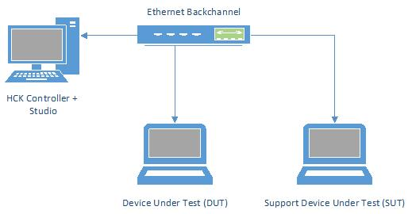
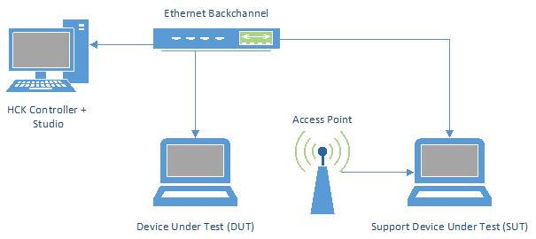

# Combined Radio Tests Prerequisites

For all combined radio tests, you must first complete the test setup as described in the test requirements: [System Client Testing Prerequisites](system-client-testing-prerequisites.md).

**In this topic:**

-   [Set up Combined Radio Test Tool for GPS and Bluetooth](#crgpsblue)

-   [Set up Combined Radio Test Tool for GPS and Wireless LAN](#crgpswlan)

-   [Set up Combined Radio Test Tool for Wireless LAN and Bluetooth](#crwlanblue)

-   [Set up Combined Radio Test Tool for Wireless LAN, Mobile Broadband and Bluetooth](#crall)

## Set up Combined Radio Test Tool for GPS and Bluetooth

The GPS and Bluetooth combined radio tests are triggered by the presence of a GPS radio on the system that is being tested. If the system does not have a Bluetooth radio, it automatically passes this test. The instructions here are used for systems with both GPS and Bluetooth radios.

To complete this test, you must configure two computers. The computer that you are trying to certify is referred to as the Device under Test (DUT). The second computer is referred to as the Support Device under Test (SUT), and it requires a Bluetooth radio. The computers must be less than ten meters from each other, and are preferably separated by five meters or less.

The DUT and SUT computers must be connected to each other and to the Windows HLK Controller by using an Ethernet HUB that has DHCP support. The computers can use a built-in Ethernet port or a USB dongle for the connection. *Figure 1 GPS Bluetooth Configuration* shows this setup:

Figure 1 GPS Bluetooth Configuration

In Windows HLK Studio, from the **Machine Set, Role** drop-down list, select **SUT**. Select the checkbox next to the designated SUT computer from the displayed list of computers, and click **OK**.

## Set up Combined Radio Test Tool for GPS and Wireless LAN

The GPS and Wireless LAN combined radio tests are initiated by the presence of a GPS radio on the system that is being tested. If the system does not have a Wireless LAN radio, it automatically passes this test. These instructions are used for systems that have both GPS and Wireless LAN radios.

Before you run the test, complete the test setup as described in the test requirements: [Wireless LAN (802.11) Testing Prerequisites](wireless-lan--80211--testing-prerequisites.md).

To complete this test, you must configure two computers: a 2.4 GHz Wireless LAN Access Point or 5 GHz Access Point (depending on the test), or one dual band Access Point. The computer that you are trying to certify is referred to as the Device under Test (DUT). The second computer is referred to as the Support Device under Test (SUT). The computers must be less than ten meters from each other, and are preferably separated by five meters or less.

The DUT and SUT computers must be connected to each other and to the Windows HLK Controller by using an Ethernet HUB that has DHCP support. The computers can use a built-in Ethernet port or a USB dongle for the connection. The SUT computer must be connected to the access point by an Ethernet connection.

The Wireless LAN Access Point must be configured by using the following settings:

1.  Configure Physical AP to a non-social channel.

2.  If the physical AP supports both 2.4GHz and 5GHz, disable the radio that is not being used for the test.

3.  Set DTIM (Delivery Traffic Indication Message) on the AP to 1. For most routers, this setting is located on the **Advance Properties** tab.

4.  Set the 802.11 Authentication and Encryption settings to WPA2-PSK and AES.

*Figure 2 GPS WLAN Configuration* shows this setup:

Figure 2 GPS WLAN Configuration

In Windows HLK Studio, from the **Machine Set, Role** drop-down list, select **SUT**. Select the checkbox next to the designated SUT computer from the displayed list of computers, and click **OK**.

## Set up Combined Radio Test Tool for Wireless LAN and Bluetooth

The Wireless LAN and Bluetooth combined radio tests are initiated by the presence of a Bluetooth radio on the system that is being tested. If the system does not have a Wireless LAN radio, it automatically passes this test. These instructions are for systems that have both Bluetooth and Wireless LAN radios.

Before you run the test, complete the test setup as described in the test requirements: [Wireless LAN (802.11) Testing Prerequisites](wireless-lan--80211--testing-prerequisites.md).

To complete this test, you must configure two computers: a 2.4 GHz Wireless LAN Access Point or 5 GHz Access Point (depending on the test), or one dual band Access Point. The computer that you are trying to certify is referred to as the Device under Test (DUT). The second computer is referred to as the Support Device under Test (SUT). The computers must be less than ten meters from each other, and are preferably separated by five meters or less.

The DUT and SUT computers must be connected to each other and to the Windows HLK Controller by using an Ethernet HUB that has DHCP support. The computers can use a built-in Ethernet port or a USB dongle for the connection. The SUT computer must be connected to the access point by using an Ethernet connection.

The Wireless LAN Access Point must be configured by using the following settings:

1.  Configure the physical AP to a non-social channel.

2.  If the physical AP supports both 2.4GHz and 5GHz, disable the radio that is not being used for the test.

3.  Set DTIM (Delivery Traffic Indication Message) on the AP to 1. For most routers, this setting is located on the **Advance Properties** tab.

4.  Set the 802.11 Authentication and Encryption settings to WPA2-PSK and AES.

See *Figure 2 GPS WLAN Configuration* for an example of this setup.

In Windows HLK Studio, from the **Machine Set, Role** drop-down list, select **SUT**. Select the checkbox next to the designated SUT computer from the displayed list of computers, and click **OK**.

## Set up Combined Radio Test Tool for Wireless LAN, Mobile Broadband and Bluetooth

The Wireless LAN, Mobile Broadband and Bluetooth combined radio tests are initiated by the presence of a Mobile Broadband radio on the system that is being tested. If the system does not have a Wireless LAN or Bluetooth radio, it automatically passes this test. These instructions are for systems that have Bluetooth, Mobile Broadband, and Wireless LAN radios.

Before you run the test, complete the test setup as described in the test requirements: [Mobile Broadband Testing Prerequisites](mobile-broadband-testing-prerequisites.md) and [Wireless LAN (802.11) Testing Prerequisites](wireless-lan--80211--testing-prerequisites.md).

To complete this test, you must configure two computers: a 2.4 GHz Wireless LAN Access Point or 5 GHz Access Point (depending on the test), or one dual band Access Point. The computer that you are trying to certify is referred to as the Device under Test (DUT). The second computer is referred to as the Support Device under Test (SUT), and it requires a Bluetooth radio. The computers must be less than ten meters from each other, and are preferably separated by five meters or less.

The DUT and SUT computers must be connected to each other and to the Windows HLK Controller by an Ethernet HUB that has DHCP support. The computers can use a built-in Ethernet port or a USB dongle for the connection. The SUT computer must be connected to the access point by using an Ethernet connection.

The Wireless LAN Access Point must be configured by using the following settings:

1.  Configure the physical AP to a non-social channel.

2.  If the physical AP supports both 2.4GHz and 5GHz, disable radio that is not being used for the test.

3.  Set DTIM (Delivery Traffic Indication Message) on the AP to 1. For most routers, this setting is located on the **Advance Properties** tab.

4.  Set the 802.11 Authentication and Encryption settings to WPA2-PSK and AES.

See *Figure 2 GPS WLAN Configuration* for an example of this setup.

In Windows HLK Studio, from the **Machine Set, Role** drop-down list, select **SUT**. Select the checkbox next to the designated SUT computer from the displayed list of computers, and click **OK**.

## Related topics

[System.Client Tests](system-client-tests.md)

 

 

