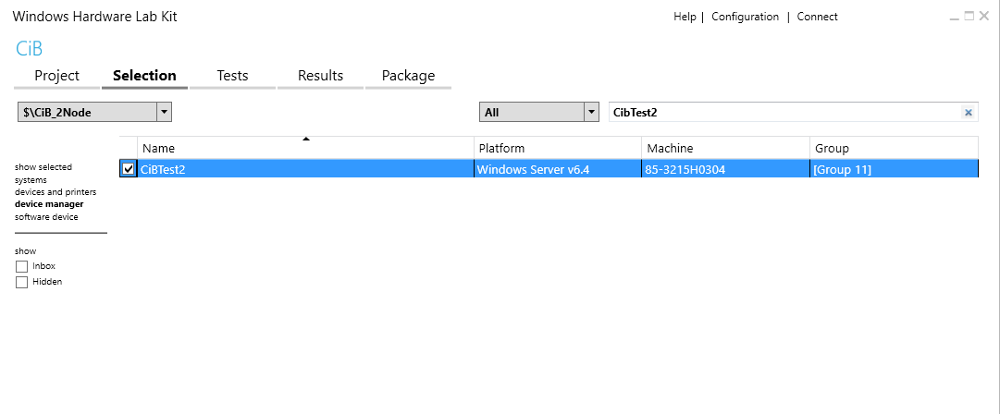
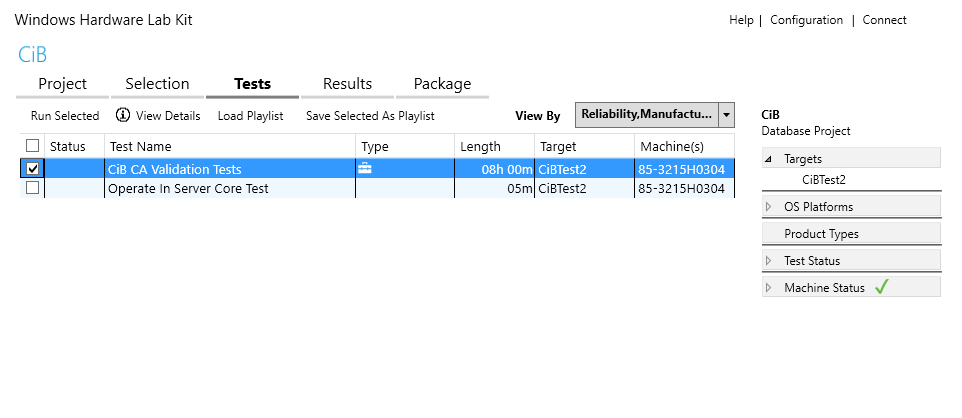
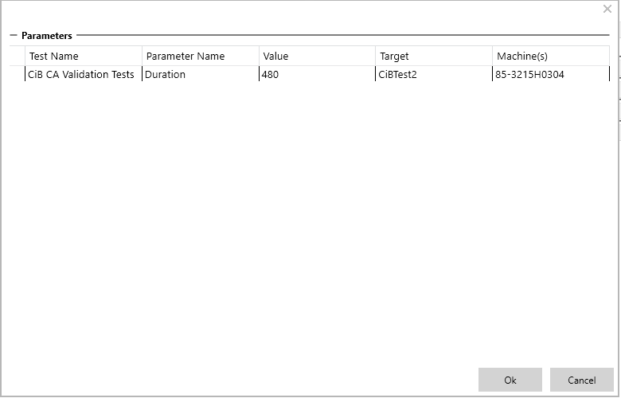
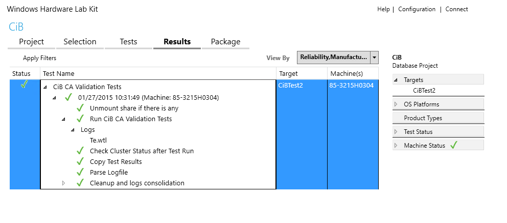

# CiB CA Validation Tests

These tests are the second part of the Cluster in a Box (CiB) Continuous Available (CA) validation tests which help validate CiB product meet the CA hardware requirements. The tests conduct various end-to-end test scenarios by running I/O workloads, data integrity tests against the cluster during a planned or unplanned failover. The tests also validate that the hardware platform under test meets CA hardware requirements.

## Test details

<table>
<colgroup>
<col width="50%" />
<col width="50%" />
</colgroup>
<tbody>
<tr class="odd">
<td><strong>Specifications</strong></td>
<td><ul>
<li>Device.Cluster.Core.ClusterInABox</li>
</ul></td>
</tr>
<tr class="even">
<td><strong>Platforms</strong></td>
<td><ul>
<li>Windows Server 2016 x64</li>
</ul></td>
</tr>
<tr class="odd">
<td><strong>Supported Releases</strong></td>
<td><ul>
<li>Windows 10</li>
<li>Windows 10, version 1511</li>
<li>Windows 10, version 1607</li>
<li>Windows 10, version 1703</li>
</ul></td>
</tr>
<tr class="even">
<td><strong>Expected run time (in minutes)</strong></td>
<td>480</td>
</tr>
<tr class="odd">
<td><strong>Category</strong></td>
<td>Scenario</td>
</tr>
<tr class="even">
<td><strong>Timeout (in minutes)</strong></td>
<td>28800</td>
</tr>
<tr class="odd">
<td><strong>Requires reboot</strong></td>
<td>false</td>
</tr>
<tr class="even">
<td><strong>Requires special configuration</strong></td>
<td>true</td>
</tr>
<tr class="odd">
<td><strong>Type</strong></td>
<td>automatic</td>
</tr>
</tbody>
</table>

 

## Running the test

**Prerequisite:** Pass the CiB Cluster Evaluation Tests

1.  After passing the CiB Cluster Evaluation Tests, go back to the **Selection** page and deselect the Test Controller machine under the **systems** tab
2.  Click on the **device manager** tab, and search for the cluster name specified for Cluster Evaluation Tests. Select the listed device.

    

3.  Go to the **Tests** page, select **CiB CA Validation Tests**, and click **Run Selected**

    

4.  Set the **Duration** value, which is how long the test scenarios run in minutes. The suggested runtime is 480 minutes (8 hours) or longer. The minimum runtime is 120 minutes. This can also be used as long haul tests for testing product reliability.

    Click **OK** to schedule the job.

    

5.  Go to the **Results** page to check the test status and results.

    

## Troubleshooting

For generic troubleshooting of HLK test failures, see [Troubleshooting Windows HLK Test Failures](..\user\troubleshooting-windows-hlk-test-failures.md).

If failures are found, you can review the logs to get additional details about the failures in HLK Studio under the **Results** page:

-   CiB CA Validation Tests-&gt;Run CiB CA tests-&gt;Logs-&gt;te.wtl

To view CA Validation Report and additional logs, right-click the test, and select **Additional Files**

## More information

### Parameters

| Parameter name           | Parameter description                                           |
|--------------------------|-----------------------------------------------------------------|
| **CiBTestBin**           | test binary location                                            |
| **AutomatedOnly**        | Specify true if this test should not run any manual tests       |
| **PATHTOXML**            |                                                                 |
| **CONFIGFILENAME**       | Name of the config XML file                                     |
| **LOGFILE\_INPUT**       |                                                                 |
| **LOGFILE\_OUTPUT**      |                                                                 |
| **parse\_whck.ps1**      |                                                                 |
| **Duration**             | The duration of the test run in minutes. Minimum is 120 minutes |
| **Validate-Cluster.ps1** |                                                                 |

 

 

 

