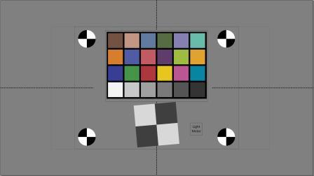
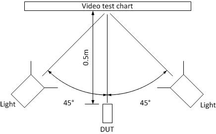
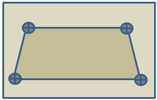
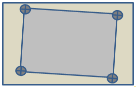
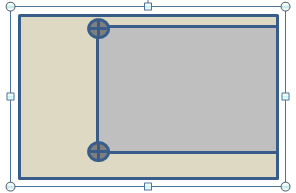

# Camera Sensor Quality Test - Evaluate video frame rate at 640x360 and 20 lux

The Camera Sensor Quality test is an optional test for systems that include one or more built in cameras (for example: phones, laptops, tablets, all-in-one personal computers). This test verifies that the system is able to deliver a high quality real-time capture experience.

This test does not require a dedicated light room; it can be performed in a standard office environment by using the described test setup.

This test is implemented in the Windows Hardware Lab Kit (Windows HLK). The Windows HLK tests measure video streams and the quality of captured images from the device under test (DUT) during streaming video capture at various resolutions. Images of a specified poster, which includes both color and image clarity features, are captured under controlled lighting conditions.

The tests estimate key video quality metrics in the following areas:

-   Image acuity

-   Noise

-   Color quality

-   Geometry

-   Timing

## Test details

<table>
<colgroup>
<col width="50%" />
<col width="50%" />
</colgroup>
<tbody>
<tr class="odd">
<td><strong>Specifications</strong></td>
<td><ul>
<li>System.Client.Camera.Discretional.SensorQuality</li>
</ul></td>
</tr>
<tr class="even">
<td><strong>Platforms</strong></td>
<td><ul>
<li>Windows 10 for desktop editions (Home, Pro, Enterprise, and Education) x86</li>
<li>Windows 10 for desktop editions x64</li>
</ul></td>
</tr>
<tr class="odd">
<td><strong>Supported Releases</strong></td>
<td><ul>
<li>Windows 10</li>
<li>Windows 10, version 1511</li>
<li>Windows 10, version 1607</li>
<li>Windows 10, version 1703</li>
</ul></td>
</tr>
<tr class="even">
<td><strong>Expected run time (in minutes)</strong></td>
<td>5</td>
</tr>
<tr class="odd">
<td><strong>Category</strong></td>
<td>Benchmark</td>
</tr>
<tr class="even">
<td><strong>Timeout (in minutes)</strong></td>
<td>10</td>
</tr>
<tr class="odd">
<td><strong>Requires reboot</strong></td>
<td>false</td>
</tr>
<tr class="even">
<td><strong>Requires special configuration</strong></td>
<td>true</td>
</tr>
<tr class="odd">
<td><strong>Type</strong></td>
<td>manual</td>
</tr>
</tbody>
</table>

 

## Additional documentation

Tests in this feature area might have additional documentation, including prerequisites, setup, and troubleshooting information, that can be found in the following topic(s):

-   [System.Client additional documentation](system-client-additional-documentation.md)

## Running the test

Before you run the test, complete the test setup as described in the test requirements: [Webcam Testing Prerequisites](webcam-testing-prerequisites.md).

**Step-by-step instructions for setting up the test:**

Watch the following video demonstration.

<iframe src="https://hubs-video.ssl.catalog.video.msn.com/embed/caa1967e-1e59-484a-b55b-23dd3efe70d7/IA?csid=ux-en-us&MsnPlayerLeadsWith=html&PlaybackMode=Inline&MsnPlayerDisplayShareBar=false&MsnPlayerDisplayInfoButton=false&iframe=true&QualityOverride=HD" width="720" height="405" allowFullScreen="true" frameBorder="0" scrolling="no"></iframe>

[Download the video (MP4)](http://content5.catalog.video.msn.com/e2/ds/c7cb1516-1219-45d7-a3e1-cc757efdf16c.mp4)

The following additional test equipment is required to run the video tests:

1.  Video test chart:

    -   xRite ColorChecker chart. See *Figure 1. Video Test Chart*.

    -   National Institute of Standards and Technology (NIST) calibrated lux meter (for example, INS DX-100). You should calibrate the lux meter anually.

    -   Printout of the test chart (that is shown in *REF \_Ref311027164 \\h Figure 1. Video Test Chart*), on matte paper by using a high quality inkjet (for example, an HP Z2100). You can access and print this high resolution PDF test chart from: [http://download.microsoft.com/download/8/0/0/80080840-64DC-4929-9B67-16B83E946C6B/HLK Video Test Chart.pdf](http://download.microsoft.com/download/8/0/0/80080840-64DC-4929-9B67-16B83E946C6B/HLK Video Test Chart.pdf).

        

    -   After you print the test chart, mount the color checker and the light meter. The light meter sensor and display should both be mounted and in the field of view. This allows you to measure light levels at test time and to validate light levels by reading the display from captured images.

2.  Dimmable lights

    -   Two impact light stands. Any type is acceptable as long as they allow for the positioning that is described in this topic.

    -   Two light mounts that have reflectors; for example, an Impact 5" Reflector Floodlight Kit.

    -   INSTEON Plug-In Lamp Dimmer Module. Any type is acceptable as long as it has two plugs so that you can control two lights simultaneously (with equal lighting), and the granularity of adjustment to achieve the target 80 & 20 lux (+/- 10%).

    -   INSTEON Wireless Keypad RemoteLinc 2 (optional).

    -   3-to-1 extension cord. Any type is acceptable as long as it can connect to the Insteon dimmer module.

    -   Two units [Philips 424382 11-Watt A19 LED Light Bulb, Dimmable](http://www.amazon.com/Philips-424382-11-watt-Household-Dimmable/dp/B00APTS03K)

    An example DUT and lighting configuration is shown in *REF \_Ref311027182 \\h Figure 2. Video Test Setup*. The lighting that is used in this example is A19 LED-lighting at 20 and 80 lux on the test target.

    

**To run the video capture test**

1.  Start the test by using the Windows HLK Studio Test Scheduler.

2.  Position the DUT as shown in *REF \_Ref311027182 \\h Figure 2. Video Test Setup*.

3.  Turn off all ambient lighting.

4.  The test prompts you to set the light level and test position:

    1.  In light setting mode, the test automatically dims the screen to allow accurate measurement of the light level.

    2.  Adjust the dimmer to get the required number of lux. An acceptable range is 18 to 22 and 72 to 88.

    3.  Confirm the light level and exact distance from the camera to the target chart.

5.  If the system has both front and back cameras, repeat steps 2-4 for the second camera.

## Troubleshooting

For generic troubleshooting of HLK test failures, see [Troubleshooting Windows HLK Test Failures](..\user\troubleshooting-windows-hlk-test-failures.md).

For troubleshooting information, see [Troubleshooting Device.Streaming Testing](troubleshooting-devicestreaming-testing.md).

### Troubleshooting specific errors

<table>
<colgroup>
<col width="50%" />
<col width="50%" />
</colgroup>
<thead>
<tr class="header">
<th>Error</th>
<th>Description/Workaround</th>
</tr>
</thead>
<tbody>
<tr class="odd">
<td>
Setup: test can’t find Region of Interest (ROI)
</td>
<td>
The test looks for Region of Interest (ROI) markers (black and white circles) at known locations on the test. If the test cannot identify ROI markers, then the test cannot run properly. Failure to detect ROI might be due to a poorly aimed camera or unusable video capture from the camera (for example, too dark).

If preview window is not a usable video (for example, 100% gray image due to failed capture, or too dark), exit the test and verify the camera functionality with an independent camera application under test lighting conditions (for example, AMCap) before proceeding.

If the preview window provides a usable image that has clearly recognizable ROI markers, reposition the camera according to the test procedure conditions.
</td>
</tr>
<tr class="even">
<td>
Setup: Region of Interest doesn’t fit within field of view of camera
</td>
<td>
The test looks for ROI markers at known locations on the test. If the test cannot identify ROI markers, then the test cannot run properly.

You might need to position smaller field of view cameras (for example, rear facing cameras) farther than 0.5 m from the test target to capture the required ROI.Reposition the camera according to the test procedure and verify that the camera provides a usable image under test lighting conditions. To avoid an inaccurate measurement for the field of view requirement, enter the new distance into the test application.
</td>
</tr>
</tbody>
</table>

 

### Troubleshooting position problems

This section shows three examples of the most common camera positionining problems. To aid in troubleshooting these types of issues, Windows HLK saves a marked-up version of the image file (look for files that have “ROI” in the file name). The marked-up file includes small red, green and blue markers at key positions on the chart. Markers are as follows:

-   Green dot in the center of the four black and white circles.

-   Four red dots that mark the boundaries of each color square in the color chart.

-   Red and green dots in the center of the white and gray slanted edge chart. The red dot should cover the green dot (hiding it), or the two dots should be within five pixels of each other.

-   Four red dots that outline the region of interest for a horizontal MTF measurement. The slanted edge should be in this region at an approximate angle of seven degrees from the vertical direction.

-   Four blue dots that outline the region of interest for a vertical MTF measurement. The slanted edge should be in this region and at an approximate angle of seven degrees from the horizontal direction.

In *Figure 3. Incorrect Position because of Keystoning*, ROI markers do not form a rectangle because the camera is not perpendicular to the target.

In *Figure 4. Position Not Level*, position markers form a rectangle that is rotated relative to the field of view.

*Figure 5. Poor Centering*, shows two or more image markers that are outside of the field of view.

## More information

### Parameters

| Parameter name                  | Parameter description                                                |
|---------------------------------|----------------------------------------------------------------------|
| **DriverVerifierExcludedFlags** | Driver Verifier flags that may be manually excluded for the test run |

 

 

 

