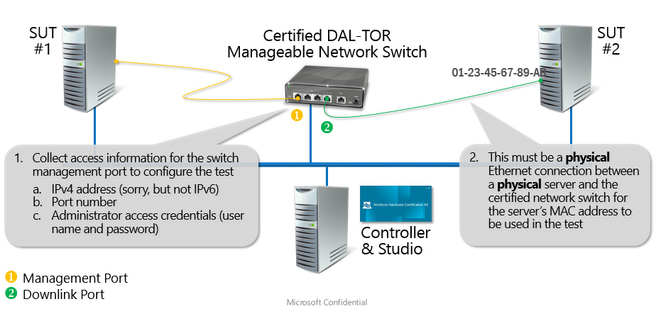

# Device.Network.Switch.DAL-TOR Test


This topic describes how to test network switches for OMI compatibility as part of the Windows® Certification Program. To begin the testing part of the certification process, you must install and run the Windows Hardware Lab Kit (Windows HLK) and set up the test environment. For information about how to install and configure Windows HLK, see [Step 1: Install Controller and Studio on the test server](..\getstarted\step-1-install-controller-and-studio-on-the-test-server.md).

The types of products in the Device.Network.Switch.DAL-TOR category include Top of the Rack Switches.

**In this topic:**

-   [Switch Testing Prerequisites](#switchpre)

-   [Troubleshooting Device.Network.Switch.DAL-TOR tests](#ts)

-   [Switch Tests](#swtests)

## <span id="switchpre"></span><span id="SWITCHPRE"></span>Switch Testing Prerequisites


This section describes the following tasks that you must complete before you test a switch by using the Windows HLK:

-   [Hardware requirements](#hwreq)

-   [Software requirements](#swreq)

-   [Device configuration](#devcon)

-   [Test computer configuration](#testcompconfig)

### <span id="hwreq"></span><span id="HWREQ"></span>Hardware requirements

The following hardware is required for switch testing. Additional hardware can be required if the test device provides bus-specific support. See the test description for each bus-specific test to determine whether there are additional hardware requirements.

-   Basic Windows HLK test setup (Controller and Studio). See [Windows HLK Getting Started](..\getstarted\windows-hlk-getting-started.md).

-   Two test computers.

    >[!NOTE]
    >  
    All computers must meet the Windows HLK requirements. If two test computers are required, both computers must be in the same computer pool. For more information, see [Windows HLK Prerequisites](..\getstarted\windows-hlk-prerequisites.md).

    For testing networking capabilities, the test computer to which the switch is physically attached to is referred to as the System Under Test (SUT).

     

-   One test top of the rack switch.

-   One network card for each of the test machines.

The hardware configuration is illustrated in Figure 1 Hardware Configuration:



### <span id="swreq"></span><span id="SWREQ"></span>Software requirements

Install the operating system on the client systems before the final test passes, to ensure that the system is in a known good state.

-   Client-side software requirements:

    -   Windows PowerShell 3.0

    -   Dot Net 3.5 or higher

-   Switch-side software requirements

    -   OMI server integrated on the switch

### <span id="devcon"></span><span id="DEVCON"></span>Device configuration

To configure the test device for HLK testing, follow these steps:

1.  Connect the switch to the serial port of the test computer by using a console cable.

2.  Establish a console connection to the switch to communicate over the serial port.

3.  Create a default password for the admin user on the switch if one is not already set. (Note: The password is shared when the result is submitted, so be sure to use a default password for the admin user for testing purpose only.)

4.  Assign a Host name to the switch by using the switch cli.

5.  Assign an IP address on the management port on the switch and make sure that the IP is on the same subnet as the test computer so that the test computer can communicate to the switch over the management port.

6.  Make sure that the OMI server is running on the switch. How the OMI server is enabled is determined by the switch vendor.

7.  Make sure that the required access control lists (ACLs) are set on the switch to allow https traffic on the OMI port that is selected by the switch vendor on which the OMI Server is listening.

8.  Make sure that the valid certificate is installed for the OMI service that is running on the system. This certificate is used for a SSL connection to the OMI service from the client.

### <span id="testcompconfig"></span><span id="TESTCOMPCONFIG"></span>Test computer configuration

To configure the test computer for switch testing, follow these steps:

1.  Install the appropriate operating system on the test computer.

2.  Configure the test computer for the test network that contains the Windows HLK Studio and Windows HLK Controller.

3.  Connect the SUT to the Top of the rack switch on the management port and connect a test machine to one of the downlink ports of the Top of the rack switch.

4.  Ping the switch from the test machine that is connected to its downlink port.

5.  Check that the switch functions properly on the test computer.

6.  Install the Windows HLK client application on the test computer.

7.  Install the valid certificate on the test computer, which corresponds to the one on the switch, and add it to the local machine certificate store.

8.  Copy **\\\\**&lt;*HLKControllerMachineName***&gt;\\tests\\AMD64\\nttest\\admintest\\wmi\\TORSwitch\\Logo\\ GenerateVirtualNode.ps1** to the Windows HLK client installation directory that was selected in Step 6, on the test machine. This is typically **C:\\WLK\\JobsWorkingDir**.

9.  Run the GenerateVirtualNode script on the client machine by using an elevated PowerShell window. This test setup script detects the switch that is connected to this host, and creates a node so that tests can be targeted against the device.

    GenerateVirtualNode generates a virtual target for the switch in the Windows HLK controller for targeting Top of the Rack switch tests. The script makes a connection to the switch over OMI, and tries to retrieve critical information that is used for test submission on the switch.

    >[!NOTE]
    >  
    At the end of a successful script execution, the machine is restarted.

     

    **Script parameters**

    -   **ipAddress**: The management IP address of the TOR switch that is connected to the host.

    -   **username**: The user name of the TOR switch device admin.

    -   **password**: The default password of the TOR switch admin user account.

    -   **portNumber**: The OMI port number for SSL communication to the switch.

    **Script example:**

    The following example shows how to run the script by passing the information of all the script arguments.

    ``` syntax
    .\GenerateVirtualNode.ps1 -ipAddress 10.0.0.1 -userName 'admin'-password 'defaultpassword' -portNumber '5986'
    ```

    Before you start to test, make sure that the test computers are in the ready state. If a test requires parameters to be set before it is run, a dialog box displays for that test. Review the specific test topic for more information.

    Some Windows HLK tests require user intervention. When you run tests for a submission, it is a best practice to run the automated tests in a separate block from manual tests. This prevents a manual test from interrupting an automated test run.

## <span id="ts"></span><span id="TS"></span>Troubleshooting Device.Network.Switch.DAL-TOR tests


To troubleshoot issues that occur with Device.Network.Switch.DAL-TOR tests, follow these steps:

1.  Review the [Troubleshooting Windows HLK](..\user\troubleshooting-windows-hlk.md) topic.

2.  Review the Windows HLK release notes for current test issues.

3.  For a test failure, look for usable information in the Windows HLK Studio test log. If you find usable information, resolve the issue and rerun the test.

4.  Review this topic for information about the known test issues for the specific type of device that you are testing. Take any appropriate action that is based on the information that you find, and then rerun the affected test or tests. If you cannot complete testing for your submission, open a support case as described in [Troubleshooting Windows HLK](..\user\troubleshooting-windows-hlk.md).

### <span id="Specific_switch_test_information"></span><span id="specific_switch_test_information"></span><span id="SPECIFIC_SWITCH_TEST_INFORMATION"></span>Specific switch test information

If the Device.Network.Switch.DAL-TOR feature is not detected during testing, we recommend that you run the GenerateVirtualNode script to make sure that the DAL-TOR device is detected in Windows HLK Studio.

## <span id="swtests"></span><span id="SWTESTS"></span>Switch Tests


The Switch category includes the following tests:

-   [TOR Test](#tor)

-   Driver Memory Test

>[!NOTE]
>  
TDI filters and LSPs are not allowed.

 

### <span id="tor"></span><span id="TOR"></span>TOR Test

-   **D3M.TOR.BVT.SwitchFeatures.Enumerate**: The test verifies that the Switch Enumerate Features gets the correct set of features from the switch.

    Steps:

    1.  Get Instance on the list of features.

    2.  Verify that the feature count is greater than zero (0).

    3.  Filter the features to the SSH feature.

    4.  Verify that the SSH feature is found.

-   **D3M.TOR.BVT.SwitchFeatures.Enable**: The test verifies that you can enable and disable the switch features.

    Steps:

    1.  Get Instance on the list of features.

    2.  Filter the features to the SSH feature.

    3.  Disable the SSH feature.

    4.  Verify that the SSH feature is disabled.

    5.  Enable the SSH feature.

    6.  Verify that the SSH feature is enabled.

-   **D3M.TOR.BVT.EthernetPort.GetPortList**: The test verifies that the port list can be retrieved.

    Steps:

    1.  Get Instance on the list of Ethernet ports.

    2.  Verify that the list of ports returned is greater than zero (0).

    3.  Verify the required properties of the port.

-   **D3M.TOR.BVT.EthernetPort.EnablePort**: The test verifies that you can enable and disable the Ethernet port.

    Steps:

    1.  Get Instance on the list of Ethernet ports.

    2.  Get the first port from the list.

    3.  Set the Enabled state of the port to two (2).

    4.  Get the port that corresponds to the same port name.

    5.  Verify that the state is enabled.

    6.  Disable the port.

    7.  Verify that the state is disabled.

-   **D3M.TOR.BVT.EthernetPort.PortProperties**: The test verifies that you can set the Ethernet port properties.

    Steps:

    1.  Get Instance on the list of Ethernet ports.

    2.  Get the first port from the list.

    3.  Set the port speed and the port description.

    4.  Verify that the properties are correctly set.

-   **D3M.TOR.BVT.EthernetPort.PortAssociation**: The test verifies that the Ethernet associations in the Ethernet port are working as expected.

    Steps:

    1.  Get Instance on the list of Ethernet ports.

    2.  Get the first port from the list.

    3.  Get the associated Ethernet port setting data for that port.

-   **D3M.TOR.BVT.EthernetPort.PortModeToAccess**: The test verifies that you can set the Ethernet port mode to Access.

    Steps:

    1.  Get Instance on the list of Ethernet Port Setting Data.

    2.  Get the first port from the list.

    3.  Change the port mode to Access.

    4.  Verify that the port mode is successfully set to Access by calling a Get Instance.

-   **D3M.TOR.BVT.EthernetPort.PortModeToTrunk**: The test verifies that the Ethernet port can be set to Trunk Port.

    Steps:

    1.  Get Instance on the list of Ethernet Port Setting Data.

    2.  Get the first port from the list.

    3.  Change the port mode to Trunk.

    4.  Verify that the port mode is successfully set to Trunk by calling a Get Instance.

-   **D3M.TOR.BVT.VLAN.CreateVLAN**: The test verifies that you can successfully create a VLAN.

    Steps:

    1.  Create two VLANs on the machine.

    2.  Verify that the two VLAN are created.

    3.  Delete the two VLANs.

    4.  Verify that the two VLAN are deleted.

-   **D3M.TOR.BVT.VLAN.EnableVLAN**: The test verifies that you can enable the VLAN on the switch.

    Steps:

    1.  Create one VLAN on the machine.

    2.  Enable the VLAN.

    3.  Verify the Enabled state.

    4.  Disable the VLAN.

    5.  Verify the Disabled state.

    6.  Delete the VLAN.

-   **D3M.TOR.BVT.VLAN.AssociateAccessPortWithVLAN**: The test verifies that the VLAN can be associated with an Ethernet port.

    Steps:

    1.  Create one VLAN on the machine.

    2.  Associate the VLAN with an Ethernet Port.

    3.  Verify that the VLAN Endpoint is associated with the port.

    4.  Delete the VLAN.

-   **D3M.TOR.BVT.VLAN.AssociateTrunkPortWithVLAN**: The test verifies that the VLAN can be associated with an Ethernet Port.

    Steps:

    1.  Create two VLANs on the machine.

    2.  Change the Ethernet port to Trunk Port.

    3.  Associate the two VLANs with the Ethernet port.

    4.  Verify that the VLAN endpoints are associated with the port.

    5.  Delete the VLAN.

-   **D3M.TOR.BVT.VLAN.VLANProperties**: The test verifies that the VLAN can be enabled on the switch.

    Steps:

    1.  Create one VLAN on the machine.

    2.  Set the name of the VLAN.

    3.  Verify the name of the VLAN.

    4.  Delete the VLAN.

-   **D3M.TOR.BVT.Configuration.CopyConfig**: The test verifies that the config can be copied from the startup to the current config and back again.

    Steps:

    1.  Create one VLAN on the machine.

    2.  Copy the Running to the Startup.

    3.  Validate the return value of the method.

    4.  Delete the VLAN.

    5.  Verify that there is no VLAN in the current config.

    6.  Copy the Startup to the Running.

    7.  Verify that the VLAN is up.

    8.  Delete the VLAN.

    9.  Copy the Running to the Startup.

-   **D3M.TOR.BVT.Configuration.SetHostName**: The test verifies that you can successfully change the Host name on the Switch.

    Steps:

    1.  Get Instance of the switch from the computer system.

    2.  Set the Host name of the switch.

    3.  Get Instance of the switch.

    4.  Verify that the Host name of the switch is set as expected.

-   **D3M.TOR.BVT.Configuration.SetBanner**: The test verifies that the banner data can be set successfully for the switch.

    Steps:

    1.  Get Instance of the switch from the computer system.

    2.  Get the Instance of the associated data for the switch.

    3.  Set the banner text to a specific value.

    4.  Get the Instance of MSFT\_Banner data again.

    5.  Verify that the banner data is successfully retrieved.

-   **D3M.TOR.BVT.Configuration.SetIPAddressOnEthernetPort**: The test verifies that the IP address can be successfully set on the switch Ethernet port.

    Steps:

    1.  Get Instance of the Ethernet port from the computer system.

    2.  Create a client-only instance of Cim\_IPProtocolEndpoint.

    3.  Invoke the AddProtocolEndpoint on the Switch Service Class.

    4.  Issue a Get command and obtain the associated instance of the IP Protocol Endpoint.

    5.  Verify that the IP address is successfully set on the Ethernet port.

    6.  Call Remove Protocol on the IP interface.

    7.  Verify that the IP address is successfully reset on the switch.

-   **D3M.TOR.BVT.Configuration.SetIPAddressOnVLAN**: The test verifies that you can successfully set the IP address on the VLAN interface of the switch.

    Steps:

    1.  Create a new VLAN on the switch.

    2.  Create a client-only instance of Cim\_SwitchedVirtualInterface.

    3.  Invoke the AddProtocolEndpoint on the Switch Service Class on the VLAN.

    4.  Issue a Get command and obtain the associated instance of the IP Protocol Endpoint for the VLAN.

    5.  Verify that the IP address is successfully set on the VLAN.

    6.  Call Remove Protocol on the VLAN interface.

    7.  Verify that the IP address is successfully reset on the VLAN.

-   **D3M.TOR.BVT.Configuration.MACAddressTable**: verifies that MACTable can be enumerated in the switch, and the MAC address table entries are valid.

    Steps:

    1.  Enumerate the MAC address table.

    2.  Get the associated MAC table entries from the table.

    3.  Verify the required properties of the MAC table.

    4.  Filter by dynamic MAC address table.

    5.  Verify that the dynamic entries are found in the MAC address table.

 

 


