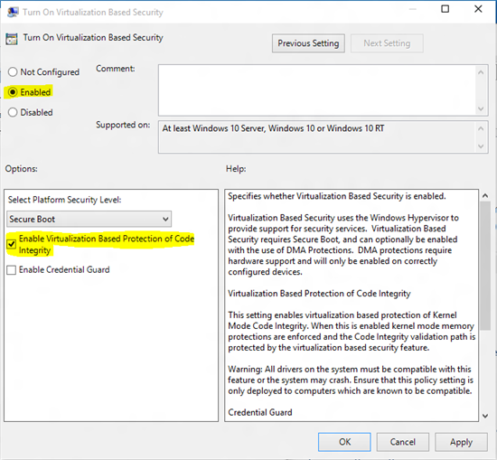

# Driver Compatibility with Device Guard


Windows 10 has a feature called [Device Guard](http://blogs.windows.com/business/2015/04/21/windows-10-security-innovations-at-rsa-device-guard-windows-hello-and-microsoft-passport/) that gives organizations the ability to lock down devices in a way that provides advanced malware protection against new and unknown malware variants as well as Advanced Persistent Threats (APTs). Device Guard can use hardware technology and virtualization to isolate the Code Integrity (CI) decision-making function from the rest of the Windows operating system. When using virtualization-based security to isolate Code Integrity, the only way kernel memory can become executable is through a Code Integrity verification. This means that kernel memory pages can never be Writable and Executable (W+X) and executable code cannot be directly modified.

## <span id="How_to_build_compatible_drivers"></span><span id="how_to_build_compatible_drivers"></span><span id="HOW_TO_BUILD_COMPATIBLE_DRIVERS"></span>How to build compatible drivers


Since memory pages and sections can never be writable and executable, the first step is to ensure a clear separation of data and code and not to attempt to directly modify code pages.

-   Opt-in to NX by default
-   Use NX APIs/flags for memory allocation - NonPagedPoolNx
-   Don't use sections that are both writable and executable
-   Don't attempt to directly modify executable system memory
-   Don't use dynamic code in kernel
-   Don't load data files as executable
-   Section Alignment must be a multiple of 0x1000 (PAGE\_SIZE). E.g. DRIVER\_ALIGNMENT=0x1000

Use the latest version of the [WDK](https://msdn.microsoft.com/en-us/windows/hardware/dn913145.aspx) and [Visual Studio 2015](https://www.visualstudio.com/en-us/dn949247) to produce compatible drivers when using default settings. Visual Studio 2013 currently marks the INIT section as RWX. This will be patched, but is still compatible as Windows 10 will automatically strip the write permission (W) from the INIT section.

## <span id="How_to_verify_driver_compatibility"></span><span id="how_to_verify_driver_compatibility"></span><span id="HOW_TO_VERIFY_DRIVER_COMPATIBILITY"></span>How to verify driver compatibility


There are two steps to verify driver compatibility:

1.  Use Driver Verifier with the new Code Integrity compatibility checks enabled
2.  Test the driver on a system with virtualization-based isolation of Code Integrity enabled.

## <span id="Driver_Verifier_compatibility_checks"></span><span id="driver_verifier_compatibility_checks"></span><span id="DRIVER_VERIFIER_COMPATIBILITY_CHECKS"></span>Driver Verifier compatibility checks


Driver Verifier has a new Code Integrity option flag (0x02000000) to enable extra checks that validate compliance with this feature. To enable this from the command line, use the following command:

``` syntax
verifier.exe /flags 0x02000000 /driver <driver.sys>
```

To choose this option if using the verifier GUI, choose **Create custom settings (for code developers)**, choose **Next**, and then choose **Code integrity checks**.

Drivers built with older versions of Visual Studio will fail on the INIT section being WRX. However, if this is the only issue you can ignore this issue and hit go past this in the kernel debugger as this will not cause any compatibility issues with this feature. Forthcoming updates to driver verifier will not flag the INIT section.

## <span id="Enable_virtualization-based_isolation_for_Code_Integrity"></span><span id="enable_virtualization-based_isolation_for_code_integrity"></span><span id="ENABLE_VIRTUALIZATION-BASED_ISOLATION_FOR_CODE_INTEGRITY"></span>Enable virtualization-based isolation for Code Integrity


Virtualization-based security is supported on Enterprise and Server editions of Windows. To enable virtualization-based protection of Code Integrity, the simplest method is to use gpedit as described below. This will turn on Hyper-V and Isolated User Mode and enable the feature:

1.  Run gpedit to edit local Group Policy
2.  Under Computer Configuration -&gt; Administrative Templates -&gt; System -&gt; **Device Guard**, choose **Turn On Virtualization Based Security**

    

3.  In the detailed configuration dialog that appears, choose **Enabled**, and then select **Enable Virtualization Based Protection of Code Integrity**

    

4.  Reboot

Virtualization-based protection of Code Integrity is now enabled.

## <span id="HLK_tests_and_requirements"></span><span id="hlk_tests_and_requirements"></span><span id="HLK_TESTS_AND_REQUIREMENTS"></span>HLK tests and requirements


### <span id="Client"></span><span id="client"></span><span id="CLIENT"></span>Client

There is a new HLK test called the Hypervisor Code Integrity Readiness Test that will enable the driver verifier Code Integrity options to catch any driver loading issues. This test will not necessarily catch things that the driver does during normal operation, so it is suggested that other testing be performed while driver verifier is enabled and/or while virtualization-based protection of CI is enabled.

### <span id="Server"></span><span id="server"></span><span id="SERVER"></span>Server

The HLK Hypervisor Code Integrity Readiness Test is required as part of the Assurance AQ and the flags to enable Code Integrity checks are also set while enabling driver verifier during other HLK tests.

### <span id="FAQs_"></span><span id="faqs_"></span><span id="FAQS_"></span>FAQs:

**What about existing drivers? Do I need to re-build these drivers to get them to work with Windows 10?**

It depends. Many drivers will already be compatible. If using standard settings with the old versions of the WDK and Visual Studio, a known issue is that the INIT section is marked as RWX. In Windows 10, however, the W will automatically be stripped, so if this is the only issue then the driver will be compatible.

**How do I verify that Virtualization Based Protection of Code Integrity is enabled?**

The simplest mechanism is to run the System Information app (msinfo32). Look for the following line: "Device Guard Security Services Running". It should report: "Hypervisor enforced Code Integrity". There is also a WMI interface for checking using management tools.

**Can I verify that Virtualization Based Protection of Code Integrity is enabled programmatically from kernel in order to alter driver behavior?**

Yes, you can use NtQuerySystemInformation: <https://msdn.microsoft.com/en-us/library/windows/desktop/ms724509(v=vs.85).aspx>

The SYSTEM\_CODEINTEGRITY\_INFORMATION structure has a new 0x400 value exposed, indicating that virtualization based protection of Code Integrity is on.

**How do I fix compatibility issues?**

In addition to double checking that there are no W+X pages and the driver sections are aligned correctly as mentioned above, the most likely issue will be improper memory allocation. Information about the Code Analysis warnings related to memory allocation issued is available on MSDN on the following page:

[Code Analysis for Drivers Warnings](https://msdn.microsoft.com/en-us/library/windows/hardware/ff550572.aspx)

The following MSDN links show some examples of commonly-used APIs that cause executable memory to be allocated, along with some example fixes:

-   [C30029](https://msdn.microsoft.com/en-us/library/windows/hardware/dn910903.aspx)
-   [C30030](https://msdn.microsoft.com/en-us/library/windows/hardware/dn910904.aspx)
-   [C30031](https://msdn.microsoft.com/en-us/library/windows/hardware/dn910905.aspx)
-   [C30032](https://msdn.microsoft.com/en-us/library/windows/hardware/dn910906.aspx)
-   [C30033](https://msdn.microsoft.com/en-us/library/windows/hardware/dn910907.aspx)
-   [C30034](https://msdn.microsoft.com/en-us/library/windows/hardware/dn910908.aspx)
-   [C30035](https://msdn.microsoft.com/en-us/library/windows/hardware/dn910909.aspx)

**Which APIs are potentially affected?**

The following list of APIs that are not reserved for system use may be impacted:

|                                            |                                                                                    |
|--------------------------------------------|------------------------------------------------------------------------------------|
| API name                                   | Description                                                                        |
| ExAllocatePool                             | <https://msdn.microsoft.com/en-us/library/windows/hardware/ff544501(v=vs.85).aspx> |
| ExAllocatePoolWithQuota                    | <https://msdn.microsoft.com/en-us/library/windows/hardware/ff544506(v=vs.85).aspx> |
| ExAllocatePoolWithQuotaTag                 | <https://msdn.microsoft.com/en-us/library/windows/hardware/ff544513(v=vs.85).aspx> |
| ExAllocatePoolWithTag                      | <https://msdn.microsoft.com/en-us/library/windows/hardware/ff544520(v=vs.85).aspx> |
| ExAllocatePoolWithTagPriority              | <https://msdn.microsoft.com/en-us/library/windows/hardware/ff544523(v=vs.85).aspx> |
| ExInitializeNPagedLookasideList            | <https://msdn.microsoft.com/en-us/library/windows/hardware/ff545301(v=vs.85).aspx> |
| ExInitializeLookasideListEx                | <https://msdn.microsoft.com/en-us/library/windows/hardware/ff545298(v=vs.85).aspx> |
| MmAllocateContiguousMemory                 | <https://msdn.microsoft.com/en-us/library/windows/hardware/ff554460(v=vs.85).aspx> |
| MmAllocateContiguousMemorySpecifyCache     | <https://msdn.microsoft.com/en-us/library/windows/hardware/ff554464(v=vs.85).aspx> |
| MmAllocateContiguousMemorySpecifyCacheNode | <https://msdn.microsoft.com/en-us/library/windows/hardware/ff554464(v=vs.85).aspx> |
| MmAllocateContiguousNodeMemory             | <https://msdn.microsoft.com/en-us/library/windows/hardware/jj602795(v=vs.85).aspx> |
| MmCopyMemory                               | <https://msdn.microsoft.com/en-us/library/windows/hardware/dn342884(v=vs.85).aspx> |
| MmMapIoSpace                               | <https://msdn.microsoft.com/en-us/library/windows/hardware/ff554618(v=vs.85).aspx> |
| MmMapLockedPages                           | <https://msdn.microsoft.com/en-us/library/windows/hardware/ff554622(v=vs.85).aspx> |
| MmMapLockedPagesSpecifyCache               | <https://msdn.microsoft.com/en-us/library/windows/hardware/ff554629(v=vs.85).aspx> |
| MmProtectMdlSystemAddress                  | <https://msdn.microsoft.com/en-us/library/windows/hardware/ff554670(v=vs.85).aspx> |
| ZwAllocateVirtualMemory                    | <https://msdn.microsoft.com/en-us/library/windows/hardware/ff566416(v=vs.85).aspx> |
| ZwCreateSection                            | <https://msdn.microsoft.com/en-us/library/windows/hardware/ff566428(v=vs.85).aspx> |
| ZwMapViewOfSection                         | <https://msdn.microsoft.com/en-us/library/windows/hardware/ff566481(v=vs.85).aspx> |
| NtCreateSection                            | <https://msdn.microsoft.com/en-us/library/windows/hardware/ff556473(v=vs.85).aspx> |
| NtMapViewOfSection                         | <https://msdn.microsoft.com/en-us/library/windows/hardware/ff556551(v=vs.85).aspx> |
| StorPortGetDataInBufferSystemAddress       | <https://msdn.microsoft.com/en-us/library/windows/hardware/jj553720(v=vs.85).aspx> |
| StorPortGetSystemAddress                   | <https://msdn.microsoft.com/en-us/library/windows/hardware/ff567100(v=vs.85).aspx> |
| DxgkCbMapMemory                            | <https://msdn.microsoft.com/en-us/library/windows/hardware/ff559533(v=vs.85).aspx> |
| IMiniportDMus::NewStream                   | <https://msdn.microsoft.com/en-us/library/windows/hardware/ff536701(v=vs.85).aspx> |
| FltAllocatePoolAlignedWithTag              | <https://msdn.microsoft.com/en-us/library/windows/hardware/ff541762(v=vs.85).aspx> |
| FltAllocateContext                         | <https://msdn.microsoft.com/en-us/library/windows/hardware/ff541710(v=vs.85).aspx> |
| ChangerClassAllocatePool                   | <https://msdn.microsoft.com/en-us/library/windows/hardware/ff551402(v=vs.85).aspx> |
| IMiniportMidi::NewStream                   | <https://msdn.microsoft.com/en-us/library/windows/hardware/ff536710(v=vs.85).aspx> |
| IMiniportWaveCyclic::NewStream             | <https://msdn.microsoft.com/en-us/library/windows/hardware/ff536723(v=vs.85).aspx> |
| IPortWavePci::NewMasterDmaChannel          | <https://msdn.microsoft.com/en-us/library/windows/hardware/ff536916(v=vs.85).aspx> |
| IMiniportWavePci::NewStream                | <https://msdn.microsoft.com/en-us/library/windows/hardware/ff536735(v=vs.85).aspx> |
| PcNewDmaChannel                            | <https://msdn.microsoft.com/en-us/library/windows/hardware/ff537712(v=vs.85).aspx> |
| PcNewResourceList                          | <https://msdn.microsoft.com/en-us/library/windows/hardware/ff537717(v=vs.85).aspx> |
| PcNewResourceSublist                       | <https://msdn.microsoft.com/en-us/library/windows/hardware/ff537718(v=vs.85).aspx> |
| VideoPortAllocatePool                      | <https://msdn.microsoft.com/en-us/library/windows/hardware/ff570180(v=vs.85).aspx> |
| ClfsCreateMarshallingArea                  | <https://msdn.microsoft.com/en-us/library/windows/hardware/ff541520(v=vs.85).aspx> |
| WdfLookasideListCreate                     | <https://msdn.microsoft.com/en-us/library/windows/hardware/ff548694(v=vs.85).aspx> |
| WdfMemoryCreate                            | <https://msdn.microsoft.com/en-us/library/windows/hardware/ff548706(v=vs.85).aspx> |
| WdfDeviceAllocAndQueryProperty             | <https://msdn.microsoft.com/en-us/library/windows/hardware/ff545882(v=vs.85).aspx> |
| WdfDeviceAllocAndQueryPropertyEx           | <https://msdn.microsoft.com/en-us/library/windows/hardware/dn265599(v=vs.85).aspx> |
| WdfFdoInitAllocAndQueryProperty            | <https://msdn.microsoft.com/en-us/library/windows/hardware/ff547239(v=vs.85).aspx> |
| WdfFdoInitAllocAndQueryPropertyEx          | <https://msdn.microsoft.com/en-us/library/windows/hardware/dn265612(v=vs.85).aspx> |
| WdfIoTargetAllocAndQueryTargetProperty     | <https://msdn.microsoft.com/en-us/library/windows/hardware/ff548585(v=vs.85).aspx> |
| WdfRegistryQueryMemory                     | <https://msdn.microsoft.com/en-us/library/windows/hardware/ff549920(v=vs.85).aspx> |
| NdisAllocateMemory                         | <https://msdn.microsoft.com/en-us/library/windows/hardware/ff550762(v=vs.85).aspx> |

 

 

 


