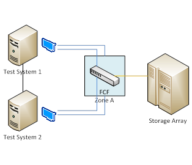

# Fibre Channel Over Ethernet Testing Prerequisites


This section describes the tasks that you must complete before you test a Fibre Channel over Ethernet (FCoE) controller by using the Windows Hardware Lab Kit (Windows HLK):

-   [Hardware Requirements](#bkmk-hardwarerequirements).

-   [Software Requirements](#bkmk-softwarerequirements).

-   [Test Computer Configuration](#bkmk-configure).

## <span id="BKMK_HardwareRequirements"></span><span id="bkmk-hardwarerequirements"></span><span id="BKMK_HARDWAREREQUIREMENTS"></span>Hardware Requirements


The following hardware is required for testing an FCoE controller. You might need additional hardware if the test device offers other features. To determine whether additional hardware requirements apply, see the test description for each test that appears for the device in Windows HLK Studio.

>[!NOTE]
>  
With the exception of the test computer and the test controller, all hardware involved in the test must already have a logo.

 

-   Two test computers. The test computers must meet the Windows HLK requirements as described in [Windows HLK Prerequisites](..\getstarted\windows-hlk-prerequisites.md). and the following operating system-specific requirements.

    -   For testing on Windows 8, Windows 7, Windows Vista or Windows XP:

        -   One dual-core or equivalent processor

        -   4 GB of memory

    -   For testing on Windows Server® 2012, Windows Server 2008 R2, Windows Server 2008, or Windows Server 2003:

        -   One quad-core or equivalent processor

        -   6 GB of memory

-   Two identical PCI-X or PCIe-based dual-port FCoE adapters (the test devices). Four identical FCoE adapters are needed if the adapter is single-ported.

-   One FCF (FCoE switch) that supports 10G/E bandwidth for FCoE traffic. FCF is installed with four available FCoE ports/SFP+, and one FC port/SFP+.

-   Copper- or fibre-based FCoE cable and Fibre Channel cable for the above ports.

-   One Fibre Channel storage array system that can support any one of the following: RAID-0, RAID-1, RAID-5, RAID-10, or RAID-6.

-   If the FCoE adapter is not bootable, one on-board SATA or SAS controller.

-   If the FCoE adapter is not bootable, one SATA or SAS disk drive for operating system installation.

>[!NOTE]
>  
To certify your product for use on servers, the test computer must support four processors and a minimum of 1 GB of RAM. These system capabilities are required to test the Rebalance, D3 State, and Multiple Processor Group functionality of the device and driver. You do not need a computer that actually has more than 64 processors to test your device. Additionally, the server system(s) being used for device or driver testing must have Server Core installed prior to testing. For more information see [Windows Server Installation Options](http://go.microsoft.com/fwlink/p/?LinkID=251454).

If you use a pool of test computers to test devices, at least one computer in the pool must contain four processors and a minimum of 1 GB of RAM. Additionally, that computer must contain the device and the driver that you want to test. If the driver is the same on all the computers in the pool, the system creates a schedule to run against all test computers.

For tests that do not include a driver to test, such as hard disk drive tests, the Windows HLK scheduler constrains the tests that validate the device’s and driver’s rebalance, D3 state, and multiple processor groups functionality to run on the default test computer. You must manually configure this computer to have multiple processor groups. The default computer is the first test computer in the list. Test personnel must make sure that the first test computer in the list meets the minimum hardware requirements.

>[!NOTE]
>  
Except for para-virtualization drivers (as defined by the [WHCP Policies and Processes](http://go.microsoft.com/fwlink/p/?LinkID=615222) document), you may not use any form of virtualization when you test physical devices and their associated drivers for server certification or signature. All virtualization products do not support the underlying functionality that is required to pass the tests that relate to multiple processor groups, device power management, device PCI functionality, and other tests.

>[!NOTE]
>  Multiple Processor Groups Setting
>You must set the value for the processor group size for Hardware Lab Kit testing of Windows Server 2008 R2 and later device drivers for certification. This is done by running bcdedit in an elevated command prompt window, using the /set option.
>
>The commands for adding the group settings and restarting are as follows:
>
``` syntax
bcdedit.exe /set groupsize 2
bcdedit.exe /set groupaware on
shutdown.exe -r -t 0 -f
```
>
>
>The commands for removing the group settings and rebooting are as follows:
>
``` syntax
bcdedit.exe /deletevalue groupsize
bcdedit.exe /deletevalue groupaware
shutdown.exe -r -t 0 -f
```
>

>[!NOTE]
>  
**Code Integrity Setting**

>The Virtualization Based Security feature (VBS) of Windows Server 2016 must be enabled using Server Manager first.
>
>Once that has occurred, the following Registry key must be created and set:
>
``` syntax
HKLM\System\CurrentControlSet\Control\DeviceGuard
HypervisorEnforcedCodeIntegrity:REG_DWORD
0 or 1 (disabled, enabled)
```

 

## <span id="BKMK_SoftwareRequirements"></span><span id="bkmk-softwarerequirements"></span><span id="BKMK_SOFTWAREREQUIREMENTS"></span>Software Requirements


The following software is required to test a Fibre Channel storage controller:

-   The drivers for the test device.

-   The latest Windows HLK filters or updates.

-   The current release of the Windows Driver Kit (WDK).

-   Windows symbol files. These are available from the [Symbol Files website](http://go.microsoft.com/fwlink/?LinkId=231439).

## <span id="BKMK_Configure"></span><span id="bkmk-configure"></span><span id="BKMK_CONFIGURE"></span>Test Computer Configuration


To configure the test computer to test a Fibre Channel storage controller, follow these steps:

1.  When the test computer is turned off, complete the following assembly steps:

    1.  If the FCoE adapter is not bootable, configure an alternate SATA or SAS on-board boot controller, and then install a respective SATA or SAS hard disk drive if they are not present.

    2.  Install one FCoE adapter in the first test system. (Install two FCoE adapters in the first computer if the computer has only one port.)

    3.  Connect all ports of the FCoE adapter(s) to the FCF.

    4.  Repeat step 2 through step 4 for the second FCoE adapter in the second test system. (Install two FCoE adapters in the second computer if the computer has only one port.)

    5.  Connect the FCF to the storage array, as described in the following diagram:

        

    6.  Create LUN and configure LUN mapping on the storage array system. The array must contain at least 120 GB of disk space for SAN boot configuration. The LUN mapping is only needed for the first test system. Complete this step according to the storage array vendor instructions.

    7.  Configure the ports and zoning on the FCF. Complete this step according to the switch vendor instructions.

    8.  Turn on the test systems.

2.  Turn on the test computer, install the appropriate Windows operating system, install all available Windows updates, and then configure the computer for your test network. The test network is the network that contains the Windows HLK Studio and Windows HLK Controller.

3.  Install any HBA or RAID system drivers that are necessary to connect to or manage the peripheral devices.

4.  Do one of the following to install the operating system:

    1.  If the test FCoE adapter is bootable, install the operating system on an NTFS, 120 GB partition on the RAID system.

    2.  Install the operating system on an NTFS-formatted 120 GB partition on the SATA or SAS hard disk drive that is connected to the alternate SATA or SAS boot controller in the test system.

    >[!WARNING]
    >  
    Do not follow this step when you test MPIO.

     

5.  Start the test system in the Microsoft Windows operating system.

6.  Configure MPIO for the first test system only:

    -   Install the Windows MPIO feature through Server Manager.

    -   Reboot the system.

    -   Use the mpclaim.exe command line utility or edit the MPIO CPL (Control Panel) GUI interface to add the LUN ID to be claimed.

    -   Restart the system.

7.  Complete the following procedure to set the system page file and enable crashdump:

    1.  Click the **Start** button, right-click **My Computer**, and then click **Properties.**

    2.  Click the **General** tab, and then note the amount of RAM that the computer contains.

    3.  Click the **Advanced** tab (or click **Advanced system settings** in the left pane for Windows Vista, Windows 7, Windows 8, Windows Server 2008, Windows Server 2008 R2 or Windows Server® 2012), and then, in the **Performance** area, click **Settings**.

        >[!NOTE]
        >  
        If you are prompted to enter administrative credentials or allow the action, enter the credentials or allow the action.

         

    4.  Click the **Advanced** tab, and then, in the **Virtual Memory** area, click **Change**.

    5.  Select **Custom Size**, and then enter a number in the **Initial size (MB)** box that is larger than the size of RAM that you noted in step b.

    6.  In the **Maximum size (MB)** text box, enter a maximum size value that is larger than the initial size that you entered in the **Initial size (MB)** box. (The maximum size is typically 1.5 to 2 times the initial size.)

    7.  Click **Set**, and then click **OK** two times.

    8.  Click **OK**, and then restart the computer to update the page file size.

8.  Copy the Windows symbol files to %SystemDrive%\\Symbols.

9.  Verify that Windows can access the storage array over the FCoE adapter.

10. Install the Windows HLK client application on the test computer.

11. Use Windows HLK Studio to create a computer pool, and then move the test computer to that pool.

Make sure that the test computer is in the ready state before you begin your testing. If a test requires parameters to be set before it is run, a dialog box appears for that test. Review the specific test topic for more information.

Some Windows HLK tests require user intervention. When you run tests for a submission, it is a best practice to run the automated tests in a block separately from manual tests. This prevents a manual test from interrupting completion of an automated test.

>[!WARNING]
>  
When testing storage devices, we strongly recommend that you complete all Device Fundamentals tests before starting storage tests. Storage tests will reconfigure your test device, leaving the device in a state unsuitable to support Device Fundamentals tests. The following configurations provide steps to create volume on the storage test device. This is important to complete the Device Fundamental part of testing (DevFund).

 

 

 


