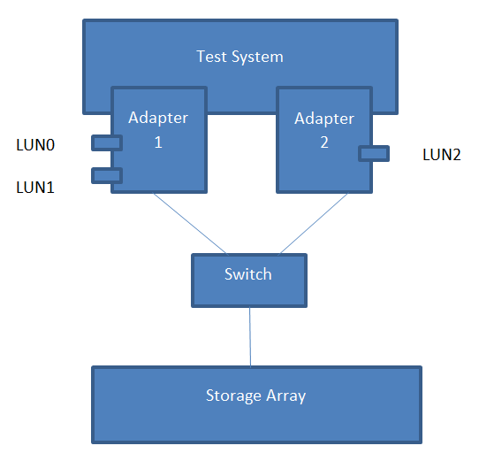
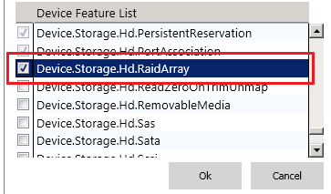

# Hardware-based Raid Systems (Fibre Channel, SAS, SCSI, Serial ATA) Testing Prerequisites


This topic describes the tasks that you must complete before you test a hardware-based RAID storage array by using the Windows Hardware Lab Kit (Windows HLK):

-   [Hardware Requirements](#bkmk-hardwarerequirements).

-   [Software Requirements](#bkmk-softwarerequirements).

-   [Configuring the Test Computer](#bkmk-configure)

The storage tests that you must run, the testing prerequisites, and the test setup vary depending on whether the RAID system is Internet SCSI (iSCSI) based or whether it uses another connection type: Fibre Channel, Serial Attached SCSI (SAS), SCSI, or Serial Advanced Technology Attachment (SATA).

## <span id="BKMK_HardwareRequirements"></span><span id="bkmk-hardwarerequirements"></span><span id="BKMK_HARDWAREREQUIREMENTS"></span>Hardware Requirements


To test a hardware-based RAID array, you need the following hardware. You might need additional hardware if the test device offers other features. To determine whether additional hardware requirements apply, see the description for each test that appears for the device in Windows HLK Studio.

>[!NOTE]
>  
All hardware (except the test device, monitor, keyboard, mouse, and floppy disk drive) must be listed in the Windows Catalog.

 

-   1 test computer that meets the Windows HLK requirements. For more information, see [Windows HLK Prerequisites](..\getstarted\windows-hlk-prerequisites.md). In addition, this computer must include:

    -   1 logo-compliant Advanced Configuration and Power Interface (ACPI) BIOS, with ACPI enabled by default.

    -   Dual-core or equivalent processor and a minimum of 2 gigabytes (GB) of memory for Windows client operating systems (for example, Windows 8, Windows 7, and Windows Vista).

    -   Quad-core or equivalent processor and 6 GB of memory for Windows Server® operating systems.

    An equivalent processor is any processor that appears to Windows as if it contains the specified number of CPUs. You can achieve this status through 1 or more physical microprocessors.

-   1 test-specific type of RAID storage system: Fibre Channel, SAS, SCSI, or SATA RAID (for example, a SAS RAID storage system for a SAS system test). This device is the test device.

    >[!WARNING]
    >  
    The RAID system must be a single cabinet that consists of an array controller that's enclosed in an external subsystem with hard disk drives. Or it must be an external array controller that connects to a RAID JBOD. The RAID system can't consist of only a Peripheral Component Interconnect (PCI)–based controller and 1 RAID JBOD.

     

-   1 PCI-based, test-specific type of host bus adapter (HBA). If the test system supports Microsoft® Multipath I/O (MPIO), 2 ports in the HBA or 2 identical HBAs (if each of them has only 1 port) must be connected to the same target device.

    >[!NOTE]
    >  
    The RAID system should support the PCI-based HBA that you select to test the RAID system. Any drivers that you use on the test system for this HBA must have a Windows logo, and the HBA model and firmware version must be included in the Windows Catalog.

     

-   1 bootable ATA, SCSI, or SATA (only for testing SATA hardware-based RAID systems) hard disk drive, if the RAID system doesn't support boot. This drive must have a minimum capacity of 36 GB.

To certify your product for use on servers, the test computer must support four processors and a minimum of 1 GB of RAM. These system capabilities are required to test the Rebalance, D3 State, and Multiple Processor Group functionality of the device and driver. You do not need a computer that actually has more than 64 processors to test your device. Additionally, the server system(s) being used for device or driver testing must have Server Core installed prior to testing. For more information see [Windows Server Installation Options](http://go.microsoft.com/fwlink/p/?LinkID=251454).

If you use a pool of test computers to test your device, at least 1 computer in the pool must contain 4 processors and a minimum of 1 GB of RAM. Additionally, that computer must contain the device and the driver that you want to test. As long as the driver is the same on all the computers in the pool, the system creates a schedule to run against all test computers.

For tests that don't include a driver to test, like tests for a hard disk drive, the Windows HLK scheduler constrains the tests that validate the device's and driver's Rebalance, D3 State, and Multiple Processor Groups functionality to run on the default test computer. You must manually configure this computer to have multiple processor groups. The default computer is the first test computer in the list. Make sure that the first test computer in the list meets the minimum hardware requirements.

>[!NOTE]
>  
Except for para-virtualization drivers (as defined by the [WHCP Policies and Processes](http://go.microsoft.com/fwlink/p/?LinkID=615222) document), you can't use any form of virtualization when you test physical devices and their associated drivers for server certification or signature. Virtualization products don't support the underlying functionality that's required to pass the tests that relate to multiple processor groups, device power management, device PCI functionality, and other tests.

>[!NOTE]
>  Multiple Processor Groups Setting
>You must set the value for the processor group size for Hardware Lab Kit testing of Windows Server 2008 R2 and later device drivers for certification. This is done by running bcdedit in an elevated command prompt window, using the /set option.
>
>The commands for adding the group settings and restarting are as follows:
>
``` syntax
bcdedit.exe /set groupsize 2
bcdedit.exe /set groupaware on
shutdown.exe -r -t 0 -f
```
>
>
>The commands for removing the group settings and rebooting are as follows:
>
``` syntax
bcdedit.exe /deletevalue groupsize
bcdedit.exe /deletevalue groupaware
shutdown.exe -r -t 0 -f
```
>

>[!NOTE]
>  
**Code Integrity Setting**

>The Virtualization Based Security feature (VBS) of Windows Server 2016 must be enabled using Server Manager first.
>
>Once that has occurred, the following Registry key must be created and set:
>
``` syntax
HKLM\System\CurrentControlSet\Control\DeviceGuard
HypervisorEnforcedCodeIntegrity:REG_DWORD
0 or 1 (disabled, enabled)
```

 

## <span id="BKMK_SoftwareRequirements"></span><span id="bkmk-softwarerequirements"></span><span id="BKMK_SOFTWAREREQUIREMENTS"></span>Software Requirements


To test a hardware-based RAID array, you need this software:

-   Any drivers for the test hardware that aren't included with Windows.

-   The latest Windows HLK filters or updates.

-   Windows symbol files. These are available from the [Symbol Files](http://go.microsoft.com/fwlink/?LinkId=231439) website.

## <span id="BKMK_Configure"></span><span id="bkmk-configure"></span><span id="BKMK_CONFIGURE"></span>Configuring the Test Computer


To configure the test computer to test your Fibre Channel, SAS, SCSI, or SATA RAID array, follow these steps:

1.  Configure the RAID system by using the RAID system operator panel, by using the command-line tool, or by connecting another system to the RAID system and running the configuration tool. Specifically:

    1.  Check that all RAID devices support only 1 RAID level: either RAID 5, RAID 1, or RAID 0.

        If your RAID system supports more than 1 RAID level, you must test all RAID levels that the device supports.

    2.  Create three 40-GB RAID arrays on the RAID system. Configure the arrays according to this table:

        <table>
        <colgroup>
        <col width="25%" />
        <col width="25%" />
        <col width="25%" />
        <col width="25%" />
        </colgroup>
        <thead>
        <tr class="header">
        <th>If the test device supports these RAID levels</th>
        <th>RAID level for RAID Array 1</th>
        <th>RAID level for RAID Array 2</th>
        <th>RAID level for RAID Array 3</th>
        </tr>
        </thead>
        <tbody>
        <tr class="odd">
        <td><p>0 only</p></td>
        <td><p>0</p></td>
        <td><p>0</p></td>
        <td><p>0</p></td>
        </tr>
        <tr class="even">
        <td><p>1 only</p></td>
        <td><p>1</p></td>
        <td><p>1</p></td>
        <td><p>1</p></td>
        </tr>
        <tr class="odd">
        <td><p>5 only</p></td>
        <td><p>5</p></td>
        <td><p>5</p></td>
        <td><p>5</p></td>
        </tr>
        <tr class="even">
        <td><p>0 and 1 only</p></td>
        <td><p>1</p></td>
        <td><p>0</p></td>
        <td><p>1 or 0</p></td>
        </tr>
        <tr class="odd">
        <td><p>0, 1, and 10</p></td>
        <td><p>10</p></td>
        <td><p>1</p></td>
        <td><p>0</p></td>
        </tr>
        <tr class="even">
        <td><p>0 and 5 only</p></td>
        <td><p>5</p></td>
        <td><p>5</p></td>
        <td><p>0</p></td>
        </tr>
        <tr class="odd">
        <td><p>1 and 5 only</p></td>
        <td><p>5</p></td>
        <td><p>5</p></td>
        <td><p>1</p></td>
        </tr>
        <tr class="even">
        <td><p>0, 1, and 5</p></td>
        <td><p>5</p></td>
        <td><p>1</p></td>
        <td><p>0</p></td>
        </tr>
        <tr class="odd">
        <td><p>0, 1, 5, and 10</p></td>
        <td><p>5</p></td>
        <td><p>10</p></td>
        <td><p>1 or 0</p></td>
        </tr>
        </tbody>
        </table>

         

2.  Turn off the test computer.

3.  Install 1 test-specific type of HBA. For example, if you're testing for a Fibre Channel system, install the Fibre Channel HBA.

4.  In the test system, connect the HBA to the RAID system by using the appropriate cables for the bus type (for example, SCSI, SATA, and so on).

    >[!NOTE]
    >  
    If the test RAID system supports more than 1 bus protocol, you must test and submit your device for Windows certification 1 time with each protocol that you want to have it qualified for.

     

5.  If the device supports MPIO, make sure that the HBA has at least 2 ports. If the HBA has only 1 port, install another HBA of the same model, and then connect it to the RAID system by using the appropriate cables for the bus.

6.  For a non-MPIO test environment, if both the HBA that you're using to test the RAID system and the RAID system itself support boot, follow these steps:

    1.  Install any HBA or RAID system drivers, including multipath drivers that are required to connect to or manage the test device.

    2.  Create a 36-GB NTFS file system partition on RAID Array 1, and then install the appropriate operating system on this partition.

        >[!NOTE]
        >  
        We recommend SAN-boot configuration, but it isn't required.

         

    For an MPIO test environment, we don't recommend that you set up MPIO logical unit number (LUN) bootable. Instead, follow these steps:

    1.  Install an alternate boot controller on the test system.

    2.  Connect a hard disk drive to the alternate boot controller on the test system.

    3.  Install any necessary drivers for the alternate boot controller.

    4.  Install the appropriate operating system on a 36-GB NTFS partition on the hard disk drive.

    5.  Install any HBA or RAID system drivers, including multipath drivers that are required to connect to or manage the peripheral devices.

7.  Click **Start**, and then click **Run**.

8.  Type **diskmgmt.msc**, and then press Enter.

    If the test operating system is Windows Vista or Windows Server 2008, and you're prompted to enter administrator credentials, enter the credentials.

9.  If the disks appear to be inactive, activate them by right-clicking the disk and then clicking **Initialize Disk**.

10. Partition and format all disks:

    1.  Right-click each disk, and then click **Convert to Basic Disk** if it is not basic already.

    2.  Right-click each disk, and then click **New Partition**.

        >[!NOTE]
        >  
        Each partition should be a primary partition, should use all of the disk space, should use any drive letter, and should be formatted in NTFS.

        For a non-MPIO test environment, if the HBA that you're using to test the RAID system is bootable, and if the RAID system supports boot, RAID Array 1 should already have a 36-GB partition. Create a new NTFS partition by using the remaining space on this drive.

         

11. Restart the operating system to update the size of the page file.

12. Verify that the computer can read or write to the test RAID array.

13. Install the Windows symbol files to the C:\\Symbols directory. These are available from the [Download Windows Symbol Packages](http://go.microsoft.com/fwlink/?LinkId=230679) webpage.

14. Install the Windows HLK client application on the test computer.

15. Use Windows HLK Studio to create a computer pool, and then move the test computer to that pool.

For all types of RAID arrays that you're testing, make sure that the test computer is in the ready state before you begin your testing. If a test requires you to set parameters before you run it, a dialog box will appear for that test. For more information, review the specific test topic.

Some Windows HLK tests require user intervention. When you're running tests for a submission, it's a best practice to run the automated tests in a block separately from manual tests. This prevents a manual test from interrupting the completion of an automated test.

>[!WARNING]
>  
When testing storage devices, we strongly recommend that you complete all Device Fundamentals tests before starting storage tests. Storage tests will reconfigure your test device, leaving the device in a state unsuitable to support Device Fundamentals tests. The following configurations provide steps to create volume on the storage test device. This is important to complete the Device Fundamental part of testing (DevFund).

 

## <span id="Feature-Based_Configuration"></span><span id="feature-based_configuration"></span><span id="FEATURE-BASED_CONFIGURATION"></span>Feature-Based Configuration


If your device supports any of the feature(s) in this section, please update the associated configurations steps in addition to the general interface-based configuration steps in the “Configuring the Test Computer” section. Minor modifications may be applicable depending on the specifics of your device form-factor.

**Device.Storage.Hd.Mpio**

-   MPIO Test needs multiple ports connected to the same LUN. HBA needs to have multiple ports, or multiple one-port HBAs need to be set up.

-   For iSCSI test environment, it needs NIC card(s) or iSCSI HBA(s).

-   HBA firmware and drivers.

-   At least three LUNs.

-   Install MPIO feature by using Server Manager and install MS DSM or 3rd party DSM.

-   For iSCSI test environment, the users need to set up multiple iSCSI sessions for each pair of initiator IP address and target.

-   If device supports MPIO, then all of the three LUNs should be MPIO LUNs.

-   Configure the LUNs LBP policy to be Failover Only.

-   Configure the LUNs to be with partitions.

-   While creating submissions, select both DSM and the specific LUNs supporting specific features. You do not need to manually add the MPIO feature to the LUN.

**Device.Storage.Hd.OffloadedDataTransfer**

-   Test system has minimum 2 adapters with Adapter1 having 2 LUNs and Adapter2 having 1 LUN.

-   LUNs configured should be a minimum of 21 GB in size.

-   Single HBA Push Scenario & Single HBA Pull Scenario: Runs Offload Scenario test between Lun0 and Lun1.

-   Multiple HBA Push Scenario & Multiple HBA Pull Scenario: Runs Offload Scenario test between Lun0 and Lun2.



**Device.Storage.Hd.RaidArray**

Upon completion of hardware setup, and manually select this feature when going through the Windows HLK’s target selection.



**Device.Storage.Hd.ThinProvisioning**

-   If the device supports thin provisioning, at least include one thin provisioned LUN and one full provisioned LUN. Thinly provisioned LUN needs to have a size no larger than 25 GB.

-   If the device supports thin provisioning, thin provisioning feature, threshold notification and persistent resource exhaustion, features need to be configured on the storage device end.

-   Configure the threshold notification to be set at 70% for thinly-provisioned LUN.

-   Enable permanent resource exhaustion feature on storage array.

 

 


