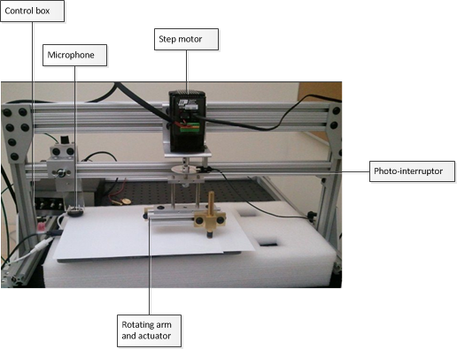
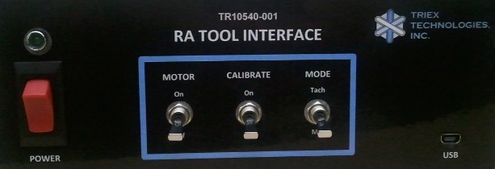
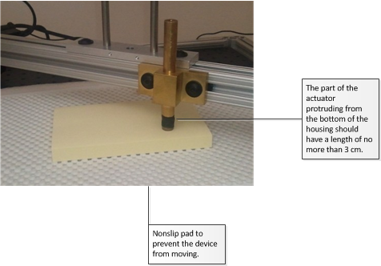
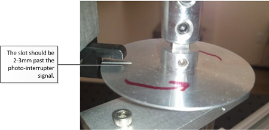
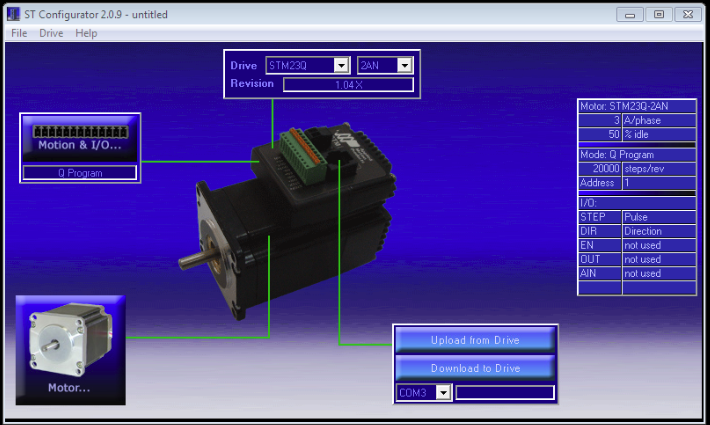
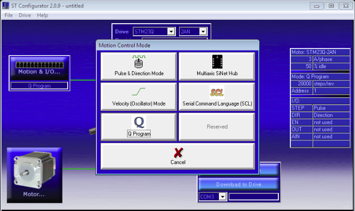
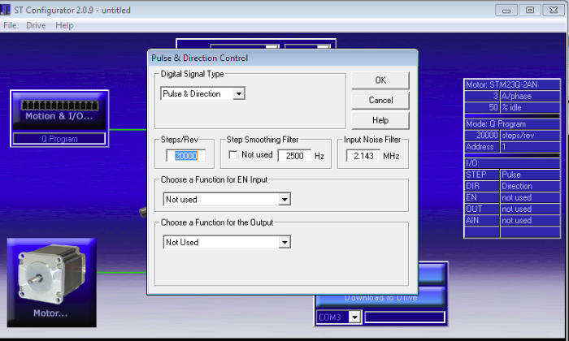
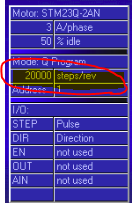
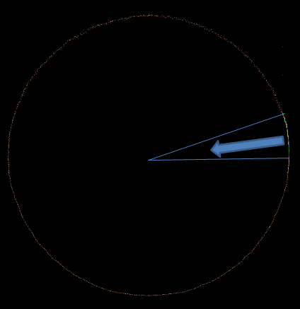

# How to measure Touch Panning Latency


This topic provides detailed setup instructions and procedures to measure touch panning latency in accordance with Hardware Certification for Windows 8.1. It assumes that the reader is familiar with touch screens, understands the concept of touch screen latency, and has basic understanding of electrical and software engineering.

**In this topic:**

-   [Overview](#ov)

-   [Methodology](#methodology)

-   [Hardware requirements](#nwreq)

-   [Software requirements](#swreq)

-   [Test procedure for Triex RA tool](#testtriexpa)

-   [Test procedure for ITRI RA tool](#itri-ra)

-   [Analysis and report](#ar)

-   [Automated calibration mode](#acm)

-   [Troubleshooting](#ts)

-   [Additional support](#sup)

## <span id="ov"></span><span id="OV"></span>Overview


*Latency* is a measure of time delay that is experienced in the touch digitizer system. *Touch down latency* is the time between the finger or stylus (actuator) touching the screen and the host operating system receiving the contact (usually through a HID report). *Panning latency* is slightly more complicated because the contact is moving along a continuous path but the reports arrive in discrete time intervals. Therefore, panning latency is defined only in terms of discrete time intervals for which reported touch data are available. Measuring panning latency is then reduced to knowing the time delay between when the touch actually occurs and when the operating system receives the touch event.

## <span id="methodology"></span><span id="METHODOLOGY"></span>Methodology


This topic describes the setup and procedures to measure the panning latency of a touch hardware device by using a step motor and a photo-interrupter. The step motor drives a mechanical arm to drive an actuator that simulates a human finger. The actuator draws a circle on the tested device and the photo-interrupter circuit detects when the actuator is at a certain control point. This information is sent to the host computer by using a microcontroller and the testing application calculates latency based on when the device reports a touch event and when the actuator actually makes contact. The following diagram shows the overall concept.


## <span id="nwreq"></span><span id="NWREQ"></span>Hardware requirements


This section describes the hardware components that are required to measure panning latency.

### <span id="Step_motor_and_photo-interrupter"></span><span id="step_motor_and_photo-interrupter"></span><span id="STEP_MOTOR_AND_PHOTO-INTERRUPTER"></span>Step motor and photo-interrupter

The measuring tool consists of a step motor, a photo-interrupter, a rotating arm and an actuator, and a control box, which is visible in the background of the following figure.



The control box has three controlling switches and a power switch.

-   **Motor**: To turn on and off the step motor arm.

-   **Calibrate**: Not used for panning latency - turn it off. (Used for touch down latency only.)

-   **Mode**: Switch between **Tach** (refers to the photo-interrupter that is used for panning latency measurement) and **Mic** (microphone that is used for touch down latency measurement).



For panning latency measurement, the initial settings should be as follows:

<table>
<colgroup>
<col width="50%" />
<col width="50%" />
</colgroup>
<thead>
<tr class="header">
<th>Switch name</th>
<th>State</th>
</tr>
</thead>
<tbody>
<tr class="odd">
<td><p>Power</p></td>
<td><p>Off</p></td>
</tr>
<tr class="even">
<td><p>Motor</p></td>
<td><p>Off</p></td>
</tr>
<tr class="odd">
<td><p>Calibrate</p></td>
<td><p>Off</p></td>
</tr>
<tr class="even">
<td><p>Mode</p></td>
<td><p>Tach</p></td>
</tr>
</tbody>
</table>

 

Power-on the control box after you plug the USB in to the computer. Plugging in USB after powering on the control box can result in an unpredictable state of the microcontroller.

### <span id="Stepper_motor_settings"></span><span id="stepper_motor_settings"></span><span id="STEPPER_MOTOR_SETTINGS"></span>Stepper motor settings

The stepper motor can be programmed to run in a variety of ways. By default, the stepper motor is programmed to run in an *automated calibration mode*. (This mode is explained in more detail in the “Automated calibration mode” section later in the document.) The automated calibration mode is designed to minimize calibration errors and latency variations by manual calibration.

During acquisition and collection stages, the motor runs at a constant speed of 0.75 revolutions per second. The stepper motor settings used for acquisition and collection stages are as follows:

-   AC (acceleration) = 0.167

-   DE (deceleration) = 0.167

-   VE (velocity) = 0.75

By using these settings, the step motor circles one time every 1.33 seconds.

### <span id="Arm_length"></span><span id="arm_length"></span><span id="ARM_LENGTH"></span>Arm length

The angular velocity differs, depending on the radius of the arm. For example, if the radius of the circle is about 5 cm, the velocity is ~25 cm per second. To standardize the test procedure, the arm length should have a radius of 5 cm to reach the velocity of 25 cm per second. A tolerance of ±1 is allowed: that is, from 24 to 26 cm per second.

In the case of smaller tablet which is up to 10’’ diagonal display size, the recommended radius is 3 cm instead of 5 cm.

### <span id="Arm_positioning"></span><span id="arm_positioning"></span><span id="ARM_POSITIONING"></span>Arm positioning

Ideally, you should cover as many areas of the screen as possible by running the test multiple times in different parts of the screen. The latency in any part of the digitizer is expected to be equal or below the target latency (15 ms).

1.  **Test device with a keyboard**: If you are using a tablet device, you will need an external keyboard to complete the testing procedures.

2.  **Place the test device on a non-slipping surface**: Place the test device in such a way that it does not move during testing. For a small device, a simple solution is to place it on top of a non-slip pad as shown in the figure below. Another way is to have a brace to hold the device firmly in place.

3.  **Level the test device**: the actuator is designed to minimize the effect of leveling so the leveling does not have to be perfect. However, you should ensure that the actuator surface (~9 mm in diameter) is touching the device uniformly and not standing on one edge.

4.  **Close any unnecessary processes from the test device**: Because you are measuring system performance, close any unnecessary processes from the test device.



## <span id="swreq"></span><span id="SWREQ"></span>Software requirements


The required software should be installed and configured by the logo controller and the client. If it is running as a standalone, copy stepmotor.exe, wlklogannotation.dll, and WTTLog.dll to a local folder.

## <span id="testtriexpa"></span><span id="TESTTRIEXPA"></span>Test procedure for Triex RA tool


The test procedure consists of three steps: calibration, acquisition, and collection. Before you start the test however, you have to level the device. The point of leveling is to align it with the level of the motor rotating in circles. If it is not leveled properly, the actuator will not make good contacts with the digitizer and the circles drawn by the step motor will become irregular and will greatly affect the latency numbers at the end. Verification methods are included to fail the test if the device is not properly leveled or aligned.

### <span id="calibration"></span><span id="CALIBRATION"></span>Calibration

When you start stepmotor.exe, you will see a blank screen. Press the space key to start calibration. The purpose of calibration is to locate the reported position of a touch within a tolerable error estimate when the photo-interrupter is signaled. Because calibration results can greatly affect the latency numbers, it is important that you calibrate carefully.

**Setup**

1.  Connect the microcontroller to the computer.

2.  Turn on the Power switch of the control box.

    <table>
    <colgroup>
    <col width="50%" />
    <col width="50%" />
    </colgroup>
    <thead>
    <tr class="header">
    <th>Switch name</th>
    <th>State</th>
    </tr>
    </thead>
    <tbody>
    <tr class="odd">
    <td><p>Power</p></td>
    <td><p>On</p></td>
    </tr>
    <tr class="even">
    <td><p>Motor</p></td>
    <td><p>Off</p></td>
    </tr>
    <tr class="odd">
    <td><p>Calibrate</p></td>
    <td><p>Off</p></td>
    </tr>
    <tr class="even">
    <td><p>Mode</p></td>
    <td><p>Tach</p></td>
    </tr>
    </tbody>
    </table>

     

3.  Make sure that Motor switch is turned off.

4.  Make sure that the photo-interrupter is not signaling (the photo-interrupter’s light is off). The slot of the disk should be positioned about 2-3 mm past the photo-interrupter signal beam.

    There are two reasons for the positioning. First, when you turn on the motor, the motor arm will jitter slightly. When it does, you do not want it to cross the beam and therefore make the photo-interrupter signal. Second, when you are running an automated calibration script, this is the position where the loop starts and you want to make sure that the end of the loop (when the calibration begins) aligns properly to be under the photo-interrupter. If you are manually calibrating, this is still a good position to start at so, you do not have to change anything.

    

5.  Do not move or lower the arm until you enter the calibration phase.

6.  Run stepmotor.exe. If you are running the program through the Windows HLK Controller, select the machine and panning latency test to start the test.

7.  The following text message appears:

    Press the space bar to start the calibration process.

8.  Press the space bar. The word **CALIBRATION** appears on the screen.

9.  Lower the actuator onto the surface of the screen.

**Test steps (automated)**

1.  Turn on the motor. The stepper motor will run in a calibration mode nine times.

2.  At the end of the calibration mode, it will stop for five seconds. Follow the instructions in the [Acquisition](#acquisition) section of this topic.

**Test steps (manual)**

1.  Slowly turn the arm in the same direction as that in which the motor will be moving when it is turned on.

2.  Decrease the speed almost to the point of a complete stop when the needle (or the hole) passes through the photo-interrupter. (Note that the maximum velocity should not exceed 1% of the acquisition/collection speed; that is., if the acquisition/collection velocity is 25 cm/s, then the calibration velocity when the slot passes through the photo-interrupter should be less than 0.25 cm/s.)

3.  Carefully turn the arm to pass through the photo interrupter.

4.  Repeat steps 1 to 2 at least six times.

    When the signal is interrupted, you should see the photo-interrupter blinking and the test window will report the exact location of the screen where the actuator is making a contact. The following is a sample result:

    ``` syntax
    Touch Pointer Update count=0, x=508,y=110
    Touch Pointer Update count=1, x=512,y=113
    ```

**Expected results**

If calibration is performed successfully, you will not see any error messages.

### <span id="acquisition"></span><span id="ACQUISITION"></span>Acquisition

During the acquisition step, the velocity of the step motor and the shape of the circle are calculated.

**Setup**

Make sure that the slot is placed as far away from the photo-interrupter as possible.

**Test steps**

1.  Press the space bar and turn on the Motor switch at the same time. The text on the screen should change to **ACQUISITION**.

2.  Let the device run for approximately ten loops.

3.  Press the space bar again to go into COLLECTION mode.

**Expected results**

The screen will display that COLLECTION mode is active and show the acquisition data. It shows a list of time and velocity calculated for each loop. The first few loops might be skipped if the step motor jittered and showed poor results. A sample text is as follows:

``` syntax
[4]: t: 1.333 [s] v: 25.456 [cm/s]
```

This tells you:

``` syntax
[loop number]: t:<loop time in seconds> [s] v:<velocity> [cm/s]
```

### <span id="Collection"></span><span id="collection"></span><span id="COLLECTION"></span>Collection

Data collection represents the final step for the test.

**Setup**

Make sure that the word **COLLECTION** appears at the top of the screen. If the word **CALIBRATION** remains after you press the space bar, an error occurred. You will need to run the test again.

**Test steps**

1.  Let the motor run about ten loops.

2.  Press the space bar to finish the test.

3.  Turn off the Motor switch.

**Expected results**

You will see pass or fail results.


## <span id="itri_ra"></span><span id="ITRI_RA"></span>Test procedure for ITRI RA tool


The procedure for running the Touch Panning Latency tool on the ITRI RA tool is slightly different from running the test with the Triex RA tool. The test itself remains the same and contains the same set of Calibration, Acquisition, and Collection steps. The steps for running the test with ITRI are as follows:

1.  RA chassis

    

    Note that in the case of the ITRI RA tool, the calibrate switch has three positions: on, off, and home, which is the center position.

2.  To begin, the switches should be as follows:

    <table>
    <colgroup>
    <col width="50%" />
    <col width="50%" />
    </colgroup>
    <thead>
    <tr class="header">
    <th>Switch name</th>
    <th>State</th>
    </tr>
    </thead>
    <tbody>
    <tr class="odd">
    <td><p>Power</p></td>
    <td><p>On</p></td>
    </tr>
    <tr class="even">
    <td><p>Motor</p></td>
    <td><p>Off</p></td>
    </tr>
    <tr class="odd">
    <td><p>Calibrate</p></td>
    <td><p>Off (down)</p></td>
    </tr>
    <tr class="even">
    <td><p>Mode</p></td>
    <td><p>Panning</p></td>
    </tr>
    </tbody>
    </table>

     

3.  Zero the system by changing the switches to the following and letting the motor rotate the arm 45 degrees. When completed, turn the motor to OFF.

    <table>
    <colgroup>
    <col width="50%" />
    <col width="50%" />
    </colgroup>
    <thead>
    <tr class="header">
    <th>Switch name</th>
    <th>State</th>
    </tr>
    </thead>
    <tbody>
    <tr class="odd">
    <td><p>Power</p></td>
    <td><p>On</p></td>
    </tr>
    <tr class="even">
    <td><p>Motor</p></td>
    <td><p>Off</p></td>
    </tr>
    <tr class="odd">
    <td><p>Calibrate</p></td>
    <td><p>Home (center)</p></td>
    </tr>
    <tr class="even">
    <td><p>Mode</p></td>
    <td><p>Panning (upper)</p></td>
    </tr>
    </tbody>
    </table>

     

4.  Place the test finger down on the device and press the space bar to enter the Calibration phase. Switches are now as follows:

    <table>
    <colgroup>
    <col width="50%" />
    <col width="50%" />
    </colgroup>
    <thead>
    <tr class="header">
    <th>Switch name</th>
    <th>State</th>
    </tr>
    </thead>
    <tbody>
    <tr class="odd">
    <td><p>Power</p></td>
    <td><p>On</p></td>
    </tr>
    <tr class="even">
    <td><p>Motor</p></td>
    <td><p>On</p></td>
    </tr>
    <tr class="odd">
    <td><p>Calibrate</p></td>
    <td><p>On (upper)</p></td>
    </tr>
    <tr class="even">
    <td><p>Mode</p></td>
    <td><p>Panning (upper)</p></td>
    </tr>
    </tbody>
    </table>

     

5.  Allow the test to run past the count of 17, then turn off Motor and turn the Calibrate switch to off (lowest position):

    <table>
    <colgroup>
    <col width="50%" />
    <col width="50%" />
    </colgroup>
    <thead>
    <tr class="header">
    <th>Switch name</th>
    <th>State</th>
    </tr>
    </thead>
    <tbody>
    <tr class="odd">
    <td><p>Power</p></td>
    <td><p>On</p></td>
    </tr>
    <tr class="even">
    <td><p>Motor</p></td>
    <td><p>Off</p></td>
    </tr>
    <tr class="odd">
    <td><p>Calibrate</p></td>
    <td><p>Off (lower)</p></td>
    </tr>
    <tr class="even">
    <td><p>Mode</p></td>
    <td><p>Panning (upper)</p></td>
    </tr>
    </tbody>
    </table>

     

6.  Press the space bar, and turn the motor back ON for the Acquisition phase.

7.  After the screen shows a count value over 1999, press the space bar. The test display will show the motor circle time and the speed. Wait for the contact information to be collected in the Collection phase for approximately ten loops, and then press the space bar. At this point, the system is finished. Press the space bar again and turn off the motor.

## <span id="ar"></span><span id="AR"></span>Analysis and report


### <span id="Analysis"></span><span id="analysis"></span><span id="ANALYSIS"></span>Analysis

If there are any failures in calibration or acquisition, the test will fail and you can view details for the failure in the report. You will see an error such as the following:

``` syntax
Warning multiple touch devices present.
Calibration failed: x11err=3.71 y11err=1.14 x22err=9.14 y22err=1.71
Acquisition failed: Circles are showing variations in pixel= 9.70
[135] 581 451 739 602 [199556137598] > 18 48
```

### <span id="Report"></span><span id="report"></span><span id="REPORT"></span>Report

Pass or fail is reported through the Windows HLK. If you are running the test manually, you can open the **TabletDigitizerOPK.wtl** file in WTT or in Notepad. The average panning latency is logged toward the end. The target latency is equal or less than 15 milliseconds.

## <span id="acm"></span><span id="ACM"></span>Automated calibration mode


Automated calibration mode is the default mode for the RA tool. When you run the script, first make sure that the step motor is set to 20000 steps per revolution in the Q programmer settings. This configuration can be set using the [ST Configurator tool](http://www.applied-motion.com/products/software/st-configurator). Go to Motion & I/O and then Pulse & Direction Control.





Make sure that the Steps/Rev setting shows **20000**.



The settings on the right side should also show **Steps/Rev** currently set for the step motor.



If the settings are correct, then the automation script will run in three modes in sequential order:

1.  **Calibration mode**: When you first turn on the motor, this is the first mode that it will run. During calibration mode, the step motor runs at a velocity of 0.75 revolutions per second (about 1.33 seconds per loop) for 339 degrees from the starting position. Then it stops for 0.5 second before it runs at a velocity of 0.0042 revolutions per second (lowest possible velocity for stepper motor) for 21 degrees. While the stepper motor is running at a very low speed, the testing program (stepmotor.exe) correlates the positions and timestamps from the reported touch contacts when the photo-interrupter beam is interrupted.

    The following example is a screen shot of how the circle will look. The arc portion where the arrow is pointing at is where the stepper motor runs in a slow speed and where the photo interrupter should be signaling. It is important that the operator aligns the starting position of the disc properly: that is, the slot on the disc should be about 2-3 mm past the photo-interrupter.

    

    As a reference, the following describes how this calibration arc is designed:

    <table>
    <colgroup>
    <col width="50%" />
    <col width="50%" />
    </colgroup>
    <thead>
    <tr class="header">
    <th>VE parameter in Q-Programmer</th>
    <th>0.0042</th>
    </tr>
    </thead>
    <tbody>
    <tr class="odd">
    <td><p>Average calibration signal arc length</p></td>
    <td><p>1.85 cm (based on 31.26 cm circumference)</p></td>
    </tr>
    <tr class="even">
    <td><p>Average calibration signal angle</p></td>
    <td><p>0.37 radian (21.20 degrees</p></td>
    </tr>
    <tr class="odd">
    <td><p>Average calibration signal time</p></td>
    <td><p>12.50 seconds (including 0.5 seconds of wait time when changing velocity)</p></td>
    </tr>
    <tr class="even">
    <td><p></p></td>
    <td><p>Average calibration signal velocity</p></td>
    </tr>
    </tbody>
    </table>

     

2.  **Five seconds of waiting**: After nine loops of calibration, the motor will stop for five seconds. During this time, the operator must press the space bar to enter into Acquisition mode.

3.  **Acquisition/Collection mode**: After five seconds of waiting, the motor will run at a velocity of 0.75 revolutions per second (1.33 seconds per loop) infinitely.

## <span id="ts"></span><span id="TS"></span>Troubleshooting


### <span id="Calibration"></span><span id="calibration"></span><span id="CALIBRATION"></span>Calibration

During calibration, the test program cannot calculate the exact location of a touch event when the photo-interrupter is signaled. It is therefore important that you do not introduce latency by spinning the arm too fast. If there is an error, you will see an error message on screen. For example:

``` syntax
Calibration failed: x11err=3.71 y11err=1.14 x22err=9.14 y22err=1.71.
```

Stop and investigate the cause before you restart the test. There are a few common reasons for failure. They occur because the test program cannot make good calculations of the touch point. Reasons for this include:

-   You moved the finger (actuator) too fast when the photo interrupter signaled.

-   The device was moved.

Resolve these issues and try again until you get a good calibration. Additional things to keep in mind are:

-   Never turn the arm the other way around.

-   Move the arm very carefully when passing through the photo-interrupter, to minimize the error and latency that you might be introducing.

-   There should be always two signals when the photo-interrupter is interrupted. The first signal occurs when the light passes through the slot at the end of an edge. The second signal occurs when the light is blocked after it passed through the open slot. The index count is zero-based. After two events have occurred, the count should be an odd number. If you see the following message when you have just started calibration and did not even turn the arm, you have probably turned the arm (therefore the disk) around the photo-interrupter at least one time, causing it to signal. This will automatically cause the calibration to fail. Stop the test immediately and restart.

    ``` syntax
    Touch Pointer Update count=0, x=0, y=0
    ```

### <span id="Acquisition"></span><span id="acquisition"></span><span id="ACQUISITION"></span>Acquisition

If acquisition fails, you will see an error message that is similar to one of the following:

``` syntax
ERROR: Acquisition failed: Loop times not consistent > 6.3
ERROR: Acquisition failed: Circles are showing too many variations in pixels Rcm_error=0.5 xPixelErr=20 yPixelErr=20
```

The first type of error is generated when the average difference among loop times is more than five milliseconds. The second type of error occurs when the circles are not drawn as perfect circles and therefore result in pixel variations that are greater than five pixels. Common causes for this behavior include the following:

-   An improperly leveled or incorrectly calibrated device.

-   The device was moved.

-   Step motor speed is not consistent. (This is not a probable explanation because it is a well-established, widely used device; nevertheless it is possible that the motor is defective on your particular device.)

### <span id="Collection"></span><span id="collection"></span><span id="COLLECTION"></span>Collection

There should be few problems during collection if the calibration and acquisition steps are passed. Most errors are due to external factors such as, the device being moved, some other processes interrupting the test program, or the device itself failing. Operators might encounter the following three common issues:

**Problem 1: Electromagnetic field interference**

An error can result from the effect of electromagnetic force that is generated by the stepper motor. Depending on the device, this can be manifested in various ways: for example, ghost touch points being generated. The solution to the problem is to provide a good ground.

**Problem 2: Other processes interrupt the test program**

When another process interrupts the test process, it will usually corrupt the test result by negatively impacting the latency numbers.

You can diagnose this problem by comparing photo interrupter signal intervals. Review the csignal.txt file, which contains the time stamps from the photo-interrupter. The second column shows the system time stamps and the third column shows the microcontroller’s time stamps. For example:

``` syntax
[ 0:       0] 431506434557 538485264317
[ 1:      10] 431506447610 538485343495
[ 2:    1333] 431508166028 538495929302
[ 3:    1343] 431508178968 538496008565
[ 4:    1797] 431508769804 538499651185
[ 5:    1803] 431508776386 538499652266
[ 6:    2665] 431509897168 538506594116
[ 7:    2675] 431509910127 538506673294
[ 8:    3998] 431511628522 538517258922
[ 9:    4008] 431511641481 538517338232
[10:    5331] 431513359910 538527923775
[11:    5342] 431513372973 538528003038
sfirst =  0
```

The last entry in the file shows the index of the first valid signal sequence. A ‘valid signal sequence’ refers to the beginning of signal sequences when the system became stable. Between acquisition and collection, the test program writes the acquisition results to log files and, depending on the system performance, it might take some time for it to become stable. In the above example, the very first signal was valid so you can start comparing the time stamp intervals.

You can take time stamp intervals by noting the difference between the two even numbered time stamps; or example, 0, 2, 4, 6, etc. As shown in the following table, the signals 4 and 6 are quite different from other signal intervals. Therefore, we know that another process has interrupted the test during that time. In normal cases, you should see less than 1% of difference.

<table>
<colgroup>
<col width="33%" />
<col width="33%" />
<col width="33%" />
</colgroup>
<thead>
<tr class="header">
<th>Index</th>
<th>Time stamp</th>
<th>Interval</th>
</tr>
</thead>
<tbody>
<tr class="odd">
<td><p>0</p></td>
<td><p>431506434557</p></td>
<td><p></p></td>
</tr>
<tr class="even">
<td><p>2</p></td>
<td><p>431492585219</p></td>
<td><p>1731471</p></td>
</tr>
<tr class="odd">
<td><p>4</p></td>
<td><p>431494316516</p></td>
<td><p>603776</p></td>
</tr>
<tr class="even">
<td><p>6</p></td>
<td><p>431496047748</p></td>
<td><p>1127364</p></td>
</tr>
<tr class="odd">
<td><p>8</p></td>
<td><p>431497779297</p></td>
<td><p>1731354</p></td>
</tr>
<tr class="even">
<td><p>10</p></td>
<td><p>431499509508</p></td>
<td><p>1731388</p></td>
</tr>
<tr class="odd">
<td><p>12</p></td>
<td><p>431501240620</p></td>
<td><p>1731288</p></td>
</tr>
</tbody>
</table>

 

**Problem 3: Sampling rate changes**

If a device changes its sampling rate, a significant variance in latency results will occur. You can diagnose this problem by comparing acquisition and collection sampling rates.

You can use external tools to measure the sampling rate of a device before and after the motor was turned on. Another method is to analyze the logs that are generated by stepmotor.exe.

1.  Open **Acquisition.txt**.

2.  Take the first and last row’s timestamps (last column):

    ``` syntax
    581   660   709   602   199501901480
    581   805   512   602   199554132317
    ```

3.  Calculate the acquisition’s sampling rate as follows:

    ``` syntax
    (Last timestamp – first timestamp) /number of samples (rows)
    ```

4.  Open **Collection.txt**.

5.  Take the first and last row’s timestamps (last column):

    ``` syntax
    581   822   423   602 [199554407006]
    581   288   164   602 [199594255626]
    ```

6.  Calculate the collection sampling rate as follows:

    ``` syntax
    (Last timestamp – first timestamp) /number of samples (rows)
    ```

If you see more than 2% of difference between the two, the collection data is not reliable and you should investigate the cause.

## <span id="sup"></span><span id="SUP"></span>Additional support


If additional support is required, contact one of the following certified jig vendors:

-   **Triex Technologies, Inc.**

    +1 (206) 940-0943

-   **Industrial Technology Research Institute**

    +886 (03) 5743887

 

 


