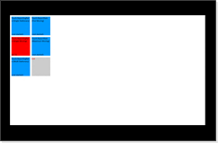

# How to run the Windows HLK Tests for Touch and Pen Devices

This article provides information to help you use the Windows touch quality certification tests to test touch hardware for Windows 8 and Windows 8.1. It discusses the equipment and software that you need to run the tests, briefly reviews the test suite, and adds general information that should make the tests useful and easy to apply. The information in this article applies to Windows 8 and Windows 8.1.

The touch quality tests enforce the touch quality requirements that are detailed in the following resources:

-   **Windows 8 Hardware Certification Requirements**

-   **Windows Hardware Certification Requirements for Client and Server Systems**

-   **Windows Hardware Certification Requirements: Devices**

-   [Windows 8 Hardware Certification Requirements (PDF)](http://msdn.microsoft.com/library/windows/hardware/hh748188)

All tests also enforce the Human Interface Device (HID) protocol that is described in [Windows Pointer Device Data Delivery Protocol](http://go.microsoft.com/fwlink/?LinkID=226808) and defined in the [HID I2C v1.0 Protocol Specification](http://go.microsoft.com/fwlink/?LinkID=286770).

Some touch quality tests require high-precision tools. To learn about the tools that Microsoft provides and about other tools that can be purchased, see the following articles:

-   [How to Use the Precision Touch Testing Tool](http://go.microsoft.com/fwlink/?LinkID=286931)

-   [How to Measure Touch Panning Latency](http://go.microsoft.com/fwlink/?LinkID=286934)

-   [How to Measure Touch Down Latency](http://go.microsoft.com/fwlink/?LinkID=286935)

**In this article:**

-   [The Windows Hardware Lab Kit test environment](#enviro)

-   [Windows HLK certification process](#process)

-   [How to run a touch quality test](#howtorun)

-   [Windows HLK touch test categories](#cat)

-   [Windows HLK touch device test descriptions](#testdescs)

-   [Touch device HID compliance errors](#hiderrors)

## The Windows Hardware Lab Kit test environment

You must install at least a minimal configuration of the [Windows Hardware Lab Kit (Windows HLK)](http://go.microsoft.com/fwlink/?LinkID=8705). The Windows HLK provides you with the tools, processes, and tests to create and upload submission packages to certify devices and systems. The Windows HLK eliminates the need for external tools such as the WLK Log Viewer. For instructions about how to install the Windows HLK, see [Windows HLK Getting Started](..\getstarted\windows-hlk-getting-started.md). This document assumes that you are familiar with the Windows HLK.

The Windows HLK requires that you install at least one test controller and one test computer. The test computer must have a clean install of the Windows 8 client operating system and it must support touch input according to the HID protocol. You must manually install all required drivers to enable touch devices to function correctly.

The touch quality tests are integrated into the Windows HLK, and you can run them by using Windows HLK Studio or as stand-alone tests.

### Windows HLK Studio

You can run the Windows 8 test management console [Windows HLK Studio](http://go.microsoft.com/fwlink/?LinkID=286937) on the Windows HLK test controller. Touch tests display in the Windows HLK Studio when touch hardware is discovered. The Windows HLK Studio allows you to organize tests into projects, view features and tests that are associated with your device, run selected tests, and create a submission package.

### Stand-alone tests

You can bypass using the Windows HLK Studio and run the tests directly on the test computer. However, you must have access to a Windows HLK controller to do this.

Stand-alone tests exist in JavaScript Object Notation (JSON) files and are started by using a single executable file: **Logo3.exe**. In most cases, a single JSON file tests one requirement, but there are exceptions. For example, all of the tests that are contained in the [Windows Touch Ux Test](8216ab22-011d-4988-a2dd-341126361f91.md) suite are also contained in the file **UxTests.json** (which relies on two DLLs: **WTTLog.dll** and **WLKLogAnnotation.dll**).

**To run a stand-alone test**

1.  On a Windows HLK test controller, navigate to **%system%\\Program Files (x86)\\Windows Kits\\8.1\\Hardware Certification Kit\\Tests**.

2.  Navigate to the folder that matches the architecture of the test computer; that is, AMD64, ARM, or x86.

3.  Copy the following files from the test folder into a single folder on the computer that is to be tested; for example:

    Copy **\\\\***&lt;ControllerName&gt;***\\Program Files (x86)\\Windows Kits\\8.1\\Hardware Certification Kit\\Tests \\***&lt;platform&gt;***\\digitizer\\Win8Touch \\\***

    Where *&lt;ControllerName&gt;* is the Windows HLK test controller name and *&lt;platform&gt;* is AMD64, ARM, or x86.

4.  On the test computer, open a **Command Prompt** window by using administrative privileges and navigate to the folder where you saved the test files.

5.  Type the test command by using the syntax **Logo3.exe /config***&lt;testname&gt;***.json**, where *&lt;testname&gt;* is the name of the test to run. For example, to run the Digitizer Jitter tests, use the following command syntax:

    **Logo3.exe /config DigitizerJitter.json**

## Windows HLK certification process

All automatic and manual tests that are listed in this article must pass before a touch device can be Windows-certified. All tests enforce the HID protocol and all tests are mandatory for certification.

### Field Firmware Upgradeable (FFU)

Windows 8.1 touch controllers are required to be field-firmware upgradeable (FFU) to support firmware bug fixes and feature additions. After testing is complete, a firmware update is applied to confirm that the device meets the Device.Digitizer.Touch.FieldFirmwareUpdatable requirement. For more about this requirement, see Field Firmware Upgradeable (FFU) in [Windows 8 Hardware Certification Requirements (.PDF)](http://go.microsoft.com/fwlink/?LinkId=253058&clcid=0x409).

Depending on the platform and the architecture of the device, a touch controller can obtain firmware updates in one of three ways:

-   **UEFI Capsule Based Update**: Firmware and configuration files can be stored in the [Unified Extensible Firmware Interface](http://www.uefi.org/specs/) (UEFI) capsule. Users can concurrently update the firmware and configuration when they update the UEFI.

-   **Driver-Based Update**: A driver can communicate with and write to a hardware device. The driver exists only for the purpose of writing to the device, and does not persist on the system after the update is applied.

-   **User Mode Application-Based Update**: A graphical user interface (GUI) or command-line tool can check or update the firmware and configuration files.

### Touch Hardware Quality Assurance Key

The first time that you run a certification test against a touch device, a 256-byte space is reserved in firmware for the Touch Hardware Quality Assurance (THQA) key. To confirm this reservation, the **Getthqablob** tool inserts and verifies a sample binary large object (BLOB) into the firmware. This test signature and tool are available at the following download sites: https://connect.microsoft.com/site1304/Downloads/DownloadDetails.aspx?DownloadID=47730, http://connect.microsoft.com/site1094/Downloads/DownloadDetails.aspx?DownloadID=47717, and http://connect.microsoft.com/site1094/Downloads/DownloadDetails.aspx?DownloadID=47718. If you do not have access to these sites, contact your Microsoft representative. The following procedure shows you how to run the **Getthqablob** tool.

**To run Getthqablob**

1.  On the test computer, open a **Command Prompt** by using administrative privileges.

2.  Type **GetTHQABlob.exe -verifySample**

After a device passes the logo requirements, Microsoft issues a cryptographically signed binary BLOB (THQA key) to the device manufacturer. The manufacturer puts this key into the device firmware prior to production. When a touch device attempts to connect to the Windows operating system, the signature is verified by Windows.

When you submit a touch controller to the [Windows Touch Device Certification Processes and Windows Touch Test Lab (WTTL) Service](windows-touch-device-certification-processes-and-windows-touch-test-lab--wttl--service.md), the touch controller has a preloaded and configured firmware that is ready for Windows HLK testing and validation.

The system that is submitted to WTTL must have a new firmware payload ready. The payload can have only the minimal change of a firmware version number increment and application instructions. Upon receipt of the device, WTTL verifies the firmware version (RevisionID) as reported in either the HID Descriptor for HID I2C-based touch controllers or the USB Descriptor for HID USB-based touch controllers. WTTL applies the firmware update and ensures that the firmware version has incremented.

If the version has incremented, the FFU requirement has been met; otherwise, this requirement is not met.

## How to run a touch quality test

Before it starts to run any series of tests, WTTL runs the physical dimension test (Device.Digitizer.Touch.PhysicalDimension), in the [Windows Touch Test (System)](85a694cc-231b-4bbd-9b52-65e7aa90d57d.md) collection of tests. The measured size value reflects the size and separation of various user interface (UI) elements in the test and in the operating system. This value must be consistent and accurate before you can proceed because further test results would be flawed by any differential. If there is a difference between the physical size as measured by the WTTL and the reported size from the device, then the test fails.

>[!NOTE]
>  
The tests are designed to run in landscape orientation and might not display correctly in portrait mode. If you are testing a device that boots into portrait mode, change to landscape orientation before you run the tests.

 

After you start a touch quality test, a screen displays the available scenarios for the selected requirement. There is typically more than one scenario per requirement, and more than one test per scenario. To begin a scenario, tap its tile.

>[!TIP]
>  
You can return to the test selection screen at any time by tapping **Back to Index** in the floating UI in the test tool.

 

Each scenario presents a set of instructions to complete the tests. The tool notifies you when you have completed all tests, and it reports the result of the scenario. You can return to the index to select any remaining scenarios or to review the progress of the requirement test.

After all scenarios are validated, tap the **Exit** tile to finish the test and initiate the reporting that determines success or failure in the Windows HLK controller.

For example, the [Windows Touch Reporting Rate Test](f2db03c0-0eaa-44d2-92f7-34a49ba4b693.md) index presents the following five test scenarios, which you can complete in any order:

-   Touch.ReportingRate (Single Stationary)

-   Touch.ReportingRate (Single Moving)

-   Touch.ReportingRate (Multi Stationary)

-   Touch.ReportRate (Five Moving)

-   Touch.ReportRate (Maximum Moving)

You can use the following procedure to test the Touch.ReportingRate (Single Moving) scenario:

**To test Touch.ReportingRate (Single Moving)**

1.  Tap the tile for the **Touch.Reporting.Rate (Single Moving)** scenario; the image shown in *Figure 1. Single Moving Test*, displays:

    

2.  Follow the onscreen instructions. After you complete the test, you are notified whether the test passed or failed, and you can return to the test index. The test index indicates the changed status of the completed test, as shown in *Figure 2. Updated Test Index*.

    

3.  After you run all the tests, you can tap the **Exit** tile to exit the test suite. Results are reported to the Windows HLK controller after you tap the **Exit** tile.

    >[!TIP]
    >  
    You can also tap any test tile to review the results of the test. You can rerun any failed test.

     

### Debugging the test

Error messages describe expected and actual behavior. When an error occurs, only one error is displayed in the error message, but all the errors that happened during the test are logged. For example, if five errors occurred, the error message states “Error 1/5: &lt;*error message*&gt;”. This indicates that the interaction produced five types of errors and the &lt;*error message*&gt; describes one of them. Each type of error is counted one time. If the interaction produced backwards motion ten times, only one of these occurrences are counted and logged.

All error types that occur during the interaction are logged. The log contains actionable items to help debug the failure. The logging details are of the following four unique types:

-   The first error type is used for tests such as DigitizerJitter, Input Separation, and Physical Input. These tests log the Test region in himetric units. The test region is represented as a rectangle where the top left point and bottom right point are denoted as &lt;(x,y), (w,z)&gt;.

-   The second error type logs up to 10 unique coordinates that are reported in himetric units &lt;x,y&gt;. This type is used in the NoiseSuppression and ZAxisAllowance tests.

-   The third error type logs the history of contacts reported in the format of &lt;scan time&gt; &lt;\# of contacts&gt; whenever the number of contacts change. This type is used by the 5TouchPointMinimum and ExtraInputBehaviorTests.

-   Errors from automatically executed binaries such as HIDValidator.exe and GetTHQABlob.exe are logged.

**Screenshots**

When a test fails, a screenshot is taken. Screenshots are named after the DUT (device under test), the test that caused the failure, and the date and time of the screen capture in UTC. For example, if the DUT is named Testingmachine1 and the test is Digitizer Jitter, the screenshot on March 12th 2013 would be named **Testingmachine1\_DigitizerJitter2013-3-12-151410.jpg**.

Screenshots are saved any time the UI transitions from a test scenario to the table of contents, when the clear overlay button is clicked, and when the test application is exited from within a test scenario. In all cases, the screenshot is saved only if at least one failure has occurred since the last screenshot. Screenshots are not generated for yes/no questions. The capability to save screenshots when the test fails is enabled by default. Failures in saving any screenshots are silent, they do not result in failing the test scenario, and they do not cause the application to be terminated. Screenshots are copied to the Windows HLK Controller and are integrated into part of the Windows HLK log. Failures that occur during the copying of the screenshots to the controller do not result in a test failure. If logo3.exe is executed standalone, the screenshots are collected in the current working directory.

To get a screenshot that is generated as part of a test, follow these steps:

1.  Open the project in Windows HLK Studio. If necessary, connect to an existing HLKX package.

2.  Click the **Results** tab, and expand the entry that relates to the test.

3.  Right-click **RunJob-Copy Screenshots**.

4.  Expand **Task Logs** and click **Show All**.

    A folder displays that contains all screenshots from the failed test.

## Windows HLK touch test categories

Touch quality certification tests are broadly grouped into two categories: *Core Requirements* tests and *User Experience* tests.

The Core Requirements tests consist of 13 Windows HLK jobs, each of which maps to one or more Windows touch requirement. Each test usually contains several scenarios that combine to stress the requirements under test. For example, the Digitizer Jitter test asks you to measure jitter in several different situations, such as a single stationary contact, a single moving contact, many moving contacts, and two contacts in radial motion.

The User Experience tests are contained in one Windows HLK job that is titled [Windows Touch Ux Test](8216ab22-011d-4988-a2dd-341126361f91.md). These tests present a set of common Windows scenarios that combine several requirements to emulate real-life situations. Examples of common tasks are to ask the tester to rearrange a tile on the **Start** screen, to type on the software keyboard, and to tap a link.

## Windows HLK touch device test descriptions

This section describes the required automated and manual tests for touch devices. Be aware that many device tests have an identical system test, but that not all system tests have device equivalents. In the latter case, the listed requirement explicitly shows the system path in the requirement name.

This article provides only a brief description of each test; for more information about any specific test including tested requirements, click the test name to see the detailed test reference article for that test.

### Automated touch device tests

The following table lists the automated tests that are mandatory for device certification. The total estimated completion time for automation tests is 40 hours and 45 minutes.

<table>
<colgroup>
<col width="33%" />
<col width="33%" />
<col width="33%" />
</colgroup>
<thead>
<tr class="header">
<th>Test name</th>
<th>Purpose</th>
<th>Estimated run time</th>
</tr>
</thead>
<tbody>
<tr class="odd">
<td>
TDI filters and LSPs are not allowed
</td>
<td>
Verifies that no TDI Filters or LSPs are installed by the driver or associated software packages.
</td>
<td>
5 minutes
</td>
</tr>
<tr class="even">
<td>
[Reinstall with IO Before and After (Certification)](http://go.microsoft.com/fwlink/?LinkID=286999)
</td>
<td>
Uninstalls and reinstalls the drivers for selected devices and runs IO on devices; verifies that no device or driver, except the device under test, has been affected by devices, driver installations, or co-install processes; verifies that no system resources are overwritten during a device or driver package installation.
</td>
<td>
5 hours
</td>
</tr>
<tr class="odd">
<td>
DevFund INF Test
</td>
<td>
Verifies the INF file against DevFund.INF devices.
</td>
<td>
1 minute
</td>
</tr>
<tr class="even">
<td>
[Device Path Exerciser Test (Certification)](http://go.microsoft.com/fwlink/?LinkID=286993)
</td>
<td>
Verifies basic reliability and security of a driver.
</td>
<td>
5 hours
</td>
</tr>
<tr class="odd">
<td>
[Verify Driver Load Order Group is not WdfLoadGroup](http://go.microsoft.com/fwlink/?LinkID=287000)
</td>
<td>
Verifies that WdfLoadGroup is not the Load Order Group value for the device under test.
</td>
<td>
2 minutes
</td>
</tr>
<tr class="even">
<td>
[Device Driver INF Verification Test (Certification)](8206b98d-7bc9-41e1-8217-bd398e71a211.md)
</td>
<td>
Validates a driver INF file against the Device Fundamentals ProperINF requirement.
</td>
<td>
5 minutes
</td>
</tr>
<tr class="odd">
<td>
[Driver Memory Test](4fbce95a-57c8-44b2-aa68-7dbdd7f7334e.md)
</td>
<td>
Checks the memory that drivers are using, and verifies that the memory consumed by graphic drivers does not exceed the specified amount.
</td>
<td>
30 minutes
</td>
</tr>
<tr class="even">
<td>
System - Sleep and PNP (disable and enable) with IO Before and After (Certification)
</td>
<td>
Cycles the system through various sleep states and performs IO and basic Plug and Play (PnP) (disable/enable) on devices before and after each sleep state cycle.
</td>
<td>
5 hours
</td>
</tr>
<tr class="odd">
<td>
[Plug and Play Driver Test (Certification)](http://go.microsoft.com/fwlink/?LinkID=286994)
</td>
<td>
Exercises various PnP-related code paths in the driver and user-mode components.
</td>
<td>
5 hours
</td>
</tr>
<tr class="even">
<td>
[Concurrent Hardware And Operating System (CHAOS) Test (Certification)](http://go.microsoft.com/fwlink/?LinkID=286995)
</td>
<td>
Runs PnPDTest and FuzzTest in parallel while cycling the system through all supported system power states.
</td>
<td>
5 hours
</td>
</tr>
<tr class="odd">
<td>
[Embedded Signature Verification Test](http://go.microsoft.com/fwlink/?LinkID=286996)
</td>
<td>
Checks whether the driver under test is embedded signed (for boot start drivers).
</td>
<td>
1 minute
</td>
</tr>
<tr class="even">
<td>
[Device Install Check For Other Device Stability (Certification)](http://go.microsoft.com/fwlink/?LinkID=286997)
</td>
<td>
Verifies that no device or driver except the device under test is affected by the device(s)/driver(s) install or co-install process.
</td>
<td>
5 hours
</td>
</tr>
<tr class="odd">
<td>
[Device Install Check For File System Consistency (Certification)](http://go.microsoft.com/fwlink/?LinkID=286998)
</td>
<td>
Verifies that no system resources are overwritten during a device/driver package install process.
</td>
<td>
5 hours
</td>
</tr>
<tr class="even">
<td>
[DevFund Broker Test](5fe996a4-38ee-4b20-86e2-362dbefa0ddd.md)
</td>
<td>
Verifies all device interface paths for a device node against Device.Fundamental requirements.
</td>
<td>
1 minute
</td>
</tr>
</tbody>
</table>

 

### Manual touch device tests

The following table lists the manual tests that are mandatory for device certification. The total estimated completion time for manual tests is two hours.

<table>
<colgroup>
<col width="50%" />
<col width="50%" />
</colgroup>
<thead>
<tr class="header">
<th>Test name</th>
<th>Purpose</th>
</tr>
</thead>
<tbody>
<tr class="odd">
<td>
[Windows Touch Five Point Minimum Test](20f7fc85-e206-432d-be66-668b0d37be26.md)
</td>
<td>
Verifies that a touch device supports a minimum of five simultaneous touch inputs.
</td>
</tr>
<tr class="even">
<td>
[Windows Touch Digitizer Jitter Test](144c6ac6-fb78-4f95-a581-eed55ea43c4d.md)
</td>
<td>
Verifies that a touch device does not exceed the allowable amount of jitter (a maximum of 1mm over 10mm of travel).
</td>
</tr>
<tr class="odd">
<td>
Windows Touch Extra Input Behavior Test
</td>
<td>
Verifies that a touch device does not report inputs that are greater than the maximum allowed values that are defined in the test requirements.
</td>
</tr>
<tr class="even">
<td>
Windows Touch High Resolution Timestamp Test
</td>
<td>
Verifies that the device supports the microsecond-level time stamp and does not drift more than the amount that is specified in the test requirements. During this test, you must hold a contact for the stated time while the tool inspects the HID reports.
</td>
</tr>
<tr class="odd">
<td>
[Windows Touch Input Separation Test](a2dd85bf-0af3-4efa-8429-4cf71ed85099.md)
</td>
<td>
Verifies that a device meets requirements during horizontal, vertical, and diagonal motion, and during a pinch gesture.
</td>
</tr>
<tr class="even">
<td>
[Windows Touch Noise Suppression Test](5bd29092-1f72-46a7-bb6b-7ef0ee9f6e20.md)
</td>
<td>
Verifies that a touch device does not report data for locations where touch input doesn't occur.
</td>
</tr>
<tr class="odd">
<td>
[Windows Touch Test](9b1ece24-41b5-4acf-be7d-ca88a3dc3c61.md)
</td>
<td>
Combines a set of simple manual tests. Measured requirements include: having a bezel that is flush with the display, specifying physical dimensions that match the device's true physical dimensions, and passing the HID Validator tool's static test.
</td>
</tr>
<tr class="even">
<td>
[Windows Touch Physical Input Position Test](3512b24e-8857-4e7d-8839-79f26778b1e3.md)
</td>
<td>
Verifies that a touch device reports all inputs within plus or minus 1mm of the center of the physical input, for all touchable areas.
</td>
</tr>
<tr class="odd">
<td>
[Windows Touch Reporting Rate Test](f2db03c0-0eaa-44d2-92f7-34a49ba4b693.md)
</td>
<td>
Verifies that a touch device correctly reports physical contact between the device and the contact position.
</td>
</tr>
<tr class="even">
<td>
[Windows Touch Response Latency Test](http://go.microsoft.com/fwlink/?LinkID=287001)
</td>
<td>
Verifies that a touch device meets the response latency requirements for both idle and active states.
</td>
</tr>
<tr class="odd">
<td>
[Windows Touch Resolution Test](23833432-e861-4495-8580-0875c303340d.md)
</td>
<td>
Verifies that a touch device has a 100-Hertz minimum reporting rate for all touch inputs.
</td>
</tr>
<tr class="even">
<td>
[Windows Touch Ux Test](8216ab22-011d-4988-a2dd-341126361f91.md)
</td>
<td>
Tests the user experience that is associated with the hardware requirements. Tests are designed to run freehand.
</td>
</tr>
<tr class="odd">
<td>
Windows Touch Z Axis Allowance Test
</td>
<td>
Verifies that a touch device does not exceed the maximum z-axis allowance (0.5 millimeters) for touch detection.
</td>
</tr>
</tbody>
</table>

 

### Touch system and pen tests

The following table lists the system and pen tests that are mandatory for device certification. Pen tests are included in this category. These tests are run for system-level testing, but associated device-level tests also apply in most cases.

<table>
<colgroup>
<col width="50%" />
<col width="50%" />
</colgroup>
<thead>
<tr class="header">
<th>Test name</th>
<th>Purpose</th>
</tr>
</thead>
<tbody>
<tr class="odd">
<td>
Windows Tablet Test (System)
</td>
<td>
Tests the resume time for systems that support InstantGo.
</td>
</tr>
<tr class="even">
<td>
Touch Slate HW LOGO test
</td>
<td>
Verifies that the components of a tablet meet the Windows 8 logo requirements.
</td>
</tr>
<tr class="odd">
<td>
Windows Pen Hover Accuracy Test (System)
</td>
<td>
Verifies pen hover accuracy.
</td>
</tr>
<tr class="even">
<td>
Windows Pen Range Test (System)
</td>
<td>
Verifies pen digitizer range.
</td>
</tr>
<tr class="odd">
<td>
Windows Pen Resolution Test (System)
</td>
<td>
Verifies that a pen digitizer resolution is at least 150 pixels per inch and equal to the native display resolution or greater.
</td>
</tr>
</tbody>
</table>

 

## Touch device HID compliance errors

The following table lists dynamic HID compliance errors that can occur during touch testing:

<table>
<colgroup>
<col width="50%" />
<col width="50%" />
</colgroup>
<thead>
<tr class="header">
<th>Error message</th>
<th>Description</th>
</tr>
</thead>
<tbody>
<tr class="odd">
<td>
Backward motion
</td>
<td>
This error is presented in the Digitizer Jitter tests and signals that a report was sent that has co-ordinates that suggest motion that is opposite to the direction of travel. The Windows HLK tests have no allowance for backward motion.
</td>
</tr>
<tr class="even">
<td>
Duplicate packets
</td>
<td>
This error occurs when consecutive identical co-ordinates are reported during a period of motion. This check is triggered only when it can be determined that movement is taking place. This error is not triggered by a stationary contact, even if the contact has only temporarily ceased movement.
</td>
</tr>
<tr class="odd">
<td>
Fabricated center
</td>
<td>
This error appears when the system detects that the device is fabricating its reports. It applies beyond the center to include pressure, tilt, twist, azimuth and geometry. This error can occur when a value is always the same.
</td>
</tr>
<tr class="even">
<td>
In-range didn't move
</td>
<td>
This error is the in-range analog to the <em>Tip didn't move</em> error.
</td>
</tr>
<tr class="odd">
<td>
In-range invalid
</td>
<td>
This error occurs for devices that report in-range data when a packet is reported with the Tip flag ON but the In-range flag OFF.
</td>
</tr>
<tr class="even">
<td>
Invalid other
</td>
<td>
This error indicates that one or more of the following properties reported a value outside the valid range: pressure, x tilt, y tilt, twist, or azimuth.
</td>
</tr>
<tr class="odd">
<td>
Invalid packet
</td>
<td>
A packet did not include x-coordinate or y-coordinate data.
</td>
</tr>
<tr class="even">
<td>
Invalid packet transition
</td>
<td>
The &quot;Button State Transitions&quot; section of the [Windows Pointer Device Data Delivery Protocol](http://go.microsoft.com/fwlink/?LinkID=226808) document presents two transition tables: one table for devices that support z-height (or hover), and one table for devices that do not support z-height. This error indicates that transitions in the digitizer reports do not conform to either table.
</td>
</tr>
<tr class="odd">
<td>
Invalid scan time
</td>
<td>
<em>Scan time</em> is new in Windows 8. It represents a specific time stamp and is logically tied to the time that a contact was actually scanned. The operating system uses this data extensively to enable smooth user interactions, especially for zooming, panning, and similar gestures. This error indicates that something is wrong in scan-time reporting or that scan-time is not being reported at all. This error most commonly occurs when consecutive scan-time reports exceed the allowed time, and when scan time is not implemented.
</td>
</tr>
<tr class="even">
<td>
Invalid width or height
</td>
<td>
This error indicates that the geometry data that is reported by the device is incorrect. The error usually occurs when the physical dimensions that are reported for a contact exceed the stated dimensions in that device's descriptor. When this error occurs, consider errors in the unit of measurement or in translation between units.
</td>
</tr>
<tr class="odd">
<td>
Invalid X size
</td>
<td>
The device specified a bit size for the center x-coordinate that was either 0 or greater than 32.
</td>
</tr>
<tr class="even">
<td>
Invalid xy
</td>
<td>
This error usually indicates that either x-coordinates or y-coordinates do not exist in a packet. It can also occur if either value is outside the allowable range, as specified in the [Windows Pointer Device Data Delivery Protocol](http://go.microsoft.com/fwlink/?LinkID=226808) document.
</td>
</tr>
<tr class="odd">
<td>
Invalid Y size
</td>
<td>
The device specified a bit size for the center y-coordinate that was either 0 or greater than 32.
</td>
</tr>
<tr class="even">
<td>
Last move location different
</td>
<td>
This error indicates that the last packet reported a location that is different from the location of the preceding packet. The <strong>up</strong> packet must specify the same location as the last move packet.
</td>
</tr>
<tr class="odd">
<td>
Missing in-range
</td>
<td>
This error occurs when the first packet without the Tip and In-range flags is not preceded by a packet with the Tip flag off and the In-range flag on. The digitizer missed the hover state.

This error can also occur if the device indicates in its descriptor that it supports z-height, but does not report the in-range bit in actual report packets. For more information, see the [Windows Pointer Device Data Delivery Protocol](http://go.microsoft.com/fwlink/?LinkID=226808) document.
</td>
</tr>
<tr class="even">
<td>
Missing in-range off &amp; tip-off
</td>
<td>
This error indicates that a mistake occurred during the transition to the out-of-range state. The last packet must have both the Tip and In-range flags OFF. This error applies to devices that report in-range data.
</td>
</tr>
<tr class="odd">
<td>
Missing in-range on &amp; tip-off
</td>
<td>
This error indicates that a sequence was reported in which a packet with <strong>Tip on</strong> immediately followed a packet that did not have the <strong>In-range</strong> flag. This error applies to devices that report in-range data.
</td>
</tr>
<tr class="even">
<td>
Missing tip
</td>
<td>
This error applies to devices that do not report in-range data. It indicates that a final packet that did not have the Tip flag was not present. This condition appears to the system as a stream of data that has been interrupted, because no removal of the Tip flag reported <strong>up</strong>.
</td>
</tr>
<tr class="odd">
<td>
Missing tip-off
</td>
<td>
This error indicates that the last packet still had the Tip flag on. This essentially means that the device didn't report an <strong>up</strong>. This error also applies to devices that do not report in-range data.
</td>
</tr>
<tr class="even">
<td>
Missing tip-on
</td>
<td>
This error occurs when the first packet from a non-hovering device does not contain the Tip flag.
</td>
</tr>
<tr class="odd">
<td>
Out-of-range location different
</td>
<td>
This error is similar to the <em>Last move location different</em> error. In this case, the packet that follows the last in-range packet specified a location that is different from the location of the in-range packet. These packets must have the same coordinates.
</td>
</tr>
<tr class="even">
<td>
Scaling factor too high
</td>
<td>
This error indicates that an unexpected zoom-in gesture was performed. This usually occurs during execution of the Semantic Zoom tests because in those tests, attention must be paid to the direction of the gesture. This error also occurs during the Quick Toss and backstack tests (in the [Windows Touch Ux Test](8216ab22-011d-4988-a2dd-341126361f91.md)) if the contacts travel too far apart: it is important that the contacts stay roughly parallel and end side-by-side.
</td>
</tr>
<tr class="odd">
<td>
Scaling factor too low
</td>
<td>
See the <em>Scaling factor too high</em> error. In the Quick Toss test, this error indicates that the contacts travelled too far toward one another.
</td>
</tr>
<tr class="even">
<td>
Tip didn't move
</td>
<td>
For devices that do not report in-range data, this error indicates that a packet was received with the Tip flag on and the next packet did not have the Tip flag. This constitutes a <strong>down</strong> immediately followed by an <strong>up</strong>, with no intermediate moves; this is not valid.
</td>
</tr>
<tr class="odd">
<td>
Unknown reason
</td>
<td>
This error occurs during a test that has a speed or angle requirement. For example, the User Experience Edge test requires movement above a certain speed and within a certain angle (also within a certain amount of time). If any of those conditions does not hold, this error displays.
</td>
</tr>
</tbody>
</table>

 

## Related topics

[Windows Hardware Development Center](http://go.microsoft.com/fwlink/?LinkID=246621)

[Windows Hardware Compatibility Program](..\user\windows-hardware-compatibility-program-overview.md)

[Windows Certification Program Policies and Processes](http://go.microsoft.com/fwlink/?LinkID=286928)

[Touch in Windows 8](http://go.microsoft.com/fwlink/?LinkID=285943)

[Using Robot Automation for Touch Hardware Certification Tests](using-robot-automation-for-touch-hardware-certification-tests.md)

[Windows Touch Testing Prerequisites](windows-touch-testing-prerequisites.md)

 

 

