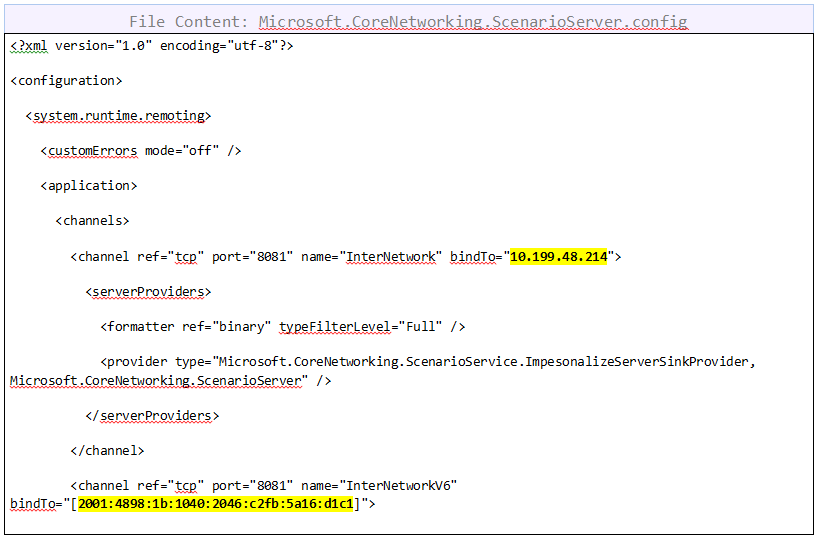
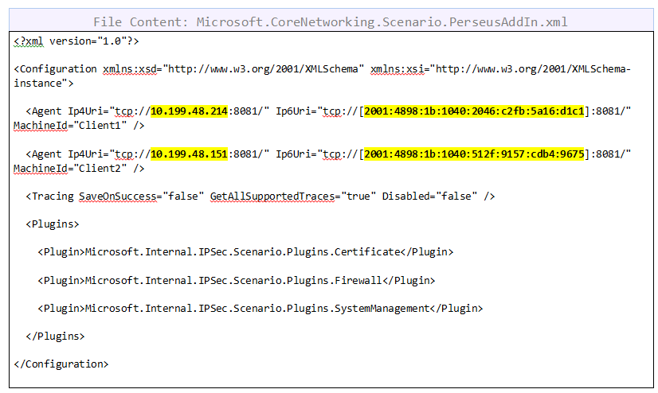
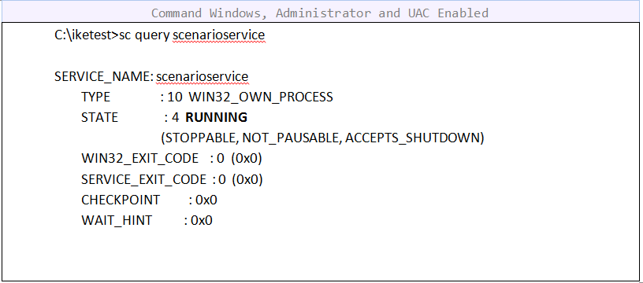
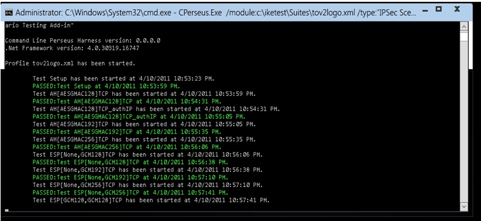

# IPsec Task Offload v2 Manual Test

This topic describes how to manually test IPsec Task Offload.

Before starting, be sure that ScenarioHarness.msi is in the \[SystemDrive\]\\iketest\\ folder, and add it to your PATH environment variables.

## Test Software Preparation Steps

Test installation steps are nearly the same for both the machines with some unique steps for each machine. The machine which controls the logo test process is called the IPsec\_Controller and the other machine is called the IPsec\_Client. In the following context, IPsec\_Controller-machine-name is the Windows machine name of the IPsec\_Controller role and IPsec\_Client-machine-name is the Windows machine name of the IPsec\_Client role. Both of these names are unique to the corporate or local network naming convention or configuration requirements. Notice that the tests running on the IPsec\_Controller machine would need to know the IP addresses of the IPsec\_Client in order to control the traffic flow and program behavior.

1.  Perform the logo test kit setup as machine local administrator with UAC enabled.

2.  Create a test directory \[SystemDrive\]\\iketest on your Windows 8 system (for example, C:\\iketest).

3.  Copy the file with name ScenarioHarness.msi provided by Microsoft DNT Test team to the \[SystemDrive\]\\iketest directory.

4.  Issue **cd \[SystemDrive\]\\iketest**.

5.  On the IPsec\_controller machine, perform the setup step by running the command as follows:

    msiexec /lvx install.log /passive /i ScenarioHarness.msi AgentConfiguration="\[AgentConfiguration\]" PeersConfig="\[PeersConfig\]" \[AdditionalOptions\]

    <table>
    <colgroup>
    <col width="33%" />
    <col width="33%" />
    <col width="33%" />
    </colgroup>
    <thead>
    <tr class="header">
    <th>Name</th>
    <th>Type</th>
    <th>Value</th>
    </tr>
    </thead>
    <tbody>
    <tr class="odd">
    <td>
AdditionalOptions
</td>
    <td>
String
</td>
    <td>

</td>
    </tr>
    <tr class="even">
    <td>
AgentConfiguration
</td>
    <td>
String
</td>
    <td>
tcp=port:8081 rename=yes useasdefault=Microsoft.CoreNetworking.IPSec.NetshPolicy
</td>
    </tr>
    <tr class="odd">
    <td>
InstallDirectory
</td>
    <td>
String
</td>
    <td>
[SystemDrive]\iketest
</td>
    </tr>
    <tr class="even">
    <td>
PeersConfig
</td>
    <td>
String
</td>
    <td>
peers=&quot;&quot;Client1:tcp://IPsec_Controller-machine-name:8081/ Client2:tcp://IPsec_Client-machine-name:8081/&quot;&quot;
</td>
    </tr>
    </tbody>
    </table>

     

    For example:

    c:\\iketest&gt;msiexec /lvx install.log /passive /i ScenarioHarness.msi AgentConfigu ration="tcp=port:8081 rename=yes useasdefault=Microsoft.CoreNetworking.IPSec.NetshPolicy" PeersConfig="peers=""Client1:tcp://27-3145E737:8081/ Client2:tcp://27-3145E751:8081/"""

    Where:

    IPsec\_Controller-machine-name = 27-3145E737IPsec\_Client-machine-name = 27-3145E751

6.  On the IPsec\_client machine, perform the setup step by running the command as follows:

    msiexec /lvx install.log /passive /i ScenarioHarness.msi AgentConfiguration="\[AgentConfiguration\]" PeersConfig="\[PeersConfig\]" \[AdditionalOptions\]

    <table>
    <colgroup>
    <col width="33%" />
    <col width="33%" />
    <col width="33%" />
    </colgroup>
    <thead>
    <tr class="header">
    <th>Name</th>
    <th>Type</th>
    <th>Value</th>
    </tr>
    </thead>
    <tbody>
    <tr class="odd">
    <td>
AdditionalOptions
</td>
    <td>
String
</td>
    <td>

</td>
    </tr>
    <tr class="even">
    <td>
AgentConfiguration
</td>
    <td>
String
</td>
    <td>
tcp=port:8081 rename=yes useasdefault=Microsoft.CoreNetworking.IPSec.NetshPolicy
</td>
    </tr>
    <tr class="odd">
    <td>
InstallDirectory
</td>
    <td>
String
</td>
    <td>
[SystemDrive]\iketest
</td>
    </tr>
    <tr class="even">
    <td>
PeersConfig
</td>
    <td>
String
</td>
    <td>

</td>
    </tr>
    </tbody>
    </table>

     

    For example:

    c:\\iketest&gt;msiexec /lvx install.log /passive /i ScenarioHarness.msi AgentConfiguration="tcp=port:8081 rename=yes useasdefault=Microsoft.CoreNetworking.IPSec.NetshPolicy" PeersConfig=""

7.  After the Test software installation, the next step is to examine the configuration file and to make some adjustments to accommodate local environment specific setting.

8.  First examine the IPsec\_Controller’s configuration files found in \[SystemDrive\]\\iketest folder. There are two configuration files on the IPsec\_Controller machine. Assuming 10.199.48.214 and 2001:4898:1b:1040:2046:c2fb:5a16:d1c1 are the (CorpNIC’s) IPv4 and IPv6 addresses of IPsec\_Controller’s machine respectively, you should expect something like this in one of the configuration files called Microsoft.CoreNetworking.ScenarioServer.config.

    

9.  Next, examine the IPsec\_Controller’s controller configuration by opening the following file:

    

10. There is one configuration file on the IPsec\_Client machine. Examine the IPsec\_Client’s scenarioServer configuration Microsoft.CoreNetworking.ScenarioServer.config. It should have the IPsec\_Client’s IPv4 and/or IPv6 addresses registered as well.

    This configuration file defines how the IPsec\_Controller machine test kit program would communicate with the local and the remote IPsec\_Client test programs to perform the logo certification process. The IPsec\_Controller and IPsec\_Client IPv4 and IPv6 addresses should all be registered in this configuration file.

11. The scenarioHarness.msi setup step attempted earlier would install the test software as well as enable a test service called ScenarioService. Issue the following command on both IPsec\_Controller and IPsec\_Client machines to make sure the service is ready for the test.

    

    If the scenario is in RUNNING state, this verifies that the ScenarioService is ready to perform the logo test.

    If you have made changes to any of the test configuration files, you must stop the Windows NT Service ‘scenarioService’ and restart it (for example, **net stop scenarioservice && net start scenarioservice**).

    Also if your test machines corpnet interface is assigned with DHCP addresses, these addresses assigned to your corpnet NIC might have a defined address lifetime based on the DHCP lease limit. In typical circumstances, we expect the tests to be performed immediately after installation. In the case when these IP addresses changed as result of address renewal or you try to perform the test after a prolonged period, you must update these configuration files manually again and recycle the ‘scenarioService’ service.

12. If the NIC Adapter is not enabled for IPsec Offload, you will have to enable that. Windows 8 will have a Windows PowerShell script to enable the IPsec Offload adapter IPsec TaskOffload later. For the time, use the IHV specific operation to enable the IPsec Task Offload capability.

13. To make sure the testNIC would not conflict with your corpnet IP address ranges, please examine the file tov2logo.xml in the \[SystemDrive\]\\iketest\\Suites folder for the hardcoded IP addresses for testNIC. Proceed to run the tests if there is no address conflict.

14. On the IPsec\_Controller machine, perform the following command to start the test (as Administrator and UAC enabled):

    **C:\\iketest&gt;CPerseus.Exe /module:c:\\iketest\\Suites\\tov2logo.xml /type:"IPSec Scenario Testing Add-in"**

    The following is a screen image of how the IPsec Task Offload v2 WLK test in progress looks like:

    

15. The test should begin if the configuration is setup properly. The test program will automatically configure the testNIC to run the tests for both IPv4 and IPv6 modes.

16. To run the individual test cases:

    1.  Run the Perseus Studio (\[SystemDrive\]\\iketest\\PerseusStudio.exe) from IPsec\_Controller machine. This is the UI version of the above explained cmdline execution.

    2.  Select “Profile” INVALID USE OF SYMBOLS “Add-module”. Select module type: “IPSec Scenario Testing Add-in” and click “ok”. Browse to “\[Systemdrive\]\\iketest\\Suites\\TOv2Logo.xml” and click open.

    3.  The module will be loaded in the Perseus Studio, visible on the left hand side pane. Select the appropriate checkboxes in front of the tests you desire to run.

    4.  Choose “Start Profile Execution in Process” or press F5 to start the test execution.

    5.  The progress of the execution and corresponding logs will be visible on the right hand side pane. All the logs will also be placed in the appropriate locations as in the case with the cmdline execution of these tests explained above.

17. Generated log files:

    -   The main log file “TOv2Logo.xml.wtl” will be placed in \[Systemdrive\]\\iketest directory. This can be opened using the HLK manager.

    -   The individual test case failure logs are placed in \[Systemdrive\]\\iketest\\Logs directory.

    -   The detailed traces including wfp, ndispcap and netmon logs are available in the \[Systemdrive\]\\iketest\\traces directory.

 

 

