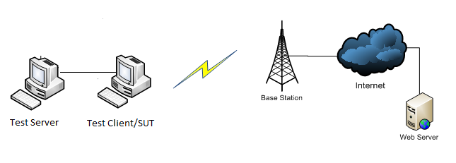

# Mobile Broadband Testing Prerequisites

This section describes the tasks that you must complete before you test an audio device by using the Windows Hardware Lab Kit (Windows HLK).

>[!NOTE]
>  
The wireless testing of mobile phones verifies support for 802.11 capabilities. However, the Windows HLK validates basic mobile phone capabilities only for devices based on modems that implement the MSFT IHV RIL interface. For data-only devices that are based on MBIM modems, the Windows HLK does not validate basic mobile phone capabilities.

 

Before beginning testing, complete the following:

-   [Hardware requirements](#bkmk-hck-mobile-hr).

-   [Software requirements](#bkmk-hck-mobile-sr).

-   [Test computer configuration](#bkmk-hck-mobile-tc).

>[!NOTE]
>  
Software-based Access Points using the Realtek 8185 chipset were deprecated with the release of WLK version 1.3. HLK testing with Software-based Access Points are exclusively supported with Atheros WLAN NICs. Customers that are testing WLAN drivers must use Atheros hardware to complete their submissions. If you have further questions on this, please let us know at wlanndt@microsoft.com.

 

## Hardware requirements

The following hardware is required for LAN device testing. You might need additional hardware if the test device provides bus-specific support. See the test description for each bus-specific test to determine if there are additional hardware requirements.

-   Basic Windows HLK test setup (Controller, Studio, and client systems). See [Windows HLK Getting Started](..\getstarted\windows-hlk-getting-started.md)

-   One test computer. This test computer must meet the Windows HLK prerequisites. See [Windows HLK Prerequisites](..\getstarted\windows-hlk-prerequisites.md) for more information.

-   One test mobile broadband device.

-   The following SIM cards:

    -   'Home' SIM with data provisioned

    -   'Roaming' SIM with data provisioned

    -   'Home' SIM with no data provisioned

    -   'Roaming' SIM with no data provisioned

    -   'Bad' SIM

    -   'Inactive' SIM

>[!NOTE]
>  
The operating systems installed on the test clients must be matching processor architecture versions. If you are Logo testing a 32-bit driver, the DUT, SUT, and Test SoftAP must all have 32-bit versions of Windows installed upon them. For example, you may not use a 64-bit DUT with a 32-bit Test SoftAP.The Ethernet cross over cable can be used in place of the test network when running the NDISTest 6.0 "2c\_priority" test job. The cross over cable enables vendors to resolve an switch-related issue. In some cases, a switch will strip the priority header causing this test job to fail.

 

## Software requirements

The following software is required to run the Device.Networking tests:

-   The latest Windows HLK filters and software updates.

## Test computer configuration

The following figure provides an overview of the Mobile broadband LAN test setup.

Make sure that the test computer is in the ready state before you begin your testing. If a test requires parameters to be set before it is run, a dialog box will be displayed for that test. Review the specific test topic for more information.

Some Windows HLK tests require user intervention. When running tests for a submission, it is a best practice to run the automated tests in a block separately from manual tests. This prevents a manual test from interrupting completion of an automated test.

Once your test computers are configured, you are ready to begin testing. Refer to [Step 4: Create a project](..\getstarted\step-4-create-a-project.md).

## Implementing Loopback Test Functionality in MB Devices

This section is intended to provide guidance to mobile broadband (MB) device manufacturers for implementing loopback test functionality in their MB device firmware. Loopback functionality is needed only for passing the Windows Hardware Lab Kit test and is not applicable during normal usage of device.

Loopback testing ensures that the link between host and device is tested for performance with no dependency on the mobile broadband network. A successful pass of this test, by the device, assures that neither the OS stack nor the device firmware is going to be the bottleneck for throughput when the network conditions are right.

>[!NOTE]
>  
Loopback functionality is tested only for the IP data traffic because it is in the performance critical path. The scope of this test does not include any other network traffic, such as SMS or USSD. Also, because this is a loopback test that terminates at the device firmware, there is no dependency to the network, SIM, or air interfaces.

 

### Guidance

-   MB device firmware should implement “loopback” APN functionality as explained here. Note that the loopback mode is independent of SIM and PIN lock states.

-   On getting MBIM\_CID\_CONNECT set request with an ActivationCommand of MBIMActivationCommandActivate and an access string loopback, the firmware should do the following:

    -   If the device is already connected, it should respond with a MBIM\_STATUS\_MAX\_ACTIVATED\_CONTEXTS.

    -   The device should be able to enter loopback mode without registering with a provider.

    -   The device should be able to enter loopback mode when its packet service state is detached.

    -   The device should respond with a MBIM\_CID\_CONNECT response using the SessionId, IPType, and ContextType specified in the MBIM\_CID\_CONNECT request. ActivationState should be MBIMActivationStateActivated, and VoiceCallState should be MBIMVoiceCallStateNone.

    -   Enter into loopback mode.

    -   The device should respond to additional MBIM\_CID\_CONNECT set requests with MBIM\_STATUS\_MAX\_ACTIVATE\_CONTEXTS until loopback mode is deactivated.

-   While in loopback mode:

    -   On getting a MBIM\_CID\_CONNECT query, the device should respond with a MBIM\_CID\_CONNECT response using the SessionId, IPType, and ContextType specified in the MBIM\_CID\_CONNECT request. ActivationState should be MBIMActivationStateActivated, and VoiceCallState should be MBIMVoiceCallStateNone.

    -   On getting a MBIM\_CID\_IP\_CONFIGURATION query, the device should respond with a MBIM\_STATUS\_SUCCESS but not specify any IP addresses.

    -   The device will manually be assigned a static IP address by the Windows 8 operating system. The device should not supply an IP address itself, but should respond to MBIM\_CID\_IP\_CONFIGURATION queries as specified above, indicating that it does not have an IP address.

    -   Listen for NTBs (NCM Transfer Block) on the BULK OUT pipe from the host.

        -   The device should unpack the datagrams from the NTB and send them back to the host on the MBIM Bulk-IN pipe.

        -   The device should swap the Source and Destination addresses of IPv4 and IPv6 datagrams. The device should not need to modify the IPv4 checksum and vendor datagrams.

        -   NTBs sent on the MBIM Bulk-IN pipe should conform to the NTB parameters specified by the device in the NCM GetNtbParameters function. Datagrams can be sent on the Bulk-IN pipe in one or more NTBs as required by the NTB parameters for the Bulk-IN pipe.

    -   On getting a MBIM\_CID\_CONNECT request with an ActivationCommand of MBIMActivationCommandDeactivate.

        -   Ensure that the SessionId matches the SessionId used to start loopback mode. If the SessionId’s don’t match, the device should respond with MBIM\_STATUS\_CONTEXT\_NOT\_ACTIVATED.

        -   The device should respond with a MBIM\_CID\_CONNECT response using the SessionId, IPType and ContextType specified in the MBIM\_CID\_CONNECT request. ActivationState should be MBIMActivationStateDeactivated and VoiceCallState should be MBIMVoiceCallStateNone.

### Resources

[MBIM Specification](http://www.usb.org/developers/devclass_docs/MBIM10.zip)

[MB Miniport Driver Performance Requirements](http://msdn.microsoft.com/en-us/library/windows/hardware/ff557193.aspx)

[Windows 8 Hardware Certification Requirements](http://msdn.microsoft.com/library/windows/hardware/hh748188)

## Related topics

[Device.Network Testing](device-network-tests.md)

 

 

