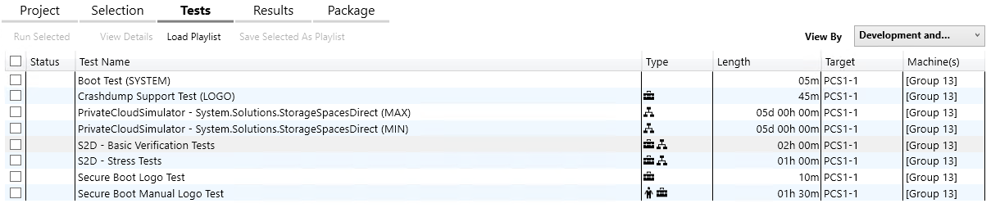
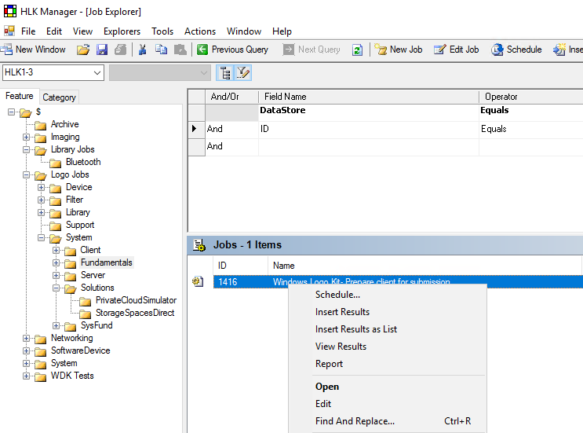
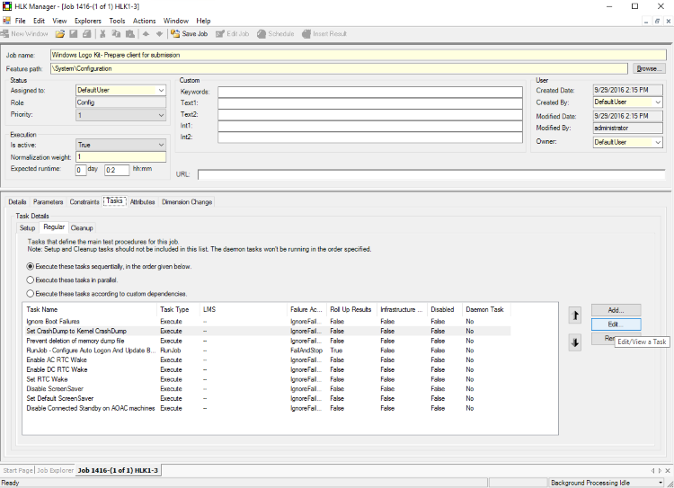
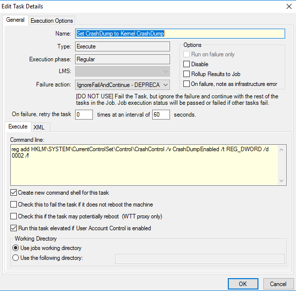
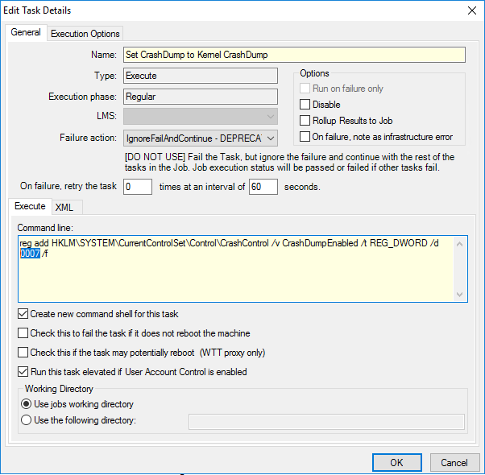
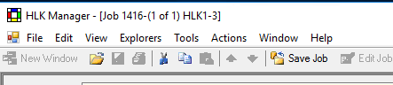
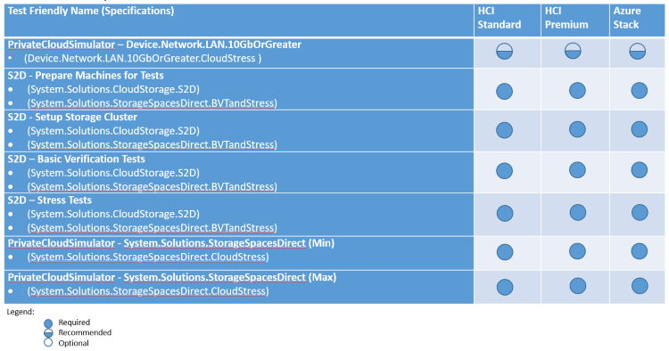

# Partner Guide to WSSD Certification


## <span id="Introduction"></span><span id="introduction"></span><span id="INTRODUCTION"></span>Introduction


Windows Server 2016 offers a range of competitive and differentiated capabilities to enable lower-cost, cloud scale Software-Defined Datacenter (SDDC) scenarios. The goal of the Windows Server Software-Defined (WSSD) program is to ensure that customers have a seamless deployment and steady-state operational experience on validated hardware. To that end, the WSSD program will provide guidance around four distinct technical stages:

-   **Design**: Reference architecture for configuration selection, design principles, and best practices
-   **Validate**: Additional SDDC tests to ensure components and systems meet WSSD requirements
-   **Deploy**: Initial deployment guidance with experience guides and scripts for automation
-   **Operate**: Experience guides for steady-state operational management using System Center Virtual Machine Manager (VMM) and System Center Operations Manager (OM)

This topic focuses on the guidance required to complete WSSD Certification as part of the **Validate** stage above.

## <span id="Audience"></span><span id="audience"></span><span id="AUDIENCE"></span>Audience


This topic is for WSSD Solution Vendors and OEMs and is not intended to provide specific guidance for IHVs or those doing individual component-level certification (i.e. SDDC AQs).

## <span id="Overview_of_Windows_Server_software-defined_offerings"></span><span id="overview_of_windows_server_software-defined_offerings"></span><span id="OVERVIEW_OF_WINDOWS_SERVER_SOFTWARE-DEFINED_OFFERINGS"></span>Overview of Windows Server software-defined offerings


WSSD provides three offerings:

-   **Hyper-converged Infrastructure (HCI) Standard** - Combines compute and storage in the same cluster of server nodes to provide a highly-virtualized solution that’s easy to deploy, manage, and scale. This deployment option simplifies IT infrastructure since customers no longer need traditional IT silos of compute, shared storage (SAN/NAS), and networking. It’s best suited for small to mid-sized IT environment running virtualized (Hyper-V) workloads.
-   **Converged Software-Defined Storage (SDS)** – Provides a lower cost, enterprise-grade, shared storage alternative to traditional SAN/NAS. Built using a cluster of server nodes, it’s easy to deploy, manage, and scale out to build storage capacity as customer’s needs grow over time. On one hand, its simplicity and low cost would appeal to small/mid-sized IT environments, it’s scale, flexibility, and cloud-scale traits would benefit large service providers and enterprise IT. Any workloads that are compatible with SMB storage are a good fit for this offer.
-   **Hyper-converged Infrastructure (HCI) Premium** - Provides a comprehensive software-defined “datacenter in a box”. Building on the same foundation as HCI-Standard, these offers add Software-Defined Networking (SDN) and Assurance to the stack. These offerings provide the perfect building blocks for customers – typically a large enterprise, service provider or hoster – that want to build on premise SDDC that emulates large public clouds like Azure. While SDN provides the benefit to deploy, provision and manage networking services at scale, Assurance provides essential tenant isolation and services for running a secure on-premises multi-tenant cloud.

## <span id="Workflow_steps_for_WSSD_validation_with_PCS"></span><span id="workflow_steps_for_wssd_validation_with_pcs"></span><span id="WORKFLOW_STEPS_FOR_WSSD_VALIDATION_WITH_PCS"></span>Workflow steps for WSSD validation with PCS


Step
Detail
Link
Location
Estimated time
Redeploy order\*
1
Ensure all components and systems have achieved Windows Server 2016 Logo Certification
[Certified Hardware](https://www.windowsservercatalog.com/results.aspx?bCatID=1283&cpID=0&avc=85&ava=0&avq=0&OR=1&PGS=25)
N/A
Varies
N/A
2
Ensure all components and systems have achieved Windows Server Software Defined Datacenter Additional Qualifications (SDDC AQ) for either Standard or Premium (depending on the selected topology)
-   HLK playlists for SDDC Standard and Premium AQs are published [here](http://aka.ms/hlkplaylist)
-   Component and System SDDC AQs are listed in the Windows Server Catalog [here](https://www.windowsservercatalog.com/)
-   [Windows Hardware Lab Kit User's Guide](https://msdn.microsoft.com/library/windows/hardware/dn939963)

>[!NOTE]
>  Microsoft will make updates to the HLK content and documentation available and needed. Those updates will be required for certification when released.

 

N/A
Varies
N/A
3
Choose WSSD topology
WSSD Reference Architecture – Section 1.1
N/A
N/A
1
4
Install Stamp
[Hyperconverged deployment guide](https://docs.microsoft.com/en-us/windows-server/storage/storage-spaces/hyper-converged-solution-using-storage-spaces-direct)
Target stamp
~3 hours
2
5
Deploy PCS infrastructure
[Deploy PCS](#deploy) (in this topic)
N/A
  5a
Deploy Windows Hardware Lab Kit
[HLK](https://msdn.microsoft.com/library/windows/hardware/dn915002)
Standalone system, outside of stamp
1 hour
N/A
  5b
Install HLK Supplemental Package
In the **Supplemental Content for Windows HLK Private Cloud Simulator (PCS) Tests** section of the [HLK downloads](https://developer.microsoft.com/en-us/windows/hardware/windows-hardware-lab-kit) page, download PCSFiles.vhd, and follow the associated instructions to install
HLKController VM
15 minutes
N/A
  5c
Deploy HLK Client software
[HLKClientScript](#deploy)
Stamp/Targets, PCSController VM
15-30 minutes
3 - Stamp/Targets
  5d
Download and install Windows Hardware Lab Kit (HLK) Supplemental Test Content
[HLK Supplemental Test Content](https://msdn.microsoft.com/library/windows/hardware/dn383615)
HLKController VM
15 minutes
N/A
  6
Obtain and install the current version of the PCS playlist
[PCS Playlist](http://aka.ms/hlkplaylist)
N/A
7
Execute PCS Tests
HLKController VM
  7a
Prepare cluster for PCS Tests by taking cluster resources offline
[Offline](#execute)
Stamp/Targets
  7b
Prepare clients for additional PCS tests
[LoadGenWorkaround](#execute)
HLKController VM
  7c
Validate Setup with HLK initial test
[LAN10Gb](#lan10gb)
HLKController VM
  7d
Execute required PCS certification tests
| Test Name                                                          | Length   |
|--------------------------------------------------------------------|----------|
| S2D - Prepare Machines for Tests                                   | 1 hour   |
| S2D - Basic Verification Tests                                     | 2 hours  |
| S2D - Stress Tests                                                 | 1 hour   |
| PrivateCloudSimulator - System.Solutions.StorageSpacesDirect (Min) | 96 hours |
| PrivateCloudSimulator - System.Solutions.StorageSpacesDirect (Max) | 96 hours |

 

HLKController VM
8
Collect and submit results
[Submissions](#submissions)
HLKController VM
15 minutes
6

>[!NOTE]
>  \*Redeploy order specifies whether the stamp is to be redeployed along with the order of steps

 

## <span id="Overview_of_tests_required_for_WSSD_certification"></span><span id="overview_of_tests_required_for_wssd_certification"></span><span id="OVERVIEW_OF_TESTS_REQUIRED_FOR_WSSD_CERTIFICATION"></span>Overview of tests required for WSSD certification


All requirements are detailed in WSSD Reference Architecture Appendix.

-   Ensure all components and systems have achieved Windows Server 2016 Logo certification
-   Ensure all components and systems have achieved Windows Server Software Defined Datacenter Additional Qualifications (SDDC AQ) for either Standard or Premium (depending on the selected topology)
    1.  HLK playlists for SDDC Standard and Premium AQs are published on Connect:
        -   <https://connect.microsoft.com/site1304/Downloads>
    2.  Component and System SDDC AQs are listed in the Windows Server Catalog:
        -   <https://www.windowsservercatalog.com>

The assembled solution/offering must pass the following Windows Hardware Lab Kit / Private Cloud Simulator tests to achieve WSSD Certification:

| Test Name                                                          | Length   |
|--------------------------------------------------------------------|----------|
| S2D - Prepare Machines for Tests                                   | 1 hour   |
| S2D – Basic Verification Tests                                     | 2 hours  |
| S2D – Stress Tests                                                 | 1 hour   |
| PrivateCloudSimulator – System.Solutions.StorageSpacesDirect (Min) | 96 hours |
| PrivateCloudSimulator – System.Solutions.StorageSpacesDirect (Max) | 96 hours |

 

More details are located here:

-   <https://msdn.microsoft.com/library/windows/hardware/mt219240>

Many of the required tests can be selected by loading the appropriate playlist after obtaining the playlist from the Connect partner site. It is recommended to use the playlist after completing the **S2D – Prepare Machines for Tests** test. Below is a sample of the **SDDC\_Standard\_Playlist** after loading into the Windows Hardware Lab Kit Studio.



## <span id="Choose_WSSD_topology"></span><span id="choose_wssd_topology"></span><span id="CHOOSE_WSSD_TOPOLOGY"></span>Choose WSSD topology


1.  Hyper-converged Infrastructure (HCI) Standard
2.  Hyper-converged Infrastructure (HCI) Premium
3.  Converged Software-Defined Storage (SDS)

## <span id="Deploy_OS_and_associated_software"></span><span id="deploy_os_and_associated_software"></span><span id="DEPLOY_OS_AND_ASSOCIATED_SOFTWARE"></span>Deploy OS and associated software


-   Based on leveraging WSSD scripted process (itself based on MASD scripts)
-   Two options/approaches – Brownfield or Greenfield

### <span id="Brownfield"></span><span id="brownfield"></span><span id="BROWNFIELD"></span>Brownfield

-   Presumes the existence of:
    -   Active Directory
    -   DNS
    -   System Center Virtual Machine Manager
        -   Requires pre-existing logical switch and uplink port profile (used in deployment script as parameters)
    -   System Center Operations Manager
-   Deploys:
    -   WDS
    -   DHCP
    -   Windows Server Essentials
    -   IIS

### <span id="Greenfield"></span><span id="greenfield"></span><span id="GREENFIELD"></span>Greenfield

-   No presumption of pre-existing infrastructure/services

## <span id="deploy"></span><span id="DEPLOY"></span>Deploy and configure HLK infrastructure with PCS


-   HLKController
    -   Deploy Windows Hardware Lab Kit as per [these instructions](https://msdn.microsoft.com/library/windows/hardware/dn915002).
    -   Install HLK Supplemental Package.
    -   Deploy client software as per instructions here.
        -   To aid in deploying the client across several nodes in a large stamp, leverage the following sample script:

            ``` syntax
# Script to install the HLK Client on target systems
# Array of servers to target for installation

            $Servers = @( "3171R16-18", "3171R16-20", "3171R16-22", "3171R16-24", "3171R16-26", "3171R16-28", "3171R16-30")

# Definition of user credentials to be used in the installation
            $AdminUser = "Contoso\administrator"
            $Password = "<PASSWORDHERE>"
            $securePassword = $Password | ConvertTo-SecureString -AsPlainText -Force 
            $domainCred = New-Object System.Management.Automation.PSCredential -ArgumentList $AdminUser, $securePassword

# These two sections are required to set the CredSSP Client status on local system and CredSSP Server role on specified target systems
# These are required to work around the 'double-hop' issue 

            foreach ($Server in $Servers) {
            Enable-WSManCredSSP Client -DelegateComputer $Server -Force}

            foreach ($Server in $Servers) {
            Invoke-Command -Computername $Server -ScriptBlock {Enable-WSManCredSSP -role server -Force}}

# This command initiates the HLK Client installation on named servers in the defined array above
# Edit the Source Path as per your installation “\\hlk1-3\”

            foreach ($Server in $Servers) {
            Invoke-Command -Computername $Server -ScriptBlock { & "\\hlk1-3\HLKInstall\Client\Setup.cmd" /qn ICFAGREE=Yes } -Authentication Credssp -Credential $domainCred }

# This command initiates the HLKSupplemental Client package copy and intall
            foreach ($Server in $Servers) {
                Copy-item -path  C:\HlkSupplementalPackage -destination "\\$server\C$" -recurse -force 
            }
             
            foreach ($Server in $Servers) {
            Invoke-Command -Computername $Server -ScriptBlock { & "C:\HlkSupplementalPackage\UpdateHlkClient.ps1" } -Authentication Credssp -Credential $domainCred 
            } 
             
             
            foreach ($Server in $Servers) {
                Restart-Computer -ComputerName $server
            }
            ```

    -   Download and install Windows Hardware Certification Kit (HCK) Supplemental Test Content as per [these instructions](https://msdn.microsoft.com/library/windows/hardware/dn383615)
    -   Download and install the current version of the PCS playlist from the following location:
        -   <https://aka.ms/hlkplaylist>

## <span id="execute"></span><span id="EXECUTE"></span>Execute tests


Use these links for additional reference:

-   [Primary Validation Guide](https://connect.microsoft.com/site1304/Downloads/DownloadDetails.aspx?DownloadID=63248)
-   [Additional high-level overview](https://msdn.microsoft.com/library/windows/hardware/dn942347)

The additional steps below supplement this content.

Prior to scheduling or running any tests in the HLK, complete the following steps:

-   Connect to the target cluster, and take the following resources offline in this order:
    -   All online roles (SOFS, etc.)
    -   All Volumes
    -   All Pools
-   Follow the steps documented here for the LoadGen SC LMS Workaround. Changes to the original process are ***bolded and italicized*** below.

### <span id="Run_Hardware_Lab_Kit_-_Prepare_client_for_submission_job_on_every_machine_in_the_machine_pool"></span><span id="run_hardware_lab_kit_-_prepare_client_for_submission_job_on_every_machine_in_the_machine_pool"></span><span id="RUN_HARDWARE_LAB_KIT_-_PREPARE_CLIENT_FOR_SUBMISSION_JOB_ON_EVERY_MACHINE_IN_THE_MACHINE_POOL"></span>Run Hardware Lab Kit - Prepare client for submission job on every machine in the machine pool

1.  Open HLK Manager
2.  On the **Explorers** menu, click **Job Explorer**.
3.  In **Job Explorer**, press CTRL+Q to open the query pane, and search for jobs where **Name Equals Windows Logo Kit- Prepare client for submission**.
4.  In the **Results** pane, note the **Job ID** for the matching job.

    >[!NOTE]
    >  The Job ID will be 1416.

     

5.  ***Right-click on the job in the Jobs panel, and select Edit***

    

6.  ***In the Job window, select the Tasks tab***

    

7.  ***Select the Task Set CrashDump to Kernel CrashDump and click Edit...***

    

8.  ***In the Edit Task Details window, change the Command line on the Execute tab from 0002 to 0007***

    

    

9.  ***Click OK***
10. ***At the top of the Job window, click Save Job***

    

11. On the **Explorers** menu, click **Job Monitor**.
12. In **Job Monitor**, navigate to the machine pool that contains the SUT, MC, and SCs that will be used, and highlight all target machines. Make sure to select all stress clients.
13. Right-click the machine selection and click **Schedule by Job ID**.
14. In the prompt area, enter the **Job ID** from step 4, and then click **OK**.
15. In the **Schedule Jobs** window, in the **Local Parameters** pane, set the **WdkSubmissionId** parameter equal to **Client Prepared**.
16. In the toolbar, click **Create Schedule**.
17. Wait for the job to run and all of the selected machines to return to the **Ready state**.

### <span id="lan10gb"></span><span id="LAN10GB"></span>

After scheduling and executing the [LoadGen SC LMS Workaround](https://msdn.microsoft.com/library/windows/hardware/dn974493) (jobs 1416 and 1418), proceed with an initial test run of **PrivateCloudSimulator – Device.Network.LAN.10GbOrGreater** (Device.Network.LAN.10GbOrGreater.CloudStress). This test will help ensure your environment is setup and configured properly.

Next, proceed with additional tests as per the required playlist for the chosen certification path.



## <span id="submissions"></span><span id="SUBMISSIONS"></span>Log submission and certification


After completion of a test, right-click the test, and select **Create Partial Package of Highlighted Tests** and submit results via the [Sysdev dashboard](https://msdn.microsoft.com/library/windows/hardware/mt786453).

 

 


