# Private Cloud Simulator for Windows Server 2016


## <span id="Introduction"></span><span id="introduction"></span><span id="INTRODUCTION"></span>Introduction


The current industry trend is for private cloud solutions to comprise tightly integrated software and hardware components in order to deliver a resilient private cloud with high performance. Issues in any of the components (software, hardware, drivers, firmware, and so forth) can compromise the solution and undermine the promises made regarding a Service Level Agreement (SLA) for the private cloud.

Some of these issues are surfaced only under a high-stress, cloud-scale deployment, and are potentially hard to find using traditional standalone, component-focused tests. The Private Cloud Simulator is a cloud validation test suite that enables you to validate your component in a cloud scenario and identify these types of issues.

## <span id="Target_Audience"></span><span id="target_audience"></span><span id="TARGET_AUDIENCE"></span>Target Audience


The target audience for this document are those working towards validating their hardware for Windows Server 2016 Logo, Microsoft Azure Stack (MAS) solutions and Windows Server Software Defined (WSSD) datacenter offerings (that offer SDDC Standard, SDDC Premium Additional Qualifiers on the Windows Server Catalog).

| Component Type                          | Windows Server 2016 Logo | WSSD (SDDC Standard/Premium) | Azure Stack |
|-----------------------------------------|--------------------------|------------------------------|-------------|
| **Network Interface Cards (NICs)**      | Yes                      | Yes                          | Yes         |
| **SAS HBA**                             | No                       | Yes                          | Yes         |
| **Hard Disk Drives (HDD): SAS, SATA**   | No                       | Yes                          | Yes         |
| **Solid State Drives (SSD): SAS, SATA** | No                       | Yes                          | Yes         |
| **NVMe devices**                        | No                       | Yes                          | Yes         |
| **SCSI Enclosures**                     | No                       | Yes                          | Yes         |
| **Solutions**                           | Not Applicable           | Yes                          | Yes         |

 

In the future this guidance is expected to expand to cover the following device classes:

-   iSCSI, FCOE, and Fiber Channel HBAs
-   Storage Arrays

## <span id="Supporting_Documents"></span><span id="supporting_documents"></span><span id="SUPPORTING_DOCUMENTS"></span>Supporting Documents


1.  [Failover-Clustering](https://technet.microsoft.com/en-us/library/hh831579.aspx)
2.  [Windows Server 2016 Storage Spaces Direct cluster](https://technet.microsoft.com/en-us/library/mt693395.aspx)
3.  [Microsoft Azure Stack Logo Requirements](http://aka.ms/getreq) released via Connect to Microsoft partners

## <span id="Test_Overview"></span><span id="test_overview"></span><span id="TEST_OVERVIEW"></span>Test Overview


Private Cloud Simulator (PCS) simulates a live datacenter/private cloud by creating VM workloads, simulating data center operations (load balancing, software/hardware maintenance), and injecting compute/storage faults (unplanned hardware/software failure). PCS uses a Microsoft SQL Server database to record test and solution data during the run. It then presents a report that includes operation pass/fail rates and logs whihch provide the capability to correlate data for pass/fail determination and failure diagnosis (as applicable).

### <span id="Topology"></span><span id="topology"></span><span id="TOPOLOGY"></span>Topology

Figure 1 shows the topology for a PCS lab environment with the following elements:

-   An Active Directory domain controller/DNS/DHCP server for the test domain.
-   A dedicated HLK controller machine.
-   A dedicated PCS controller machine.
-   A minimum 3-node (maximum nodes: 64) compute cluster, which hosts Hyper-V virtual machines.

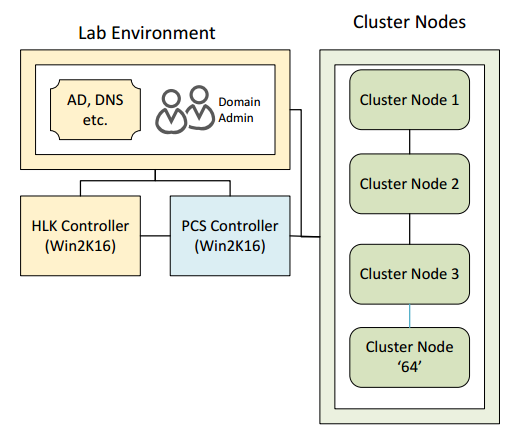

### <span id="Execution_Flow"></span><span id="execution_flow"></span><span id="EXECUTION_FLOW"></span>Execution Flow

PCS execution proceeds through the stages below. All stages after the PCS kickoff \[Stage (2)\] are fully automated and need no user intervention.

1.  Setup PCS lab topology
    1.  In this stage, the lab setup necessary for a succesful PCS run should be complete.
    2.  Section (2) discusses details on setting up the common lab infrastructure
    3.  Section (3) discusses the specific setups necessary for different types of devices/solutions.
2.  Kickoff PCS using HLK Studio
    1.  This stage kicks off the PCS execution process.
    2.  Section (3) discusses the HLK job(s) to be used to kick off PCS for different types of devices/solutions.
3.  Initialize PCS Controller (automated)
    1.  In this stage, the PCS execution engine sets up a SQL server and IIS on the PCS controller machine
    2.  It also copies content (e.g. evaluation OS VHD files) to enable VM creation in the next stage
4.  Create VMs (automated)
    1.  This stage sees the PCS engine start creating VMs on each node of the cluster
    2.  VM creation stops when the target number of VMs/node has been reached.
    3.  This step is a part of PCS setup phase. Test run duration timer kicks in post this stage.
5.  Run Actions (automated)
    1.  Now, PCS initiates various types of actions (VM, Cluster, Storage, Network) on each node of the cluster.
    2.  Actions run in parallel and co-ordinate among themselves to exercise the device (storage, network) and the solution through the private cloud/datacenter lifecycle
    3.  Actions run periodically and stop once the target execution time (defined by the profile/job) of the test has been reached.
    4.  Test execution time is defined per profile and can vary based on the profile you are running. Test execution timer kicks in after all the VMs are created.
    5.  The steps in each action and the corresponding result of each step is stored in the SQL server.
6.  Analyze Results (automated)
    1.  The Run Analyzer engine uses results stored on the SQL server to decide the result of the run based on the success rate of each action, the absence of unexpected crashes on the cluster node.
    2.  This result stored in the HLK logging format for use by HLK Studio.
7.  Cleanup Run (automated)
    -   In this stage, VMs created in stage (4) are cleaned up and the cluster is restored to a clean state (as possible).
8.  Report result in HLK Studio (automated)
    1.  In this stage, the HLK studio reports the result of the PCS run.
    2.  The result can be packaged into an HLKX file for submission to Microsoft.

## <span id="Common_Lab_Infrastructure_Setup"></span><span id="common_lab_infrastructure_setup"></span><span id="COMMON_LAB_INFRASTRUCTURE_SETUP"></span>Common Lab Infrastructure Setup


In this section, we will discuss the lab environment that will be common for all PCS execution.

### <span id="Topology"></span><span id="topology"></span><span id="TOPOLOGY"></span>Topology

The figure below shows the common topology for a PCS lab environment with the following elements:

1.  An Active Directory (AD) domain controller and DNS/DHCP servers for the test domain.
2.  A dedicated HLK controller
3.  A dedicated PCS controller

All the above machines (AD Controller, HLK Controller, PCS Controller) can be VMs and must be joined to the same test domain.

**User Credentials**

-   All PCS tests need to be run as the same user in the 'Domain Admins' group for the test domain.
-   Use the same user with Domain Admin credentials to install the HLK controller.


### <span id="Active_Directory_Functional_Level"></span><span id="active_directory_functional_level"></span><span id="ACTIVE_DIRECTORY_FUNCTIONAL_LEVEL"></span>Active Directory Functional Level

You can find information about Active Directory at the following URL: <https://msdn.microsoft.com/library/bb727067.aspx>

PCS needs the [AD DS domain and forest functional level](https://technet.microsoft.com/en-us/library/understanding-active-directory-functional-levels.aspx) to be Windows Server 2012 or higher.

### <span id="HLK_Controller"></span><span id="hlk_controller"></span><span id="HLK_CONTROLLER"></span>HLK Controller

This controller can be a VM or a physical machine.

### <span id="System_Requirements"></span><span id="system_requirements"></span><span id="SYSTEM_REQUIREMENTS"></span>System Requirements

Minimum system requirements are as shown in the table below.

| Resource                | Minimum requirement            |
|-------------------------|--------------------------------|
| CPU (or vCPU)           | 4 cores                        |
| Memory                  | 12 GB RAM                      |
| Available disk space    | 200 GB                         |
| Operating system        | Windows Server 2016 Datacenter |
| Active Directory domain | Join it to the test domain     |

 

### <span id="Setup"></span><span id="setup"></span><span id="SETUP"></span>Setup

### <span id="Hardware_Lab_Kit"></span><span id="hardware_lab_kit"></span><span id="HARDWARE_LAB_KIT"></span>Hardware Lab Kit

1.  Follow the [Windows HLK Getting Started guide](https://msdn.microsoft.com/library/windows/hardware/dn915002) to [download](https://developer.microsoft.com/windows/hardware/windows-hardware-lab-kit) and install HLK controller software.
2.  Download [PCSFiles.vhd](https://go.microsoft.com/fwlink/p/?LinkId=808763) (Supplemental content for Windows HLK Private Cloud Simulator (PCS) Tests) from the [HLK website](https://developer.microsoft.com/en-us/windows/hardware/windows-hardware-lab-kit).
3.  Copy the [PCSFiles.vhd](https://go.microsoft.com/fwlink/p/?LinkId=808763) file to the **Tests\\amd64** test folder on the HLK Controller. The following path is the default path for an HLK installation:

    `C:\Program Files (x86)\Windows Kits\10\Hardware Lab Kit\Tests\amd64`

### <span id="IOMeter"></span><span id="iometer"></span><span id="IOMETER"></span>IOMeter

1.  IOMeter is a workload that must be installed on the HLK controller.
2.  Download the i386 Windows version of IOMeter release dated 2006.07.27 from the IOMeter website.
3.  Run the setup (or unzip the package) to unpack the files.
4.  Copy IOMeter.exe, Dynamo.exe to Tests \\amd64\\pcs\\GuestScenarioManager\\IOMeter folder on the HLK controller.

    Example:

    `C:\Program Files (x86)\Windows Kits\10\Hardware Lab Kit\Tests\amd64\pcs\GuestScenarioManager\IOMeter`

### <span id="PCS_Controller"></span><span id="pcs_controller"></span><span id="PCS_CONTROLLER"></span>PCS Controller

This controller must be a Generation v2 VM or a physical machine.

### <span id="System_Requirements"></span><span id="system_requirements"></span><span id="SYSTEM_REQUIREMENTS"></span>System Requirements

Minimum system requirements are as shown in the table below.

| Resource                     | Minimum requirement            |
|------------------------------|--------------------------------|
| CPU (or vCPU)                | 4 cores                        |
| Memory                       | 12 GB RAM                      |
| Free space on the boot drive | 200 GB                         |
| Operating system             | Windows Server 2016 Datacenter |
| Active Directory domain      | Join it to the test domain     |

 

### <span id="Setup"></span><span id="setup"></span><span id="SETUP"></span>Setup

1.  Disable **Secure Boot** and **BitLocker** on the PCS controller. This is needed because PCS enables **TestSigning** boot configuration on the controller. If you are using Generation 2 Hyper-V VM as PCS controller, stop the VM to disable Secure Boot in the VM's settings.
2.  Install the HLK Client using the [Windows HLK Getting Started guide](https://msdn.microsoft.com/library/windows/hardware/dn915002) and open the requisite ports.
3.  Install .NET Framework 3.5 (not included by default in Windows Server 2016).
    1.  Generic Installation Instructions can be found at the following locations:
        -   <https://msdn.microsoft.com/library/hh506443>
        -   <https://msdn.microsoft.com/library/windows/desktop/hh848079>
    2.  For builds released via Microsoft Connect, see details below:
        -   Mount the ISO supplied with the build and find the file:
            -   microsoft-windows-netfx3-ondemand-package.cab

            in the &lt;Mounted ISO&gt;\\sources\\sxs folder
        -   Copy the file to a local folder on the PCS controller
        -   Install the package by executing this command line using admin privileges

            ``` syntax
            Dism.exe /online /enable-feature /featurename:NetFX3 /All /Source:<Local Folder> /LimitAccess
            ```

            **or**

            ``` syntax
            PS> Add-WindowsFeature Net-Framework-Features –IncludeAllSubFeature
            ```
4.  During test execution, the features (including all sub-features) below will be installed on the PCS controller:
    1.  Web Server

        ``` syntax
        PS> Add–WindowsFeature Web-WebServer –IncludeAllSubFeature
        ```

    2.  Failover Clustering feature and sub features. Management tools

        ``` syntax
        PS> Add-WindowsFeature Failover-Clustering -IncludeAllSubFeature -IncludeManagementTools
        ```

    3.  Remote Server Administration for Hyper-V tools

        ``` syntax
        PS> Add-WindowsFeature RSAT-Hyper-V-Tools –IncludeAllSubFeature
        ```

## <span id="Setup_and_Run_PCS_tests_from_Windows_HLK"></span><span id="setup_and_run_pcs_tests_from_windows_hlk"></span><span id="SETUP_AND_RUN_PCS_TESTS_FROM_WINDOWS_HLK"></span>Setup and Run PCS tests from Windows HLK


This section discusses how to find an appropriate PCS test for your device/solution, configure the lab, and kickoff PCS execution.

-   You need to use the same domain admin user account to setup lab and run tests.
-   You need to install "1607 HLK Update for WS16 (NIC, HDD, SERVER), WSSD (ALL) & AZURE STACK (ALL) Certification" to update your HLK controller and clients. This package is available at Microsoft Connect site for download.
-   "Secure Boot State" must be OFF on all nodes and PCS controller.

## <span id="PCS_Test_Selection"></span><span id="pcs_test_selection"></span><span id="PCS_TEST_SELECTION"></span>PCS Test Selection


The PCS execution framework is used to certify multiple categories of devices and solutions. The table below, maps the device to the appropriate PCS test.

Target
Certification/Validation Program
PCS Test Job Name in HLK
NIC (10GbE)
Windows Server 2016 Logo
PrivateCloudSimulator - Device.Network.LAN.10GbOrGreater
SDDC - Standard
SDDC – Premium
PrivateCloudSimulator - Device.Network.LAN.AzureStack
AzureStack
SAS HBA
SDDC – Standard
PrivateCloudSimulator - Device.Storage.Controller.AzureStack
SDDC – Premium
AzureStack
Disk (HDD/SSD/NVMe)
SDDC – Standard
PrivateCloudSimulator - Device.Storage.HD.AzureStack
SDDC – Premium
AzureStack
Complete end-to-end solution
SDDC – Standard
PrivateCloudSimulator - System.Solutions.StorageSpacesDirect (MIN)

PrivateCloudSimulator - System.Solutions.StorageSpacesDirect (MAX)

SDDC – Premium
AzureStack
PrivateCloudSimulator - System.Solutions.AzureStack (MIN)

PrivateCloudSimulator - System.Solutions.AzureStack (MAX)

 

PCS actions simulate planned and unplanned activity. PCS tests are summarized below:

-   PrivateCloudSimulator - Device.Network.LAN.10GbOrGreater

    This test contains a set of actions, that specifically target the network adapter device along with VM and compute cluster actions.

-   PrivateCloudSimulator - Device.Network.LAN.AzureStack

    This test contains an extended set of actions, that verify network adapter support for the new 'Software Defined Networking' feature in Windows Server 2016, along with VM and compute cluster actions.

-   PrivateCloudSimulator - Device.Storage.Controller.AzureStack

    This test contains an extended set of actions, that specifically target the Storage Controller, along with VM and compute cluster actions.

-   PrivateCloudSimulator - Device.Storage.Enclosure.AzureStack

    This test contains an extended set of actions, that specifically target the JBOD enclosure, along with VM, compute cluster and storage cluster actions.

-   PrivateCloudSimulator - Device.Storage.HD.AzureStack

    This test contains an extended set of actions, that specifically target the disk, along with VM and compute cluster actions.

-   PrivateCloudSimulator - System.Solutions.StorageSpacesDirect (MIN)/(MAX)

    This test contains an extended set of actions, that target the entire solution built on an hyper-converged storage spaces direct cluster. The (MIN) test should be run on a cluster with the minimum number of supported nodes for the solution. The (MAX) test should be run on a cluster with the maximum number of supported nodes for the solution.

-   PrivateCloudSimulator - System.Solutions.AzureStack (MIN)/(MAX)

    This test contains an extended set of actions, that target the entire AzureStack solution. The (MIN) test should be run on a cluster with the minimum number of supported nodes for the solution. The (MAX) test should be run on a cluster with the maximum number of supported nodes for the solution.

## <span id="Execute_PCS_Tests"></span><span id="execute_pcs_tests"></span><span id="EXECUTE_PCS_TESTS"></span>Execute PCS Tests


## <span id="PrivateCloudSimulator_-_Device.Network.LAN.10GbOrGreater"></span><span id="privatecloudsimulator_-_device.network.lan.10gborgreater"></span><span id="PRIVATECLOUDSIMULATOR_-_DEVICE.NETWORK.LAN.10GBORGREATER"></span>PrivateCloudSimulator - Device.Network.LAN.10GbOrGreater


### <span id="System_Requirements"></span><span id="system_requirements"></span><span id="SYSTEM_REQUIREMENTS"></span>System Requirements

<table>
<colgroup>
<col width="50%" />
<col width="50%" />
</colgroup>
<tbody>
<tr class="odd">
<td>Component Being certified</td>
<td>NIC</td>
</tr>
<tr class="even">
<td>Setup Type</td>
<td>Hyper-converged setup with S2D storage.
<div class="alert">
<strong>Note</strong>  An SDDC certified HBA is required.
</div>
<div>
 
</div></td>
</tr>
<tr class="odd">
<td>(Minimum) Number of Server Nodes</td>
<td>3 - all identical</td>
</tr>
<tr class="even">
<td>Server Spec</td>
<td>CPU: 16 physcial cores (e.g. 2 socket with 8 cores), Memory: 128 GB, 64 GB free space on boot drive</td>
</tr>
<tr class="odd">
<td>Storage - Overall</td>
<td>4 TB free space per node on HDD, 800 GB free space per node on SSD</td>
</tr>
<tr class="even">
<td>SSD</td>
<td>Minimum of 1 SSD per node</td>
</tr>
<tr class="odd">
<td>HDD</td>
<td>Minimum of 2 HDD per node</td>
</tr>
<tr class="even">
<td>Network Card</td>
<td>NIC being certified</td>
</tr>
<tr class="odd">
<td>Switch</td>
<td>Switch supporting all NIC features</td>
</tr>
</tbody>
</table>

 

### <span id="Setup"></span><span id="setup"></span><span id="SETUP"></span>Setup

1.  Follow the [Windows HLK Getting Started guide](https://msdn.microsoft.com/library/windows/hardware/dn915002) to install HLK client software on all cluster nodes
2.  Follow the [Windows Server 2016 Storage Spaces Direct cluster guide](https://technet.microsoft.com/library/mt693395.aspx) to deploy a cluster
3.  All nodes must be connected to the same physical switches.
4.  10GbE or better networking bitrate must be used. Create a virtual swith with the same name on each node.
5.  Virtual machines, created by PCS, connect to the virtual switch to send network traffic between them. These VMs get IP address via DHCP. Make sure your DHCP server assigns valid IP addresses to these VMs. If DHCP server is not available or fails, VMs would use Automatic Private IP Addressing (APIPA) to self-configure an IP address and subnet. Each VM must have a valid IP address to send network traffic between VMs.

### <span id="Execute"></span><span id="execute"></span><span id="EXECUTE"></span>Execute

-   Open HLK Studio
-   Follow the [Windows HLK Getting Started guide](https://msdn.microsoft.com/library/windows/hardware/dn915002) to create a machine pool
-   Navigate to the **Project** tab and click **Create Project**
-   Enter a project name and press Enter
-   Navigate to the **Selection** tab
-   Select the machine pool containing the network adapter device
-   Select **device manager**
-   Select the device

    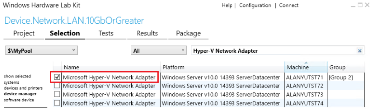

-   Right-click on the selected device and select **Add/Modify Features**

    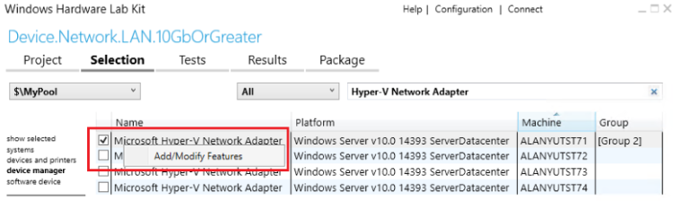

-   In the features dialog, select **Device.Network.LAN.10GbOrGreater** and click **OK**. For most NIC cards (with speeds 10GbE or higher) this feature will have been selected automatically.
-   Navigate to the **Tests** tab
-   Select **PrivateCloudSimulator - Device.Network.LAN.10GbOrGreater**
-   Click **Run Selected**
-   In the Schedule dialog,
    -   Enter values for the required test parameters
        -   DomainName: Test user's domain name
        -   UserName: Test user's user name
        -   Password: Test user's password
        -   ComputeCluster: Name of compute cluster
        -   StoragePath: Default value is "". It uses all the available CSVs from compute cluster. You can use different path by entering comma separated paths.

            Example: "C:\\ClusterStorage\\Volume1,C:\\ClusterStorage\\Volume2"

        -   VmSwitchName: Name of virtual switch on all nodes

    -   Map machines to roles
        -   PrimaryNode: This is the node with the selected device
        -   Test Controller: Select PCS test controller machine
        -   OtherNodes: Select other cluster nodes
-   Click **OK** to schedule the test
-   Please refer to [View PCS report in real-time through SQL Server Reporting Services](#realtime) to view the real-time results for the test run.

### <span id="Actions"></span><span id="actions"></span><span id="ACTIONS"></span>Actions

The table below lists the actions that are included in this test.

Target object
Action
Description
Virtual machine
VmCloneAction
Creates a new VM.
VmLiveMigrationAction
Live-migrates the VM to another cluster node.
VmSnapshotAction
Takes a snapshot of the VM.
VmStateChangeAction
Changes the VM state (for example, to Paused).
VmStorageMigrationAction
Migrates VM storage (the VHD(s)) between cluster nodes.
VmGuestRestartAction
Restarts the VM.
VmStartWorkloadAction
Starts a user-simulated workload.
VmGuestFullPowerCycleAction
Power-cycles the VM.
Compute node
ComputeNodeRestartAction
Restart a compute node.
ComputeNodeBugcheckAction
Bugcheck one node of the compute cluster.
 

**Duration**

-   PCS Actions (listed above) will run for 24 hours.
-   The complete run may take around 48-72 hours (including time for setup and cleanup)

## <span id="PrivateCloudSimulator_-_Device.Network.LAN.AzureStack"></span><span id="privatecloudsimulator_-_device.network.lan.azurestack"></span><span id="PRIVATECLOUDSIMULATOR_-_DEVICE.NETWORK.LAN.AZURESTACK"></span>PrivateCloudSimulator - Device.Network.LAN.AzureStack


### <span id="System_Requirements"></span><span id="system_requirements"></span><span id="SYSTEM_REQUIREMENTS"></span>System Requirements

<table>
<colgroup>
<col width="50%" />
<col width="50%" />
</colgroup>
<tbody>
<tr class="odd">
<td>Component Being certified</td>
<td>NIC (with RDMA)</td>
</tr>
<tr class="even">
<td>Setup Type</td>
<td>Hyper-converged setup with S2D storage
<div class="alert">
<strong>Note</strong>  An SDDC certified HBA is required.
</div>
<div>
 
</div></td>
</tr>
<tr class="odd">
<td>(Minimum) Number of Server Nodes</td>
<td>3 - all identical</td>
</tr>
<tr class="even">
<td>Server Spec</td>
<td>CPU: 16 physcial cores (e.g. 2 socket with 8 cores), Memory: 128 GB, 64 GB free space on boot drive</td>
</tr>
<tr class="odd">
<td>Storage - Overall</td>
<td>4 TB free space per node on HDD, 800 GB free space per node on SSD</td>
</tr>
<tr class="even">
<td>SSD</td>
<td>Minimum of 1 SSD per node</td>
</tr>
<tr class="odd">
<td>HDD</td>
<td>Minimum of 2 HDD per node</td>
</tr>
<tr class="even">
<td>Network Card</td>
<td>(RDMA) NIC being certified</td>
</tr>
<tr class="odd">
<td>Switch</td>
<td>Switch supporting all NIC features (including RDMA)</td>
</tr>
</tbody>
</table>

 

### <span id="Setup"></span><span id="setup"></span><span id="SETUP"></span>Setup

-   Follow the [Windows HLK Getting Started guide](https://msdn.microsoft.com/library/windows/hardware/dn915002) to install HLK client software on all cluster nodes
-   Follow the [Windows Server 2016 Storage Spaces Direct cluster guide](https://technet.microsoft.com/library/mt693395.aspx) to deploy a cluster
-   10GbE or better networking bitrate is required for the NICs under test. Each server should have two identical 10gb or greater NICs.
-   All the nodes must be able to communicate with the PCS-Controller at all times through a management interface. For this purpose, each server should have one additional NIC for management interface, which does not need to meet strict bitrate requirements.
-   If RDMA capable NICs are used, the physical switch must meet the associated RDMA requirements.
-   Make sure that RDMA is setup on all nodes and reflects when queried through Get-SMBClientNetworkInterface & Get-SMBServerNetworkInterface.
-   Make sure that every node contains a teaming enabled virtual switch with the same name.

    Example: New-VMSwitch -Name SdnSwitch -NetAdapterName "SLOT 2,SLOT 2 2" -AllowManagementOS -EnableEmbeddedTeaming

-   Live Migration settings (Failover Cluster Manager-&gt;Networks-&gt;Live Migration Settings) must be set appropriately to use storage network for live migrations.

PCS will create virtual machines and send traffic between them using the virtual switch created. The vNic (virtual nic) of the PCS virtual machines are assigned IP address from the IP address space passed in as the AddressPrefixes parameter.

**PCS-Controller should be built as a Gen2-VM and have 2 network interfaces, one for the management network and the other for SDN (PA address space) topology.** The interface for SDN topology will be assigned an IP address from the IP address space passed in as the AddressPrefixes parameter.

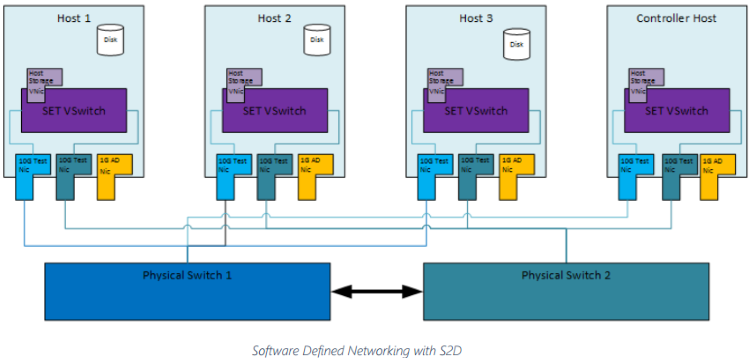

### <span id="Execute"></span><span id="execute"></span><span id="EXECUTE"></span>Execute

-   Open HLK Studio
-   Navigate to the **Project** tab and click **Create Project**
-   Enter a project name and press Enter
-   Navigate to the **Selection** tab
-   Select the machine pool containing the network adapter device
-   Select **device manager**
-   Select the device

    It should be OK to select any relevant NIC device (does not matter which member of the virtual switch team) on any of the compute nodes that is targeted for certification.

    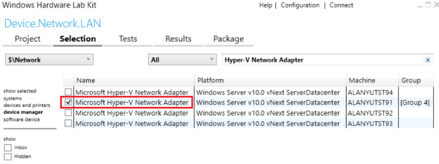

-   Right-click on the selected device and select **Add/Modify Features**

-   In the features dialog, select **Device.Network.LAN.AzureStack** and click **OK**.
-   Navigate to the **Tests** tab
-   Select **PrivateCloudSimulator - Device.Network.LAN.AzureStack**
-   Click **Run Selected**
-   In the Schedule dialog,
    -   Enter values for the required test parameters
        -   DomainName: Test user's fully qualified domain name (FQDN).
        -   UserName: Test user's user name
        -   Password: Test user's password
        -   ComputeCluster: compute cluster name
        -   VmSwitchName: Name of virtual switch to be used for SDN.

            Example: SdnSwitch.

        -   AdapterNames: Comma separated list of adapter names that are part of the vmSwitch. Use the format '"Slot 2, Slot 2 2"' for multiple adapters. Names must be derived from Get-NetAdapter cmdlet.
        -   VLan: Vlan ID set on vmSwitch. Only required if your physical switch is configured for Vlan. Enter '0' to indicate that there is no Vlan tagging.
        -   AddressPrefixes: The IP address range to be used by Tenant VMs and Hosts. These addresses will be used for SDN datacenter management.
        -   ClientAddressPrefix: The IP address range used by Client VMs.
        -   RDMAEnabled: Enter 1 if NIC supports RDMA
        -   SetEnabled: Enter 1 if NIC supports Switch Embedded Teaming
        -   HnvEnabled: Enter 1 if NIC supports Hyper-V Network Virtualization
        -   TaskOffloadEnabled: Enter 1 if NIC supports Encapsulate Task Offload
        -   TestControllerNetAdapterName: Adapter name on PCS-Controller that can be assigned a static IP in the AddressPrefixes range to communicate with SDN Network Controller virtual machines.
        -   IsCreateCluster: Enter true if you want the test to create cluster and enable S2D.
        -   IsRemoveCluster: Enter true if you want to cleanup cluster and S2D configuration when exiting test

    -   Map machines to roles
        -   PrimaryNode: This is the node with the selected device, automatically selected by HLK.
        -   Test Controller: Select PCS test controller machine
        -   OtherNodes: Select other cluster nodes
-   Click **OK** to schedule the test
-   Please refer to [View PCS report in real-time through SQL Server Reporting Services](#realtime) to view the real-time results for the test run.

### <span id="Cleanup"></span><span id="cleanup"></span><span id="CLEANUP"></span>Cleanup

Use the **C:\\Pcs\\ReRunPcsCleanup.cmd** script on the PCS-Controller for cleaning up state of the setup if the test abruptly ends. It is very important that stale VMs & SDN infrastructure is cleaned up before starting a new run.

Please make sure the following items are cleaned up before starting a new run:

-   Clustered VM roles (FailoverClusterManager-&gt;Cluster-&gt;Roles)
-   All the VMs created by PCS
-   vNics created by PCS/SDN

    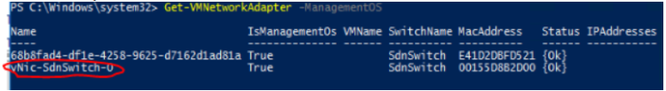

-   Storage/CSV-volumes on the cluster do not have any entries pertaining to PCS (C:\\ClusterStorage\\Volume1\\PCS).

### <span id="Actions"></span><span id="actions"></span><span id="ACTIONS"></span>Actions

The table below lists the actions that are included in this test.

Type
Action Name
Description
Traffic
NetRunEastWestCrossSubnetTrafficAction
Run traffic between two Tenant Vms in same VNetwork, but different Vsubnets
NetRunEastWestSameSubnetTrafficAction
Run traffic between two Tenant Vms in same Vsubnet
NetLoadBalancerEastWestInterTenantTrafficAction
Run traffic between load balanced tenants and another Vm in a different App Tier. Simulates load balanced traffic amongst frontent application (website) Vms.
NetLoadBalancerEastWestIntraTenantTrafficAction
Run traffic between load balanced tenants and a Vm in the same App Teir. Simulates load balanced traffic from backend application (DB) to frontent application (website).
NetLoadBalancerInboundTrafficAction
Run traffic from outside the Tenant network to a load balanced Vms (website).
NetLoadBalancerNorthSouthTrafficAction
Run traffic from inside the Tenant network to a load balanced Vms.
NetLoadBalancerOutboundTrafficAction
Run traffic from load balancedVms inside the Tenant network to a Vm outside.
NetAddInboundVipToLoadBalancerAction
Creates Virtual Ips for Tenant VMs dynamically, mainly for other traffic actions to use.
Virtual machine
VmLiveMigrationAction
Live-migrates the VM to another cluster node.
VmStateChangeAction
Changes the VM state (for example, to Paused).
VmStorageMigrationAction
Migrates VM storage (the VHD(s)) between cluster nodes.
VmGuestRestartAction
Restarts the VM.
VmGuestFullPowerCycleAction
Power-cycles the VM.
 

**Duration**

-   PCS Actions (listed above) will run for 24 hours.
-   The complete run may take around 48-72 hours (including time for setup and cleanup).

## <span id="PrivateCloudSimulator_-_Device.Storage.HD.AzureStack"></span><span id="privatecloudsimulator_-_device.storage.hd.azurestack"></span><span id="PRIVATECLOUDSIMULATOR_-_DEVICE.STORAGE.HD.AZURESTACK"></span>PrivateCloudSimulator - Device.Storage.HD.AzureStack


### <span id="System_Requirements"></span><span id="system_requirements"></span><span id="SYSTEM_REQUIREMENTS"></span>System Requirements

### <span id="Solid_State_Drives"></span><span id="solid_state_drives"></span><span id="SOLID_STATE_DRIVES"></span>Solid State Drives

When certifying SSD's for use in Azure Stack the following is the minimum required hardware test harness that must be running a Windows Server 2016 Storage Spaces Direct cluster.

<table>
<colgroup>
<col width="50%" />
<col width="50%" />
</colgroup>
<tbody>
<tr class="odd">
<td>Component Being certified</td>
<td>SSD</td>
</tr>
<tr class="even">
<td>Setup Type</td>
<td>Hyper-converged setup with S2D storage
<div class="alert">
<strong>Note</strong>  An SDDC certified HBA is required.
</div>
<div>
 
</div></td>
</tr>
<tr class="odd">
<td>(Minimum) Number of Server Nodes</td>
<td>4 - all identical</td>
</tr>
<tr class="even">
<td>Server Spec</td>
<td>CPU: 16 physical cores (e.g. 2 socket with 8 cores), Memory: 128 GB, 64 GB free space on boot drive</td>
</tr>
<tr class="odd">
<td>Storage - Overall</td>
<td>4 TB free space per node on SSD</td>
</tr>
<tr class="even">
<td>SSD</td>
<td>Total SSD storage capacity on each node = 4 TB. Minimum of 2 SSD per node, but more may be needed to meet the 4 TB free space requirement and have enough spare disks for repair test case. To certify multiple SSD disk families in the same setup concurrently (aka with a single PCS run), you need 1 SSD of each family on each of the 4 nodes in the same enclosure slot.</td>
</tr>
<tr class="odd">
<td>HDD</td>
<td>None</td>
</tr>
<tr class="even">
<td>Network Card</td>
<td>10 GbE NIC with WS2016 Compatible certification/WS2012 R2 certification</td>
</tr>
<tr class="odd">
<td>Switch</td>
<td>10 GbE Switch supporting all NIC features</td>
</tr>
</tbody>
</table>

 

### <span id="Hard_Disk_Drives"></span><span id="hard_disk_drives"></span><span id="HARD_DISK_DRIVES"></span>Hard Disk Drives

When certifying HDD's for use in Azure Stack the following is the minimum required hardware test harness that must be running a Windows Server 2016 Storage Spaces Direct cluster.

<table>
<colgroup>
<col width="50%" />
<col width="50%" />
</colgroup>
<tbody>
<tr class="odd">
<td>Component Being certified</td>
<td>HDD</td>
</tr>
<tr class="even">
<td>Setup Type</td>
<td>Hyper-converged setup with S2D storage
<div class="alert">
<strong>Note</strong>  An SDDC certified HBA is required.
</div>
<div>
 
</div></td>
</tr>
<tr class="odd">
<td>(Minimum) Number of Server Nodes</td>
<td>4 - all identical</td>
</tr>
<tr class="even">
<td>Server Spec</td>
<td>CPU: 16 physical cores (e.g. 2 socket with 8 cores), Memory: 128 GB, 64 GB free space on boot drive</td>
</tr>
<tr class="odd">
<td>Storage - Overall</td>
<td>4 TB free space per node on HDD</td>
</tr>
<tr class="even">
<td>SSD</td>
<td>None</td>
</tr>
<tr class="odd">
<td>HDD</td>
<td>Total HDD storage capacity on each node = 4 TB. Minimum of 2 HDD per node, but more may be needed to meet the 4 TB free space requirement and have enough spare disks for repair test case. To certify multiple HDD disk families in the same setup concurrently (aka with a single PCS run), you need 1 HDD of each family on each of the 4 nodes in the same enclosure slot.</td>
</tr>
<tr class="even">
<td>Network Card</td>
<td>10 GbE NIC with WS2016 Certification</td>
</tr>
<tr class="odd">
<td>Switch</td>
<td>10 GbE Switch supporting all NIC features</td>
</tr>
</tbody>
</table>

 

### <span id="Setup"></span><span id="setup"></span><span id="SETUP"></span>Setup

-   Follow the [Windows HLK Getting Started guide](https://msdn.microsoft.com/library/windows/hardware/dn915002) to install HLK client software on all cluster nodes
-   Follow the [Windows Server 2016 Storage Spaces Direct cluster guide](https://technet.microsoft.com/library/mt693395.aspx) to deploy a cluster

### <span id="Execute"></span><span id="execute"></span><span id="EXECUTE"></span>Execute

-   Open HLK Studio
-   Follow the [Windows HLK Getting Started guide](https://msdn.microsoft.com/library/windows/hardware/dn915002) to create a machine pool
-   Navigate to the **Project** tab and click **Create Project**
-   Enter a project name and press Enter
-   Navigate to the **Selection** tab
-   Select the machine pool containing the disk device
-   Select **device manager**
-   Select the disk device that needs to be certified.

    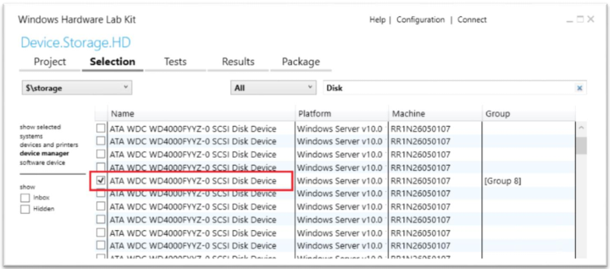

-   Right-click on the selected device and select **Add/Modify Features**

    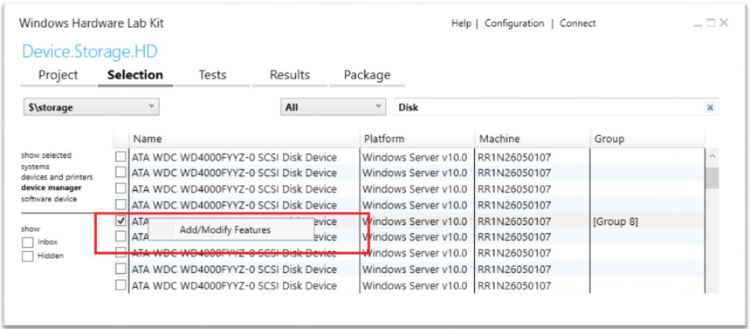

-   In the features dialog, select **Device.Storage.HD.AzureStack** and click **OK**.

    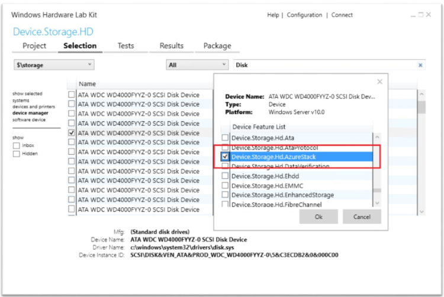

-   Navigate to the **Tests** tab
-   Select **PrivateCloudSimulator - Device.Storage.HD.AzureStack**
-   Click **Run Selected**

    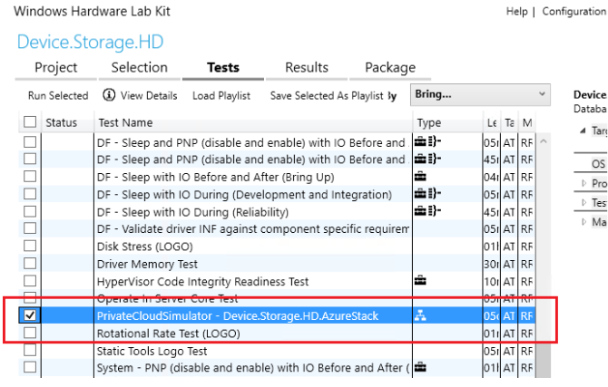

-   In the Schedule dialog,
    -   Enter values for the required test parameters
        -   DomainName: Test user's fully qualified domain name (FQDN).
        -   UserName: Test user's user name
        -   Password: Test user's password
        -   ComputeCluster: compute cluster name
        -   This location(s) will be on the disk device under test. Default value is "". It uses all the available CSVs from compute cluster. You can use different path by entering comma separated paths.

            Example: "C:\\ClusterStorage\\Volume1,C:\\ClusterStorage\\Volume2"

    -   Map machines to roles
        -   PrimaryNode: This is the node with the selected device
        -   Test Controller: Select PCS test controller machine
        -   OtherNodes: Select other cluster nodes

        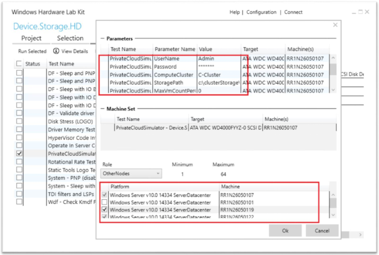
-   Click OK to schedule the test.
-   Please refer to [View PCS report in real-time through SQL Server Reporting Services](#realtime) to view the real-time results for the test run.

### <span id="Actions"></span><span id="actions"></span><span id="ACTIONS"></span>Actions

The profile defines the actions to execute to validate the disk drives for Microsoft AzureStack. The table below lists the actions that are included in this profile.

Target object
Action
Description
Virtual machine
VmCloneAction
Creates a new VM.
VmLiveMigrationAction
Live-migrates the VM to another cluster node.
VmSnapshotAction
Takes a snapshot of the VM.
VmStateChangeAction
Changes the VM state (for example, to Paused).
VmStorageMigrationAction
Migrates VM storage (the VHD(s)) between cluster nodes.
VmGuestRestartAction
Restarts the VM.
VmStartWorkloadAction
Starts a user-simulated workload.
VmGuestFullPowerCycleAction
Power-cycles the VM.
Compute node
ClusterCSVMoveAction
Move the CSV disks to the best available node.
Storage node
StorageNodePoolMove
Moves a storage pool (created in Storage Spaces) to a different owner node in the storage cluster.
StorageNodeRestart
Restarts a node in the storage cluster.
StorageNodeBugcheck
Bug checks one node of the storage cluster.
StorageNodeDiskReadTimeoutAction
This action goes through disks that tolerate errors (not readonly, clustered, no simple spaces) and waits for read IO. Once an IO is intercepted, it will cause the IO to timeout. If a single timeout is detected on any disk, the action is considered successful.
StorageNodeDiskWriteTimeoutAction
This action goes through disks that tolerate errors (not readonly, clustered, no simple spaces) and waits for write IO. Once an IO is intercepted, it will cause the IO to timeout. If a single timeout is detected on any disk, the action is considered successful.
StorageNodeBusResetAction
This action attempts to inject a bus reset to any of the physical disks backing the pool. First, a timeout to a read or write IO is attempted, if that is successful then the corresponding abort, reset LUN, and reset target commands are failed. If any of these succeed then a bus reset will be triggered. If any disk issues a bus reset, the action is then considered successful.
StorageNodeUpdateStorageProviderCacheAction
Calls update-storageprovidercache command in powershell
 

**Duration**

-   PCS Actions (listed above) will run for 48 hours.
-   The complete run may take an additional 24-36 hours (including time for setup and cleanup).

## <span id="PrivateCloudSimulator_-_Device.Storage.Controller.AzureStack"></span><span id="privatecloudsimulator_-_device.storage.controller.azurestack"></span><span id="PRIVATECLOUDSIMULATOR_-_DEVICE.STORAGE.CONTROLLER.AZURESTACK"></span>PrivateCloudSimulator - Device.Storage.Controller.AzureStack


### <span id="System_Requirements"></span><span id="system_requirements"></span><span id="SYSTEM_REQUIREMENTS"></span>System Requirements

When certifying SAS HBA's for use in Azure Stack the following is the minimum required hardware test harness that must be running a Windows Server 2016 Storage Spaces Direct cluster.

|                                  |                                                                                                     |
|----------------------------------|-----------------------------------------------------------------------------------------------------|
| Component Being certified        | SAS HBA (for S2D)                                                                                   |
| Setup Type                       | Hyper-converged setup with S2D storage. HBA under test has to be separate from the Boot HBA         |
| (Minimum) Number of Server Nodes | 3 - all identical                                                                                   |
| Server Spec                      | CPU: 16 physical cores (e.g. 2 socket with 8 cores), Memory: 128 GB, 64 GB free space on boot drive |
| Storage - Overall                | 4 TB free space per node on HDD, 800 GB free space per node on SSD                                  |
| SSD                              | Minimum of 1 SSD per node                                                                           |
| HDD                              | Minimum of 2 HDD per node                                                                           |
| Network Card                     | 10 GbE NIC with WS2016 Certification                                                                |
| Switch                           | 10GbE Switch supporting all NIC features                                                            |

 

### <span id="Setup"></span><span id="setup"></span><span id="SETUP"></span>Setup

-   Follow the [Windows HLK Getting Started guide](https://msdn.microsoft.com/library/windows/hardware/dn915002) to install HLK client software on all cluster nodes
-   Follow the [Windows Server 2016 Storage Spaces Direct cluster guide](https://technet.microsoft.com/library/mt693395.aspx) to deploy a cluster

### <span id="Execute"></span><span id="execute"></span><span id="EXECUTE"></span>Execute

-   Open HLK Studio
-   Follow the [Windows HLK Getting Started guide](https://msdn.microsoft.com/library/windows/hardware/dn915002) to create a machine pool
-   Navigate to the **Project** tab and click **Create Project**
-   Enter a project name and press Enter
-   Navigate to the **Selection** tab
-   Select the machine pool containing the disk device
-   Select **device manager**
-   Select the disk device that needs to be certified.

    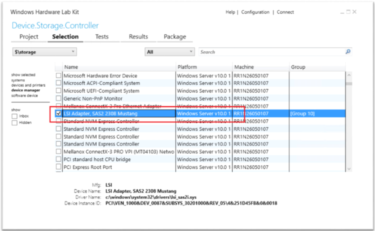

-   Right-click on the selected device and select **Add/Modify Features**

    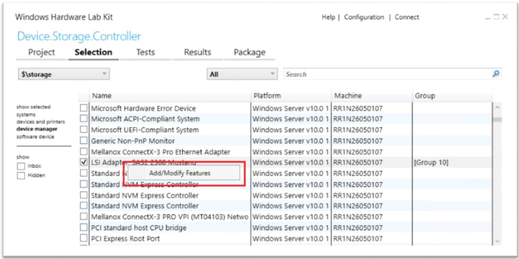

-   In the features dialog, select **Device.Storage.Controller.AzureStack** and click OK.

    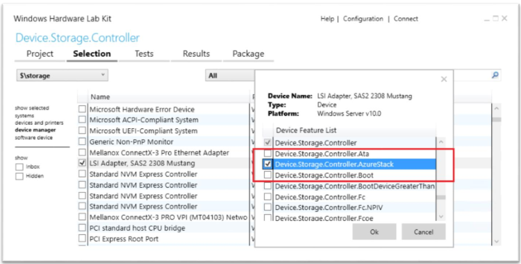

-   Navigate to the Tests tab
-   Select **PrivateCloudSimulator - Device.Storage.Controller.AzureStack**
-   Click **Run Selected**

    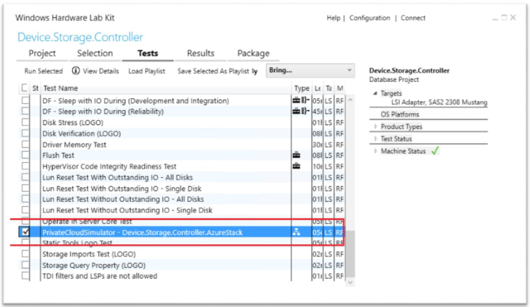

-   In the Schedule dialog,
    -   Enter values for the required test parameters
        -   DomainName: Test user's fully qualified domain name (FQDN).
        -   UserName: Test user's user name
        -   Password: Test user's password
        -   ComputeCluster: Name of compute cluster name
        -   StoragePath: This location(s) will be on the disk connected to the storage controller under test.

            Default value is "". It uses all the available CSVs from compute cluster. You can use different path by entering comma separated paths.

            Example: "C:\\ClusterStorage\\Volume1,C:\\ClusterStorage\\Volume2"

    -   Map machines to roles
        -   PrimaryNode: This is the node with the selected device
        -   Test Controller: Select PCS test controller machine
        -   OtherNodes: Select other cluster nodes

            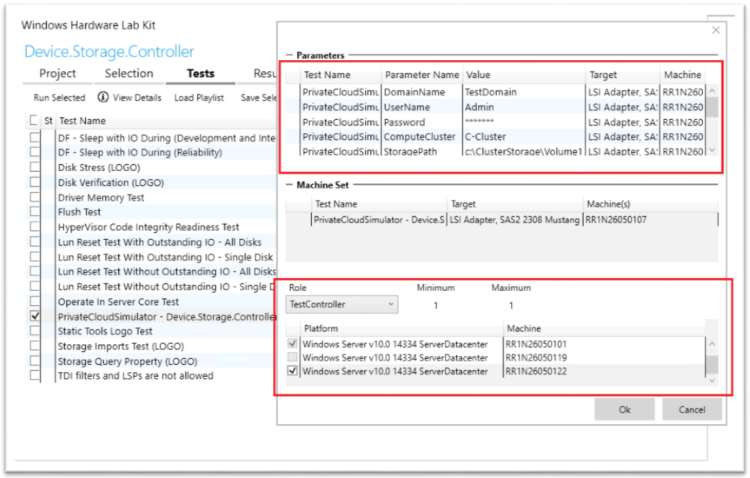
-   Click OK to schedule the test.
-   Please refer to [View PCS report in real-time through SQL Server Reporting Services](#realtime) to view the real-time results for the test run.

### <span id="Actions"></span><span id="actions"></span><span id="ACTIONS"></span>Actions

The profile defines the actions to execute to validate the disk drives for Microsoft AzureStack. The table below lists the actions that are included in this profile.

Target object
Action
Description
Virtual machine
VmCloneAction
Creates a new VM.
VmLiveMigrationAction
Live-migrates the VM to another cluster node.
VmSnapshotAction
Takes a snapshot of the VM.
VmStateChangeAction
Changes the VM state (for example, to Paused).
VmStorageMigrationAction
Migrates VM storage (the VHD(s)) between cluster nodes.
VmGuestRestartAction
Restarts the VM.
VmStartWorkloadAction
Starts a user-simulated workload.
VmGuestFullPowerCycleAction
Power-cycles the VM.
Compute node
ClusterCSVMoveAction
Move the CSV disks to the best available node.
StorageNodePoolMove
Moves a storage pool (created in Storage Spaces) to a different owner node in the storage cluster.
StorageNodeBusResetAction
This action attempts to inject a bus reset to any of the physical disks backing the pool. First, a timeout to a read or write IO is attempted, if that is successful then the corresponding abort, reset LUN, and reset target commands are failed. If any of these succeed then a bus reset will be triggered. If any disk issues a bus reset, the action is then considered successful.
StorageNodePortDisableAllAction
This action disables all the storage controllers in the node. All of the SCSI controllers are disabled, if one is successfully disabled then the action is considered passed. After the specified time, all of the controllers are then re-enabled.

This action is disabled for boot controllers

 

**Duration**

-   PCS Actions (listed above) will run for 48 hours.
-   The complete run may take an additional 24-36 hours (including time for setup and cleanup).

## <span id="PrivateCloudSimulator_-_Device.Storage.Enclosure.AzureStack"></span><span id="privatecloudsimulator_-_device.storage.enclosure.azurestack"></span><span id="PRIVATECLOUDSIMULATOR_-_DEVICE.STORAGE.ENCLOSURE.AZURESTACK"></span>PrivateCloudSimulator - Device.Storage.Enclosure.AzureStack


### <span id="System_Requirements"></span><span id="system_requirements"></span><span id="SYSTEM_REQUIREMENTS"></span>System Requirements

|                                  |                                                                                                     |
|----------------------------------|-----------------------------------------------------------------------------------------------------|
| Component Being certified        | Enclosure                                                                                           |
| Setup Type                       | Hyper-converged setup with S2D storage. HBA under test has to be separate from the Boot HBA         |
| (Minimum) Number of Server Nodes | 3 - all identical                                                                                   |
| Server Spec                      | CPU: 16 physical cores (e.g. 2 socket with 8 cores), Memory: 128 GB, 64 GB free space on boot drive |
| Storage - Overall                | 4 TB free space per node on HDD, 800 GB free space per node on SSD                                  |
| SSD                              | Minimum of 1 SSD per node                                                                           |
| HDD                              | Minimum of 2 HDD per node                                                                           |
| Network Card                     | 10 GbE NIC with WS2016 Certification                                                                |
| Switch                           | 10GbE Switch supporting all NIC features                                                            |

 

### <span id="Setup"></span><span id="setup"></span><span id="SETUP"></span>Setup

-   Follow the [Windows HLK Getting Started guide](https://msdn.microsoft.com/library/windows/hardware/dn915002) to install HLK client software on all cluster nodes
-   Follow the [Windows Server 2016 Storage Spaces Direct cluster guide](https://technet.microsoft.com/library/mt693395.aspx) to deploy a cluster

### <span id="Execute"></span><span id="execute"></span><span id="EXECUTE"></span>Execute

-   Open HLK Studio
-   Follow the [Windows HLK Getting Started guide](https://msdn.microsoft.com/library/windows/hardware/dn915002) to create a machine pool
-   Navigate to the **Project** tab and click **Create Project**
-   Enter a project name and press Enter
-   Navigate to the **Selection** tab
-   Select the machine pool containing the disk device
-   Select **device manager**
-   Select the disk device that needs to be certified.

    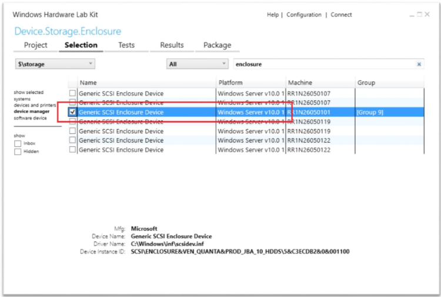

-   Right-click on the selected device and select **Add/Modify Features**

    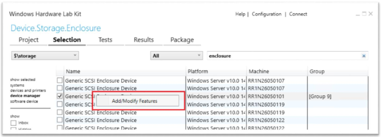

-   In the features dialog, select **Device.Storage.Enclosure.AzureStack** and click OK.

    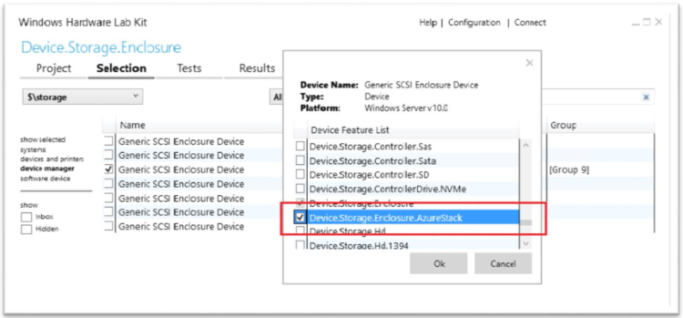

-   Navigate to the Tests tab
-   Select **PrivateCloudSimulator - Device.Storage.Enclosure.AzureStack**
-   Click **Run Selected**

    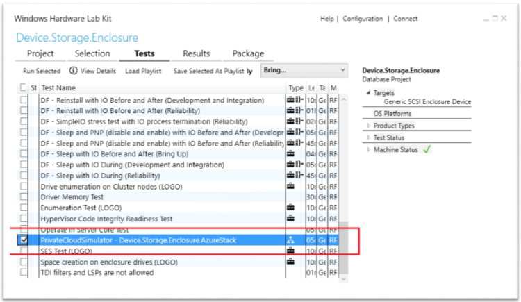

-   In the Schedule dialog,
    -   Enter values for the required test parameters
        -   DomainName: Test user's fully qualified domain name (FQDN).
        -   UserName: Test user's user name
        -   Password: Test user's password
        -   ComputeCluster: Name of compute cluster name
        -   StoragePath: This location(s) will be on the disk connected to the storage controller under test.

            Default value is "". It uses all the available CSVs from compute cluster. You can use different path by entering comma separated paths.

            Example: "C:\\ClusterStorage\\Volume1,C:\\ClusterStorage\\Volume2"

    -   Map machines to roles
        -   PrimaryNode: This is the node with the selected device
        -   Test Controller: Select PCS test controller machine
        -   OtherNodes: Select other cluster nodes

            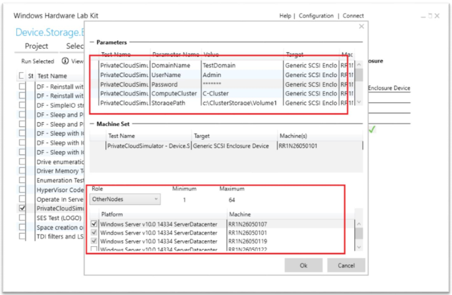
-   Click OK to schedule the test.
-   Please refer to [View PCS report in real-time through SQL Server Reporting Services](#realtime) to view the real-time results for the test run.

### <span id="Actions"></span><span id="actions"></span><span id="ACTIONS"></span>Actions

The profile defines the actions to execute to validate the disk drives for Microsoft AzureStack. The table below lists the actions that are included in this profile.

Target object
Action
Description
Virtual machine
VmCloneAction
Creates a new VM.
VmLiveMigrationAction
Live-migrates the VM to another cluster node.
VmSnapshotAction
Takes a snapshot of the VM.
VmStateChangeAction
Changes the VM state (for example, to Paused).
VmStorageMigrationAction
Migrates VM storage (the VHD(s)) between cluster nodes.
VmGuestRestartAction
Restarts the VM.
VmStartWorkloadAction
Starts a user-simulated workload.
VmGuestFullPowerCycleAction
Power-cycles the VM.
Compute node
ClusterCSVMoveAction
Move the CSV disks to the best available node.
Storage node
StorageNodePoolMove
Moves a storage pool (created in Storage Spaces) to a different owner node in the storage cluster.
StorageNodeBusResetAction
This action attempts to inject a bus reset to any of the physical disks backing the pool. First, a timeout to a read or write IO is attempted, if that is successful then the corresponding abort, reset LUN, and reset target commands are failed. If any of these succeed then a bus reset will be triggered. If any disk issues a bus reset, the action is then considered successful.
StorageRetireAndRepairAction
This action retires a disk from a pool and starts repair. If spaces doesn't get healthy, the action fails. The action randomly picks a pool and tries to retire a disk in the pool. If the disk is set as readonly, or it is a simple space or is used for cluster purposes (i.e. quorum resource) then the action is skipped
 

**Duration**

-   PCS Actions (listed above) will run for 48 hours.
-   The complete run may take an additional 24-36 hours (including time for setup and cleanup).

## <span id="PrivateCloudSimulator_-_System.Solutions.StorageSpacesDirect"></span><span id="privatecloudsimulator_-_system.solutions.storagespacesdirect"></span><span id="PRIVATECLOUDSIMULATOR_-_SYSTEM.SOLUTIONS.STORAGESPACESDIRECT"></span>PrivateCloudSimulator - System.Solutions.StorageSpacesDirect


### <span id="Setup"></span><span id="setup"></span><span id="SETUP"></span>Setup

-   Setup your solution with the cluster deployment toolset supplied for WSSD program.
-   Minimum Configuration
    -   This config contains the minimum of cluster nodes, slowest supported processor, least memory and lowest storage capacity supported by the solution family.
    -   Please use the **PrivateCloudSimulator - System.Solutions.StorageSpacesDirect (MIN)** job to validate this setup
-   Maximum Configuration
    -   This config contains the maximum of cluster nodes and the maximum storage supported by the solution family.
    -   Processor and memory should be equal or higher than the lowest supported value for the solution, but need not be the maximum possible supported value. The processor and memory values should be representative of the most common skus for the solution.
    -   Please use the **PrivateCloudSimulator - System.Solutions.StorageSpacesDirect (MAX)** job to validate this setup

### <span id="Execute"></span><span id="execute"></span><span id="EXECUTE"></span>Execute

-   Open HLK Studio
-   Follow the [Windows HLK Getting Started guide](https://msdn.microsoft.com/library/windows/hardware/dn915002) to create a machine pool
-   Navigate to the **Project** tab and click **Create Project**
-   Enter a project name and press Enter
-   Navigate to the **Selection** tab
-   Select the machine pool containing the system under test and PCS controller machine.
-   Select **systems** on the left panel and then select the PCS test controller (NOTE: Not the machine that needs to be certified).

    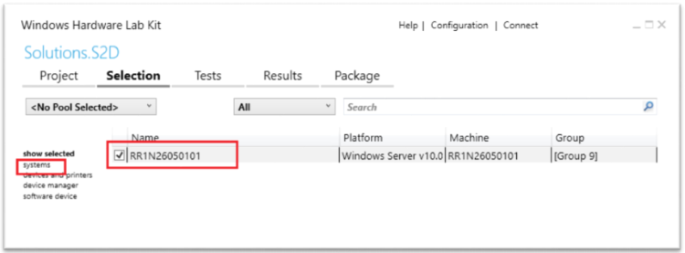

-   Right-click on the selected device and select **Add/Modify Features**

    

-   In the features dialog, select **System.Solution.StorageSpacesDirect** and click OK

    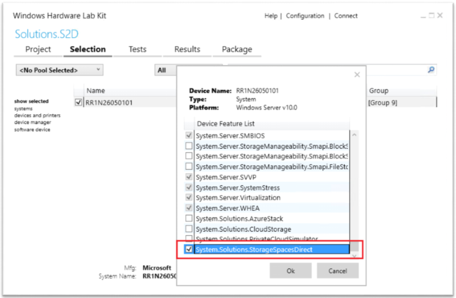

-   Navigate to the Tests tab
-   Select **PrivateCloudSimulator – System.Solutions.StorageSpacesDirect (MAX)** or **PrivateCloudSimulator – System.Solutions.StorageSpacesDirect (MIN)** (based on the solution size you are testing)
-   Click **Run Selected**

    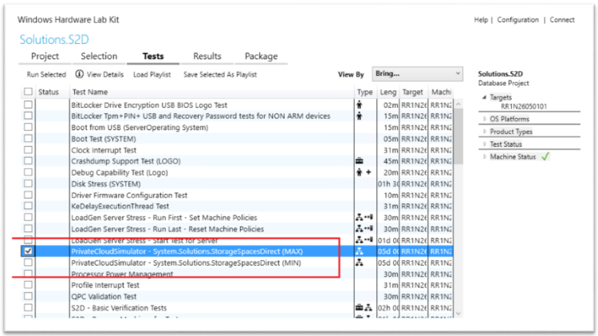

-   In the Schedule dialog,
    -   Enter values for the required test parameters
        -   DomainName: Test user's fully qualified domain name (FQDN).
        -   UserName: Test user's user name
        -   Password: Test user's password
        -   ComputeCluster: Name of compute cluster name
        -   StoragePath: This location(s) will be on the disk device under test. Default value is "". It uses all the available CSVs from compute cluster. You can use different path by entering comma separated paths.

            Example: "C:\\ClusterStorage\\Volume1,C:\\ClusterStorage\\Volume2"

    -   Map machines to roles
        -   Test Controller: Select PCS test controller machine

            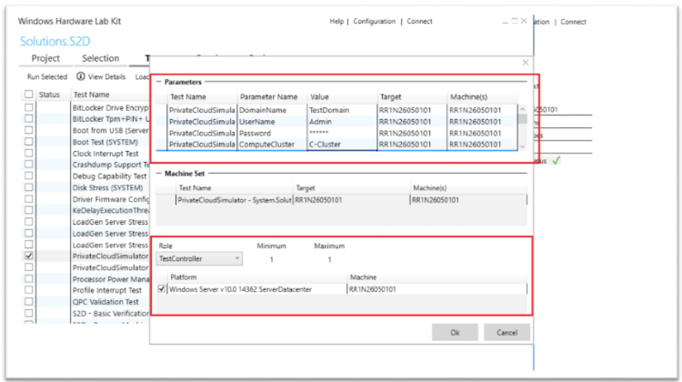
-   Click **OK** to schedule the test.
-   Please refer to [View PCS report in real-time through SQL Server Reporting Services](#realtime) to view the real-time results for the test run.

### <span id="Actions"></span><span id="actions"></span><span id="ACTIONS"></span>Actions

The profile defines the actions to execute to validate the disk drives for Microsoft AzureStack. The table below lists the actions that are included in this profile.

Target object
Action
Description
Virtual machine
VmCloneAction
Creates a new VM.
VmLiveMigrationAction
Live-migrates the VM to another cluster node.
VmSnapshotAction
Takes a snapshot of the VM.
VmStateChangeAction
Changes the VM state (for example, to Paused).
VmStorageMigrationAction
Migrates VM storage (the VHD(s)) between cluster nodes.
VmGuestRestartAction
Restarts the VM.
VmStartWorkloadAction
Starts a user-simulated workload.
VmGuestFullPowerCycleAction
Power-cycles the VM.
Compute node
ComputeNodeEvacuation
Drains all resources from one cluster node.
ClusterCSVMoveAction
Move the CSV disks to the best available node.
StorageNodePoolMove
Moves a storage pool (created in Storage Spaces) to a different owner node in the storage cluster.
StorageNodeRestart
Restarts a node in the storage cluster.
StorageNodeBugcheck
Bug checks one node of the storage cluster.
StorageNodeDiskReadTimeoutAction
This action goes through disks that tolerate errors (not read-only, clustered, no simple spaces) and waits for read IO. Once an IO is intercepted, it will cause the IO to timeout. If a single timeout is detected on any disk, the action is considered successful. This action is invoked on storage nodes every 15 minutes.
StorageNodeDiskWriteTimeoutAction
This action goes through disks that tolerate errors (not read-only, clustered, no simple spaces) and waits for write IO. Once an IO is intercepted, it will cause the IO to timeout. If a single timeout is detected on any disk, the action is considered successful. This action is invoked on storage nodes every 15 minutes.
StorageNodeBusResetAction
This action attempts to inject a bus reset to any of the physical disks backing the pool. First, a timeout to a read or write IO is attempted, if that is successful then the corresponding abort, reset LUN, and reset target commands are failed. If any of these succeed then a bus reset will be triggered. If any disk issues a bus reset, the action is then considered successful.
StorageNodePortDisableAllAction
This action disables all the storage controllers in the node. All of the SCSI controllers are disabled, if one is successfully disabled then the action is considered passed. After the specified time, all of the controllers are then re-enabled.
StorageRetireAndRepairAction
This action retires a disk from a pool and starts repair. If spaces doesn't get healthy, the action fails. The action randomly picks a pool and tries to retire a disk in the pool. If the disk is set as readonly, or it is a simple space or is used for cluster purposes (i.e. quorum resource) then the action is skipped DisableNetworkAdapters Disables one of the network adapter that carries the storage traffic.
StorageNodeNetworkDisconnectAction
Disables one of the network adapters that carries the storage traffic.
StorageNodeDiskIoTimeoutOnceAction
Times out a single read or write across the storage node. This does not time out the retry attempt for this IO, so the disk will not go unresponsive.
StorageNodeUpdateStorageProviderCacheAction
Calls update-storageprovidercache command in PowerShell.
 

**Duration**

-   PCS Actions (listed above) will run for 96 hours.
-   The complete run may take an additional 24-36 hours (including time for setup and cleanup).

## <span id="PrivateCloudSimulator_-_System.Solutions.AzureStack"></span><span id="privatecloudsimulator_-_system.solutions.azurestack"></span><span id="PRIVATECLOUDSIMULATOR_-_SYSTEM.SOLUTIONS.AZURESTACK"></span>PrivateCloudSimulator - System.Solutions.AzureStack


### <span id="System_Requirements"></span><span id="system_requirements"></span><span id="SYSTEM_REQUIREMENTS"></span>System Requirements

### <span id="Setup"></span><span id="setup"></span><span id="SETUP"></span>Setup

-   Setup your solution with the cluster deployment toolset supplied for AzureStack program.
-   Minimum Configuration
    -   This config contains the minimum of cluster nodes, slowest processor, least memory and lowest storage capacity supported by the solution family.
    -   Please use the **PrivateCloudSimulator - System.Solutions.AzureStack (MIN)** job to validate this setup
-   Maximum Configuration
    -   This config contains the maximum of cluster nodes and the maximum storage supported by the solution family.
    -   Processor and memory should be equal or higher than the lowest supported value for the solution, but need not be the maximum possible supported value. The processor and memory values should be representative of the most common skus for the solution.
    -   Please use the **PrivateCloudSimulator - System.Solutions. AzureStack (MAX)** job to validate this setup

### <span id="Execute"></span><span id="execute"></span><span id="EXECUTE"></span>Execute

-   Open HLK Studio
-   Follow the [Windows HLK Getting Started guide](https://msdn.microsoft.com/library/windows/hardware/dn915002) to create a machine pool
-   Follow the [Windows HLK Getting Started guide](https://msdn.microsoft.com/library/windows/hardware/dn915002) to create a machine pool
-   Navigate to the **Project** tab and click **Create Project**
-   Enter a project name and press Enter
-   Navigate to the **Selection** tab
-   Select the machine pool containing the system under test
-   Select **systems** on the left panel and then select the PCS test controller (NOTE: Not the machine that needs to be certified).

    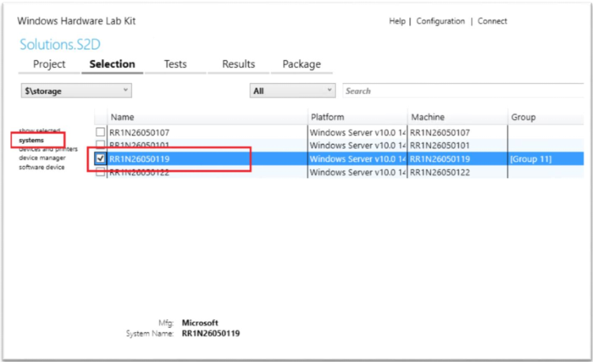

-   Right-click on the selected device and select **Add/Modify Features**

    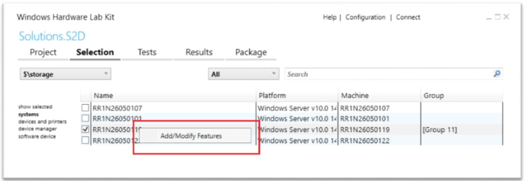

-   In the features dialog, select **System.Solution.AzureStack** and click OK

    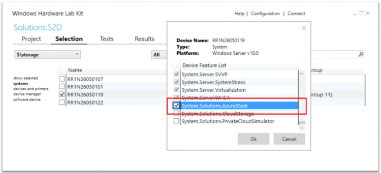

-   Navigate to the Tests tab
-   Select **PrivateCloudSimulator – System.Solutions.AzureStack**
-   Click **Run Selected** link

    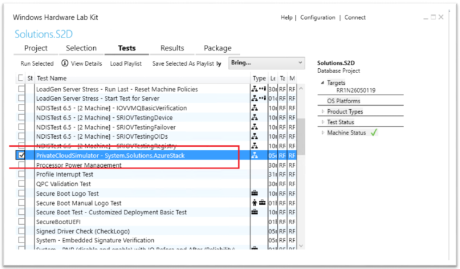

-   In the Schedule dialog,
    -   Enter values for the required test parameters
        -   DomainName: Test user's fully qualified domain name (FQDN).
        -   UserName: Test user's user name
        -   Password: Test user's password
        -   ComputeCluster: Name of compute cluster name
        -   StoragePath: This location(s) will be on the disk device under test. Default value is "". It uses all the available CSVs from compute cluster. You can use different path by entering comma separated paths.

            Example: "C:\\ClusterStorage\\Volume1,C:\\ClusterStorage\\Volume2"

    -   Map machines to roles
        -   Test Controller: Select PCS test controller machine

            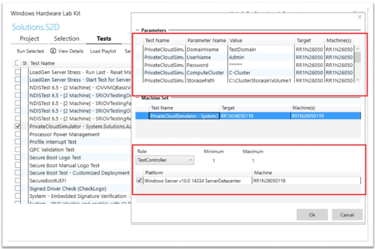
-   Click **OK** to schedule the test.
-   Please refer to [View PCS report in real-time through SQL Server Reporting Services](#realtime) to view the real-time results for the test run.

### <span id="Actions"></span><span id="actions"></span><span id="ACTIONS"></span>Actions

The profile defines the actions to execute to validate the storage Enclosure for Microsoft AzureStack. The table below lists the actions that are included in this profile.

Target object
Action
Description
Virtual machine
VmCloneAction
Creates a new VM.
VmLiveMigrationAction
Live-migrates the VM to another cluster node.
VmSnapshotAction
Takes a snapshot of the VM.
VmStateChangeAction
Changes the VM state (for example, to Paused).
VmStorageMigrationAction
Migrates VM storage (the VHD(s)) between cluster nodes.
VmGuestRestartAction
Restarts the VM.
VmStartWorkloadAction
Starts a user-simulated workload.
VmGuestFullPowerCycleAction
Power-cycles the VM.
Compute node
ComputeNodeEvacuation
Drains all resources from one cluster node.
ClusterCSVMoveAction
Move the CSV disks to the best available node.
Storage Node
StorageNodePoolMove
Moves a storage pool (created in Storage Spaces) to a different owner node in the storage cluster.
StorageNodeRestart
Restarts a node in the storage cluster.
StorageNodeBugcheck
Bug checks one node of the storage cluster.
StorageNodeDiskReadTimeoutAction
This action goes through disks that tolerate errors (not read-only, clustered, no simple spaces) and waits for read IO. Once an IO is intercepted, it will cause the IO to timeout. If a single timeout is detected on any disk, the action is considered successful. This action is invoked on storage nodes every 15 minutes.
StorageNodeDiskWriteTimeoutAction
This action goes through disks that tolerate errors (not read-only, clustered, no simple spaces) and waits for write IO. Once an IO is intercepted, it will cause the IO to timeout. If a single timeout is detected on any disk, the action is considered successful. This action is invoked on storage nodes every 15 minutes.
StorageNodeBusResetAction
This action attempts to inject a bus reset to any of the physical disks backing the pool. First, a timeout to a read or write IO is attempted, if that is successful then the corresponding abort, reset LUN, and reset target commands are failed. If any of these succeed then a bus reset will be triggered. If any disk issues a bus reset, the action is then considered successful.
StorageNodePortDisableAllAction
This action disables all the storage controllers in the node. All of the SCSI controllers are disabled, if one is successfully disabled then the action is considered passed. After the specified time, all of the controllers are then re-enabled.
StorageRetireAndRepairAction
This action retires a disk from a pool and starts repair. If spaces doesn't get healthy, the action fails. The action randomly picks a pool and tries to retire a disk in the pool. If the disk is set as readonly, or it is a simple space or is used for cluster purposes (i.e. quorum resource) then the action is skipped DisableNetworkAdapters Disables one of the network adapter that carries the storage traffic.
StorageNodeNetworkDisconnectAction
Disables one of the network adapters that carries the storage traffic.
StorageNodeDiskIoTimeoutOnceAction
Times out a single read or write across the storage node. This does not time out the retry attempt for this IO, so the disk will not go unresponsive.
StorageNodeUpdateStorageProviderCacheAction
Calls update-storageprovidercache command in PowerShell.
 

**Duration**

-   PCS Actions (listed above) will run for 96 hours.
-   The complete run may take an additional 24-36 hours (including time for setup and cleanup)

## <span id="Analyze_test_results"></span><span id="analyze_test_results"></span><span id="ANALYZE_TEST_RESULTS"></span>Analyze test results


While a PCS test pass is running, you can view and analyze data in real-time through SQL Server Reporting Services. After the test pass completes, you can get additional information in the logs generated by the PCS.

## <span id="realtime"></span><span id="REALTIME"></span>View PCS report in real-time through SQL Server Reporting Services


While PCS operations are running, reports are saved in a SQL database on the PCS Controller. Each report lists all operations that were performed, their pass percentages, and all resources that were acquired and released during the test. A new database is created for each test run to enable you to review data from previous test runs at any time.

To view the report, follow these steps:

1.  By default, Internet Explorer Enhanced Security Configuration is enabled on Windows Server 2016. You need to disable it to view the report.

    Open Server Manager =&gt; Local Server =&gt; Click **IE Enhanced Security Configuration** to turn it off for administrators and users.

2.  Open IE from HLK controller and visit http://PcsControllerMachineName/Reports.

    If you open IE from PCS controller, you need to open IE with administrator privilege.

    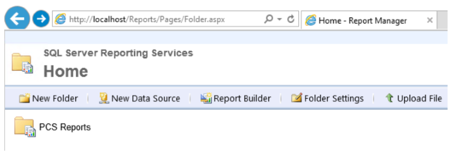

3.  Click **PCS Reports** =&gt; **PCSRuns**.
4.  Each PCS run is identified by a unique **Pass Run ID**.

    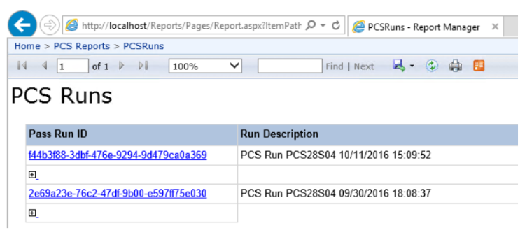

5.  Click a **Pass Run ID** (for example, click f44b3f88-3dbf-476e-9294-9d479ca0a369) to open a report from the PCS run.

    The data in these reports is live. While a test runs, you can monitor the progress of a test run in real-time.

    -   An overview of all resources (VMs and hosts) that participated in the test run.
    -   All actions that were performed on each resource. The Pass and Fail columns report the number of actions that passed and failed.

    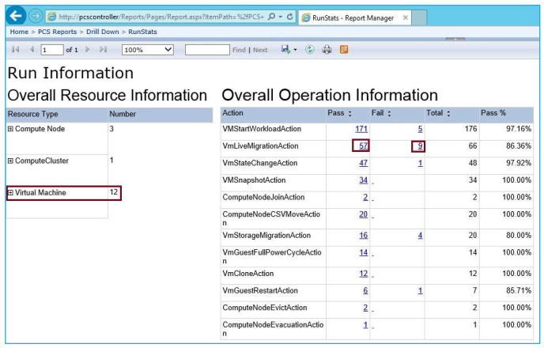

6.  In the Overall Operation Information table, you can click links in the Action/Pass/Fail column to open detail pages, which give you more information about the action's results. For example, if you clicked the failure number 9 by the **VMLiveMigrationAction** entry, you would see the summary shown in the following illustration.

    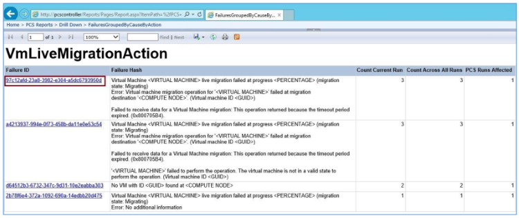

    The first entry above provides the following information:

    -   **Failure ID:** When we encounter a failure in PCS, we generalize the Failure Message and generate a unique Hash for it. In above example the Failure ID is 97c12afd-23a8-3982-e304-a5dc6793950d
    -   **Failure Hash:** Generalized failure message.

        In the example above, the failure hash is the following:

        *Virtual Machine &lt;VIRTUAL MACHINE&gt; live migration failed at progress &lt;PERCENTAGE&gt; (migration state: Migrating)*

        *Error: Virtual machine migration operation for '&lt;VIRTUAL MACHINE&gt;' failed at migration destination '&lt;COMPUTE NODE&gt;'. (Virtual machine ID &lt;GUID&gt;)*

        *Failed to receive data for a Virtual Machine migration: This operation returned because the timeout period expired. (0x800705B4).*

    -   **Count Current Run:** The count of actions of a particular type that failed with this particular error message during this run. In the above example, **VMLiveMigrationAction** was run 3 times.
    -   **Count All Runs:** A count of actions that failed because of this particular failure across all PCS runs. For the **VMLiveMigrationAction**, this count was 3.
    -   **PCS Runs Affected:** Tells how many runs have been affected by this failure. For **VMLiveMigrationAction**, only 1 PCS run was affected.

7.  To look further into the error – you can click a failure ID on that screen to drill down to a global history of the failure type across all PCS runs. For example, click **97c12afd-23a8-3982-e304-a5dc6793950d** to display the following. The page lists all failed operations, grouped by failure type, which has the effect of highlighting key features that you might need to investigate.

    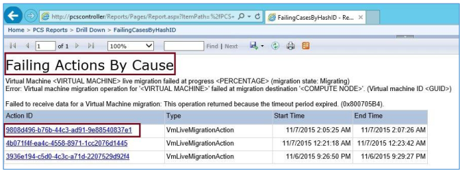

8.  If you click the Action ID, you can drill down farther to see an Action Log Report. Errors are shown in red; Warnings are shown in yellow.

    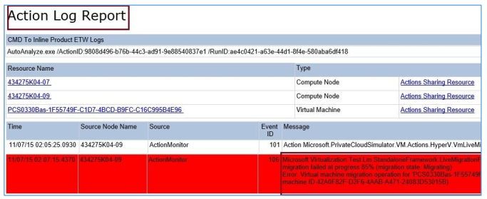

## <span id="Troubleshoot_a_PCS_run_from_the_PCS_Controller"></span><span id="troubleshoot_a_pcs_run_from_the_pcs_controller"></span><span id="TROUBLESHOOT_A_PCS_RUN_FROM_THE_PCS_CONTROLLER"></span>Troubleshoot a PCS run from the PCS Controller


There are multiple stages in PCS Execution Flow. If PCS failed at Setup, Execute, or Cleanup stage, you can browse job logs by right click the job name =&gt; click Browse Job Logs. The log file names are PCS-E2Elaunch\_Setup.log, PCSE2Elaunch\_Execute.log, and PCS-E2Elaunch\_Cleanup.log. Log files contain information about failures.

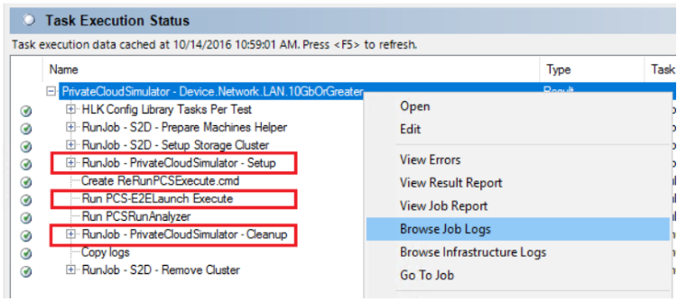

When a PCS job fails, you can rerun Setup/Execute/Cleanup stage directly from PCS controller. This method is useful to for troubleshooting problems in these stages.

-   Open elevated command prompt
-   Run **ReRunPcsSetup.cmd**, **ReRunPcsExecute.cmd**, or **ReRunPcsCleanup.cmd** script

## <span id="Logs_and_Diagnose"></span><span id="logs_and_diagnose"></span><span id="LOGS_AND_DIAGNOSE"></span>Logs and Diagnose


PCS has three main stages: Setup, Execute, and Cleanup. HLK PCS job uses PCS-E2Elaunch.ps1 script to launch these three stages. Their log file names are called PCS-E2ELaunch\_Setup.log, PCS-E2ELaunch\_Execute.log and PCSE2ELaunch\_Cleanup.log.

When a PCS run has completed, PCS Run Analyzer analyzes logs and reports. The run succeeded when the following criteria are met, with the analyzed report saved as AnalyzerLog.log.

-   All PCS actions has 90% pass rate
-   No unexpected crash of any cluster node, except the ones initiated by PCS for testing purpose

The AnalyzerLog.log looks similar to the figure below:

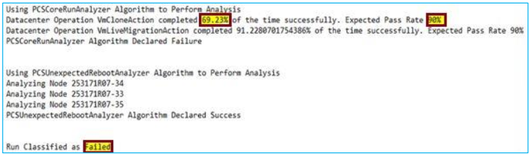

A zip file (PcsLog-DateTime.zip) is created at the end of PCS Cleanup phase. This file contains all the logs and is copied to the HLK PCS job result folder when a test fails.

-   ClusterLog subfolder: contains cluster log files
-   Events subfolder: contains event files
-   MHTML subfolder: contains SQL summary page and failed actions.
-   PCSEventData subfolder: contains workload logs
-   ClusterName-PRE.mht.html/ClusterName-POST.mht.html file: cluster validation test is run before and after PCS execute stage to verify the cluster healthy status

You can run the following script from PCS controller to generate a ZIP file that contains required logs. This method is useful when HLK Studio canceled the job before PCS Cleanup phase has finished.

**Syntax**

``` syntax
PS > C:\pcs\PCS-E2ELaunch.ps1 -DomainName <string> -UserName <string> -Password <string> -ComputeCluster <string> [-StorageCluster <string>] -CollectLog
```

**Parameters**

-   DomainName: Test user's fully qualified domain name (FQDN).
-   UserName: Test user's user name
-   Password: Test user's password
-   ComputeCluster: Name of compute cluster name
-   StorageCluster: optional, Name of storage cluster name. Don't specify this parameter if Computer and Storage clusters are the same.
-   CollectLog: Required

While PCS is running, you can run the following cmdlets on PCS controller to generate a report that lists unexpected bugchecks from all nodes.

**Syntax**

``` syntax
PS > Import-Module .\PrivateCloudSimulator-Manager.psm1
```

``` syntax
PS > Get-PCSReport
```

The above cmdlet generates a HTM file containing the report.

### <span id="Customize_Action_Logs"></span><span id="customize_action_logs"></span><span id="CUSTOMIZE_ACTION_LOGS"></span>Customize Action Logs

A PCS run has a RunId. A PCS action has an action ID. When a PCS action fails, PCS removes the variant (i.e. VM name) from the failure message and generates a unique hash value for it. Similar failures have same unique hash value. PCS then groups them together in SQL report site.

PCS uses .NET Trace Listeners to collect test results. These listeners are defined in Microsoft.PrivateCloudSimulator.exe.config.

-   SQLOnline: This listener logs the results into SQL database.
-   AnalyticalLogGather: This listener collects extra information when an action is failed.

When a particular action fails or a particular hash value is seen, you can configure AnalyticalLogGather listener to collect event logs, cluster logs, or call a script. This is defined in ActionFailureReactionPolicy.xml.

In ActionFailureReactionPolicy.xml, PCS supports two types of triggers and three types of reactions. Using this XML, you can define rules like "when trigger X is seen, take reactions Y and Z". Most actions would have NodeScope set to ReservedOnly and MaxLevel set to 3 (Critical, Error, and Warning events).

**Trigger:**

| Type         | Data           |
|--------------|----------------|
| ActionFail   | ActionFullName |
| KnownFailure | FailureHash    |

 

**Reaction:**

| Type                 | Data                                                                 |
|----------------------|----------------------------------------------------------------------|
| ETWCollection        | Channel, NodeScope, StorageLocation, MaxLevel                        |
| ClusterLogCollection | UseLocalTime, NodeScope, StorageLocation, MaxTimeDuration (optional) |
| CustomPS             | ScriptFullPath, NodeScope, Argument                                  |

 

Valid NodeScope values are the following:

-   AllNodes
-   ComputeOnly
-   StorageOnly
-   EdgeOnly
-   NCOnly
-   ReservedOnly

Valid MaxLevel values are the following:

-   0 (logs at all levels)
-   1 (Critical)
-   2 (Error)
-   3 (Warning)
-   4 (Information)
-   5 (Verbose)

**Examples:**

``` syntax
<Trigger>
  <Type>ActionFail</Type>
  <Data Name="ActionFullName" Value="Microsoft.HyperV.Test.Stress.PrivateCloud.ComputeNode.Action.StorageNodeRestartAction">
  </Data>
  <ReactionMatchList>
    <!-- Details of Reaction are Defined Below and are referenced using the ID attribute-->
    <MatchingReaction ID ="1"></MatchingReaction>
    <MatchingReaction ID ="2"></MatchingReaction>
  </ReactionMatchList>
</Trigger>49
<Reaction ID="1">
  <Type>ETWCollection</Type>
  <Data Name="Channel" Value="Microsoft-Windows-Hyper-V-VMMS-Analytic"></Data>
  <Data Name="NodeScope" Value="ReservedOnly"></Data>
  <Data Name="StorageLocation" Value="C:\PCS\PCSEventData\%NODE%\%ActionId%\EventLogs"></Data>
  <Data Name="MaxLevel" Value="3"></Data>
</Reaction>
```

Action log files are saved to 'FORENSICLOGLOCATION' folder on PCS controller. By default, it is C:\\PCS\\PCSEventData.

For each failed action, the following information is collected from the reserved node(s). This log location can be seen in the action's SQL report page.

-   %MachineName%\\%RunId%\\ClusterLogs\\%ActionId%
-   %MachineName%\\%RunId%\\EventLogs\\%ActionId%
-   %MachineName%\\%RunId%\\CustomResponse\\%ActionId%

### <span id="Logs_collected_for_each_area"></span><span id="logs_collected_for_each_area"></span><span id="LOGS_COLLECTED_FOR_EACH_AREA"></span>Logs collected for each area

The following event and logs are collected in the PcsLog zip file.

### <span id="Cluster_area"></span><span id="cluster_area"></span><span id="CLUSTER_AREA"></span>Cluster area

Cluster logs for compute and storage clusters are collected. The following events from cluster and compute cluster are collected:

Microsoft-Windows-FailoverClustering-ClusBflt/Management
Microsoft-Windows-FailoverClustering-ClusBflt/Operational
Microsoft-Windows-FailoverClustering-Clusport/Operational
Microsoft-Windows-FailoverClustering-CsvFs/Operational
Microsoft-Windows-FailoverClustering-Manager/Admin
Microsoft-Windows-FailoverClustering-Manager/Diagnostic
Microsoft-Windows-FailoverClustering-Manager/Tracing
Microsoft-Windows-FailoverClustering-NetFt/Operational
Microsoft-Windows-FailoverClustering-WMIProvider/Admin
Microsoft-Windows-FailoverClustering/Diagnostic
Microsoft-Windows-FailoverClustering/DiagnosticVerbose
Microsoft-Windows-FailoverClustering/Operational
### <span id="File_server"></span><span id="file_server"></span><span id="FILE_SERVER"></span>File server

The following events from storage cluster are collected:

Microsoft-Windows-SmbClient/Connectivity
Microsoft-Windows-SMBClient/Operational
Microsoft-Windows-SmbClient/Security
Microsoft-Windows-SMBDirect/Admin
Microsoft-Windows-SMBServer/Audit
Microsoft-Windows-SMBServer/Connectivity
Microsoft-Windows-SMBServer/Operational
Microsoft-Windows-SMBServer/Security
Microsoft-Windows-SMBWitnessClient/Admin
Microsoft-Windows-SMBWitnessClient/Informational
Microsoft-Windows-SMBWitnessServer/Admin
### <span id="Hyper-V"></span><span id="hyper-v"></span><span id="HYPER-V"></span>Hyper-V

Some Hyper-V channels are not enabled by default. There is an option to enable/disable them during PCS setup phase.

The following events from compute cluster are collected. The default mode for Analytic events is 'do not overwrite events', and the size of log file is changed to 1GB.

Microsoft-Windows-Hyper-V-Config-Analytic
Microsoft-Windows-Hyper-V-Config-Admin
Microsoft-Windows-Hyper-V-High-Availability-Admin
Microsoft-Windows-Hyper-V-High-Availability-Analytic
Microsoft-Windows-Hyper-V-Hypervisor-Admin
Microsoft-Windows-Hyper-V-Hypervisor-Analytic
Microsoft-Windows-Hyper-V-Hypervisor-Operational
Microsoft-Windows-Hyper-V-VMMS-Analytic
Microsoft-Windows-Hyper-V-VMMS-Admin
Microsoft-Windows-Hyper-V-Worker-Analytic
Microsoft-Windows-Hyper-V-Worker-Admin
Microsoft-Windows-Hyper-V-Worker-VDev-Analytic
Microsoft-Windows-Hyper-V-SynthStor-Admin
### <span id="Storage"></span><span id="storage"></span><span id="STORAGE"></span>Storage

The following Storage Space events from compute or storage clusters are collected:

System
CoreTestShim-Operational
Microsoft-Windows-StorageSpaces-Driver-Operational
Microsoft-Windows-StorageSpaces-Driver-Diagnostic
Microsoft-Windows-Storage-Storport-Operational
### <span id="Network"></span><span id="network"></span><span id="NETWORK"></span>Network

The following SDN events from compute cluster are collected:

System
Microsoft-Windows-Hyper-V-VmSwitch-Operational
## <span id="Create_VMs_that_use_differencing_disks"></span><span id="create_vms_that_use_differencing_disks"></span><span id="CREATE_VMS_THAT_USE_DIFFERENCING_DISKS"></span>Create VMs that use differencing disks


PCS by default uses the provided guest OS VHD to create VMs that have fixed disks by default. To create VMs that have differencing disks instead, set the UseDiffDisks value to true, as highlighted below:

**PrivateCloudSimulator.xml file:**

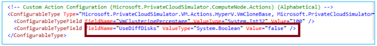

## <span id="Define_actions_for_PCS_to_run"></span><span id="define_actions_for_pcs_to_run"></span><span id="DEFINE_ACTIONS_FOR_PCS_TO_RUN"></span>Define actions for PCS to run


You can define and schedule your own actions for PCS to perform. Below shows a typical action definition in the **PrivateCloudSimulator.xml** file.

-   The value highlighted in yellow is the test name. This is the same test name that shows up on the report.
-   The **Interval** field sets the frequency with which the action runs. Use the format *hh:mm:ss*. For example, the value 02:00:00 repeats the action every 2 hours.
-   The **StartUpNumber** field defines the number of instances of that action to initiate on each node of the compute cluster.

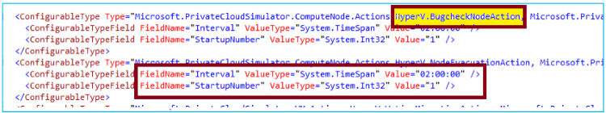

## <span id="FAQ"></span><span id="faq"></span>FAQ


***Where are HLK Studio and PCS controller installed?***

They are installed on additional machines that are not part of the cluster nodes.


***Do we need to install the HLK Client on cluster nodes?***

You need to install HLK Client on cluster nodes and on the PCS controller as well.

***What additional configuration is needed to run firmware update action for disks?***

StorageNodeiskFirmwareRolloutAction depends on the following:

1.  XML File - FirmwareRolloutSettings.xml
2.  The firmware files
    -   XML File: Please create a file named **FirmwareRolloutSettings.xml** and copy it to `C:\Program Files (x86)\Windows Kits\10\Hardware Lab Kit\Tests\amd64\PCS\StorageBin` on the HLK controller.

        The file should have the following format.

        ``` syntax
        <?xml version="1.0"?>
        <Data>
          <Table Id="Settings">
            <ParameterTypes>
              <ParameterType Name="Manufacturer">String</ParameterType>
              <ParameterType Name="Model">String</ParameterType>
              <ParameterType Name="TargetFirmwareVersion">String</ParameterType>
              <ParameterType Name="TargetFirmwarePath">String</ParameterType>
              <ParameterType Name="server">String</ParameterType>
            </ParameterTypes>
            <Row>
              <Parameter Name="Manufacturer">Manufacturer</Parameter>
              <Parameter Name="Model">Model</Parameter>
              <Parameter Name="TargetFirmwareVersion">Version1</Parameter>
              <Parameter Name="TargetFirmwarePath">\\%HLKControllerName%\tests\amd64\PCS\StorageBin\V1.bin</Parameter>
              <Parameter Name="BackupTargetFirmwareVersion">Version2</Parameter>
              <Parameter Name="BackupTargetFirmwarePath">\\%HLKControllerName%\tests\amd64\PCS\StorageBin\V2.bin</Parameter>
              <Parameter Name="server">ServerNameWillBeUpdatedByTestAutomatically</Parameter>
            </Row>
          </Table>
        </Data>
        ```

    -   Copy the firmware files to a location/share on the HLK controller. This location should be accessible by the PCS controller and the cluster nodes.

        This location will be the **TargetFirmwarePath** in the XML above (e.g. \\\\%HLKControllerName%\\tests\\amd64\\PCS\\StorageBin)

***The small boot disk of cluster node has very little free space due to a large pagefile.***

By default, Windows sets the page file max size to the amount of system memory. It s located at C:\\pagefile.sys by default. Make sure your boot drive has enough free disk space on each cluster node. Otherwise, you should change the pagefile settings to reduce the size of it or move it to another drive.

You can run the following command to change the pagefile size. You'll need to then restart the machine.

Example: set the size to 10240MB

``` syntax
reg add "HKLM\SYSTEM\CurrentControlSet\Control\Session Manager\Memory Management" /v PagingFiles /t REG_MULTI_SZ /d "C:\pagefile.sys 10240 10240" /f
```

***What is the PCS support alias?***

Please send email to [pvsha@microsoft.com](mailto://pvsha@microsoft.com) for any queries related to PCS or WSSD, AzureStack hardware certification.

## <span id="Troubleshooting_Failures"></span><span id="troubleshooting_failures"></span><span id="TROUBLESHOOTING_FAILURES"></span>Troubleshooting Failures


The issues seen or resulting from a PCS certification run has been observed to not be related to PCS itself many times, as the PCS is a reliability test suite and touches a number of OS and third party components - HyperV, Clustering, Storage, Networking etc. to name a few.

The below are put together as a basic guide to help narrow down some of the issues:

-   Run cluster validation and check report for errors.
-   On the failover cluster manager, check whether all the nodes+vDisk+Pool are in healthy condition. If they are not, it is fine to invest time on checking the logs/debugging before calling upon MSFT.
-   Open Hyper-V manager and make sure the VMs and vSwitches get enumerated (also possible by running Get-VM or Get-VMSwitch).
-   Make sure you are able create a vSwitch outside of PCS tests on one/all of the compute nodes.
-   Make sure you can create a Win2012R2 VM on one/all of the nodes and can attach a vmNetworkAdapter it to a vSwitch.
-   Look for dump files generated due to bugchecks by running “dir /s \*.dmp” from the %systemdrive% on the compute nodes.
-   Possible usage of [LiveKD](https://technet.microsoft.com/en-us/sysinternals/livekd.aspx) to look at kernel modules/threads that are stuck, if you do not have kernel debugger attached.
-   Check if compute nodes’ license is active, as Eval version license get reset every 180 days.

## <span id="Appendix__Software_Defined_Datacenter__SDDC__Additional_Qualifiers__AQs_"></span><span id="appendix__software_defined_datacenter__sddc__additional_qualifiers__aqs_"></span><span id="APPENDIX__SOFTWARE_DEFINED_DATACENTER__SDDC__ADDITIONAL_QUALIFIERS__AQS_"></span>Appendix: Software Defined Datacenter (SDDC) Additional Qualifiers (AQs)


All server systems and components used in Windows Server 2016 WSSD offers must be certified for the Windows Server 2016 logo and meet the Windows Server 2016 Software-Defined Data Center (SDDC) additional qualifiers (AQs). The required HLK Feature names are listed in the table below.

Component
Required HLK Features
Software-Defined Data Center (SDDC) Standard AQ
Software-Defined Data Center (SDDC) Premium and Azure Stack AQ
NIC
Device.Network.LAN.10GbOrGreater


Device.Network.LAN.VMQ


Device.Network.LAN.RSS


Device.Network.LAN.LargeSendOffload


Device.Network.LAN.ChecksumOffload


Device.Network.LAN.Base


Device.Network.LAN.VXLAN


Device.Network.LAN.VMMQ


Device.Network.LAN.MTUSize
Required if using Encap offloads


Device.Network.LAN.KRDMA


Device.Network.LAN.GRE


Device.Network.LAN.DCB
Required if using RoCE RDMA


Device.Network.LAN.AzureStack


SAS HBA
Device.Storage.Controller


Device.Storage.Controller.Flush


Device.Storage.Controller.PassThroughSupport


Device.Storage.Controller.Sas


Device.Storage.Controller.AzureStack


NVMe Storage Devices
Device.Storage.ControllerDrive.NVMe


Device.Storage.Hd.AzureStack


HDD (SAS)
Device.Storage.Hd


Device.Storage.Hd.DataVerification


Device.Storage.Hd.Flush


Device.Storage.Hd.PortAssociation


Device.Storage.Hd.Sas


Device.Storage.Hd.Scsi.ReliabilityCounters


Device.Storage.Hd.AzureStack


Device.Storage.Hd.FirmwareUpgrade


HDD (SAS)
Device.Storage.Hd.Sata


Device.Storage.Hd


Device.Storage.Hd.DataVerification


Device.Storage.Hd.Flush


Device.Storage.Hd.PortAssociation


Device.Storage.Hd.AzureStack


Device.Storage.Hd.FirmwareUpgrade


SSD (SAS)
Device.Storage.Hd


Device.Storage.Hd.DataVerification


Device.Storage.Hd.PortAssociation


Device.Storage.Hd.Sas


Device.Storage.Hd.AzureStack


Device.Storage.Hd.FirmwareUpgrade


Server
System.Fundamentals.Firmware


System.Server.Virtualization


System.Server.AzureStack.Security


System.Server.Assurance


System.Server.AzureStack.BMC


 

 

 


