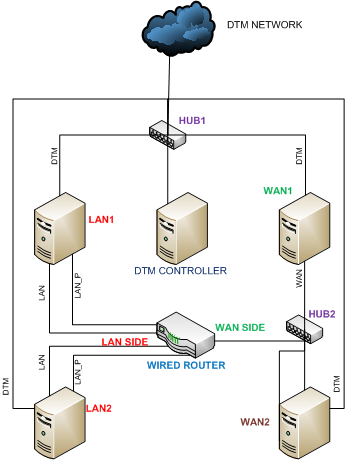

# Router Testing (Non-wireless) Prerequisites


This section describes the tasks that you must complete before you test an Ethernet router by using the Windows Hardware Lab Kit (Windows HLK):

-   [Hardware requirements](#bkmk-hck-router-hr).

-   [Software requirements](#bkmk-hck-router-sr).

-   [Test computer configuration](#bkmk-hck-router-tc).

## <span id="BKMK_HCK_Router_hR"></span><span id="bkmk-hck-router-hr"></span><span id="BKMK_HCK_ROUTER_HR"></span>Hardware requirements


The following hardware is required for router testing. You might need additional hardware if the test device provides bus-specific support. See the test description for each bus-specific test to determine if there are additional hardware requirements.

-   Basic Windows HLK test setup (Controller, Studio). See [Windows HLK Getting Started](..\getstarted\windows-hlk-getting-started.md)

-   Four test computers. Each test computer must meet the Windows HLK prerequisites. See [Windows HLK Prerequisites](..\getstarted\windows-hlk-prerequisites.md) for more information.

-   Eleven (11) 10/100 MB Ethernet adapters. Two of these adapters must support QoS 802.1p

-   A minimum of 2 100 megabit switches. More may be needed depending on the number of available Ethernet ports on the device under test.

-   One test router.

>[!NOTE]
>  
To certify a router for use with servers, the test computer must support four processors and a minimum of 1 GB of RAM. These system capabilities are required to test the Rebalance, D3 State, and Multiple Processor Group functionality of the device and driver. You do not need a computer that actually has more than 64 processors to test your device.

If you use a pool of test computers to test devices, at least one computer in the pool must contain four processors and a minimum of 1 GB of RAM.

Since routers do not include a driver to test, the Windows HLK scheduler constrains the tests that validate the device’s and driver’s Rebalance, D3 State and Multiple Processor Groups functionality to run on the default test computer. You must manually configure this computer to have multiple processor groups. The default computer is the first test computer in the list. Test personnel must make sure that the first test computer in the list meets the minimum hardware requirements.

>[!NOTE]
>  
Except for para-virtualization drivers (as defined by the [WHCP Policies and Processes](http://go.microsoft.com/fwlink/p/?LinkID=615222) document), you may not use any form of virtualization when you test physical devices and their associated drivers for server certification or signature. All virtualization products do not support the underlying functionality that is required to pass the tests that relate to multiple processor groups, device power management, device PCI functionality, and other tests.

>[!NOTE]
>  Multiple Processor Groups Setting
>You must set the value for the processor group size for Hardware Lab Kit testing of Windows Server 2008 R2 and later device drivers for certification. This is done by running bcdedit in an elevated command prompt window, using the /set option.
>
>The commands for adding the group settings and restarting are as follows:
>
``` syntax
bcdedit.exe /set groupsize 2
bcdedit.exe /set groupaware on
shutdown.exe -r -t 0 -f
```
>
>
>The commands for removing the group settings and rebooting are as follows:
>
``` syntax
bcdedit.exe /deletevalue groupsize
bcdedit.exe /deletevalue groupaware
shutdown.exe -r -t 0 -f
```
>

>[!NOTE]
>  
**Code Integrity Setting**

>The Virtualization Based Security feature (VBS) of Windows Server 2016 must be enabled using Server Manager first.
>
>Once that has occurred, the following Registry key must be created and set:
>
``` syntax
HKLM\System\CurrentControlSet\Control\DeviceGuard
HypervisorEnforcedCodeIntegrity:REG_DWORD
0 or 1 (disabled, enabled)
```

 

## <span id="BKMK_HCK_Router_sR"></span><span id="bkmk-hck-router-sr"></span><span id="BKMK_HCK_ROUTER_SR"></span>Software requirements


The following software is required to run the Device.Networking tests:

-   The latest Windows HLK filters and software updates.

## <span id="BKMK_HCK_Router_tC"></span><span id="bkmk-hck-router-tc"></span><span id="BKMK_HCK_ROUTER_TC"></span>Test computer configuration


Among the 4 test computers, there are 3 individual configurations. The test computers are designated as LAN1, LAN2, WAN, and SERVER. The test computers labled LAN1 and LAN2 are configured identically. All system requirements are in addition to minimum system requirements for Windows Vista, Windows 7 and Windows 8. The following network schematic illustrates how each is connected in the network:



>[!NOTE]
>  
Although not illustrated above, the Windows HLK Studio and the Windows HLK controller can be running on one computer to reduce the cost of the setup.

 

Before you begin testing your router, configure each of the four test computers and the machine pool according to the procedures described in the next sections.

In addition, your router must be configured as follows before you begin your testing:

-   Make sure the DHCP server for the router is enabled.

-   You must set the WAN port to this static IP address: 17.1.1.1.

-   Make sure that the UPnP setting is enabled, if it's not enabled by default.

### <span id="Configuring_LAN1_and_LAN2"></span><span id="configuring_lan1_and_lan2"></span><span id="CONFIGURING_LAN1_AND_LAN2"></span>Configuring LAN1 and LAN2

The test computers identified as LAN1 and LAN2 have an identical setup procedure described below:

1.  Install the appropriate Windows operating system on LAN1.

2.  Install three network adapters in LAN1 (including one of the two that supports QoS 802.1p).

3.  Connect two of the Ethernet cards to the LAN side of the router via Ethernet cable. One of these two must be the QoS 802.1p-capable network adapter.

4.  Connect the third Ethernet adapter to your test network.

5.  Open the Network Connections folder (this can be done by clicking **Manage Network Connections** in **Network Center**).

6.  Rename the network connections such that:

    1.  The connection to the DTM network is named **DTM**.

    2.  The connection to the LAN side of the router with the QoS -capable interface is named **LAN\_P**.

    3.  The remaining interface that is connected to the LAN side is named **LAN**.

7.  Enable QoS 802.1p on the **LAN\_P** connection (consult individual interface card manual if you are unsure how to do this)

8.  Make sure all of the connections are marked **Private** in the Network Sharing Center.

9.  Install the Windows HLK client application on both LAN 1 and LAN2. See [Step 2: Install Client on the test system(s)](..\getstarted\step-2--install-client-on-the-test-system-s-.md) for more information.

10. Run the configuration jobs: **Setup Machine LAN1** and **Setup Machine LAN2** for Machine Lan1 and Machine2, respectively. These jobs will set Static IP addresses and setup machine dimensions for each machine as follows:

    <table>
    <colgroup>
    <col width="33%" />
    <col width="33%" />
    <col width="33%" />
    </colgroup>
    <thead>
    <tr class="header">
    <th>Interface</th>
    <th>LAN1</th>
    <th>LAN2</th>
    </tr>
    </thead>
    <tbody>
    <tr class="odd">
    <td><p>LAN</p></td>
    <td><p>192.168.0.10</p></td>
    <td><p>192.168.0.20</p></td>
    </tr>
    <tr class="even">
    <td><p>LAN_P</p></td>
    <td><p>192.168.0.11</p></td>
    <td><p>192.168.0.21</p></td>
    </tr>
    <tr class="odd">
    <td><p>Test</p></td>
    <td><p>IP Address assigned by DHCP</p></td>
    <td><p>IP Address assigned by DHCP</p></td>
    </tr>
    </tbody>
    </table>

     

11. For each machine, run **ipconfig** at a command prompt to verify that each interface has correctly assigned IP address.

12. To ensure IP connectivity on all interfaces try to ping other addresses. If firewall is enabled, then open the ping exception by typing the following command at a command prompt: netsh firewall set icmpsettings 8.

13. Make sure that all network connections are set to **Private** in the **Network Center** in the **Control Panel**.

    >[!NOTE]
    >  
    In order to ensure that your test network remains set to Private, you can set a policy to do this automatically by running **gpedit.msc** from a command prompt (as an Administrator) and modifying the settings for "Unidentified Networks".

     

### <span id="Configuring_WAN1"></span><span id="configuring_wan1"></span><span id="CONFIGURING_WAN1"></span>Configuring WAN1

The test computer identifies as WAN1 should be configured using the following steps:

1.  Install the appropriate Windows operating system on the test computer.

2.  Install two network adapters in WAN1.

3.  Connect one network adapter to the WAN side of the router. Because most routers only have one port for the WAN interface, a hub can be used (as shown in the diagram).

4.  Connect the other network adapter to the test network.

5.  Open the network connections folder (this can be done by clicking **Manage Network Connections** in the **Network Center** in the **Control Panel**.

6.  Rename the network connections as follows:

    1.  The connection to the Test network is named **Test**.

    2.  The connection to the WAN side of the router is named **WAN**.

7.  The wireless connection needs be associated with the router's wireless network.

8.  Install the Windows HLK client application. See [Step 2: Install Client on the test system(s)](..\getstarted\step-2--install-client-on-the-test-system-s-.md) for more information.

9.  Run the **Setup Machine WAN1configuration** job. These jobs will set static IP addresses and set up machine dimensions as follows:

    <table>
    <colgroup>
    <col width="50%" />
    <col width="50%" />
    </colgroup>
    <thead>
    <tr class="header">
    <th>Interface</th>
    <th>WAN1</th>
    </tr>
    </thead>
    <tbody>
    <tr class="odd">
    <td><p>WAN</p></td>
    <td><p>17.1.1.10</p></td>
    </tr>
    <tr class="even">
    <td><p>Test</p></td>
    <td><p>IP Address assigned by DHCP</p></td>
    </tr>
    </tbody>
    </table>

     

10. From a command prompt, run **ipconfig** to verify that each interface has a correctly assigned IP address.

11. Make sure that all interfaces have an IP connection. If a firewall is enabled, open the ping exception by running the following command from a command prompt: **netsh firewall set icmpsettigns 8**.

12. Make sure that all network connections are set to **Private** in the **Network Center** in the **Control Panel**.

### <span id="Configuring_WAN2"></span><span id="configuring_wan2"></span><span id="CONFIGURING_WAN2"></span>Configuring WAN2

The test computer identified as WAN2 should be setup using the following steps:

1.  Install the appropriate Windows operating system on the WAN2.

2.  Install three network adapters in WAN2.

3.  Connect two of the network adapters to the **WAN** side of the router. A switch may be needed to accomplish this.

4.  Connect the remaining network adapter to the **Test** network.

5.  Open the network connections folder. This can be done by clicking Manage Network Connections in the Network Center in the Control Panel.

6.  Rename the network connections as follows:

    1.  The connection to the Test network is named **Test**.

    2.  The connections to the WAN side of the router are named **WAN1** and **WAN2** respectively.

7.  Install the Windows HLK client application. See [Step 2: Install Client on the test system(s)](..\getstarted\step-2--install-client-on-the-test-system-s-.md) for more information.

8.  Run the **Setup Machine WAN2** configuration job. These jobs will set static IP addresses and set up machine dimensions as follows:

    <table>
    <colgroup>
    <col width="50%" />
    <col width="50%" />
    </colgroup>
    <thead>
    <tr class="header">
    <th>Interface</th>
    <th>WAN2</th>
    </tr>
    </thead>
    <tbody>
    <tr class="odd">
    <td><p>WAN1</p></td>
    <td><p>17.1.1.20</p></td>
    </tr>
    <tr class="even">
    <td><p>WAN2</p></td>
    <td><p>17.1.1.21</p></td>
    </tr>
    <tr class="odd">
    <td><p>Test</p></td>
    <td><p>IP Address assigned by DHCP</p></td>
    </tr>
    </tbody>
    </table>

     

9.  From a command prompt. run **ipconfig** to verify that each interface has correctly assigned IP address.

10. Make sure that there is IP connectivity on all interfaces. If a firewall is enabled, then open the ping exception by typing the following command from a command prompt: **netsh firewall set icmpsettings 8**.

11. Make sure that all network connections are set to **Private** in the **Network Center** in the **Control Panel**.

### <span id="Machine_pool_configuration"></span><span id="machine_pool_configuration"></span><span id="MACHINE_POOL_CONFIGURATION"></span>Machine pool configuration

Proper setup of the machine pool is vital. When the machine pool is not properly configured, scheduled jobs will stay in the status "Scheduler". Configuration of the machine pool allows the Windows HLK controller to assign each individual task to the correct machine. For each of the four machines in the pool, a configuration job will have to be run. This job will set "Dimensions" on that machine which will describe its role in the network.

To run the configurations job, complete the following steps:

1.  Using the Windows HLK Studio, create a machine pool that contains all four test computers.

2.  From the Windows HLK Studio, schedule the tests against the wireless router you are testing.

3.  Select **Browse**, and then select the job **Setup Machine***&lt;XYZ&gt;* found under **WDK Tests\\Networking\\Routers\\Configuration**. (Where XYZ correspond to LAN1, LAN2, WAN1 and WAN2)

4.  For LAN1 and LAN2: Enter the MAC address of the LAN side interface of the Wireless Router in the Value field for the IGD\_Mac parameter

You may now schedule the router tests to be run.

Make sure that the test computer is in the ready state before you begin your testing. If a test requires parameters to be set before it is run, a dialog box will be displayed for that test. Review the specific test topic for more information.

Some Windows HLK tests require user intervention. When running tests for a submission, it is a best practice to run the automated tests in a block separately from manual tests. This prevents a manual test from interrupting completion of an automated test.

 

 


