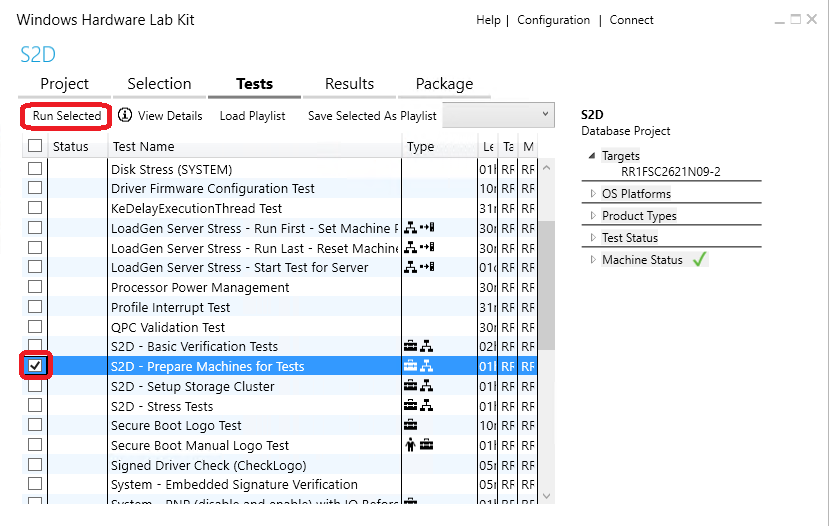
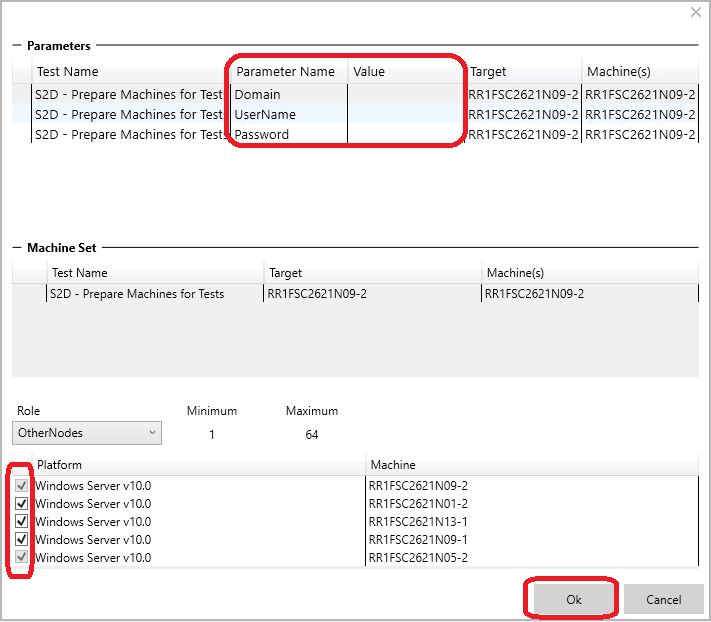
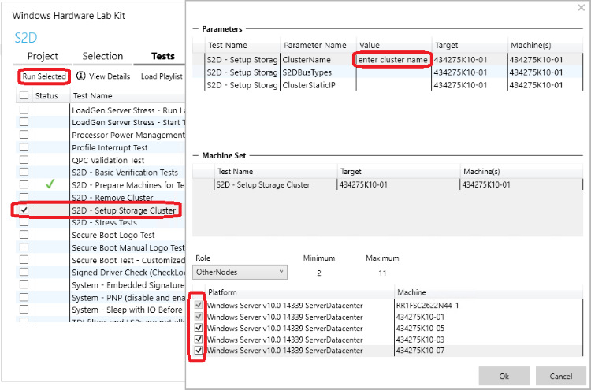
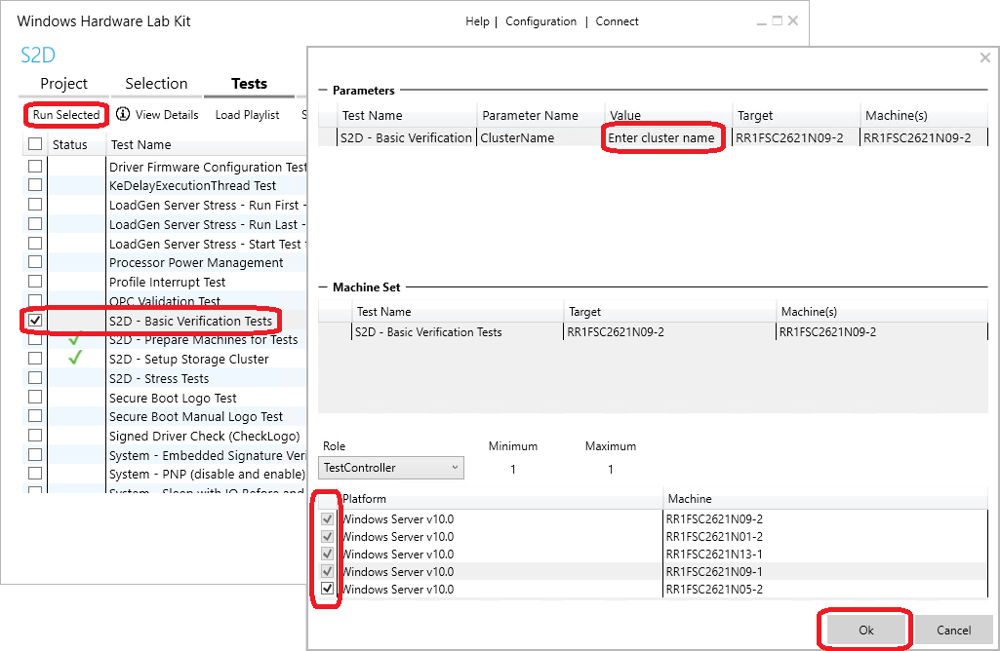
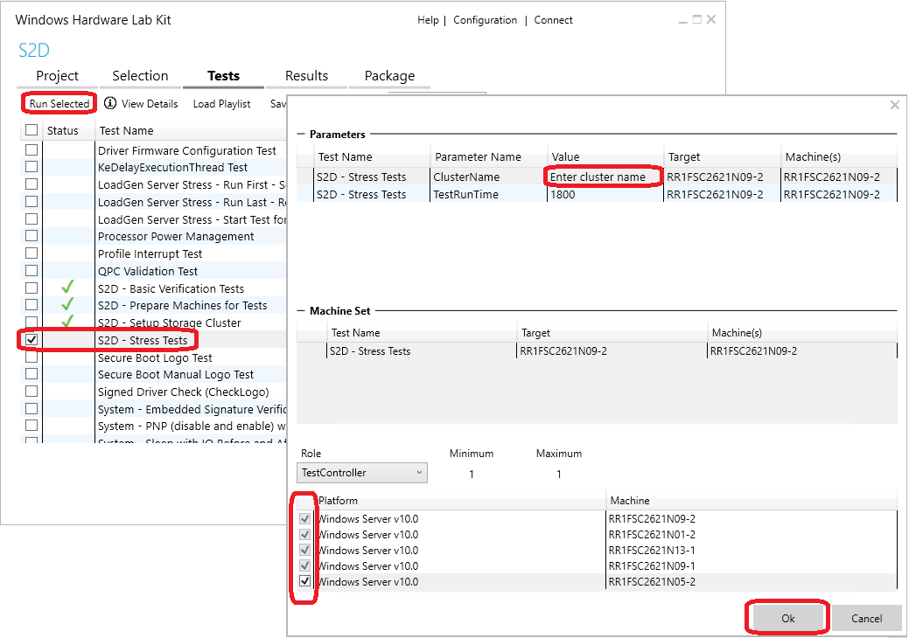
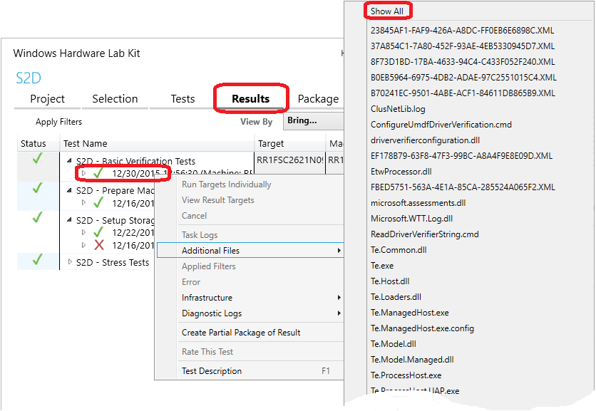
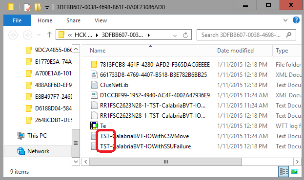
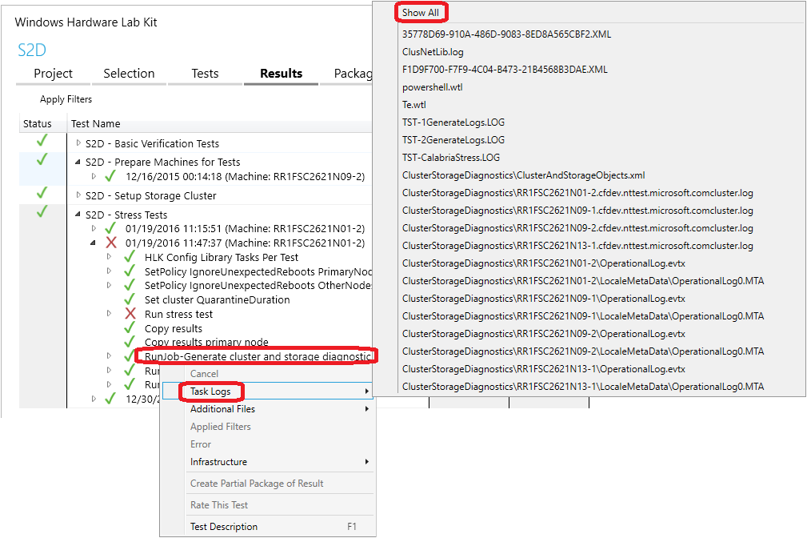
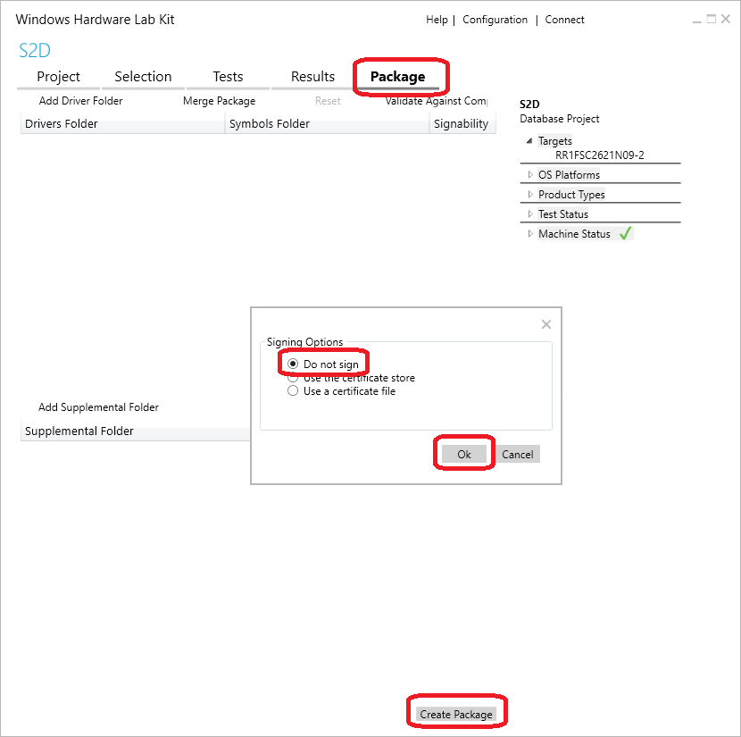

# Run cluster tests for Storage Spaces Direct (S2D) in the Windows HLK

## Abstract

This document contains instructions for partners and original equipment manufacturers (OEMs) about how to use tests included in the Windows Hardware Lab Kit (HLK, formerly HCK) to validate specific hardware configurations for basic functionality and reliability for [Storage Spaces Direct (S2D)](https://technet.microsoft.com/library/mt126109.aspx).

>[!IMPORTANT]
>  Instructions in this document are for testing purposes only. They are *not* intended for end users or to configure systems for production use.

 

## Prerequisites

1.  **Hardware configuration must meet S2D requirements, and it must have first passed all cluster validation tests, including new tests added for S2D.**
2.  You must download, install, and configure the latest Windows HLK that supports the most recent Windows Server Technical Preview. Familiarity with the Windows HLK is recommended. To download and learn more about the Windows HLK, see [Windows Hardware Lab Kit](https://msdn.microsoft.com/library/windows/hardware/dn930814.aspx).
    1.  First, install the HLK Controller (HLKC) and HLK Studio on a test server. Do not install it on a cluster node. The administrator will use this server to run tests and manage other machines. The HLKC can be used to manage multiple clusters concurrently, so an existing HLKC that has already been configured with another cluster can be used.
    2.  Next, install HLK clients on:
        -   All servers that are intended to be used as storage cluster nodes (the number of nodes, also described in separate S2D requirements, should be at least four), and
        -   A server that is not part of the cluster as the test controller (TC). This is where the tests will be run.
3.  All machines used for testing (including the HLK controller) should be joined to the same domain, and have a common domain user who has administrator privileges on all of the machines. Credentials for this user will be supplied to the test framework to run tests under. The user's password may be transmitted and stored as clear text.
4.  All cluster nodes must have DHCP enabled on all connected network interfaces, with DHCP configured on the networks they are connected to.

## Setup

### Configure the HLK

For detailed instructions about how to install the HLK, see the [HLK user’s guide](https://msdn.microsoft.com/en-us/library/windows/hardware/dn930814.aspx) for detailed instructions. After you have installed and configured the HLK on all of your machines, create a machine pool and project:

1.  In HLK Studio on the HLKC, create a new machine pool with a name that can easily identify the cluster later, such as the cluster name you will be using (this document uses "Cluster"). Add the TC and all of the cluster nodes to the machine pool. Make sure that the machines are in the **Ready** status.
    1.  Open **HLK Studio**, select **Start**, and then **All Apps** &gt; **Windows Kits** &gt; **HLK Studio**.
    2.  Select **Configuration** in the upper-right corner.
        1.  Right-click **$(Root)**, and then select **Create Machine Pool**, and specify a name. (This document uses "Cluster.")
        2.  Move your machines to the new pool. HLK Studio currently does not support multiple-selections, so you must move the machines one at a time.
        3.  Select all of the machines in the pool, and then right-click, and select **Change Machine Status** &gt; **Ready**. The machines will first change to the **Initializing** state.
        4.  Ensure that the machines reach the **Ready** state. HLK Studio does not refresh the displayed state automatically. Wait a few seconds, and then select the **Default** machine pool. Return to the cluster machine pool to refresh the machine status. After all of the machines are in the **Ready** state, continue to create a project.
2.  Create a new project with the same name.
    1.  If you are in the **Configuration** view, click **Back** (it looks like a left arrow) to the left of the title "Configuration" to return to the main view.
    2.  In the **Project** tab, select **Create project**.
    3.  Specify "S2D" as the project name. Using this exact name is not required, but doing so makes it easier to identify the project.

### Prepare the machines to run tests

This step deploys the required test binaries and drivers to the cluster nodes and test controller so that you can run S2D tests. This test job needs to be run only once per cluster, even if you run actual S2D tests multiple times. This job will restart the machines.

>[!IMPORTANT]
>  Before running this test job, ensure that both secure boot and BitLocker are disabled on all machines used for testing. If you are using a virtual machine for the test controller, you may need to manually disable secure boot and BitLocker, as they may be enabled by default.

 

Do the following in **HLK Studio**:

1.  In the **Project** tab, double-click on the project you previously created (if it’s not selected already). The project name will be displayed as the view title after you select it.
2.  Click the **Selection** tab.
    1.  Select the machine pool you previously created that contains the cluster and test controller.
    2.  Select **Systems** on the left, and then check the first cluster node that appears in the list.

        **Make sure that only one node is selected and that you do not accidentally select the test controller.**

    3.  Right-click on the selected machine, and then select **Add/Modify Features**.

        

    4.  In the dialog box that opens, select the **System.Solutions.StorageSpacesDirect** feature from the **Device Feature List**, and then select **OK.**

3.  In the **Tests** tab, select the test **S2D – Prepare Machines for Tests**, and then select **Run Selected**.
4.  Specify the required parameters.
    1.  For the parameters **Domain**, **UserName**, and **Password**, enter the appropriate information for a domain user who has administrator access to all of the machines in the machine pool.
    2.  In the **Role** drop-down list, **PrimaryNode** should be selected. In the list of machines, confirm that the node you selected in the **Selections** tab is checked. In addition:
        1.  Select **TestController** in the **Role** drop-down list, and then select the test controller from the list of machines.
        2.  Select **OtherNodes** in the **Role** drop-down list, and then select the remaining nodes in the cluster.
        3.  **Make sure all of the machines are selected before you continue**.
5.  Select **OK** to run the job. This prepares the machines.

    

6.  A progress bar will appear at the bottom of the HLK Studio window. When the process finishes, a green check mark will appear in the **Status** column for the test job. If the status displays a red "X" instead, then the test job failed. See [Troubleshooting](#troubleshooting) for more information.

This process takes about 10 minutes to run. It can take longer if your machines take more than five minutes to restart.

### Create a cluster, storage pool, and virtual disk

After you prepare machines for tests, S2D also needs to be configured before you can run related tests. The following job will create cluster, enable S2D, and configure a pool and space.

>[!IMPORTANT]
>  This job will succeed only if *no* existing cluster, storage pool, or virtual disk has already been created. Before you run this job, first remove all virtual disks, storage pools, and cluster roles. Also remove the cluster itself. If you have already created a cluster, enabled S2D, and configured and validated the pool and spaces, skip this step and proceed to running the tests.

 

1.  In the **Tests** tab in HLK Studio, select test **S2D - Setup Storage Cluster** and **Run Selected**, and then specify the required parameters and roles.
    1.  For the parameter **ClusterName**, enter the name of the cluster you want to create as its value. (You will need to provide the same cluster name for later tests.)
    2.  You can also enter an IP address in the **ClusterStaticIP** field if a static IP address is assigned to your cluster. Otherwise, leave this parameter blank. The address will be assigned to the cluster name.
    3.  Leave other parameters blank unless you are instructed otherwise.
    4.  In the **Role** drop-down list, **PrimaryNode** should be selected. In the list of machines, confirm that the node you selected in the **Selections** tab is checked. In addition:
        1.  Select **TestController** in the **Role** drop-down list, and then select the test controller from the list of machines.
        2.  Select **OtherNodes** in the **Role** drop-down list, and then select the other nodes in the cluster in the list of machines.
        3.  **Make sure all of the machines are selected before you continue.**
2.  Select **OK** to run the job. This creates a cluster and sets up S2D.

    

3.  A progress bar will appear at the bottom of the HLK Studio window. When the process finishes, a green check mark will appear in the **Status** column for the test job. If the status displays a red "X" instead, then the test job failed. See [Troubleshooting](#troubleshooting) for more information.

This job takes approximately 15 minutes to complete. It can take longer if your machines take more than five minutes to restart, or if you have a large number of disks.

## Run tests

### Running basic verification tests (BVT)

The BVT performs two types of tests:

-   One test type moves the cluster shared volumes (CSVs) on top of Storage Spaces Direct between nodes while it performs random write I/O. It also verifies that I/O is uninterrupted and that the CSVs do not fail.
-   The other test type brings down a node by stopping cluster service, killing cluster service, evicting node, restarting machines gracefully, and restarting machines ungracefully. (Each action targets a random node.) It also performs random write I/O that targets the appropriate CSV during node failures and verifies that I/O does not fail.

To run these tests in the HLK:

1.  In the **Tests** tab, select the test **S2D - Basic Verification Tests** and **Run Selected**, and then enter the required parameters:
    1.  For the parameter **ClusterName**, enter the name of your cluster. It should be the same name that you provided earlier to set up the cluster.
    2.  Do not change or fill in other parameters unless you are instructed otherwise.
    3.  In the **Role** drop-down list, **PrimaryNode** should be selected. In the list of machines below it, confirm that the node you selected in the **Selections** tab is checked. In addition:
        1.  Select **TestController** in the **Role** drop-down list, and then select the test controller from the list of machines.
        2.  Select **OtherNodes** in the **Role** drop-down list, and then select the remaining nodes in the cluster.
        3.  **Make sure all of the machines are selected before you continue.**
2.  Select **OK** to start the job. This runs the BVTs.

    

3.  A progress bar will appear at the bottom of the HLK Studio window. When the process finishes, a green check mark will appear in the **Status** column for the test job. If the status displays a red "X" instead, then the test job failed. See [Troubleshooting](#troubleshooting) for more information.

This job typically takes 30 to 60 minutes to run. For preview releases, the expected pass rate for the BVTs is at least 80 percent.

### Running stress tests

Stress tests cause repeated and random node failures (by stopping or killing cluster service). They can potentially cause multiple nodes to fail if that is tolerated by the configuration. During node failures, the test performs multiple I/O streams from multiple nodes that target the appropriate CSV. (Each stream performs sequential/random read/write with read data verification.)

To run these tests:

1.  In the **Tests** tab in **HLK Studio**, select the test **S2D - Stress Tests** and **Run Selected**, and then enter the required parameters:
    1.  For the parameter **ClusterName**, enter the name of your cluster. It should be the same name that you provided earlier to set up the cluster.
    2.  Do not change or fill in other parameters unless you are instructed otherwise.
    3.  In the **Role** drop-down list, **PrimaryNode** should be selected. In the list of machines below it, confirm that the node that you selected in the **Selections** tab is checked. In addition:
        1.  Select **TestController** in the **Role** drop-down list, and then select the test controller from the list of machines.
        2.  Select **OtherNodes** in the **Role** drop-down list, and then select the remaining nodes in the cluster.
        3.  **Make sure all of the machines are selected before you continue.**
2.  Select **OK** to run the job. This runs the stress tests.

    

3.  A progress bar will appear at the bottom of the HLK Studio window. When the process finishes, a green check mark will appear in the **Status** column for the test job. If the status displays a red "X" instead, then the test job failed. See [Troubleshooting](#troubleshooting) for more information.

For preview releases, the expected pass rate for the stress tests is at least 60 percent. This test job typically takes 45 minutes to an hour to run with default parameters. However, after it passes once with default parameters, we recommend that you run it again with a longer run time by providing a larger value for **TestRunTime**. (This specifies the core run time in seconds; the job typically runs 15 to 30 minutes longer than this due to test setup and cleanup.) This job supports a run time of up to 24 hours.

## Troubleshooting

If a job or test fails, you can check the appropriate logs to discover why it failed. If you need to, you can forward the logs to the appropriate people to help with the investigation. These documents reference each run of a job as a **result**.

### Get test logs

1.  Select the **Results** tab in **HLK Studio** while you are in the same S2D project where the tests ran.
2.  Expand the test that you are troubleshooting by selecting the triangle to the left of the test name.
3.  If you have run the test multiple times, multiple results will appear. Each result will display a timestamp and identify the machine where it was run. Right-click on the result you are troubleshooting, and then select **Additional Files** &gt; **Show All**. This will open a window in File Explorer that contains the test logs and related logs.
4.  The file names of test logs start with “TST-.” If multiple test tasks have been run in the test job, there may be multiple test log files. For instance, the BVT may have one test task that performs move CSV and another that performs storage scale unit (SSU) failures. (Due to direct-attached storage topology, each node and its storage is considered one SSU.) The variation name is in the file name (along with Calabria, a code name for Storage Spaces Direct).

    

5.  If there are multiple test log files, to quickly see which task had failed, first expand the result so that its tasks appear. You can then look for tasks that display a red "X."

In the preceding example, the icons for the tasks indicate that **Verify IO with CSV move** failed (it shows a red "X" only). They also indicate that **Verify IO with SSU Failure** was not run and was instead skipped (it shows a red X over curved arrows) due to the previous failure.

After you open a test log file in a text editor, search for "SEV2" to see if the test failed, and if so, why. In the following example, you can see that the space is not in a healthy state after a rack recovery. For additional details on this failure, see [Common known issues](#common-known-issues).

1940.1404 2015/01/09-16:36:14.867 \[INFO\] 0 : \[TST\]Space ID: 19CFCDFCC19EB54AAA780436B2B1D859 Pool ID: 5D12DF6A5D4DB444AA3407AFA5749578 Friendly Name: TestSpace Is Manual Attach? Yes Is Clustered? Yes Resiliency Type: 2 Provisioning Type: 2 Number of copies: 3 Number of columns: 1 Fault tolerance: 2 Health: 1 (Warning) State: 11 (InService/Regenerating) Attached on node: RR1FSC2623N05-1 Visible on nodes: RR1FSC2623N05-1 RR1FSC2623N05-2 RR1FSC2623N28-1 RR1FSC2623N28-2 Drives used by this space: \[base\\cluster\\testsrc\\common\\storagewrapper\\swvirtualdisk.cpp@66: ctsw::SWVirtualDisk::QuerySpInfo()\] \[orchestrator.cpp@192\]

Error: 1940.1404 2015/01/09-16:36:14.867 \[ **SEV2**\] 0 : \[TST\]Status=-2147418113(8000FFFFH) 'CalabriaBVT::VerifyIOWithRackFailure' - Unexpected behavior: Space is not in healthy state after rack recovery. \[base\\cluster\\testsrc\\calabria\\calabriabvt\\calabriabvt.cpp@1359 CalabriaBVT::VerifyIOWithRackFailure()\] \[calabriabvt.cpp@1379\]

1940.1404 2015/01/09-16:36:14.867 \[INFO\] 0 : \[TST\] Message for error 2147549183 (0x8000ffff): Catastrophic failure \[wttlog.cpp@1237\]

Error: TAEF: 'TerminateOnFirstFailure' set - ignoring all following tests and attempting to terminate gracefully.

EndGroup: CalabriaBVT::VerifyIOWithRackFailure \[Failed\]

Error: 1940.1404 2015/01/09-16:36:14.867 \[**SEV2**\] 0 : \[TST\]Status=-2147418113(8000FFFFH) ‘CalabriaBVT::VerifyIOWithRackFailure’ – Unexpected behavior: **Space is not in healthy state after rack recovery**. \[base\\cluster\\testsrc\\calabria\\calabriabvt\\calabriabvt.cpp@1359 CalabriaBVT::VerifyIOWithRackFailure()\] \[calabriabvt.cpp@1379\]

**Sample output from stress tests for this issue:**

1148.035C 2015/01/12-14:41:10.489 \[INFO\] 0 : \[TST\]**Waiting for all spaces to become healthy. Space 19CFCDFCC19EB54AAA780436B2B1D859 state is InService/Regenerating** \[calabriastress.cpp@938\]

Error: 1148.035C 2015/01/12-14:41:10.489 \[**SEV2**\] 0 : \[TST\]Status=258(102H) Fail validation: **Not all spaces reached healthy state within timeout** of 1200000 ms. May continue waiting until wait timeout. \[calabriastress.cpp@962\]

1148.035C 2015/01/12-14:41:10.505 \[INFO\] 0 : \[TST\] Message for error 258 (0x102): The wait operation timed out. \[wttlog.cpp@1237\]

### Get cluster and storage diagnostic logs

To get the cluster and storage diagnostic logs for a failed result:

1.  Expand the failed result so its test tasks are showing.
2.  Right-click on the task **RunJob-Generate cluster and storage diagnostic logs**, and then select **Task Logs** &gt; **Show All**. This opens a window in File Explorer that contains the cluster and storage diagnostic logs. These logs can provide additional details on why the test failed.

    

### Send logs to Microsoft for test failure analysis

If you need to send logs to Microsoft for help in test failure analysis, please see the [Package the results](#package-the-results) section for steps to create the .HLKX result package. This package will contain relevant logs generated and gathered by tests, and will help in analysis of failures.

### Common known issues

The most common cause of test failures is due to one or more spaces taking too long to regenerate data (in a state of service/regeneration for too long) after a node or nodes were brought down and recovered. Uneven storage performance can cause regeneration to exceed timeout and cause tests to fail. If you see this issue frequently, your configuration may have performance bottlenecks. If this is the case, we recommend that you check your storage, network performance, and remote direct memory access (RDMA).

**Sample output from BVT for this issue:**

1940.1404 2015/01/09-16:36:14.867 \[INFO\] 0 : \[TST\]Space ID: 19CFCDFCC19EB54AAA780436B2B1D859 Pool ID: 5D12DF6A5D4DB444AA3407AFA5749578 Friendly Name: TestSpace Is Manual Attach? Yes Is Clustered? Yes Resiliency Type: 2 Provisioning Type: 2 Number of copies: 3 Number of columns: 1 Fault tolerance: 2 Health: 1 (Warning) State: 11 (**InService/Regenerating**) Attached on node: RR1FSC2623N05-1 Visible on nodes: RR1FSC2623N05-1 RR1FSC2623N05-2 RR1FSC2623N28-1 RR1FSC2623N28-2 Drives used by this space: \[base\\cluster\\testsrc\\common\\storagewrapper\\swvirtualdisk.cpp@66: ctsw::SWVirtualDisk::QuerySpInfo()\] \[orchestrator.cpp@192\]

Error: 1940.1404 2015/01/09-16:36:14.867 \[**SEV2**\] 0 : \[TST\]Status=-2147418113(8000FFFFH) ‘CalabriaBVT::VerifyIOWithRackFailure’ – Unexpected behavior: **Space is not in healthy state after rack recovery**. \[base\\cluster\\testsrc\\calabria\\calabriabvt\\calabriabvt.cpp@1359 CalabriaBVT::VerifyIOWithRackFailure()\] \[calabriabvt.cpp@1379\]

**Sample output from stress tests for this issue:**

1148.035C 2015/01/12-14:41:10.489 \[INFO\] 0 : \[TST\]**Waiting for all spaces to become healthy. Space 19CFCDFCC19EB54AAA780436B2B1D859 state is InService/Regenerating** \[calabriastress.cpp@938\]

Error: 1148.035C 2015/01/12-14:41:10.489 \[**SEV2**\] 0 : \[TST\]Status=258(102H) Fail validation: **Not all spaces reached healthy state within timeout** of 1200000 ms. May continue waiting until wait timeout. \[calabriastress.cpp@962\]

1148.035C 2015/01/12-14:41:10.505 \[INFO\] 0 : \[TST\] Message for error 258 (0x102): The wait operation timed out. \[wttlog.cpp@1237\]

## Package the results

After all of the tests have completed successfully, and while you are still in the same project in **HLK Studio**, select the **Package** tab, and then **Create Package** in the lower-right corner. When you are prompted for **Signing Options**, select **Do not sign**. Save the results to a file. This file needs to be included in any S2D certification submission.

## Terms

<table>
<colgroup>
<col width="50%" />
<col width="50%" />
</colgroup>
<thead>
<tr class="header">
<th>Term</th>
<th>Description</th>
</tr>
</thead>
<tbody>
<tr class="odd">
<td>
BVT
</td>
<td>
Basic verification tests.
</td>
</tr>
<tr class="even">
<td>
CSV
</td>
<td>
Cluster shared volumes.
</td>
</tr>
<tr class="odd">
<td>
DAS
</td>
<td>
Direct-attached storage.
</td>
</tr>
<tr class="even">
<td>
HCK
</td>
<td>
(Windows) Hardware Certification Kit, the previous kit for certification testing.
</td>
</tr>
<tr class="odd">
<td>
HLK
</td>
<td>
(Windows) Hardware Lab Kit, a test framework used to help validate hardware configurations for Windows. It is also used to run the tests described in this topic.
</td>
</tr>
<tr class="even">
<td>
HLKC
</td>
<td>
HLK Controller, the server that the administrator uses to run tests and manage other machines. This must not be part of the cluster.
</td>
</tr>
<tr class="odd">
<td>
TC
</td>
<td>
Test controller, the server that some tests are run on to target the cluster. This must not be part of the cluster.
</td>
</tr>
<tr class="even">
<td>
S2D
</td>
<td>
Storage Spaces Direct.
</td>
</tr>
</tbody>
</table>

 

## Additional resources

[Windows Hardware Lab Kit](https://msdn.microsoft.com/library/windows/hardware/dn930814.aspx)

 

 

