# Running Network Switch Certification Tests


This topic describes how to successfully run the Network Switch Certification tests.

## <span id="Machine_requirements_for_certification_testing"></span><span id="machine_requirements_for_certification_testing"></span><span id="MACHINE_REQUIREMENTS_FOR_CERTIFICATION_TESTING"></span>Machine requirements for certification testing


### <span id="Test_topology"></span><span id="test_topology"></span><span id="TEST_TOPOLOGY"></span>Test topology

The diagram below describes the test topology that is used to perform the certification tests.

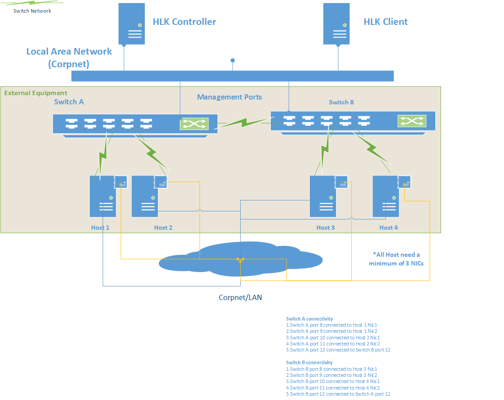

Listed below are the different roles of the machines that would be participating in the logo tests:

**HLK controller**: The HLK controller machine runs Windows Server 2012 R2 and coordinates certification testing.

**HCK client**: Also known as the SUT (system under test), this machine would run the latest version of the Windows Operating system and should be reachable on both switches on the management port.

The client is the main target of the tests and coordinates the end to end testing of the topology.

**Switch A/B (DELL 4810)**: The switch that needs to be certified. In the topology, there are two instances of the switch that are connected to each other on a specific port.

**Host machines**: There are a total of four hosts, two connected to each of the switches. These machines mandatorily require 2 NICs each. One NIC is connected to the switch under test and the other NIC is connected to the Local Area Network which forms the backbone for the certification tests so that the controller is able to communicate to the hosts irrespective of the private network.

Listed below are the connections needed for the switch network:

**Switch A connectivity:**

1.  Switch A port 1 connected to Host 1 Nic1
2.  Switch A port 2 connected to Host 1 Nic2
3.  Switch A port 3 connected to Host 2 Nic1
4.  Switch A port 4 connected to Host 2 Nic2
5.  Switch A port 5 connected to Switch B port 5

**Switch B connectivity:**

1.  Switch B port 1 connected to Host 3 Nic1
2.  Switch B port 2 connected to Host 3 Nic2
3.  Switch B port 3 connected to Host 4 Nic1
4.  Switch B port 4 connected to Host 4 Nic2
5.  Switch B port 5 connected to Switch A port 5

### <span id="Prerequisites"></span><span id="prerequisites"></span><span id="PREREQUISITES"></span>Prerequisites

The following prerequisite steps are needed before executing the certification tests:

The host machines that are connected to the network switch need to be configured first before the certification tests can execute on the topology. The following settings need to be configured on the host machines:

-   Disable firewall on all of the host machines. The certification tests are designed to validate the functionality of the network switch, and additional firewall settings would prevent certain tests from being executed.
-   Remote scripts are executed on the host machines, so you must set the appropriate PowerShell script execution policy on the hosts:

    ``` syntax
    Set-ExecutionPolicy -ExecutionPolicy Unrestricted
    ```

-   Validate that the connectivity of the hosts to the switches are made and all of the MAC addresses of the hosts appear on both the network switches as per the connectivity requirement above.
-   Ensure that your switch supports the following MIBs:
    -   BRIDGE-MIB
    -   dot1dBasePortTable
    -   dot1dTpFdbTable
    -   IF-MIB
    -   ifTable
-   Install the certificates on the network switch on the HLK client as described in the diagram above to ensure that a https session can be created with the network switch.
-   Ensure that all the hosts that are connected on the downlink of the network switch have the same administrative credentials setup.
-   Ensure that the same credentials are set up on both of the network switches.
-   Copy the Desired State Configuration Registration and the schema file from the network switch DSC package to the following locations in the HLK client machine:
    -   Schema files: C:\\Program Files\\WindowsPowerShell\\Configuration\\Schema
    -   Registration files: C:\\Program Files\\WindowsPowerShell\\Configuration\\Registration

### <span id="Execution"></span><span id="execution"></span><span id="EXECUTION"></span>Execution

-   Create a machine pool and move the HLK client machine to the machine pool.
-   Set the HLK client to the **Ready** state.

    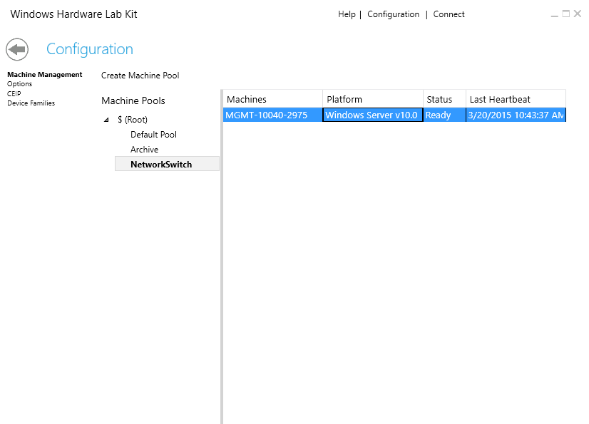

-   Create a new certification testing project from the UI

    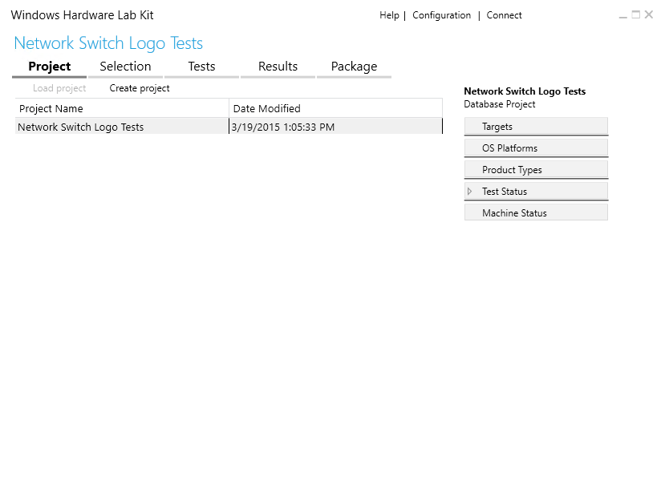

-   Select the HLK client under the **System** section from HLK UI

    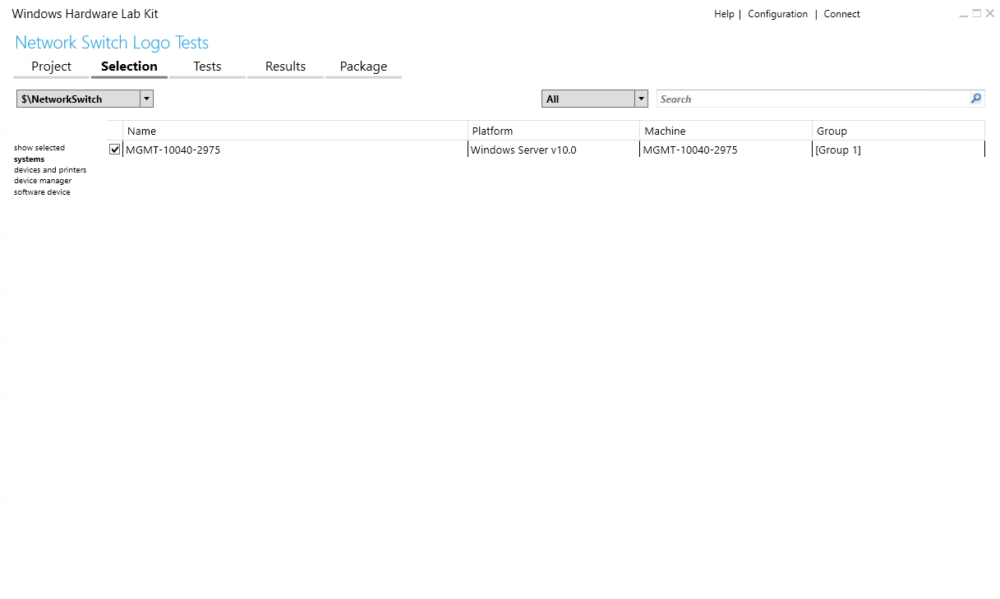

-   Click on the **Tests** tab and select **Run Network Device Discovery Tests**

    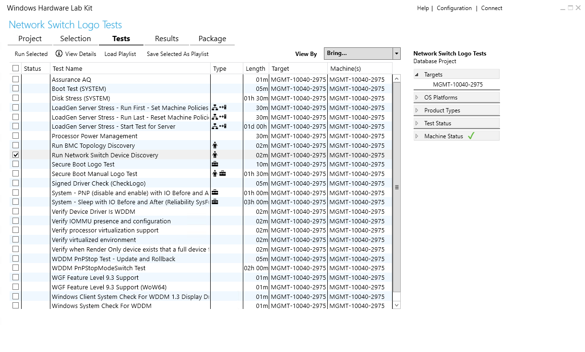

-   Right click to execute the tests on the HLK client

    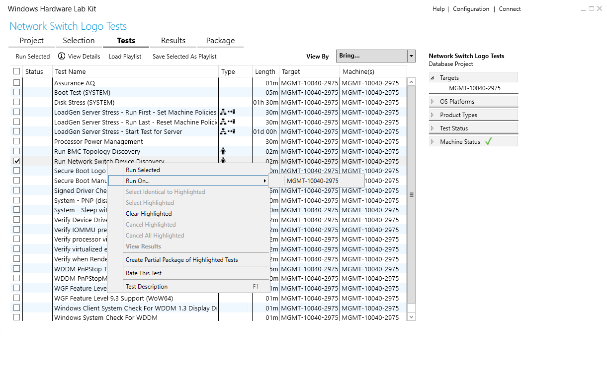

-   Provide the mandatory parameter values to run the tests. The parameters are listed below:

    -   SwitchManagementIPAddresses: The management IP addresses of the network switches that are part of the topology. This parameter is a comma separated list of IP addresses.
    -   HostNames: The host names that are connected to the downlink port of the network switch in the topology. This parameter is a comma separated list of host names.
    -   HostUserName: The domain/workgroup user name for the host that is connected to the network switch. The user needs to have Administrative privileges on the host. The same user name needs to be configured on all the hosts.
    -   HostPassword: The password for the above mentioned host user name
    -   SwitchUserName: The management user of the network switch
    -   SwitchPassword: The password for the network switch specified above

    >[!NOTE]
    >  The same credentials need to be set across all the hosts connected on the downlink of the host. Similarly, same credentials need to be set on both the network switches as well.

     

    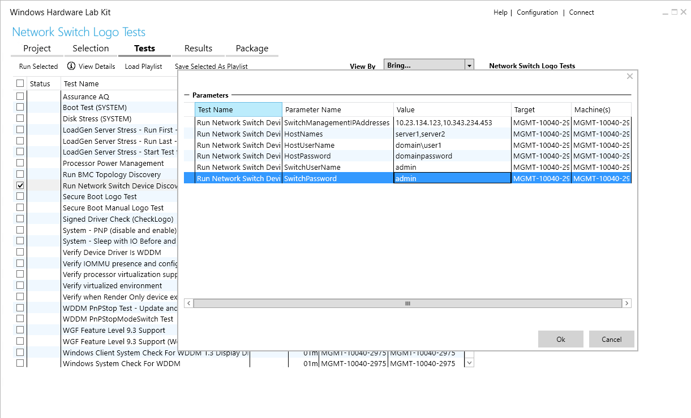

-   If there is a failure in the Discovery tests, you can look at the additional log files from the **Results** tab as indicated below:

    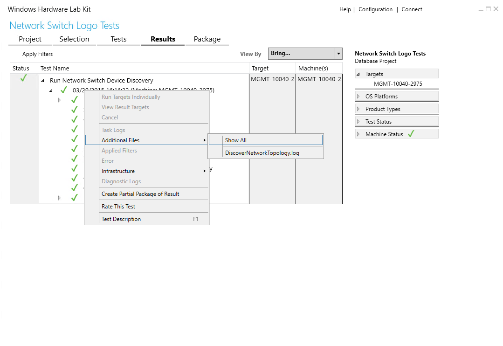

-   After the Discovery test passes, return to the **Selection** tab in the HLK
-   Deselect the previously-selected host from the **systems** section
-   Select the **device manager** section, and you should be able to see a new node: **Certification Target Network Topology**. Select this node.

    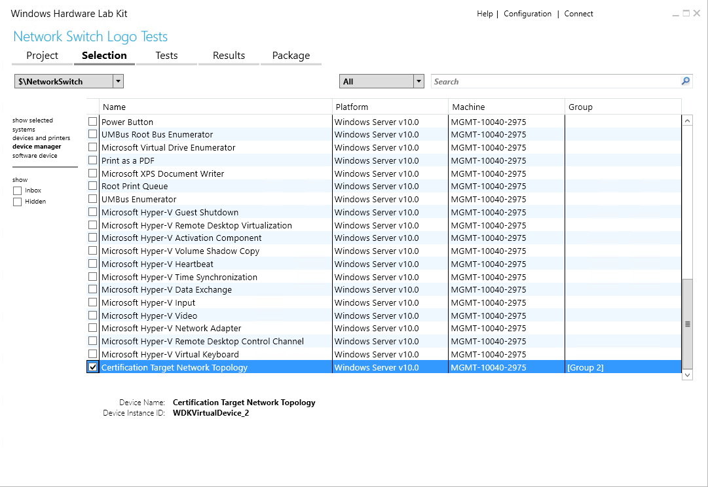

-   Select the **Tests** Tab in the HLK. You should see a list of applicable tests for network switches.

    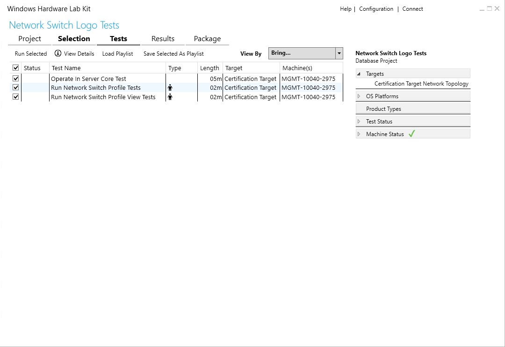

-   Select the tests one by one, provide the appropriate parameter values, and execute the tests

    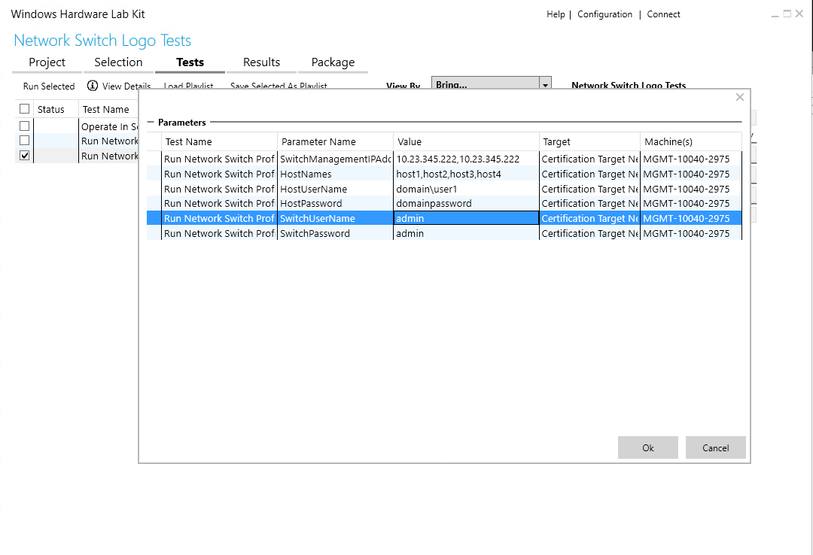

 

 


