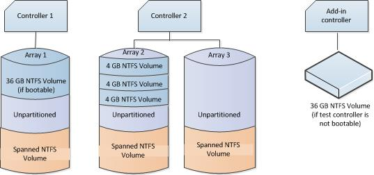
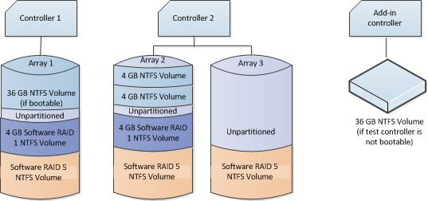

# SATA Controller Testing Prerequisites


This section describes the tasks that you must complete before you test a SATA controller by using the Windows Hardware Lab Kit (Windows HLK).

-   [Hardware Requirements](#bkmk-hardwarerequirements).

-   [Software Requirements](#bkmk-softwarerequirements).

-   [Test Computer Configuration](#bkmk-configure).

## <span id="BKMK_HardwareRequirements"></span><span id="bkmk-hardwarerequirements"></span><span id="BKMK_HARDWAREREQUIREMENTS"></span>Hardware Requirements


The following hardware is required to test an SATA controller. You might need additional hardware if the test device offers other features. To determine whether additional hardware requirements apply, see the test description for each test that appears for the device in Windows HLK Studio.

>[!NOTE]
>  
With the exception of the test computer and test controller, all hardware that is involved in the test must already have a logo.

 

-   One test computer. The test computer must meet the Windows HLK requirements. For more information, see [Windows HLK Prerequisites](..\getstarted\windows-hlk-prerequisites.md).

-   If the SATA controller supports RAID, the following requirements apply:

    -   Two identical SATA RAID controllers (the test devices), unless the test device is an integrated controller.

    -   One SATA hard disk drive for each channel that the test device supports. If two controllers are required, twice as many hard disk drives are required. Each hard disk drive must be at least 40 gigabytes (GB).

    -   One PCI-to-PCI bridge adapter, unless any of the following conditions apply:

        -   The RAID controllers cannot fit into PCI bridge adapters. This can occur if the controllers are integrated controllers or if the controllers can only fit into specially designed slots.

        -   The RAID controller is designed and sold only for systems that cannot accept full height PCI-to-PCI bridge adapters, such as blade servers.

        -   You can put one of the RAID controllers into a PCI bus slot that is already behind a PCI bridge.

    -   One optical drive.

    -   If the SATA controller does not support RAID, the following requirements apply:

        -   One SATA controller (the test device)

        -   Two SATA hard disk drives that are least 40 GB

    -   One bootable controller and hard disk drive that is at least 36 GB, if the test device does not support boot.

To certify your product for use on servers, the test computer must support four processors and a minimum of 1 GB of RAM. These system capabilities are required to test the Rebalance, D3 State, and Multiple Processor Group functionality of the device and driver. You do not need a computer that actually has more than 64 processors to test your device. Additionally, the server system(s) being used for device or driver testing must have Server Core installed prior to testing. For more information see [Windows Server Installation Options](http://go.microsoft.com/fwlink/p/?LinkID=251454).

If you use a pool of test computers to test devices, at least one computer in the pool must contain four processors and a minimum of 1 GB of RAM. Additionally, that computer must contain the device and the driver that you want to test. If the driver is the same on all the computers in the pool, the system creates a schedule to run against all test computers.

For tests that do not include a driver to test, such as hard disk drive tests, the Windows HLK scheduler constrains the tests that validate the device’s and driver’s rebalance, D3 state, and multiple processor groups functionality to run on the default test computer. You must manually configure this computer to have multiple processor groups. The default computer is the first test computer in the list. Test personnel must make sure that the first test computer in the list meets the minimum hardware requirements.

>[!NOTE]
>  
Except for para-virtualization drivers (as defined by the [WHCP Policies and Processes](http://go.microsoft.com/fwlink/p/?LinkID=615222) document), you cannot use any form of virtualization when you test physical devices and their associated drivers for server certification or signature. All virtualization products do not support the underlying functionality that is required to pass the tests that relate to multiple processor groups, device power management, device PCI functionality, and other tests.

>[!NOTE]
>  Multiple Processor Groups Setting
>You must set the value for the processor group size for Hardware Lab Kit testing of Windows Server 2008 R2 and later device drivers for certification. This is done by running bcdedit in an elevated command prompt window, using the /set option.
>
>The commands for adding the group settings and restarting are as follows:
>
``` syntax
bcdedit.exe /set groupsize 2
bcdedit.exe /set groupaware on
shutdown.exe -r -t 0 -f
```
>
>
>The commands for removing the group settings and rebooting are as follows:
>
``` syntax
bcdedit.exe /deletevalue groupsize
bcdedit.exe /deletevalue groupaware
shutdown.exe -r -t 0 -f
```
>

>[!NOTE]
>  
**Code Integrity Setting**

>The Virtualization Based Security feature (VBS) of Windows Server 2016 must be enabled using Server Manager first.
>
>Once that has occurred, the following Registry key must be created and set:
>
``` syntax
HKLM\System\CurrentControlSet\Control\DeviceGuard
HypervisorEnforcedCodeIntegrity:REG_DWORD
0 or 1 (disabled, enabled)
```

 

## <span id="BKMK_SoftwareRequirements"></span><span id="bkmk-softwarerequirements"></span><span id="BKMK_SOFTWAREREQUIREMENTS"></span>Software Requirements


The following software is required to test a SATA controller:

-   The drivers for the test device.

-   The latest Windows HLK filters or updates.

-   Windows symbol files. These are available from the [Symbol Files website](http://go.microsoft.com/fwlink/?LinkId=231439).

-   The current release of the Windows Driver Kit (WDK).

## <span id="BKMK_Configure"></span><span id="bkmk-configure"></span><span id="BKMK_CONFIGURE"></span>Test Computer Configuration


There are three possible configurations for testing SATA controllers:

-   If the test device is an add-in controller that supports RAID, use the [Add-in RAID controller test configuration](#bkmk-addin).

-   If the test device is an integrated controller that supports RAID, use the [Integrated RAID controller test configuration](#bkmk-integrated).

-   If the test device does not support RAID, use the [Non-RAID controller test configuration](#bkmk-nonraid).

Before you test a SATA controller in any of the three usage scenarios, make sure that the test computer is in the ready state. If a test requires parameters to be set before it is run, a dialog box appears for that test. Review the specific test topic for more information.

Some Windows HLK tests require user intervention. When you run tests for a submission, it is a best practice to run the automated tests in a block separately from manual tests. This prevents a manual test from interrupting completion of an automated test.

### <span id="BKMK-addin"></span><span id="bkmk-addin"></span><span id="BKMK_ADDIN"></span>Add-in RAID controller test configuration

To configure the test computer to test a SATA controller as-an add-in RAID controller, follow these steps:

1.  When the test computer is turned off, complete the following assembly steps:

    1.  Install a boot-capable controller (not the test device) and hard disk drive, if the test devices do not support boot.

    2.  Install one test controller (Controller 1).

    3.  Install a PCI-to-PCI bridge, unless any of the following conditions apply:

        -   The RAID controllers cannot fit into PCI bridge adapters. This may occur if the controllers are integrated controllers or if the controllers can only fit into specially designed slots.

        -   The RAID controller is designed and sold only for systems that cannot accept full height PCI-to-PCI bridge adapters, such as blade servers.

        -   You can put one of the RAID controllers into a PCI bus slot that is already behind a PCI bridge.

    4.  Install a second, duplicate test controller (Controller 2) in the PCI-to-PCI bridge card (or in the PCI bridge if the bridge card is not required).

    5.  Attach the disks to the test devices according to the following table:

        <table>
        <colgroup>
        <col width="33%" />
        <col width="33%" />
        <col width="33%" />
        </colgroup>
        <thead>
        <tr class="header">
        <th>Controller type</th>
        <th>Controller 1</th>
        <th>Controller 2</th>
        </tr>
        </thead>
        <tbody>
        <tr class="odd">
        <td><p>SATA RAID</p></td>
        <td><p>One SATA hard disk drive on each supported channel</p></td>
        <td><p>One SATA hard disk drive on each supported channel</p></td>
        </tr>
        </tbody>
        </table>

         

    6.  Attach an optical drive to the system, if one is not already attached.

2.  Turn on the test computer.

3.  Set the system BIOS to support the S3 state.

4.  Create one 60-GB RAID array on Controller 1 and two 60-GB RAID arrays on Controller 2. The RAID array on Controller 1 is RAID Array 1, and the RAID arrays on Controller 2 are RAID Array 2 and RAID Array 3.

5.  Configure the RAID arrays according to the following table:

    <table>
    <colgroup>
    <col width="25%" />
    <col width="25%" />
    <col width="25%" />
    <col width="25%" />
    </colgroup>
    <thead>
    <tr class="header">
    <th>RAID levels that the test device supports</th>
    <th>RAID level for RAID Array 1</th>
    <th>RAID level for RAID Array 2</th>
    <th>RAID level for RAID Array 3</th>
    </tr>
    </thead>
    <tbody>
    <tr class="odd">
    <td><p>0 only</p></td>
    <td><p>0</p></td>
    <td><p>0</p></td>
    <td><p>0</p></td>
    </tr>
    <tr class="even">
    <td><p>1 only</p></td>
    <td><p>1</p></td>
    <td><p>1</p></td>
    <td><p>1</p></td>
    </tr>
    <tr class="odd">
    <td><p>5 only</p></td>
    <td><p>5</p></td>
    <td><p>5</p></td>
    <td><p>5</p></td>
    </tr>
    <tr class="even">
    <td><p>0 and 1 only</p></td>
    <td><p>1</p></td>
    <td><p>9</p></td>
    <td><p>0</p></td>
    </tr>
    <tr class="odd">
    <td><p>0 and 5 only</p></td>
    <td><p>5</p></td>
    <td><p>9</p></td>
    <td><p>0</p></td>
    </tr>
    <tr class="even">
    <td><p>1 and 5 only</p></td>
    <td><p>5</p></td>
    <td><p>1</p></td>
    <td><p>1</p></td>
    </tr>
    <tr class="odd">
    <td><p>0, 1, and 10</p></td>
    <td><p>10</p></td>
    <td><p>1</p></td>
    <td><p>0</p></td>
    </tr>
    <tr class="even">
    <td><p>0, 1, and 5</p></td>
    <td><p>5</p></td>
    <td><p>1</p></td>
    <td><p>0</p></td>
    </tr>
    <tr class="odd">
    <td><p>0, 1, 10, and 5</p></td>
    <td><p>5</p></td>
    <td><p>10</p></td>
    <td><p>0</p></td>
    </tr>
    </tbody>
    </table>

     

6.  Install the appropriate Windows operating system on disk 1 using a newly created NTFS partition that has at least 36 GB of disk space, and then configure the computer for your test network. The test network is the network that contains the Windows HLK Studio and Windows HLK Controller. If the test controller is not bootable, install a separate hard disk drive on a bootable controller.

7.  If you have to install the manufacturer-supplied device driver on the test computer, do this now.

8.  Start Windows on the test computer.

9.  Create three 4-GB partitions on RAID Array 2.

10. If you are testing by using a client operating system, create a 4-GB NTFS spanned volume that uses unallocated space on RAID Array 1, RAID Array 2, and RAID Array 3, as the following diagram shows.

    

    If you are testing by using a server operating system, do the following:

    -   Create a software RAID 1 mirror from one of the NTFS partitions on RAID Array 2 to the unallocated space on RAID Array 1.

        Create a 4-GB NTFS software RAID 5 array that uses unallocated space on RAID Array 1, RAID Array 2, and RAID Array 3, as the following diagram shows.

        

11. To set the system page file and enable crashdump, follow these steps:

    1.  Click the **Start** button, right-click **My Computer**, and then click **Properties.**

    2.  Click the **General** tab, and then note the amount of RAM that the computer contains.

    3.  Click the **Advanced** tab (or click **Advanced system settings** in the left pane for Windows Vista, Windows 7, Windows 8, Windows Server 2008, Windows Server 2008 R2 or Windows Server® 2012), and then, in the **Performance** area, click **Settings**.

        >[!NOTE]
        >  
        If you are prompted to enter administrative credentials or allow the action, enter the credentials or allow the action.

         

    4.  Click the **Advanced** tab, and then, in the **Virtual Memory** area, click **Change**.

    5.  Select **Custom Size**, and then enter a number in the **Initial size (MB)** box that is larger than the size of RAM that you noted in step b.

    6.  In the **Maximum size (MB)** text box, enter a maximum size value that is larger than the initial size that you entered in the **Initial size (MB)** box. (The maximum size is typically 1.5 to 2 times the initial size.)

    7.  Click **Set**, and then click **OK** two times.

    8.  Click **OK**, and then restart the computer to update the page file size.

12. Verify that the storage array is accessible from the test computer.

13. Copy the Windows symbol files to %SystemDrive%\\Symbols.

14. Install the Windows HLK client application on the test computer.

15. Use Windows HLK Studio to create a computer pool, and then move the test computer to that pool.

### <span id="BKMK-integrated"></span><span id="bkmk-integrated"></span><span id="BKMK_INTEGRATED"></span>Integrated RAID controller test configuration

To configure the test computer to test a SATA controller in an integrated RAID configuration, follow these steps:

1.  When the test computer is turned off, complete the following assembly steps:

    1.  Install a boot-capable controller (not the test device) and hard disk drive, if the test devices do not support boot.

    2.  Attach the disks to the integrated test controller (Controller 1) according to the following table:

        <table>
        <colgroup>
        <col width="50%" />
        <col width="50%" />
        </colgroup>
        <thead>
        <tr class="header">
        <th>Controller type</th>
        <th>Controller 1</th>
        </tr>
        </thead>
        <tbody>
        <tr class="odd">
        <td><p>SATA RAID</p></td>
        <td><p>One SATA hard disk drive on each supported channel</p></td>
        </tr>
        </tbody>
        </table>

         

    3.  Attach an optical drive to the system, if one is not already attached.

2.  Turn on the test computer.

3.  Set the system BIOS to support the S3 state.

4.  Create two 60-GB RAID arrays on Controller 1.

    If the controller does not support a configuration that includes two arrays, use a non-RAID disk instead of Array 2 for these procedures.

    The RAID arrays on Controller 1 are RAID Array 1 and RAID Array 2.

5.  Configure the RAID arrays according to the following table.

    <table>
    <colgroup>
    <col width="33%" />
    <col width="33%" />
    <col width="33%" />
    </colgroup>
    <thead>
    <tr class="header">
    <th>RAID levels that the test device supports</th>
    <th>RAID level for RAID Array 1</th>
    <th>RAID level for RAID Array 2</th>
    </tr>
    </thead>
    <tbody>
    <tr class="odd">
    <td><p>0 only</p></td>
    <td><p>0</p></td>
    <td><p>0</p></td>
    </tr>
    <tr class="even">
    <td><p>1 only</p></td>
    <td><p>1</p></td>
    <td><p>1</p></td>
    </tr>
    <tr class="odd">
    <td><p>5 only</p></td>
    <td><p>5</p></td>
    <td><p>5 or Non-RAID disk</p></td>
    </tr>
    <tr class="even">
    <td><p>0 and 1 only</p></td>
    <td><p>1</p></td>
    <td><p>0</p></td>
    </tr>
    <tr class="odd">
    <td><p>0 and 5 only</p></td>
    <td><p>5</p></td>
    <td><p>0 or Non-RAID disk</p></td>
    </tr>
    <tr class="even">
    <td><p>1 and 5 only</p></td>
    <td><p>5</p></td>
    <td><p>1or Non-RAID disk</p></td>
    </tr>
    <tr class="odd">
    <td><p>0, 1, and 10</p></td>
    <td><p>10</p></td>
    <td><p>1 or Non-RAID disk</p></td>
    </tr>
    <tr class="even">
    <td><p>0, 1, and 5</p></td>
    <td><p>5</p></td>
    <td><p>0 or Non-RAID disk</p></td>
    </tr>
    <tr class="odd">
    <td><p>0, 1, 10, and 5</p></td>
    <td><p>5</p></td>
    <td><p>10 or Non-RAID disk</p></td>
    </tr>
    </tbody>
    </table>

     

6.  Install the appropriate Microsoft Windows operating system to a 36-GB NTFS volume on RAID Array 1, and then configure the computer for your test network. The test network is the network that contains the Windows HLK Studio and Windows HLK Controller. If the test controller is not bootable, install a separate hard disk drive on a bootable controller. If the test controller is not bootable, install Windows to a separate hard disk drive on a bootable controller.

7.  If it is necessary, install any drivers that a manufacturer supplies that the devices in the test system require.

8.  Start Windows on the test computer.

9.  To set the system page file and enable crashdump, do the following:

    1.  Click the **Start** button, right-click **My Computer**, and then click **Properties.**

    2.  Click the **General** tab, and then note the amount of RAM that the computer contains.

    3.  Click the **Advanced** tab (or click **Advanced system settings** in the left pane for Windows Vista, Windows 7, Windows 8, Windows Server 2008, Windows Server 2008 R2 or Windows Server® 2012), and then, in the **Performance** area, click **Settings**.

        >[!NOTE]
        >  
        If you are prompted to enter administrative credentials or allow the action, enter the credentials or allow the action.

         

    4.  Click the **Advanced** tab, and then, in the **Virtual Memory** area, click **Change**.

    5.  Select **Custom Size**, and then enter a number in the **Initial size (MB)** box that is larger than the size of RAM that you noted in step b.

    6.  In the **Maximum size (MB)** text box, enter a maximum size value that is larger than the initial size that you entered in the **Initial size (MB)** box. (The maximum size is typically 1.5 to 2 times the initial size.)

    7.  Click **Set**, and then click **OK** two times.

    8.  Click **OK**, and then restart the computer to update the page file size.

10. Verify that the storage array is accessible from the test computer.

11. Copy the Windows symbol files to %SystemDrive%\\Symbols.

12. Install the Windows HLK client application on the test computer.

13. Use Windows HLK Studio to create a computer pool, and then move the test computer to that pool.

### <span id="BKMK-nonraid"></span><span id="bkmk-nonraid"></span><span id="BKMK_NONRAID"></span>Non-RAID controller test configuration

To configure the test computer for testing of an SATA controller in a non-RAID configuration, follow these steps:

1.  When the test computer is turned off, complete the following assembly steps:

    1.  Install a boot-capable controller (not the test device) and hard disk drive if the test devices do not support boot.

    2.  Install the test device (Controller 1).

    3.  Attach the disks to the test devices according to the following table:

        <table>
        <colgroup>
        <col width="33%" />
        <col width="33%" />
        <col width="33%" />
        </colgroup>
        <thead>
        <tr class="header">
        <th>Controller type</th>
        <th>Controller 1</th>
        <th>Controller 2</th>
        </tr>
        </thead>
        <tbody>
        <tr class="odd">
        <td><p>SATA controllers</p></td>
        <td><p>2 SATA hard disk drives (Disk 1 and 2)</p>
        <p>Optical drive</p></td>
        <td><p>N/A</p></td>
        </tr>
        </tbody>
        </table>

         

    4.  Attach an optical drive to the system, if one is not already attached.

2.  Turn on the test computer.

3.  Set the system BIOS to support the S3 state.

4.  Turn on the test computer install the appropriate Windows operating system on disk 1 (using a newly created NTFS partition with at least 36 GB of disk space), and then configure the computer for your test network. The test network is the network that contains the Windows HLK Studio and Windows HLK Controller.

5.  If you have to install the manufacturer-supplied device driver on the test computer, do this now.

6.  Create three 4-GB partitions on Disk 2.

7.  Use the following procedure to set the system page file and enable crashdump:

    1.  Click the **Start** button, right-click **My Computer**, and then click **Properties.**

    2.  Click the **General** tab, and then note the amount of RAM that the computer contains.

    3.  Click the **Advanced** tab (or click **Advanced system settings** in the left pane for Windows Vista, Windows 7, Windows 8, Windows Server 2008, Windows Server 2008 R2 or Windows Server® 2012), and then, in the **Performance** area, click **Settings**.

        >[!NOTE]
        >  
        If you are prompted to enter administrative credentials or allow the action, enter the credentials or allow the action.

         

    4.  Click the **Advanced** tab, and then, in the **Virtual Memory** area, click **Change**.

    5.  Select **Custom Size**, and then enter a number in the **Initial size (MB)** box that is larger than the size of RAM that you noted in step b.

    6.  In the **Maximum size (MB)** text box, enter a maximum size value that is larger than the initial size that you entered in the **Initial size (MB)** box. (The maximum size is typically 1.5 to 2 times the initial size.)

    7.  Click **Set**, and then click **OK** two times.

    8.  Click **OK**, and then restart the computer to update the page file size.

8.  Verify that the storage array is accessible from the test computer.

9.  Copy the Windows symbol files to **%SystemDrive%\\Symbols**.

10. Install the Windows HLK client application on the test computer.

11. Use Windows HLK Studio to create a computer pool, and then move the test computer to that pool.

>[!WARNING]
>  
When testing storage devices, we strongly recommend that you complete all Device Fundamentals tests before starting storage tests. Storage tests will reconfigure your test device, leaving the device in a state that is unsuitable to support Device Fundamentals tests. The following configurations provide steps to create volume on the storage test device. This is important to complete the Device Fundamental part of testing (DevFund).

 

 

 


