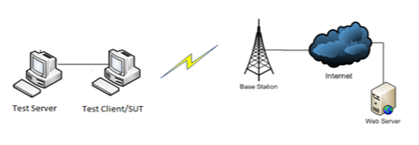

# System Client Testing Prerequisites

This section describes the tasks that you must complete before you test a client system by using the Windows Hardware Lab Kit (Windows HLK):

-   [Hardware requirements](#bkmk-hck-client-hr)

-   [Software requirements](#bkmk-hck-client-sr)

-   [Bluetooth System Requirements](#bkmk-hck-client-br)

-   [Test computer configuration](#bkmk-hck-client-tc)

## Hardware requirements

To certify your client systems for Windows 8 and Windows 8.1, you’ll need the following hardware in addition to the system that you’re testing:

-   Another computer. Ideally, the second computer is already certified.

    >[!NOTE]
    >  
    If you’re testing a computer with Bluetooth, the second computer must also have Bluetooth 4.0 or have a Bluetooth adapter installed.

     

-   An audio device (if the test system supports audio).

-   An audio loopback cable (if the test system supports audio).

-   An external speaker.

-   A network adapter.

-   Two USB flash drives.

-   One data CD.

-   One USB 3.0 hub for every exposed port.

-   Audio Precision Machine – Model System Two and connector cables.

-   A Bluetooth audio device (if the system supports Bluetooth).

-   A monitor with audio output (if the system has an external HDMI or DisplayPort port).

-   A Wi-Fi Access point (if the system supports Wi-Fi).

-   An Athena T0 test card.

-   Polycom CX100.

-   An audio microphone or another active source for audio capture.

-   A SIM with data provisioned (if the system supports mobile broadband).

-   A GPS signal (If the system has GPS).

-   A Windows To Go drive.

    You must pre-configure the Windows To Go drive with a valid Windows image (WIM) file to test the computer. It must include any drivers that are needed to use the system’s hardware.

-   A mirror large enough to reflect a screen image back into the camera (if the system has a webcam).

-   USB SuperMutt.

-   A USB 3.0 device, such as a USB 3.0 storage device.

-   Debug cables that match the transport that supports debugging on the system being tested.

-   If you are testing a webcam, you will also need:

    -   A video test chart:

        -   An x-Rite ColorChecker chart.

        -   A National Institute of Standards and Technology (NIST) calibrated lux meter (for example, INS DX-100). You should calibrate the lux meter annually.

        -   A printout of the test chart on matte paper from a high quality inkjet (for example, an HP Z2100). You can get this high resolution PDF test chart [here](http://download.microsoft.com/download/8/0/0/80080840-64DC-4929-9B67-16B83E946C6B/HLK Video Test Chart.pdf).

    -   Dimmable lights:

        -   Two Impact light stands.

        -   Two light mounts that have reflectors. For example, an Impact 5" reflector floodlight kit.

        -   An INSTEON plug-in lamp dimmer module.

        -   An INSTEON wireless keypad RemoteLinc 2 (optional).

        -   A 3-to-1 extension cord.

        -   Two Philips 422154 12.5-Watt A19 LED dimmable light bulbs.

-   The device that you are testing must have an IPv6 address.

## Software requirements

Preinstall any software as by your hardware manufacture, including any special device drivers.

## Bluetooth System Requirements

When certifying a System with an integrated Bluetooth radio through the Windows HLK, all drivers and packages, including filter drivers, profile packs, and 3rd party drivers must be installed on the Primary machine if the system ships with these drivers.

The system must be tested in the shipping Windows configuration, and no changes to Bluetooth settings should be made unless the system ships with these settings.

The Bluetooth radio included with the system must have been previously certified through the Windows HLK. For more information, see [Bluetooth Controller Testing Prerequisites](bluetooth-controller-testing-prerequisites.md).

## Test computer configuration

Before running system tests, you must configure the test system and install the operating system. This section summarizes the related procedures.

>[!IMPORTANT]
>  
Before you begin testing, make sure that you enable all of the devices in the test system and load all of the related drivers.

 

**To assemble the test computer**

1.  On the test system, install a network adapter.

2.  Connect the test system to a network hub.

3.  Connect the additional system to the network hub.

4.  Set the test system BIOS to support the S3 sleep state.

5.  On the test system, install the appropriate Microsoft Windows operating system.

6.  During this installation of the operating system, delete any existing partitions, and create a boot partition. Note, for Business Logo see note at bottom of page.

7.  During installation of the operating system, you must also add the test system to a domain or workgroup.

8.  Install any manufacturer-supplied drivers that devices in the test system require.

9.  On the test system, install the HLK client software from the test server.

10. On the additional system, install the appropriate Windows operating system.

11. During installation of the operating system, add the additional system to the same domain or workgroup that the test system belongs to.

12. Install one serial loopback connector on the serial port of the test system.

**To configure the test computer**

1.  On each test computer, from the Control Panel, under Power Options, set the following options:

    -   Turn off monitor set to Never.

    -   System standby set to Never.

    -   If there is a System hibernates set to Never.

    -   In the Power Options Properties dialog box, click the Hibernate tab, and clear the Enable hibernation check box.

2.  Repeat step 1 on the additional system.

3.  Insert a valid data CD into the CD or DVD drive of the test system.

Once your test computers are configured, you are ready to begin testing. Refer to [Step 4: Create a project](..\getstarted\step-4-create-a-project.md).

## Mobile Broadband Testing Requirements

The following figure provides an overview of the Mobile broadband LAN test setup.

Make sure that the test computer is in the ready state before you begin your testing. If a test requires parameters to be set before it is run, a dialog box will be displayed for that test. Review the specific test topic for more information.

## Related topics

[Combined Radio Tests Prerequisites](combined-radio-tests-prerequisites.md)

[System.Client Tests](system-client-tests.md)

 

 

