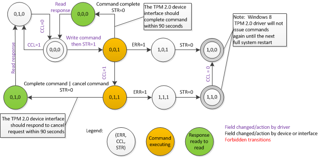

# Trusted Execution Environment ACPI Profile


Licensing: Microsoft agrees to grant to you a no charge, royalty-free license to its Necessary Claims on reasonable and non-discriminatory terms solely to make, use, sell, offer for sale, import, or distribute any implementation of this specification. “Necessary Claims” are those claims of Microsoft-owned or Microsoft-controlled patents that are technically necessary to implement the required portions (which also include the required elements of optional portions) of this specification, where the functionality causing the infringement is described in detail and not merely referenced in this Specification.

## <span id="1.0_background"></span><span id="1.0_BACKGROUND"></span>1.0 Background


This specification defines the ACPI device object for a TPM 2.0 device and the control methods associated with the ACPI device object required for Windows 8. The control methods implement the equivalent of the TCG physical presence ACPI interface, the equivalent of the Platform Reset Attack Mitigation interface and optionally an ACPI method to send a command to the TPM 2.0 device.

An additional static ACPI table (TPM2) is used to define the mechanism for communicating between the TPM 2.0 device and the Windows 8 OS.

>[!NOTE]
>  
Microsoft refers to the Trusted Computing Group’s “TPM.Next” term as “TPM 2.0”

 

## <span id="2.0_requirements"></span><span id="2.0_REQUIREMENTS"></span>2.0 Requirements


This specification assumes a computing platform that supports ACPI-based communication as specified in \[ACPI09\] between an OS and a firmware environment.

## <span id="3.0_usage_scenarios__for_example_only_"></span><span id="3.0_USAGE_SCENARIOS__FOR_EXAMPLE_ONLY_"></span>3.0 Usage scenarios (for example only)


### <span id="3.1_Sending_a_physical_presence_command"></span><span id="3.1_sending_a_physical_presence_command"></span><span id="3.1_SENDING_A_PHYSICAL_PRESENCE_COMMAND"></span>3.1 Sending a physical presence command

A typical usage scenario is as follows:

1.  Within the OS environment, an application detects the TPM 2.0 device is not fully provisioned for use for Windows 8. (An example of how this could happen is if a new OS image is installed after a previous OS image provisioned the TPM 2.0.)

2.  The application launches an OS wizard to ready the TPM 2.0 device for use.

3.  The wizard interacts with the computer administrator via UI and determines the administrator needs to clear the TPM 2.0 device to provision it because the TPM 2.0 device reset lockout authorization value is not available.

4.  To clear the TPM 2.0 device, the OS requests (by executing an ACPI control method for the TPM 2.0 device object) the firmware perform the operation to clear the TPM 2.0 device upon the next boot provided a physically present user confirms they approve of clearing the TPM 2.0 device.

5.  The OS restarts the platform.

6.  During the early portion of the boot process, the firmware recognizes the pending request from the OS to clear the TPM 2.0 device.

7.  The firmware presents a UI to a physically present user asking them to take some action to confirm clearing of the TPM 2.0 device.

8.  A physically present user confirms clearing of the TPM 2.0 device.

9.  The firmware clears the TPM 2.0 device using the platform hierarchy authorization.

10. If necessary, to persist the clearing of the TPM 2.0 device, the platform is rebooted immediately.

11. The OS boots.

12. The OS queries (via an ACPI control method on the TPM 2.0 device) if the last OS request to clear the TPM 2.0 device was either (a) successful, (b) was not confirmed by the physically present user or (c) had some other error. In the following, we assume the TPM 2.0 device was cleared successfully.

13. The TPM 2.0 device provisioning wizard within the OS performs additional commands to ready the device for use by Windows.

### <span id="3.2_Requesting_memory_to_be_cleared_on_the_next_boot"></span><span id="3.2_requesting_memory_to_be_cleared_on_the_next_boot"></span><span id="3.2_REQUESTING_MEMORY_TO_BE_CLEARED_ON_THE_NEXT_BOOT"></span>3.2 Requesting memory to be cleared on the next boot

This scenario illustrates how the memory clear feature of the system helps thwart attacks that harvest system memory for key material after the platform is unexpectedly restarted.

1.  From within the OS, an administrator on a system with a TPM 2.0 device turns on the BitLocker feature for the OS volume.

2.  The BitLocker feature calls the TPM 2.0 device ACPI control method to set the ClearMemory bit defined in the TCG Platform Reset Attack Mitigation Specification.

3.  The BitLocker feature encrypts the OS volume.

4.  The administrator leaves the system unattended with the screen locked.

5.  A malicious person steals the system while it is running.

6.  The malicious person inserts a USB stick and quickly removes the system battery and re-inserts it.

7.  The system starts booting when the battery is re-inserted.

8.  Because the ClearMemory bit was set previously the firmware clears the entire system memory before launching any code not provided by the platform manufacturer.

9.  The malicious person configures the firmware during boot to boot to the USB device even though the code on the USB device is not properly signed.

10. The code on the USB device scans the system memory for the BitLocker Volume Master Key but it is not found.

    >[!WARNING]
    >  
    Steps 11 through 16 are similar to the earlier steps, but use the UEFI interface instead of ACPI

     

11. The malicious person attempts to boot the system normally.

12. Because BitLocker was enabled with the TPM key protector, this permits BootMgr to “unseal” the volume master key for the OS volume because the correct measurements are in the TPM 2.0 device when BootMgr runs.

13. Boot proceeds to the OS logon screen.

14. The malicious person again removes then re-inserts the battery and boots code from a USB device.

15. Because the ClearMemory bit was set, the system firmware erases the entire system memory during boot.

16. Even though code from the USB device scans the system memory, the OS volume encryption key is not in memory.

### <span id="3.3_Issuing_a_command_to_the_TPM_2.0_device"></span><span id="3.3_issuing_a_command_to_the_tpm_2.0_device"></span><span id="3.3_ISSUING_A_COMMAND_TO_THE_TPM_2.0_DEVICE"></span>3.3 Issuing a command to the TPM 2.0 device

This example is not applicable for all system architectures.

1.  The Windows TPM 2.0 driver wants to issue a command to the TPM 2.0 device.

2.  The Windows TPM 2.0 driver writes the command to execute to the physical address read from the ACPI-defined Control Area earlier during the Windows TPM 2.0 driver initialization.

3.  The Windows TPM 2.0 driver executes the ACPI control method to execute a TPM 2.0 command.

4.  The Windows TPM 2.0 driver polls the registers in the control area until they indicate the TPM command has completed.

5.  The Windows TPM driver reads the command response from the physical address read from the ACPI-defined Control Area earlier during Windows TPM driver initialization.

## <span id="4.0_General_ACPI_Requirements_for_the_TPM_2.0_System_and_Device"></span><span id="4.0_general_acpi_requirements_for_the_tpm_2.0_system_and_device"></span><span id="4.0_GENERAL_ACPI_REQUIREMENTS_FOR_THE_TPM_2.0_SYSTEM_AND_DEVICE"></span>4.0 General ACPI Requirements for the TPM 2.0 System and Device


### <span id="4.1_Power_considerations"></span><span id="4.1_power_considerations"></span><span id="4.1_POWER_CONSIDERATIONS"></span>4.1 Power considerations

**ACPI D1/D2**

The TPM 2.0 device MAY support ACPI D1 and/or ACPI D2 but MUST behave as if it was in power state ACPI D0 while in D1 or D2.

**ACPI S3 (Sleep)**

The TPM 2.0 MAY support S3 but entry into and exit from the S3 low power state for the device MUST be controlled by the system/platform manufacturer.

The OS (or other software running in the OS environment) MUST NOT be able to place the TPM 2.0 device in S3 or cause the TPM 2.0 device to exit from S3. For example, if the TPM 2.0 device is on a bus, the OS MUST NOT be able to power down the bus causing the TPM 2.0 device to enter S3.

The Windows 8 TPM driver will attempt to issue a TPM2\_Shutdown command prior to entering S3 (sleep).

If a hardware platform does support S3 and the TPM does not retain its state while the system is in S3, the platform MUST issue the necessary TPM2\_Init and TPM2\_Startup(TPM\_SU\_STATE) commands during S3 resume. It is possible the OS may not have completed the TPM2\_Shutdown command prior to entry into S3. This could cause the return result of TPM2\_Startup(TPM\_SU\_STATE) to return an error. The system firmware that resumes from S3 MUST deal with a TPM2\_Startup error appropriately. For example, by either disabling access to the TPM via hardware, issuing a TPM2\_Startup(TPM\_SU\_CLEAR) command and configuring the device securely by taking actions like extending a separator with an error digest (0x01) into PCRs 0 through 7 and locking NV indices.

The system MUST account for time elapsed during S3 by decrementing TPM dictionary attack failure count (TPM\_PT\_LOCKOUT\_COUNTER) for the time the system was in S3 per the lockout interval (TPM\_PT\_LOCKOUT\_INTERVAL). This may require a platform implementation to provide standby voltage to retain TPM clock and/or state during S3 or a platform could also securely provide information regarding how much time elapsed while the system was in a low power state so the TPM can reliably updates its authorization failure count for its dictionary attack logic.

**Low Power States for Connected Standby Systems**

Windows 8 does not perform any additional actions associated with the TPM upon entry and exit from low power states for Connected Standby systems. The platform MUST performing any actions needed for the TPM to behave as though it was in D0 whenever the system enters and exits from low power states for Connected Standby systems. This MAY require a platform implementation to provide standby voltage to power the TPM clock and/or retain state. Alternatively, a platform MAY need to securely provide information regarding how much time elapsed while the system was in a low power state to the TPM, so the TPM can reliably updates its authorization failure count for its dictionary attack logic.

**System Off**

The system SHOULD securely account for time elapsed during full shutdown by decrementing TPM dictionary attack failure count (TPM\_PT\_LOCKOUT\_COUNTER) for the time the system was in S5 per the lockout interval (TPM\_PT\_LOCKOUT\_INTERVAL).

### <span id="4.2_ACPI_tables"></span><span id="4.2_acpi_tables"></span><span id="4.2_ACPI_TABLES"></span>4.2 ACPI tables

A system with a TPM 2.0 device MUST provide a device object table with a hardware device ID and an OS vendor specific static table (TPM2) as described below.

Both the TPM2 table and the TPM 2.0 device object MUST be persistent once the platform is shipped to a customer. (E.g. Firmware options MUST NOT permit hiding of the TPM2 table or the TPM 2.0 device object.) An exception is if a system is shipped with a non-default option to provide TPM 1.2 functionality instead of TPM 2.0 functionality (i.e. for compatibility with older operating systems like Windows 7.) In this situation the TPM2 table and the TPM 2.0 device object MAY be removed via a BIOS configuration option and enumeration of a TPM 1.2 performed. Note: A Connected Standby System for Windows 8 is required to ship, by default, with a TPM 2.0 visible to the operating system. Please contact Microsoft for technical guidance about switching between a TPM 2.0 and TPM 1.2 on a hardware platform.

### <span id="4.3_TPM_2.0_Device_Object_ACPI_Table"></span><span id="4.3_tpm_2.0_device_object_acpi_table"></span><span id="4.3_TPM_2.0_DEVICE_OBJECT_ACPI_TABLE"></span>4.3 TPM 2.0 Device Object ACPI Table

**4.3.1 Bus Hierarchy**

The Device Object table MUST be under the DSDT table in the ACPI namespace.The TPM 2.0 Device Object MUST be located under the system bus at “root\\\_SB”.

**4.3.2 Hardware Identifier**

The actual plug and play hardware identifier (e.g. \_HID) for the TPM 2.0 device object MUST be “MSFT0101”or the device MUST have a compatible ID of “MSFT0101” and the \_HID could be vendor specific.

**4.3.3 Resource Descriptors**

The ACPI TPM 2.0 Device Object MUST claim all resources used by the TPM 2.0 device.

**4.3.4 Control Methods**

**4.3.4.1 Platform Reset Attack Mitigation**

The system MUST implement all ACPI and UEFI related parts of \[TCG08\] for UEFI. The device object MUST implement the control method interface defined in \[TCG08\], section 6. The interface is required even if the platform unconditionally clears memory on every boot. The clearing of memory MUST NOT be conditional on the TPM 2.0 device state (in contrast \[TCG08\] does not requiring clearing of memory if the TPM 1.2 is not owned). Also, sections 3, 5 of \[TCG08\] MUST be implemented. The \_DSM query function MUST be implemented (function index 0) per the ACPI specification. (Note: There is a mistake in the ACPI 4.0 specification about the return value for the \_DSM method. The return value of the \_DSM method should be a buffer containing 0x03.) The implementation MUST auto-detect an orderly OS shutdown and clear the ClearMemory bit on such events.

Special note for UEFI based ARM systems with a TPM 2.0: On UEFI based ARM systems with a TPM 2.0, Windows 8 will unconditionally request memory be cleared using the UEFI interface on every boot. Implementing the ACPI interface is still required, but the interface MAY be implemented to not change the state of the ClearMemory or DisableAutoDetect flags. (Note: Microsoft recommends the ACPI interface be implemented per the TCG specification so calling the ACPI interface does change the state of ClearMemory or DisableAutoDetect.)

**4.3.4.2 Physical Presence Interface**

The system MUST implement the specification defined in \[TCG11\] per the additional notes below:

1.  The use of TPM in the TCG specification should be equated with the TPM 2.0 device.

2.  The control methods defined in section 2 MUST be implemented with the following restrictions:

    1.  The \_DSM query function MUST be implemented (function index 0) per the ACPI specification. (Note: There is a mistake in the ACPI 4.0 specification about the return value for the \_DSM method. The return value of the \_DSM method should be a buffer containing 0x01FF.)

    2.  The implementation MUST return a value of “2: Reboot” for “Get Platform-Specific Action to Transition to Pre-OS Environment.” PPI operations MUST occur for a transition of a restart and SHOULD occur for a shutdown transition.

    3.  Implementation of the following control methods is optional: “Submit TPM Operation Request to Pre-OS Environment” (may return “2: General Failure”) and “Submit preferred user language” (may return “3: Not implemented”).

3.  The requirements in section 3 MUST be implemented with the following revisions:

    1.  The BIOS does not need to provide persistent storage for the NoPPIProvision flag because the operations it authorizes are not relevant for the TPM 2.0 device state.

    2.  Table 2 is revised as follows:

        Table 1: revised PPI table 2

        <table style="width:100%;">
        <colgroup>
        <col width="14%" />
        <col width="14%" />
        <col width="14%" />
        <col width="14%" />
        <col width="14%" />
        <col width="14%" />
        <col width="14%" />
        </colgroup>
        <tbody>
        <tr class="odd">
        <td><p><strong>OperationValue</strong></p></td>
        <td><p><strong>Operation Name</strong></p></td>
        <td><p><strong>TPM Stat</strong></p></td>
        <td><p><strong>BIOS TPM Mgmt Flags</strong></p></td>
        <td><p><strong>Mandatory versus Optional</strong></p></td>
        <td><p><strong>When Physical Presence Confirmation is Required</strong></p></td>
        <td><p><strong>May need additional boot cycle</strong></p></td>
        </tr>
        <tr class="even">
        <td><p>0</p></td>
        <td><p>No Operation</p></td>
        <td><p></p></td>
        <td><p></p></td>
        <td><p>M</p></td>
        <td><p></p></td>
        <td><p></p></td>
        </tr>
        <tr class="odd">
        <td><p>1-4</p></td>
        <td><p>No Operation</p></td>
        <td><p></p></td>
        <td><p></p></td>
        <td><p>M</p></td>
        <td><p></p></td>
        <td><p></p></td>
        </tr>
        <tr class="even">
        <td><p>5</p></td>
        <td><p>TPM2_ClearControl(NO) +</p>
        <p>TPM2_Clear</p></td>
        <td><p>X</p></td>
        <td><p></p></td>
        <td><p>M</p></td>
        <td><p>NoPPIClear is FALSE</p></td>
        <td><p>X</p></td>
        </tr>
        <tr class="odd">
        <td><p>6-11</p></td>
        <td><p>No Operation</p></td>
        <td><p></p></td>
        <td><p></p></td>
        <td><p>M</p></td>
        <td><p></p></td>
        <td><p></p></td>
        </tr>
        <tr class="even">
        <td><p>12-13</p></td>
        <td><p>No Operation</p></td>
        <td><p></p></td>
        <td><p></p></td>
        <td><p>O</p></td>
        <td><p></p></td>
        <td><p></p></td>
        </tr>
        <tr class="odd">
        <td><p>14</p></td>
        <td><p>TPM2_ClearControl(NO) +</p>
        <p>TPM2_Clear</p></td>
        <td><p>X</p></td>
        <td><p></p></td>
        <td><p>M</p></td>
        <td><p>NoPPIClear is FALSE</p></td>
        <td><p>X</p></td>
        </tr>
        <tr class="even">
        <td><p>15-16</p></td>
        <td><p>No Operation</p></td>
        <td><p></p></td>
        <td><p></p></td>
        <td><p>M</p></td>
        <td><p></p></td>
        <td><p></p></td>
        </tr>
        <tr class="odd">
        <td><p>17</p></td>
        <td><p>SetNoPPIClear_False</p></td>
        <td><p></p></td>
        <td><p>X</p></td>
        <td><p>O1</p></td>
        <td><p></p></td>
        <td><p></p></td>
        </tr>
        <tr class="even">
        <td><p>18</p></td>
        <td><p>SetNoPPIClear_True</p></td>
        <td><p></p></td>
        <td><p>X</p></td>
        <td><p>O1</p></td>
        <td><p>Always</p></td>
        <td><p></p></td>
        </tr>
        <tr class="odd">
        <td><p>19-20</p></td>
        <td><p>No Operation</p></td>
        <td><p></p></td>
        <td><p></p></td>
        <td><p>O2</p></td>
        <td><p></p></td>
        <td><p></p></td>
        </tr>
        <tr class="even">
        <td><p>21-22</p></td>
        <td><p>TPM2_ClearControl(NO) +</p>
        <p>TPM2_Clear</p></td>
        <td><p>X</p></td>
        <td><p></p></td>
        <td><p>M</p></td>
        <td><p>NoPPIClear is FALSE</p></td>
        <td><p>X</p></td>
        </tr>
        <tr class="odd">
        <td><p>23 – 127</p></td>
        <td><p>Reserved</p></td>
        <td><p></p></td>
        <td><p></p></td>
        <td><p></p></td>
        <td><p></p></td>
        <td><p></p></td>
        </tr>
        <tr class="even">
        <td><p>&gt;=128</p></td>
        <td><p>Vendor Specific</p></td>
        <td><p>X</p></td>
        <td><p>X</p></td>
        <td><p>O</p></td>
        <td><p></p></td>
        <td><p>X</p></td>
        </tr>
        </tbody>
        </table>

        >[!IMPORTANT]
        >  
        For **SetNoPPIClear\_False**: if the BIOS implements the items marked “O1” or “O2” it must implement them as a set. For the **No Operation** that follows **SetNoPPIClear\_True**, the BIOS must not implement operations 19 and 20 if it does not implement operation 12.

         

    3.  Table 3 is revised as follows:

        <table>
        <colgroup>
        <col width="33%" />
        <col width="33%" />
        <col width="33%" />
        </colgroup>
        <tbody>
        <tr class="odd">
        <td><p><strong>Operation</strong></p>
        <p><strong>Value</strong></p></td>
        <td><p><strong>Operation</strong></p>
        <p><strong>Name</strong></p></td>
        <td><p><strong>TPM commands sent by BIOS and other BIOS actions to perform the operation</strong></p></td>
        </tr>
        <tr class="even">
        <td><p>0</p></td>
        <td><p>No Operation</p></td>
        <td><p><em>No operation</em></p></td>
        </tr>
        <tr class="odd">
        <td><p>1-4, 6-13, 15-16, 19-20</p></td>
        <td><p>No Operation</p></td>
        <td><p>No operation. However, the operation number MUST be remembered and the result if queried from the OS it MUST return success.</p></td>
        </tr>
        <tr class="even">
        <td><p>5, 14, 21, 22</p></td>
        <td><p>Clear</p></td>
        <td><p>TPM2_ClearControl(NO) +</p>
        <p>TPM2_Clear</p>
        <p>&lt;PLATFORM RESET&gt;* [*If necessary to persist the TPM changes from TPM2_CLEAR. Microsoft anticipates on most systems this is unnecessary.]</p></td>
        </tr>
        <tr class="odd">
        <td><p>17</p></td>
        <td><p>SetNoPPIClear_False</p>
        <p>(Require physical presence for clear.)</p></td>
        <td><p>This operation does not change TPM state.</p>
        <p></p>
        <p>Clears the BIOS TPM Management Flag NoPPIClear to FALSE.</p></td>
        </tr>
        <tr class="even">
        <td><p>18</p></td>
        <td><p>SetNoPPIClear_True</p>
        <p></p>
        <p>(Do not require physical presence confirmation for clear.)</p></td>
        <td><p>This operation does not change TPM state.</p>
        <p></p>
        <p>Sets the BIOS TPM Management Flag NoPPIClear to TRUE.</p>
        <p></p></td>
        </tr>
        <tr class="odd">
        <td><p>23 – 127</p></td>
        <td><p>Reserved</p></td>
        <td><p>Reserved, do not implement or use</p></td>
        </tr>
        <tr class="even">
        <td><p>&gt;=128</p></td>
        <td><p>Vendor Specific</p></td>
        <td><p>TPM commands mapping to vendor specific operation</p></td>
        </tr>
        </tbody>
        </table>

         

4.  The spirit of section 4 MUST be maintained to obtain confirmation from a physically present user when it is required to perform an operation but the actual mechanism does not need to be key presses. The keys or other mechanism to affirm consent are up to the platform manufacturer.

    <table>
    <colgroup>
    <col width="33%" />
    <col width="33%" />
    <col width="33%" />
    </colgroup>
    <tbody>
    <tr class="odd">
    <td><p><strong>Op</strong></p>
    <p><strong>Value</strong></p></td>
    <td><p><strong>Operation</strong></p>
    <p><strong>Name</strong></p></td>
    <td><p><strong>Confirmation</strong></p>
    <p><strong>Text</strong></p></td>
    </tr>
    <tr class="even">
    <td><p>5, 14, 21, and 22</p></td>
    <td><p>Clear</p></td>
    <td><p>A configuration change was requested to clear this computer’s TPM (Trusted Platform Module)</p>
    <p>WARNING: Clearing erases information stored on the TPM. You will lose all created keys and access to data encrypted by these keys.</p>
    <p>Press &lt;CAK&gt; to clear the TPM</p>
    <p>Press &lt;RK&gt; to reject this change request and continue</p></td>
    </tr>
    <tr class="odd">
    <td><p>18</p></td>
    <td><p>SetNoPPIClear_True</p>
    <p></p></td>
    <td><p>A configuration change was requested to allow the Operating System to clear the computer’s TPM (Trusted Platform Module) without asking for user confirmation in the future.</p>
    <p>NOTE: This action does not clear the TPM, but by approving this configuration change, future actions to clear the TPM will not require user confirmation.</p>
    <p>WARNING: Clearing erases information stored on the TPM. You will lose all created keys and access to data encrypted by these keys.</p>
    <p>Press &lt;CAK&gt; to approve future Operating System requests to clear the TPM</p>
    <p>Press &lt;RK&gt; to reject this change request and continue</p></td>
    </tr>
    </tbody>
    </table>

     

5.  Section 5 is informative.

6.  Connected Standby systems MAY hardcode NoPPIClear to TRUE and not implement operations 17 and 18. This means they do not need to implement any confirmation dialogs for physical presence actions because no physical presence operations will require user confirmation.

7.  The firmware MUST leave the storage and endorsement hierarchies enabled when it passes control to initial program loader code like the Windows Boot Manager.

**4.3.4.3 Optional ACPI Start Method**

Note: Some platforms MAY implement this optional ACPI method to permit the OS to request the firmware to execute or cancel a TPM 2.0 command. The use of the ACPI Start method is determined by the StartMethod field of the static ACPI table (see Section 4.4.)If the StartMethod field of the static ACPI table indicates the use of this method, the ACPI Start method MUST be implemented.The ACPI functions defined herein shall reside in the \_DSM control method object. \[Note: This is not a control method in the TPM2 ACPI table.\] The \_DSM method defined herein MUST be implemented as follows:

<table>
<colgroup>
<col width="25%" />
<col width="25%" />
<col width="25%" />
<col width="25%" />
</colgroup>
<tbody>
<tr class="odd">
<td><p><strong>UUID</strong></p></td>
<td><p><strong>Revision</strong></p></td>
<td><p><strong>Function</strong></p></td>
<td><p><strong>Description</strong></p></td>
</tr>
<tr class="even">
<td><p>6bbf6cab-5463-4714-b7cd-f0203c0368d4</p>
<p></p></td>
<td><p>0</p></td>
<td><p>0</p></td>
<td><p>As described in [ACPI09], Section 9.14.1.</p></td>
</tr>
<tr class="odd">
<td><p></p></td>
<td><p>0</p></td>
<td><p>1</p></td>
<td><p>Start</p></td>
</tr>
</tbody>
</table>

 

Function Start

Input Arguments:

``` syntax
Arg0 (Buffer): UUID = 6bbf6cab-5463-4714-b7cd-f0203c0368d4
Arg1 (Integer): Revision ID = 0
Arg2 (Integer): Function Index = 1
Arg3 (Package): Arguments = Empty Package
```

Return Value:

Type: Integer

Description of the Return Value:

0: Success

1: General Failure

Functional Behavior:

This function tells the system to review the status registers in the TPM 2.0 device control area and take the appropriate action to execute or cancel TPM 2.0 command.

The function is non-blocking. The call will return immediately. (Do not attempt to perform command execution from within the ACPI method. AML calls need to be short.)When Return Value 0 is returned, the submitted command was accepted and will be executed by the firmware or cancelled if the Cancel field is already set. Whenever possible the system should return a TPM response instead of a General Failure from this call. For example, a command cannot be processed now, a Response buffer of TPM2\_RC\_RETRY could be written and the START field could be CLEARed. If the command was cancelled because the Cancel field was set, this method may write a TPM2\_RC\_Cancelled return code in the Response buffer, clear the Start field and return a value of 0. Alternatively, if the Cancel field is set the method may return a value of 0 and the TPM 2.0 device may later complete or cancel the command per the requirements for cancelling a command.

When Return Value 1 is returned, the firmware is unable to read or act upon the request. Other than the return value, the request is equivalent to a NO-OP. Examples are (a) a bad OS driver requests execution of additional commands before a prior command completed, (b) the control area is not in physical memory \[perhaps due to memory corruption\], or (c) the command or response physical addresses do not exist. A return value of 1 may cause the Windows TPM 2.0 driver may stop using the TPM 2.0 device until the next full system boot (this excludes hibernation/resume cycles).

Note: Once command execution starts, this method is not called a second time if the OS chooses the cancel the currently executing command. (However it is possible the control method may be called initially for a command while the cancel field is set.)

### <span id="4.4_TPM2_Static_ACPI_Table"></span><span id="4.4_tpm2_static_acpi_table"></span><span id="4.4_TPM2_STATIC_ACPI_TABLE"></span>4.4 TPM2 Static ACPI Table

An ACPI table named “TPM2” listed in the “RSDT” ACPI table describes the platform’s TPM 2.0 hardware interface. The Windows TPM 2.0 driver uses this table to determine the manner in which it is to communicate with the TPM 2.0 device. The parameters in the ACPI table required to support this interface are illustrated in the table below.

**Table 3: TPM2 ACPI table layout**

<table>
<colgroup>
<col width="25%" />
<col width="25%" />
<col width="25%" />
<col width="25%" />
</colgroup>
<tbody>
<tr class="odd">
<td><p>Field</p></td>
<td><p>Byte Length</p></td>
<td><p>Byte Offset</p></td>
<td><p>Description</p></td>
</tr>
<tr class="even">
<td><p>Header</p></td>
<td><p></p></td>
<td><p></p></td>
<td><p></p></td>
</tr>
<tr class="odd">
<td><p>Signature</p></td>
<td><p>4</p></td>
<td><p>00h</p></td>
<td><p>‘TPM2’. Signature for the TPM 2.0 device Hardware Interface Table</p></td>
</tr>
<tr class="even">
<td><p>Length</p></td>
<td><p>4</p></td>
<td><p>04h</p></td>
<td><p>The length of the table, in bytes, including the header, starting from offset 0. This field is used to record the size of the entire table.</p></td>
</tr>
<tr class="odd">
<td><p>Revision</p></td>
<td><p>1</p></td>
<td><p>08h</p></td>
<td><p>Revision of this table including the data and structure referenced by it. If any structure referenced by this changed (e.g., Control Area), this revision MUST change. Value 03h.</p></td>
</tr>
<tr class="even">
<td><p>Checksum</p></td>
<td><p>1</p></td>
<td><p>09h</p></td>
<td><p>The entire table, including the checksum field, MUST add to zero to be considered valid.</p></td>
</tr>
<tr class="odd">
<td><p>OEM ID</p></td>
<td><p>6</p></td>
<td><p>0Ah</p></td>
<td><p>OEM ID per ACPI specification. An OEM-supplied string that identifies the OEM (this may be the chipset vendor).</p></td>
</tr>
<tr class="even">
<td><p>OEM Table ID</p></td>
<td><p>8</p></td>
<td><p>10h</p></td>
<td><p>The OEM Table ID is the manufacturer model ID (assigned by the OEM identified by “OEM ID”; may be the chipset vendor).</p></td>
</tr>
<tr class="odd">
<td><p>OEM Revision</p></td>
<td><p>4</p></td>
<td><p>18h</p></td>
<td><p>OEM revision for the given OEM Table ID. Per ACPI, “[an] OEM-supplied revision number. Larger numbers are assumed to be newer revisions.”</p></td>
</tr>
<tr class="even">
<td><p>Creator ID</p></td>
<td><p>4</p></td>
<td><p>1Ch</p></td>
<td><p>Vendor ID of utility that created the table. For the tables containing Definition Blocks, this is the ID of the ASL Compiler.</p></td>
</tr>
<tr class="odd">
<td><p>Creator Revision</p></td>
<td><p>4</p></td>
<td><p>20h</p></td>
<td><p>Revision of utility that created the table. For the tables containing Definition Blocks, this is the revision of the ASL Compiler.</p></td>
</tr>
<tr class="even">
<td><p>Flags</p></td>
<td><p>4</p></td>
<td><p>24h</p></td>
<td><p>Reserved</p>
<p>MUST always be zero</p></td>
</tr>
<tr class="odd">
<td><p>Address of Control Area</p></td>
<td><p>8</p></td>
<td><p>28h</p></td>
<td><p>Physical address of the Control Area. May be either in TPM 2.0 device memory or in memory reserved by the system during boot. The TPM 2.0 driver retains knowledge of this address throughout a boot cycle including hibernation and resume cycles. If the system does not use the Control Area this value MUST be all zeros.</p></td>
</tr>
<tr class="even">
<td><p>Start Method</p></td>
<td><p>4</p></td>
<td><p>30h</p></td>
<td><p>The start method selector determines which mechanism the Windows TPM 2.0 driver uses to communicate TPM 2.0 commands to the device and to notify the TPM 2.0 device that a command is available for processing. This field may contain one of the following values:</p>
<table>
<colgroup>
<col width="50%" />
<col width="50%" />
</colgroup>
<tbody>
<tr class="odd">
<td><p>Value</p></td>
<td><p>Description</p></td>
</tr>
<tr class="even">
<td><p>0</p></td>
<td><p>Reserved.</p></td>
</tr>
<tr class="odd">
<td><p>1</p></td>
<td><p>Reserved (Vendor specific)</p></td>
</tr>
<tr class="even">
<td><p>2</p></td>
<td><p>Uses the ACPI Start method.</p></td>
</tr>
<tr class="odd">
<td><p>3-5</p>
<p></p>
<p>6</p></td>
<td><p>Reserved (Vendor specific)</p>
<p>Reserved for the Memory mapped I/O Interface (TIS 1.2+Cancel). This option is not Windows 8 Hardware Certification compliant. Use of this option requires an approved Windows 8 WHLK contingency request for logo certification. Please contact Microsoft for details.</p></td>
</tr>
<tr class="even">
<td><p>7</p>
<p></p>
<p>8</p></td>
<td><p>Uses the Command Response Buffer Interface.</p>
<p>Uses the Command Response Buffer Interface with ACPI Start method.</p></td>
</tr>
<tr class="odd">
<td><p>…</p></td>
<td><p>Reserved.</p></td>
</tr>
</tbody>
</table>
<p> </p>
<p></p></td>
</tr>
<tr class="odd">
<td><p>Platform Specific Parameters</p></td>
<td><p>variable</p></td>
<td><p>34h</p></td>
<td><p>The content of the platform specific parameters is determined by the start mechanism used by this system’s TPM 2.0 device interface. This field contains values that may be used to initiate command processing. This information may be vendor specific. For Start Method values of 2 or 6 the field is not used and the Byte Length is zero.</p></td>
</tr>
</tbody>
</table>

 

### <span id="4.4.1_Control_Area_Contents"></span><span id="4.4.1_control_area_contents"></span><span id="4.4.1_CONTROL_AREA_CONTENTS"></span>4.4.1 Control Area Contents

The Control Area structure contains status fields as well as other control bits/fields and one or more addresses. The Control Area contains the physical address of the command buffer and the physical address of the response buffer.

Not all TPM 2.0 interface implementations use the Control Area, for example a Start Method value of 6 does not use the Control Area and the information in this section is not applicable for the platform.

The control area MUST be in ACPI AddressRangeReserved memory.

The Control Area structure is shown in the table below and unless specified otherwise all accesses to the control area are done in the little endian format.

**Table 4: Control Area layout**

<table>
<colgroup>
<col width="25%" />
<col width="25%" />
<col width="25%" />
<col width="25%" />
</colgroup>
<tbody>
<tr class="odd">
<td><p></p>
<p>Field</p></td>
<td><p>Byte Length</p></td>
<td><p>Offset</p></td>
<td><p>Description</p></td>
</tr>
<tr class="even">
<td><p>Status fields</p></td>
<td><p></p></td>
<td><p></p></td>
<td><p>TPM 2.0 status fields</p></td>
</tr>
<tr class="odd">
<td><p>Reserved</p></td>
<td><p>4</p></td>
<td><p>00h</p></td>
<td><p>Reserved. (MUST be zero.)</p></td>
</tr>
<tr class="even">
<td><p>Error</p></td>
<td><p>4</p></td>
<td><p>04h</p></td>
<td><p>SET by the TPM 2.0 to indicate an error condition</p></td>
</tr>
<tr class="odd">
<td><p>Cancel</p></td>
<td><p>4</p></td>
<td><p>08h</p></td>
<td><p>SET by the DRIVER to abort command processing</p></td>
</tr>
<tr class="even">
<td><p>Start</p></td>
<td><p>4</p></td>
<td><p>0Ch</p></td>
<td><p>SET by the DRIVER to indicate that a command is available for processing.</p></td>
</tr>
<tr class="odd">
<td><p>Interrupt Control</p></td>
<td><p>8</p></td>
<td><p>10h</p></td>
<td><p>Reserved. (MUST be zero.)</p></td>
</tr>
<tr class="even">
<td><p>Command Size</p></td>
<td><p>4</p></td>
<td><p>18h</p></td>
<td><p>Size of the Command buffer</p></td>
</tr>
<tr class="odd">
<td><p>Command</p></td>
<td><p>8</p></td>
<td><p>1Ch</p></td>
<td><p>This field contains the physical address of the command buffer. Note that the actual command buffer (not the physical address of command buffer) is in big-endian format as mandated by TCG.</p></td>
</tr>
<tr class="even">
<td><p>Response Size</p></td>
<td><p>4</p></td>
<td><p>24h</p></td>
<td><p>Size of the Response Buffer</p></td>
</tr>
<tr class="odd">
<td><p>Response</p></td>
<td><p>8</p></td>
<td><p>28h</p></td>
<td><p>This field contains the physical address of the response buffer. Note that the actual response buffer (not the physical address of response buffer) is in big-endian format as mandated by TCG.</p></td>
</tr>
</tbody>
</table>

 

The TPM 2.0 driver reads the following information once during the initialization of the operating system:

1.  The physical address of the control area

2.  The size of the command buffer

3.  The physical location of the command buffer

4.  The size of the response buffer

5.  The physical location of the response buffer

For systems that use the control area (i.e. the Start Method value does not equal 6) and support hibernation and resume, the five values above MUST remain constant across hibernation and resume cycles.

**4.4.1.1 Error**

The TPM 2.0 device may SET this status. It may only write this status when Start is SET. Immediately after the TPM 2.0 device SETs this status, it CLEARs the Start value. The Windows TPM 2.0 driver will not read the Error field unless the Start field is CLEAR.

A SET value of the Error field is treated as generic error of the TPM 2.0 device or its hardware interface. Any SET value results in the cancellation of the current command. The command MUST be rolled back, so the TPM 2.0 device is left in a consistent state.

For a device with an ACPI Start method, this field should only be used for errors for which a response code cannot be provided. An example is: the response buffer is not in physical memory. The Windows TPM 2.0 driver may stop using the TPM 2.0 device when this field is SET.

The initial value for this field after ExitBootServices MUST reflect whether the device works or not.

**4.4.1.2 Cancel**

The Windows TPM 2.0 driver may SET this field to request that TPM 2.0 device processing of current command be terminated. The Windows TPM 2.0 driver does not invoke the Start method to initiate processing of the cancel request.

When Cancel is SET by the Windows TPM 2.0 driver and the TPM 2.0 device is processing a command, the TPM 2.0 device will stop processing the current command at the earliest convenient point. For most commands, it is expected that the TPM 2.0 device will complete the command and provide a normal response. For commands that are long running (e.g., RSA key generation), the TPM 2.0 device may exit with TPM\_RC\_CANCELLED. The TPM 2.0 device has to either complete or cancel the command within 90 seconds. (Generally most TPM 2.0 commands should complete in less than 500 ms, except RSA key generation commands which may take longer and command cancelling should occur within 200 ms)

The Windows TPM 2.0 driver may CLEAR this value when the Start field is CLEAR. The initial value for this field after ExitBootServices MUST be CLEAR.

**4.4.1.3 Start**

The Windows TPM 2.0 driver may SET this status to indicate that a new command has been placed in the Command buffer. The Windows TPM 2.0 driver may invoke the Start method to initiate processing of the command. The TPM 2.0 device will CLEAR this status when it completes processing a command.

The Windows TPM 2.0 driver may CLEAR this status when Start method invocation failed.

The initial value for this field after ExitBootServices MUST be CLEAR.

**4.4.1.4 Command**

This is the physical address to which the Windows TPM 2.0 driver will write the command to execute. The Windows TPM 2.0 driver will never write a command larger than “Command Size”.

The Windows TPM 2.0 driver MUST NOT write to this memory area unless the Start field is CLEAR. Note that the address is specified in little-endian format in the control area but the actual command buffer is in big-endian format as mandated by TCG.

**4.4.1.5 Response**

This is the physical address from which the Windows TPM 2.0 driver will read command responses. The Windows TPM 2.0 driver will never read a response larger than “Response Size”.

The Windows TPM 2.0 driver will only read a response after the Start field changed from SET to CLEAR and Error is CLEAR. Note that the address is specified in little-endian format in the control area but the actual response buffer is in big-endian format as mandated by TCG.

### <span id="4.5_Control_Area_Interface_Definition"></span><span id="4.5_control_area_interface_definition"></span><span id="4.5_CONTROL_AREA_INTERFACE_DEFINITION"></span>4.5 Control Area Interface Definition

For hardware platforms that use the Control Area as the TPM 2.0 interface, this section and the information in section 4.4 describes the TPM 2.0 driver interaction with the hardware. An example of a system that uses the Control Area is a system with a Start Method value of 2 in the TPM2 table.

### <span id="4.5.1_State_Combinations"></span><span id="4.5.1_state_combinations"></span><span id="4.5.1_STATE_COMBINATIONS"></span>4.5.1 State Combinations

Table 5 describes the expected behavior for changes made by the Windows TPM 2.0 driver. Please note that only some combinations are allowed. Only the allowed combinations and changes are documented. All other combinations are invalid. Field changes without action by the Windows TPM 2.0 driver means the TPM 2.0 device or the ACPI Start method changed the fields.

States marked with ‘0’ indicate that this field is CLEAR. States marked with ‘1’ indicate that this field is SET. States marked with ‘?’ indicate that the value of this field might be either CLEAR or SET. The status fields are abbreviated with: ‘ERR’ – Error, ‘CCL’ – Cancel, and ‘STR’ – Start. A field can be written either by the Windows TPM 2.0 driver or the TPM 2.0 device interface, which is detailed in the action column.

<table style="width:100%;">
<colgroup>
<col width="9%" />
<col width="9%" />
<col width="9%" />
<col width="9%" />
<col width="9%" />
<col width="9%" />
<col width="9%" />
<col width="9%" />
<col width="9%" />
<col width="9%" />
<col width="9%" />
</colgroup>
<tbody>
<tr class="odd">
<td><p></p></td>
<td><p>|---</p></td>
<td><p>Present State</p></td>
<td><p>---|</p></td>
<td><p>|---</p></td>
<td><p>Field Written</p></td>
<td><p>---|</p></td>
<td><p>|---</p></td>
<td><p>Next State</p></td>
<td><p>---|</p></td>
<td><p>Action Taken by TPM 2.0 device interface</p></td>
</tr>
<tr class="even">
<td><p>#</p></td>
<td><p>ERR</p></td>
<td><p>CCL</p></td>
<td><p>STR</p></td>
<td><p>ERR</p></td>
<td><p>CCL</p></td>
<td><p>STR</p></td>
<td><p>ERR</p></td>
<td><p>CCL</p></td>
<td><p>STR</p></td>
<td><p></p></td>
</tr>
<tr class="odd">
<td><p>1</p></td>
<td><p>0</p></td>
<td><p>1</p></td>
<td><p>0</p></td>
<td><p>-</p></td>
<td><p>0</p></td>
<td><p>-</p></td>
<td><p>0</p></td>
<td><p>0</p></td>
<td><p>0</p></td>
<td><p>The Windows TPM 2.0 driver CLEARs the Cancel value to prepare the Control Area for the next command. The Windows TPM 2.0 driver may CLEAR the Cancel value only when START is CLEAR.</p>
<p>(The TPM 2.0 device MUST NOT write to the Cancel field.)</p></td>
</tr>
<tr class="even">
<td><p>2</p></td>
<td><p>0</p></td>
<td><p>0</p></td>
<td><p>0</p></td>
<td><p>-</p></td>
<td><p>-</p></td>
<td><p>1</p></td>
<td><p>0</p></td>
<td><p>0</p></td>
<td><p>1</p></td>
<td><p>The Windows TPM 2.0 driver SETs the Start value to indicate that a command is present in the Command area.</p>
<p>The Windows TPM 2.0 driver may call the ACPI Start method to initiate the execution of the command. Upon completion of the ACPI Start method, the TPM 2.0 device MUST complete commands and CLEAR the Start field within 90 seconds. Exceeding the time limit may cause the Windows TPM 2.0 driver to assume the TPM 2.0 device is hung.</p></td>
</tr>
<tr class="odd">
<td><p>3</p></td>
<td><p>0</p></td>
<td><p>?</p></td>
<td><p>1</p></td>
<td><p>-</p></td>
<td><p>-</p></td>
<td><p>0</p></td>
<td><p>0</p></td>
<td><p>?</p></td>
<td><p>0</p></td>
<td><p>The TPM 2.0 device CLEARs the Start field when it finishes processing the command or cancels the command.</p>
<p>If the command was canceled, a response with return code TPM_RC_CANCELLED is placed into the response buffer and Start is CLEARed.</p>
<p>The Windows TPM 2.0 driver may read the response buffer while the Start field is CLEAR. The Windows TPM 2.0 driver MUST NOT read the response buffer while the Start field is SET.</p></td>
</tr>
<tr class="even">
<td><p>4</p></td>
<td><p>0</p></td>
<td><p>0</p></td>
<td><p>1</p></td>
<td><p>-</p></td>
<td><p>1</p></td>
<td><p>-</p></td>
<td><p>0</p></td>
<td><p>1</p></td>
<td><p>1</p></td>
<td><p>The Windows TPM 2.0 driver SETs Cancel to indicate the TPM 2.0 device to cancel the current command. Generally, long running commands should be canceled at the next convenient point. Short running commands may be completed. Specifically, the TPM 2.0 device MUST CLEAR the Start field within 90 seconds after the Cancel field is SET. (A good performance target is 200ms instead of 90 seconds.) Note: It is possible the Cancel field may be set when the ACPI Start method is called because one thread within the OS may SET the Cancel field before another thread invokes the ACPI Start Method.</p></td>
</tr>
<tr class="odd">
<td><p>5</p></td>
<td><p>0</p></td>
<td><p>?</p></td>
<td><p>1</p></td>
<td><p>1</p></td>
<td><p>-</p></td>
<td><p>-</p></td>
<td><p>1</p></td>
<td><p>?</p></td>
<td><p>1</p></td>
<td><p>The TPM 2.0 device indicates an error condition in the device. The state of the TPM 2.0 device is as if the command execution never started. The Windows TPM 2.0 driver treats this value as a generic failure of the TPM 2.0 device and cancels the processing of the command.</p></td>
</tr>
<tr class="even">
<td><p>6</p></td>
<td><p>1</p></td>
<td><p>?</p></td>
<td><p>1</p></td>
<td><p>-</p></td>
<td><p>-</p></td>
<td><p>0</p></td>
<td><p>1</p></td>
<td><p>?</p></td>
<td><p>0</p></td>
<td><p>The TPM 2.0 device CLEARs the Start field immediately after SETting the Error field.</p>
<p>The Windows TPM 2.0 driver only inspects the Error field when the Start field is CLEAR or if command execution or cancelling does not occur within the required time window. The Windows TPM 2.0 driver may stop using the TPM 2.0 device when the Error field is SET.</p></td>
</tr>
</tbody>
</table>

 

### <span id="4.5.2_State_diagram_when_using_ACPI_Start_method"></span><span id="4.5.2_state_diagram_when_using_acpi_start_method"></span><span id="4.5.2_STATE_DIAGRAM_WHEN_USING_ACPI_START_METHOD"></span>4.5.2 State diagram when using ACPI Start method

This state diagram is for informative purposes only. The normative description of behavior is the text in previous sections. If there are missing or ambiguous state transitions please consult the text above.


Figure 1: TPM 2.0 device states when using ACPI Start method

>[!NOTE]
>  
(a) Please note that multiple concurrent threads can interact with the Control Area concurrently. For example: one thread could initiate a command by setting the Start field and then issuing the Start method. Another thread can set the Cancel field in parallel. Hence, the possibility to have the Cancel field set after setting the Start field, but before issuing the Start method. (b) A Windows TPM 2.0 driver may react to error conditions differently than depicted. It might, for instance, transition into an error state when a timeout hits.

 

### <span id="4.5.3_State_diagram_without_an_ACPI_Start_method"></span><span id="4.5.3_state_diagram_without_an_acpi_start_method"></span><span id="4.5.3_STATE_DIAGRAM_WITHOUT_AN_ACPI_START_METHOD"></span>4.5.3 State diagram without an ACPI Start method

This state diagram is for informative purposes only. The normative description of behavior is the text in previous sections. If there are state transitions are missing or ambiguous please consult the text above.



**Figure 2: TPM 2.0 device states without ACPI Start method**

### <span id="4.6_Memory_Mapped_I_O_Interface"></span><span id="4.6_memory_mapped_i_o_interface"></span><span id="4.6_MEMORY_MAPPED_I_O_INTERFACE"></span>4.6 Memory Mapped I/O Interface

For hardware platforms that use the Memory Mapped I/O Interface, this section and the information in section 4.4 describes the TPM 2.0 driver interaction with the hardware. An example of a system that uses the memory mapped I/O interface is a system with a Start Method value of 6 in the TPM2 table.

### <span id="4.6.1_TCG_TPM_Interface_Specification_Requirements"></span><span id="4.6.1_tcg_tpm_interface_specification_requirements"></span><span id="4.6.1_TCG_TPM_INTERFACE_SPECIFICATION_REQUIREMENTS"></span>4.6.1 TCG TPM Interface Specification Requirements

The system MUST comply with the TPM 1.2 hardware interface requirements in \[TCG12\] for the following sections:

Section 9.1: TPM Locality Levels

Section 9.2: Locality Uses

Section 9.3: Locality Usage per a Register

Section 10: TPM Register Space

Section 11: System Interaction and Flows

Except: All of section 11.2.4 Failure Mode

Except section 11.2.5: Command Duration, normative item 2

Except All of section 11.2.6: Timeouts

Except All of section 11.2.8: Self Test and Early Platform Initialization

Except All of section 11.2.9: Input Buffer Size

Except section 11.2.10: Errors, normative items 2c and 3.

Section 13: TPM Hardware Protocol

For future draft specifications of \[TCG12\] please contact Microsoft.

### <span id="4.6.2_Support_for_cancelling_a_command"></span><span id="4.6.2_support_for_cancelling_a_command"></span><span id="4.6.2_SUPPORT_FOR_CANCELLING_A_COMMAND"></span>4.6.2 Support for cancelling a command

Windows requires the TPM 2.0 device to permit cancelling of a TPM 2.0 command using the memory mapped I/O interface by exhibiting the behavior described below.

The previously unused bit 24 of the STS Register is defined as write only and referred to as commandCancel.

A write of ‘1’ to commandCancel during the command execution phase MAY cancel the currently executing command and a response MUST be returned. The response indicates if the command was cancelled (no TPM 2.0 state change, but a cancel response code TPM\_RC\_CANCELLED is returned) or completed (a regular TPM 2.0 response is returned indicating the result of the command). Writes to the commandCancel register when the TPM is not in the command execution state MUST be ignored.

### <span id="4.6.3_Additional_Requirements"></span><span id="4.6.3_additional_requirements"></span><span id="4.6.3_ADDITIONAL_REQUIREMENTS"></span>4.6.3 Additional Requirements

1.  All TPM commands MUST complete within a maximum of 90 seconds.

2.  If the TPM 2.0 driver requests to cancel a command, it must complete or cancel within 90 seconds.

3.  The following TIMEOUT values MUST be implemented: TIMEOUT\_A = 1 second, TIMEOUT\_B = 2 seconds, TIMEOUT\_C = 1 second, TIMEOUT\_D = 1 second.

4.  The minimum input buffer size MUST be 0x500 (or larger).

## <span id="5.0_references"></span><span id="5.0_REFERENCES"></span>5.0 References


<table>
<colgroup>
<col width="50%" />
<col width="50%" />
</colgroup>
<tbody>
<tr class="odd">
<td><p>[ACPI09]</p></td>
<td><p>“Advanced Configuration and Power Interface Specification,” Version 4.0, June 16, 2009.</p></td>
</tr>
<tr class="even">
<td><p>[TCG08]</p></td>
<td><p>Trusted Computing Group, “TCG Platform Reset Attack Mitigation Specification,” Version 1.0, May 15, 2008.</p></td>
</tr>
<tr class="odd">
<td><p>[TCG11]</p></td>
<td><p>Trusted Computing Group, “TCG Physical Presence Interface Specification,” Version 1.20, Feb. 10, 2011.</p></td>
</tr>
<tr class="even">
<td><p>[TCG12]</p></td>
<td><p>Trusted Computing Group, “PC Client Work Group PC Client Specific TPM Interface Specification (TIS) Version 1.21, Revision 1.00.</p></td>
</tr>
</tbody>
</table>

 

 

 


