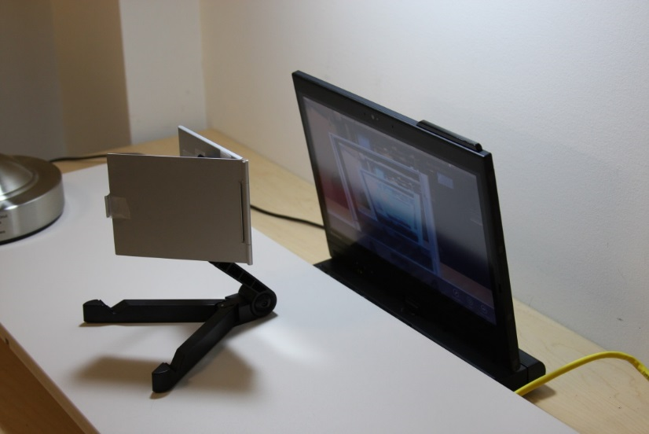
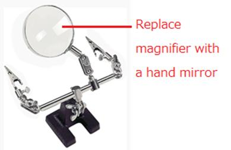
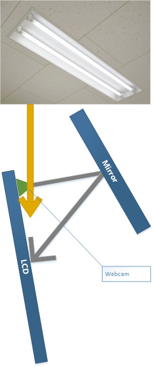
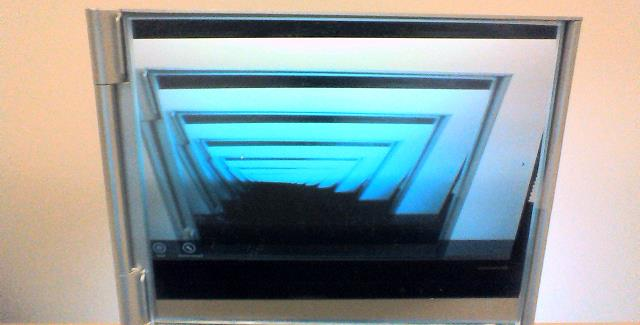
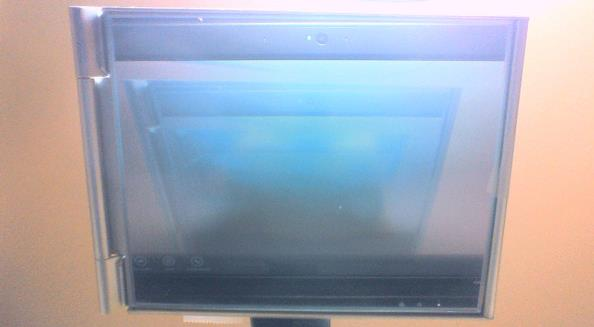
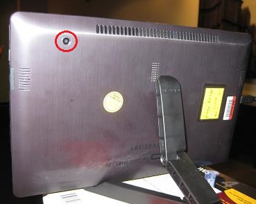
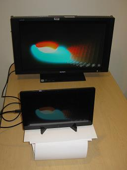

# Webcam BasicPerf System (Manual) Test: Best Practices

Physical settings and external factors often influence the test results of the Webcam Basic Performance test. This article describes how to set up a test environment to avoid these influences and achieve the most accurate video capturing test results.

>[!NOTE]
>  
The instructions in this article are specific to integrated webcams; however, you can apply many of the same best practices to testing non-integrated webcams if you modify the test set up. For system (integrated test), audio latency and AVsync are measured and enforced. Because this is not true for non-integrated webcams, a microphone is not required for non-integrated webcam tests.

 

## Example test environment

In this article, a test environment is created that consists of a laptop computer that has a built-in webcam and a small mirror. A built-in webcam is typically located on the top side of the lid of the laptop computer. You can use a flexible arm or tripod to hold the mirror, as shown in the following picture (Figure 1. Example Test Environment). In this example, the computer keyboard is put under a board and the mirror is put close to the webcam. By angling both the computer screen and the mirror and adjusting the distance, you can avoid noise (reflection) from ambient room lighting.

>[!NOTE]
>  
If you are testing a non-integrated webcam, the mirror is not necessary. In this case, you can point the camera directly at the computer screen.

 

>[!TIP]
>  
You can use a “helping hand” device to hold a mirror in place; simply replace the magnifying glass with a mirror, as shown in Figure 2. Helping Hand.

 

## Reflection

When you set up your test environment, be aware that if the computer lid is facing up, the screen can pick up reflection from ceiling lights, as shown in Figure 3. Reflection on Computer Screen. This reflection can distort test results.

We recommend that you tilt the computer screen away from the ceiling to avoid light reflection, as shown in Figure 4. Tilted Computer Screen. If you are testing a non-integrated webcam, tilt the webcam away from the ceiling in the same way.

## Brightness

Either too much or too little lighting can affect test results. Optimal brightness levels are hard to define because the optimal lighting level depends on the individual webcam. We recommend that you adjust the room brightness by using the Windows 8 camera application until you achieve a clear captured image, as shown in Figure 5. Clear Image.

Figure 6. Poor Image, shows a captured image that is distorted by too much reflected ambient light.

## Image validation

Sometimes the way that an image appears on the screen differs from the actual captured image. You can confirm the validity of the captured image by visually inspecting the captured image quality. To do this, you must add a separate computer monitor to the test environment.

Some laptop computers have a built-in webcam on the back of the laptop lid. Figure 7. Rear Camera, shows a typical location of a rear camera on a computer laptop.

You can aim the rear camera at a separate computer screen to validate the image, as shown in Figure 8. Image Capture Validation. In this example, the captured image is the same as the image on the laptop computer screen, which confirms the validity of the captured image.

## Summary of best practices

-   Position the angle and distance of the laptop webcam and the mirror to avoid ambient light reflection. You can use Windows 8 camera application to position the mirror.

-   Position the mirror so that it reflects just part of the screen: it is not necessary to reflect the entire screen for test purposes. For example, even if the image on the camera is 1/4 of the screen, the test can perform the necessary calculations.

-   The captured image should be composed of neutral colors such as black, gray, and white. Bright colors (such as red, green, and blue) and changing colors can become noise; you should avoid them.

-   Because the test also measures audio latency and AVsync for integrated webcams, set the default audio playback device to be the speakers and set the volume level to be great than 70%. Set the default recording device to be the microphone and set the volume level to be greater than 70%.

-   Validate that the captured image is the same as the viewed image.

 

 

