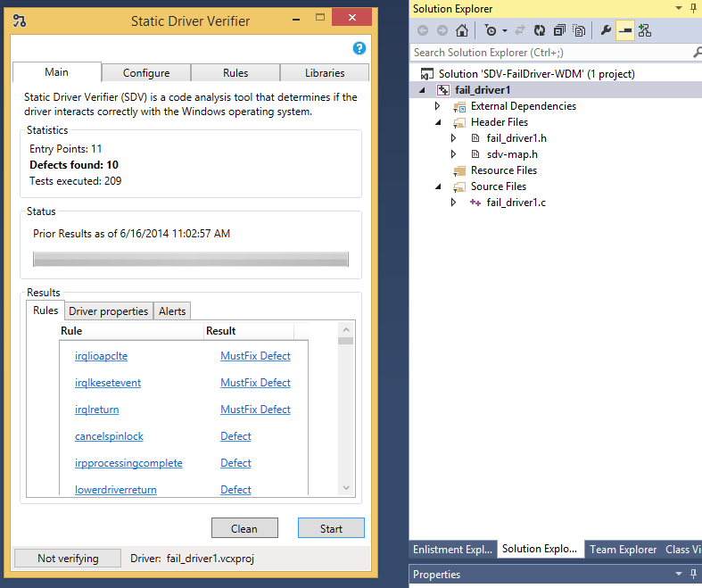
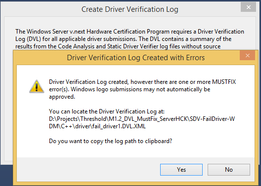
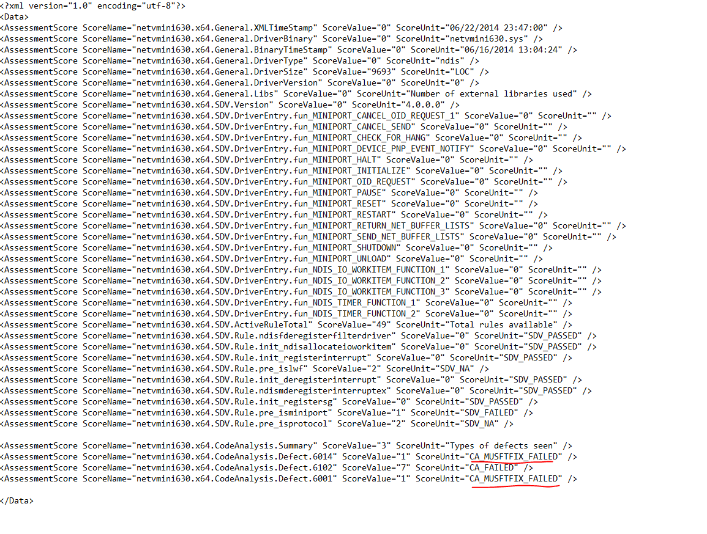

# Windows Server Must-Fix Code Analysis and Static Driver Verifier Errors affecting Network and Storage Adapter Vendors

## Overview

If your company manufactures a Network or Storage adapter that is to be Certified for Windows Server 2016, there are Code Analysis (CA) and Static Driver Verifier (SDV) driver source code errors which are considered Must-Fix in order for the driver to be successfully certified for Windows Server 2016.

The SDV user interface highlights these errors specifically for NDIS and Network related interface calls that are incorrect and considered Must-Fix in order to get a driver Certified for Windows Server 2016. The Storage interface calls are planned to be called out as well, but that functionality is not complete at this time.

The CA user interface does not currently highlight the errors it detects in Network and Storage driver sources that are incorrect and considered Must-Fix in order to get a driver Certified for Windows Server 2016. That work is planned for future versions of the CA tool.

## Criteria for Rules Selection as Must-Fix

The criteria for the SDV and CA Rules which have been selected for Network and Storage adapter drivers as being Must-Fix in order to get a driver Certified for Windows Server 2016 are as follows:

-   Accuracy - the Rule finds code errors with a low false failure rate
-   Impact - the code error can cause data corruption, hangs or crashes
-   Data Driven – the code error caused a problem in a driver that crashed and was analyzed as part of Microsoft’s Online Crash Analysis tool, OCA.
-   Experience - the code error is one included in the internal bar used by Microsoft, with high impact and security issues always being fixed
-   Minimal Annotation - there is low dependency on annotations of the driver’s sources in order for the CA and SDV tools to function. Note however that some annotations are required.

>[!NOTE]
>  
There are a few CA Rules below for which there are no links in MSDN, which are called out below. The functionality for checking these in Visual Studio Express 2013 does not exist, so other versions of Visual Studio must be used. However, the errors are generally self-explanatory.

For all other Rules, the link can be found by searching on MSDN.

For convenience, there is a short snippet of text from the links, but the links themselves usually contain more text and code examples of both correct and incorrect usage to illustrate the needed change(s).

 

## CA Rules

C6001:USING UNINITIALIZED MEMORY   
This warning is reported when an uninitialized local variable is used before it is assigned a value. This could lead to unpredictable results.

C6011:DEREFERENCING A NULL POINTER   
This warning indicates that a null pointer is being dereferenced. If the pointer value is invalid, the result is undefined.

C6014:LEAKING MEMORY   
This warning indicates that the specified pointer points to allocated memory or some other allocated resource that has not been freed.

C6063:MISSING\_STRING\_ARGUMENT\_TO\_FORMAT\_FUNCTION   
This defect can cause crashes and buffer overflows (if the called function is of the sprintf family), as well as potentially incorrect output.

C6214:CAST\_HRESULT\_TO\_BOOL   
Any comparison that uses the Boolean variable to test for HRESULT success or failure could lead to incorrect results.

C6215:CAST\_BOOL\_TO\_HRESULT   
Casting a Boolean type to an HRESULT and then using it in a test expression will yield an incorrect result.

C6216:COMPILER\_INSERTED\_CAST\_BOOL\_TO\_HRESULT   
The typical failure value for functions that return a Boolean false is a success status when it is tested as an HRESULT. This is likely to lead to incorrect results.

C6230:USING\_HRESULT\_IN\_BOOLEAN\_CONTEXT   
This warning indicates that a bare HRESULT is being used in a context, such as if statement, where a Boolean result is expected. This is likely to yield incorrect results.

C6248:CREATINGNULLDACL   
This warning identifies a call that sets a SECURITY\_DESCRIPTOR's DACL field to null, which grants full access to any user who requests it; normal security checking is not performed with respect to the object. Objects that have null DACLs can have their security descriptors altered by malicious users so that no one has access to the object.

C6259:DEADCODEINBITORLIMITEDSWITCH   
This warning indicates unreachable code caused by the result of a bitwise-AND (&) comparison in a switch expression

C6260:USEOFBYTEAREA   
This warning indicates that the results of two sizeof operations have been multiplied together.

C6268:MISPARENTHESIZED\_CASTS   
This warning indicates that a complex cast expression might involve a precedence problem when performing pointer arithmetic. In some cases, this defect causes incorrect behavior or a program crash.

C6276:CHAR\_TO\_WCHAR\_CAST   
This warning indicates a potentially incorrect cast from an ANSI string (char\_t\*) to a UNICODE string (wchar\_t \*). Using such strings with the wcs\* library of functions could cause buffer overruns and access violations.

C6277:CREATEPROCESS\_ESCAPE   
This warning indicates that the application name parameter is null and there might be spaces in the executable path name. A malicious user might insert a rogue executable with the same name earlier in the path.

C6281:BITWISERELATIONPRECEDENCEERROR   
This warning indicates a possible error in the operator precedence. This might produce incorrect results.

C6282:ASSIGNMENTREPLACESTEST   
This warning indicates that an assignment of a constant to a variable was detected in a test context.

C6284:OBJECT\_AS\_STRING\_ARGUMENT\_TO\_FORMAT\_FUNCTION   
This warning indicates that the format string specifies a string, for example, a %s specification for printf or scanf, but a C++ object has been passed instead.

C6287:REDUNDANTTEST   
This warning indicates that a redundant element was detected in an expression.

C6288:MUTUALINCLUSIONOVERANDISFALSE   
This warning indicates that in a test expression, a variable is being tested against two different constants and the result depends on both conditions being true.

C6289:MUTUALEXCLUSIONOVERORISTRUE   
This warning indicates that in a test expression a variable is being tested against two different constants and the result depends on either condition being true. This always evaluates to true.

C6290:LOGICALNOTBITWISEAND   
This warning indicates possible confusion in the use of an operator or an operator precedence.

C6291:LOGICALNOTBITWISEOR   
The ! operator yields a Boolean result, and the | (bitwise-or) operator takes two arithmetic arguments. It is difficult to judge the severity of this problem without examining the code

C6293:LOOP\_INDEX\_GOES\_NEGATIVE   
This warning indicates that a for-loop might not function as intended.

C6295:INFINITE\_LOOP   
No link in MSDN

C6296:LOOP\_ONLY\_EXECUTED\_ONCE   
This warning indicates that a for-loop might not function as intended

C6299:BITFIELD\_TO\_BOOL\_COMPARISON   
This warning indicates an incorrect assumption that Booleans and bit fields are equivalent. The comparison can yield unexpected results.

C6305:SIZEOF\_COUNTOF\_MISMATCH   
This will cause unexpected scaling in pointer arithmetic.

C6306:INCORRECT\_VARARG\_FUNCTIONCALL   
This warning indicates an incorrect function call.

C6308:REALLOCLEAK   
This warning indicates a memory leak that is the result of the incorrect use of a reallocation function.

C6312:EXCEPTIONCONTINUEEXECUTION   
This warning indicates the use of the constant EXCEPTION\_CONTINUE\_EXECUTION. This can cause an infinite loop.

C6318:EXCEPTIONCONTINUESEARCH   
This warning indicates that if an exception occurs in the protected block of this structured exception handler, the exception will not be handled because the constant EXCECPTION\_CONTINUE\_SEARCH is used in the exception filter expression. This code is equivalent to the protected block without the exception handler block because the handler block is not executed.

C6328:FORMAT\_SIZE\_MISMATCH   
For C runtime character-based routines in the family name isxxx(), passing an argument of type char can have unpredictable results.

C6384:DIVIDING\_SIZEOF\_POINTER   
This warning indicates that a size calculation might be incorrect.

C26110:FAILING TO HOLD LOCK BEFORE CALLING FUNCTION   
No link in MSDN

C28126:OBJ\_REFERENCE\_MODE   
Driver is passing UserMode or KernelMode for the AccessMode parameter, instead of using Irp-&gt;RequestorMode.

C28128:FUNCTION\_ASSIGNMENT   
The driver directly accessed a structure member that should be accessed only by using specialized functions.

C28134:POOL\_TAG   
No link in MSDN

C28135:KE\_WAIT\_LOCAL   
If the first argument to KeWaitForSingleObject is a local variable, the Mode parameter must be KernelMode

C28145:MODIFYING\_MDL   
The opaque MDL structure should not be modified by a driver

C28157:IRQL\_NOT\_USED   
There is at least one path in which the driver is executing at a different IRQL when the function completes.

C28158:IRQL\_NOT\_SET  
There is at least one path in which the IRQL value is not saved in that variable.

C28163:MUST\_NOT\_TRY   
This warning is reported when a function is of a type that should never be enclosed in a try/except block is found in a try/except block.

C28164:PVOID   
This warning is reported when a pointer to a pointer is used in a call to a function that is expecting a pointer to an object.

C28170:NO\_PAGED\_CODE   
The function has been declared to be in a paged segment, but neither PAGED\_CODE nor PAGED\_CODE\_LOCKED was found

C28171:MULTIPLE\_PAGED\_CODE   
The function has more than one instance of PAGED\_CODE or PAGED\_CODE\_LOCKED

C28719:BANNED\_API\_USAGE   
This warning indicates that a function is being used that has been banned, and has a more robust and secure replacement.

C28726:BANNED\_API\_USAGEL2   
This warning indicates that a function is being used that has been banned, and has a more robust and secure replacement.

C28735:BANNED\_CRIMSON\_API\_USAGE   
This warning indicates that a function is being used that has been banned, and has a more robust and secure replacement. ETW is the replacement

C28736:BANNED\_API\_ARGUMENT\_USAGE   
This warning indicates that a function is being used that has been banned, and has a more robust and secure replacement. ETW is the replacement

C28750:BANNED\_API\_USAGE\_LSTRLEN   
This warning indicates that a function is being used that has been banned, and has better replacements.

C28751:BANNED\_API\_USAGE\_EXALLOCATEPOOL   
Banned usage of ExAllocatePool and its variants. This warning indicates that a function is being used that has been banned, and has a more robust and secure replacement.

## Rules needed for SDV to work as well as possible

The below CA outputs are not errors per se, but rather indicate where some annotation is required in order for Static Driver Verifier to work as well as possible.

C28168:  
This warning supports Static Driver Verifier by checking that each function assigned into the dispatch table is annotated with one or more \_Dispatch\_type\_ annotations

C28169:  
This warning supports Static Driver Verifier by checking that each function assigned into the dispatch table is annotated with one or more \_Dispatch\_type\_ annotations

C28101:  
The Drivers module has inferred that the current function is a &lt;function-type&gt; function

C28022:  
The function class(es) on this function do not match the function class(es) on the typedef used to define it.

C28023:  
The function being assigned or passed should have a \_Function\_class\_ annotation for at least one of the class(es)

C28024:  
The function pointer being assigned to is annotated with the function class, which is not contained in the function class(es) list.

C28155:  
Driver routine was not declared with the correct Role type

C28208:  
Function signature doesn’t match with the function declarations

## SDV Rules

### Network

DoubleComplete   
The DoubleComplete rule specifies that NDIS drivers must not complete an object identifier (OID) request multiple times.

DoubleCompleteWorkItem   
The DoubleCompleteWorkItem rule specifies that NDIS drivers must not complete an OID request multiple times when the completion is deferred in a work item.

Init\_DeRegisterInterrupt  
The Init\_DeRegisterInterrupt rule specifies that if NdisMRegisterInterruptEx is called at least once during MPInitilize, NdisMDeregisterInterruptEx should be called at least once in MPHaltEx.

Init\_NdisAllocateIoWorkItem  
The Init\_NdisAllocateIoWorkItem rule specifies that if NdisAllocateIoWorkItem is called at least once during MiniportInitializeEx, the NdisFreeIoWorkItem function should;

-   be called at least once in MPHaltEx, if MiniportInitializeEx succeeds
-   be called in MiniportInitializeEx, if MiniportInitializeEx fails

Init\_RegisterInterrupt   
The Init\_RegisterInterrupt rule specifies that the registration of interrupts, which usually happens during initialization, must be undone if something goes wrong in the initialization process or during the halting of the miniport driver. If NdisMRegisterInterruptEx is called at least one time during MiniportInitializeEx, the NdisMDeregisterInterruptEx function must be called at least one time in MiniportHaltEx.

Init\_RegisterSG   
The Init\_RegisterSG rule specifies that the registration of the scatter-gather list (SG), which usually happens during initialization, must be undone if something goes wrong in the initialization process or during the halting of the miniport driver. If NdisMRegisterScatterGatherDma is called at least one time during MiniportInitializeEx, the NdisMDeregisterScatterGatherDma function should be called at least one time in MiniportHaltEx.

Irql\_CallManager\_Function   
The Irql\_CallManager\_Function rule specifies that the NDIS functions for the NDIS CallManager must be called at correct IRQL levels. This rule examines the following NDIS functions;

-   NdisCmActivateVc
-   NdisCmAddPartyComplete
-   NdisCmCloseAddressFamilyComplete
-   NdisCmCloseCallComplete
-   NdisCmDeactivateVc
-   NdisCmDeregisterSapComplete
-   NdisCmDispatchCallConnected
-   NdisCmDispatchIncomingCall
-   NdisCmDispatchIncomingCallQoSChange
-   NdisCmDispatchIncomingCloseCall
-   NdisCmDispatchIncomingDropParty
-   NdisCmDropPartyComplete
-   NdisCmMakeCallComplete
-   NdisCmModifyCallQoSComplete
-   NdisCmNotifyCloseAddressFamily
-   NdisCmOpenAddressFamilyComplete
-   NdisCmRegisterAddressFamilyEx
-   NdisCmRegisterSapComplete

Irql\_Connection\_Function   
The Irql\_Connection\_Function rule specifies that the NDIS connection functions for protocol drivers must be called at correct IRQL levels. This rule verifies the following NDIS functions;

-   NdisCoAssignInstanceName
-   NdisCoCreateVc
-   NdisCoDeleteVc
-   NdisCoGetTapiCallId
-   NdisCoOidRequest
-   NdisCoOidRequestComplete
-   NdisCoSendNetBufferLists

Irql\_Filter\_Driver\_Function   
The Irql\_Filter\_Driver\_Function rule specifies that the NDIS functions for filter drivers must be called at correct IRQL levels. The NDIS functions for filter drivers include the following;

-   NdisFRegisterFilterDriver
-   NdisFDeregisterFilterDriver
-   NdisFSetAttributes
-   NdisFRestartFilter
-   NdisFRestartComplete
-   NdisFPauseComplete
-   NdisFSendNetBufferLists
-   NdisFReturnNetBufferLists
-   NdisFSendNetBufferListsComplete
-   NdisFCancelSendNetBufferLists
-   NdisFIndicateReceiveNetBufferLists
-   NdisFNetPnPEvent
-   NdisFDevicePnPEventNotify
-   NdisEnumerateFilterModules

Irql\_Gather\_DMA\_Function   
The Irql\_Gather\_DMA\_Function rule specifies that the NDIS scatter/gather DMA functions must be called at correct IRQL levels. This rule verifies the following NDIS functions;

-   NdisMAllocateNetBufferSGList
-   NdisMAllocateSharedMemoryAsyncEx
-   NdisMDeregisterScatterGatherDma
-   NdisMFreeNetBufferSGList
-   NdisMRegisterScatterGatherDma

Irql\_IM\_Function   
The Irql\_IM\_Function rule specifies that the NDIS functions for Intermediate (IM) drivers must be called at correct IRQL levels. This rule verifies the following NDIS functions;

-   NdisIMAssociateMiniport
-   NdisIMCancelInitializeDeviceInstance
-   NdisIMDeInitializeDeviceInstance
-   NdisIMGetBindingContext
-   NdisIMInitializeDeviceInstanceEx

Irql\_Interfaces\_Function   
The Irql\_Interfaces\_Function rule specifies that the NDIS network interface functions must be called at correct IRQL levels. This rule verifies the following NDIS network interface functions; NdisIfAddIfStackEntry,

-   NdisIfAllocateNetLuidIndex
-   NdisIfDeleteIfStackEntry
-   NdisIfDeregisterInterface
-   NdisIfDeregisterProvider
-   NdisIfFreeNetLuidIndex
-   NdisIfGetInterfaceIndexFromNetLuid
-   NdisIfGetNetLuidFromInterfaceIndex
-   NdisIfQueryBindingIfIndex
-   NdisIfRegisterInterface
-   NdisIfRegisterProvider

Irql\_Interrupt\_Function   
The Irql\_Interrupt\_Function rule specifies that the NDIS functions for interrupts must be called at correct IRQL levels. This rule verifies the following NDIS functions;

-   NdisMDeregisterInterruptEx
-   NdisMRegisterInterruptEx

Irql\_IrqlSetting\_Function   
The Irql\_IrqlSetting\_Function rule specifies that the NDIS interrupt macros must be called at correct IRQL levels. This rule verifies the following NDIS macros;

-   NDIS\_LOWER\_IRQL
-   NDIS\_RAISE\_IRQL\_TO\_DISPATCH"

Irql\_MCM\_Function   
The Irql\_MCM\_Function rule specifies that the NDIS MCM functions for drivers must be called at correct IRQL levels.

Irql\_MCO\_Function   
The Irql\_MCO\_Function rule specifies that the NDIS MCO DDIs for miniport drivers must be called at correct IRQL levels.

Irql\_Miniport\_Driver\_Function   
The Irql\_Miniport\_Driver\_Function rule specifies that the NDIS functions for miniport drivers must be called at correct IRQL levels. This rule verifies functions for NDIS miniport driver logging, NDIS ports, and NDIS DMA interface;

-   NdisMCreateLog
-   NdisMDeregisterDmaChannel
-   NdisMDeregisterIoPortRange
-   NdisMDeregisterMiniportDriver
-   NdisMFlushLog
-   NdisMFreePort
-   NdisMFreeSharedMemory
-   NdisMGetDeviceProperty
-   NdisMGetDmaAlignment
-   NdisMMapIoSpace
-   NdisMPauseComplete
-   NdisMQueryAdapterInstanceName
-   NdisMReadDmaCounter
-   NdisMRegisterDmaChannel
-   NdisMRegisterIoPortRange
-   NdisMRegisterMiniportDriver
-   NdisMRemoveMiniport
-   NdisMResetComplete
-   NdisMRestartComplete
-   NdisMSetMiniportAttributes
-   NdisMSetupDmaTransfer
-   NdisMSleep
-   NdisMUnmapIoSpace
-   NdisMUpdateSharedMemory
-   NdisMWriteLogData

Irql\_Miscellaneous\_Function   
The Irql\_Miscellaneous\_Function rule specifies that the NDIS functions must be called at correct IRQL levels. This rule verifies the following functions;

-   KeGetCurrentProcessorNumber
-   NdisAllocateFromNPagedLookasideList
-   NdisAllocateGenericObject
-   NdisAllocateIoWorkItem
-   NdisAllocateMemoryWithTagPriority
-   NdisAnsiStringToUnicodeString
-   NdisCloseConfiguration
-   NdisCloseFile
-   NdisDeleteNPagedLookasideList
-   NdisDeregisterDeviceEx
-   NdisEqualMemory
-   NdisEqualUnicodeString
-   NdisFreeGenericObject
-   NdisFreeIoWorkItem
-   NdisFreeMemory
-   NdisFreeSpinLock
-   NdisFreeString
-   NdisFreeToNPagedLookasideList
-   NdisGeneratePartialCancelId
-   NdisGetCurrentProcessorCounts
-   NdisGetDriverHandle
-   NdisGetRoutineAddress
-   NdisGetSharedDataAlignment
-   NdisGetVersion
-   NdisInitAnsiString
-   NdisInitializeListHead
-   NdisInitializeNPagedLookasideList
-   NdisInitializeSListHead
-   NdisInitializeString
-   NdisInitUnicodeString
-   NdisMapFile
-   NdisOpenConfigurationEx
-   NdisOpenConfigurationKeyByIndex
-   NdisOpenConfigurationKeyByName
-   NdisOpenFile
-   NdisQueryAdapterInstanceName
-   NdisQueryDepthSList
-   NdisQueueIoWorkItem
-   NdisReadConfiguration
-   NdisReadNetworkAddress
-   NdisReEnumerateProtocolBindings
-   NdisSetOptionalHandlers
-   NdisSystemProcessorCount
-   NdisUnicodeStringToAnsiString
-   NdisUnmapFile
-   NdisUpcaseUnicodeString
-   NdisWaitEvent
-   NdisWriteConfiguration
-   NdisWriteErrorLogEntry
-   NdisWriteEventLogEntry

Irql\_NetBuffer\_Function   
The Irql\_NetBuffer\_Function rule specifies that the NET\_BUFFER-related functions must be called at correct IRQL levels. This rule verifies the following NDIS functions;

-   NdisAdvanceNetBufferDataStart
-   NdisAdvanceNetBufferListDataStart
-   NdisAllocateCloneNetBufferList
-   NdisAllocateFragmentNetBufferList
-   NdisAllocateMdl
-   NdisAllocateNetBuffer
-   NdisAllocateNetBufferAndNetBufferList
-   NdisAllocateNetBufferList
-   NdisAllocateNetBufferListContext
-   NdisAllocateNetBufferListPool
-   NdisAllocateNetBufferMdlAndData
-   NdisAllocateNetBufferPool
-   NdisAllocateReassembledNetBufferList
-   NdisCopyFromNetBufferToNetBuffer
-   NdisCopyReceiveNetBufferListInfo
-   NdisCopySendNetBufferListInfo
-   NdisFreeCloneNetBufferList
-   NdisFreeFragmentNetBufferList
-   NdisFreeMdl
-   NdisFreeNetBuffer
-   NdisFreeNetBufferList
-   NdisFreeNetBufferListContext
-   NdisFreeNetBufferListPool
-   NdisFreeNetBufferPool
-   NdisFreeReassembledNetBufferList
-   NdisGetDataBuffer
-   NdisGetMdlPhysicalArraySize
-   NdisGetPoolFromNetBuffer
-   NdisGetPoolFromNetBufferList
-   NdisQueryMdl
-   NdisQueryMdlOffset
-   NdisQueryNetBufferPhysicalCount
-   NdisRetreatNetBufferDataStart
-   NdisRetreatNetBufferListDataStart

Irql\_OID\_Function  
The Irql\_OID\_Function rule specifies that the NDIS OID request DDIs must be called at correct IRQL levels.

Irql\_Protocol\_Driver\_Function   
The Irql\_Protocol\_Driver\_Function rule specifies that the NDIS functions for CoNDIS clients must be called at correct IRQL levels. This rule verifies the following NDIS functions;

-   NdisClAddParty
-   NdisClCloseAddressFamily
-   NdisClCloseCall
-   NdisClDeregisterSap
-   NdisClDropParty
-   NdisClGetProtocolVcContextFromTapiCallId
-   NdisClIncomingCallComplete
-   NdisClMakeCall
-   NdisClModifyCallQoS
-   NdisClNotifyCloseAddressFamilyComplete
-   NdisClOpenAddressFamilyEx
-   NdisCloseAdapterEx
-   NdisClRegisterSap
-   NdisCompleteBindAdapterEx
-   NdisCompleteNetPnPEvent
-   NdisCompleteUnbindAdapterEx
-   NdisDeregisterProtocolDriver
-   NdisMNetPnPEvent
-   NdisOpenAdapterEx
-   NdisRegisterProtocolDriver
-   NdisUnbindAdapter

Irql\_SendRcv\_Function   
The Irql\_SendRcv\_Function rule specifies that the send and receive functions for NDIS drivers must be called at correct IRQL levels.

Irql\_StatusIndication\_Function   
The Irql\_StatusIndication\_Function rule specifies that the NDIS status indication functions for miniport and filter drivers must be called at correct IRQL levels. This rule verifies the following NDIS functions; NdisFIndicateStatus and,NdisMIndicateStatusEx

Irql\_Synch\_Function   
The Irql\_Synch\_Function rule specifies that the NDIS interrupt and synchronization DDIs must be called at correct IRQL levels.

Irql\_Timer\_Function   
The Irql\_Timer\_Function rule specifies that the NDIS timer service functions must be called at correct IRQL levels. This rule verifies the following NDIS functions;

-   NdisAllocateTimerObject
-   NdisCancelTimerObject
-   NdisFreeTimerObject
-   NdisSetTimerObject

MiniportPause\_Return   
The MiniportPause\_Return rule specifies that the MiniportPause callback function should return only NDIS\_STATUS\_SUCCESS if the pause operation is complete, or NDIS\_STATUS\_PENDING if the miniport driver is in the pausing state. Any other returned status is invalid.

NdisAllocateCloneNetBufferList   
This rule checks that NdisAllocateCloneNetBufferList and NdisFreeCloneNetBufferList are called in alternate order. The ultimate goal is to make sure all NetBuffer are free when MiniportHaltEx ends. The rule uses three different states. State changes when a NetBuffer is allocated or freed. If a NetBuffer is still allocated when the MiniportHaltEx exits, then the rule will fail.

NdisAllocateCloneNetBufferList\_InitFail   
This rule checks that NdisAllocateCloneNetBufferList and NdisFreeCloneNetBufferList are called in alternate order. The ultimate goal is to make sure all NetBuffers are freed when the initialization functions fails. The rule uses three different states. State changes when a NetBuffer is allocated or freed. If a NetBuffer is still allocated when the Initialization functions fails this rule will report a defect.

NdisAllocateFragmentNetBufferList   
This rule checks that NdisAllocateFragmentNetBufferList and NdisFreeFragmentNetBufferList are called in alternate order. The ultimate goal is to make sure all NetBuffer are freed when MiniportHaltEx ends. The rule uses three different states. State changes when a NetBuffer is allocated or freed. If a NetBuffer is still allocated when the MiniportHaltEx exits, then the rule will fail.

NdisAllocateFragmentNetBufferList\_InitFail   
This rule checks that NdisAllocateFragmentNetBufferList and NdisFreeFragmentNetBufferList are called in alternate order. The ultimate goal is to make sure all NetBuffers are freed when the initialization functions fails. The rule uses three different states. State changes when a NetBuffer is allocated or freed. If a NetBuffer is still allocated when the Initialization functions fails this rule will report a defect.

NdisAllocateFromNPagedLookasideList   
This rule checks that NdisAllocateFromNPagedLookasideList and NdisFreeToNPagedLookasideList are called in alternate order. The ultimate goal is to make sure all LookasideList are freed. The rule uses three different states. State changes when a LookasideList is allocated or freed and deleted.

NdisAllocateFromNPagedLookasideList\_InitFail   
This rule checks that NdisAllocateFromNPagedLookasideList and NdisFreeToNPagedLookasideList are called in alternate order. The ultimate goal is to make sure all LookasideList are freed. The rule uses three different states. State changes when a LookasideList entry is allocated or freed.

NdisAllocateGenericObject   
The NdisAllocateGenericObject rule specifies that NdisAllocateGenericObject and NdisFreeGenericObject are called in alternate order. The ultimate goal is to make sure all generic objects are freed when MiniportHaltEx ends. The rule uses three different states. The state changes when an NDIS generic object is allocated or freed. If an NDIS generic object is still allocated when the MiniportHaltEx exits, the rule will fail.

NdisAllocateMdl   
The NdisAllocateMdl rule specifies that NdisAllocateMdl and NdisFreeMdl are called in alternate order. The ultimate goal is to make sure all MDLs are freed when MiniportHaltEx ends. The rule uses three different states. The state changes when an MDL is allocated or freed. If an MDL is still allocated when the MiniportHaltEx exits, the rule reports the defect.

NdisAllocateMemoryWithTagPriority   
The NdisAllocateMemoryWithTagPriority rule specifies that a driver must not call NdisAllocateMemoryWithTagPriority without providing a Tag. Every memory allocation should use a unique pool tag to ensure that kernel debuggers and Driver Verifier can identify a distinct allocated block of memory.

NdisAllocateMemoryWithTagPriority\_Cleanup  
This rule checks that NdisAllocateMemoryWithTagPriority and NdisFreeMemoryWithTagPriority or NdisFreeMemory are called in alternate order. The ultimate goal is to make sure all NetBuffers are freed when the initialization functions fails. The rule uses three different states. State changes when a NetBuffer is allocated or freed. If a NetBuffer is still allocated when the Initialization functions fails this rule will report a defect.

NdisAllocateMemoryWithTagPriority\_InitFail   
This rule checks that NdisAllocateMemoryWithTagPriority and NdisFreeMemoryWithTagPriority or NdisFreeMemory are called in alternate order. The ultimate goal is to make sure all NetBuffers are freed when the initialization functions fails. The rule uses three different states. State changes when a NetBuffer is allocated or freed. If a NetBuffer is still allocated when the Initialization functions fails this rule will report a defect.

NdisAllocateNetBuffer   
The NdisAllocateNetBuffer rule specifies that NdisAllocateNetBuffer and NdisFreeNetBuffer are called in alternate order. The ultimate goal is to make sure all instances of NET\_BUFFER are freed when MiniportHaltEx ends. The rule uses three different states. The state changes when a NET\_BUFFER is allocated or freed. If a NET\_BUFFER is still allocated when the MiniportHaltEx exits, the rule reports the defect.

NdisAllocateNetBufferList   
This rule checks that NdisAllocateNetBufferList and NdisFreeNetBufferList are called in alternate order. The ultimate goal is to make sure all NetBuffer are freed when MiniportHaltEx ends.

NdisAllocateNetBufferList2   
This rule checks that NdisAllocateNetBufferList and NdisFreeNetBufferList are called in alternate order. The ultimate goal is to make sure all NetBuffer are freed when MiniportHaltEx ends. The rule uses three different states. State changes when a NetBuffer is allocated or freed. If a NetBuffer is still allocated when the MiniportHaltEx exits, then the rule will fail.

NdisAllocateNetBufferList2\_InitFail   
This rule checks that NdisAllocateNetBufferList and NdisFreeNetBufferList are called in alternate order. The ultimate goal is to make sure all NetBuffers are freed when the initialization functions fails. The rule uses three different states. State changes when a NetBuffer is allocated or freed. If a NetBuffer is still allocated when the MiniportHaltEx exits, then the rule will fail.

NdisAllocateNetBufferListPool   
This rule checks that NdisAllocateNetBufferListPool and NdisFreeNetBufferListPool are called in alternate order. The ultimate goal is to make sure all NetBuffer are freed when MiniportHaltEx ends. The rule uses three different states. State changes when a NetBuffer is allocated or freed. If a NetBuffer is still allocated when the MiniportHaltEx exits, then the rule will fail.

NdisAllocateNetBufferListPool\_InitFail   
This rule checks that NdisAllocateNetBufferListPool and NdisFreeNetBufferListPool are called in alternate order. The ultimate goal is to make sure all NetBuffers are freed when the initialization functions fails. The rule uses three different states. State changes when a NetBuffer is allocated or freed. If a NetBuffer is still allocated when the Initialization functions fails this rule will report a defect.

NdisAllocateNetBufferList\_InitFail   
This rule checks that NdisAllocateNetBufferAndNetBufferList and NdisFreeNetBufferList are called in alternate order. The ultimate goal is to make sure all NetBuffer are freed when the initialization functions fails. The rule uses three different states. State changes when a NetBuffer is allocated or freed. If a NetBuffer is still allocated when the Initialization functions fails.

NdisAllocateNetBufferMdlAndData   
This rule checks that NdisAllocateNetBufferMdlAndData and NdisFreeNetBuffer are called in alternate order. The ultimate goal is to make sure all NetBuffer are freed when MiniportHaltEx ends. The rule uses three different states. State changes when a NetBuffer is allocated or freed. If a NetBuffer is still allocated when the MiniportHaltEx exits, then the rule will fail.

NdisAllocateNetBufferMdlAndData\_InitFail   
This rule checks that NdisAllocateNetBufferMdlAndData and NdisFreeNetBuffer are called in alternate order. The ultimate goal is to make sure all NetBuffers are freed when the initialization functions fails. The rule uses three different states. State changes when a NetBuffer is allocated or freed. If a NetBuffer is still allocated when the Initialization functions fails this rule will report a defect.

NdisAllocateNetBufferPool   
This rule checks that NdisAllocateNetBufferPool and NdisFreeNetBufferListPool are called in alternate order. The ultimate goal is to make sure all NetBuffer are freed when MiniportHaltEx ends. The rule uses three different states. State changes when a NetBuffer is allocated or freed. If a NetBuffer is still allocated when the MiniportHaltEx exits, then the rule will fail.

NdisAllocateNetBufferPool\_InitFail   
This rule checks that NdisAllocateNetBufferPool and NdisFreeNetBufferListPool are called in alternate order. The ultimate goal is to make sure all NetBuffers are freed when the initialization functions fails. The rule uses three different states. State changes when a NetBuffer is allocated or freed. If a NetBuffer is still allocated when the Initialization functions fails this rule will report a defect.

NdisAllocateReassembledNetBufferList   
This rule checks that NdisAllocateReassembledNetBufferList and NdisFreeReassembledNetBufferList are called in alternate order. The ultimate goal is to make sure all NetBuffer are freed when MiniportHaltEx ends. The rule uses three different states. State changes when a NetBuffer is allocated or freed. If a NetBuffer is still allocated when the MiniportHaltEx exits, then the rule will fail.

NdisAllocateReassembledNetBufferList\_InitFail   
This rule checks that NdisAllocateReassembledNetBufferList and NdisFreeReassembledNetBufferList are called in alternate order. The ultimate goal is to make sure all NetBuffers are freed when the initialization functions fails. The rule uses three different states. State changes when a NetBuffer is allocated or freed If a NetBuffer is still allocated when the Initialization functions fails this rule will report a defect.

NdisFDeregisterFilterDriver   
A filter driver must call NdisFDeregisterFilterDriver from its FilterDriverUnload routine.

NdisMDeregisterInterruptEx   
After NdisMDeregisterInterruptEx returns control, the miniport driver cannot call the NdisMSynchronizeWithInterruptEx function.

NdisMFreeSharedMemory   
NdisMFreeSharedMemory cannot be called from a MiniportShutdownEx function.

NdisMIndicateStatusEx   
The driver must not call NdisMIndicateStatusEx after it returns from the MiniportHaltEx function.

NdisMMapIoSpace   
The NdisMMapIoSpace function should only be called in the context of MiniportInitializeEx.

NdisMNetPnPEventInOIDRequest   
This rule checks that NdisMNetPnPEvent is not called in the context of an OID request.

NdisMRegisterIoPortRange   
A miniport driver calls NdisMRegisterIoPortRange from its MiniportInitializeEx or MINIPORT\_ADD\_DEVICE functions. MiniportInitializeEx or MINIPORT\_ADD\_DEVICE must call NdisMSetMiniportAttributes before calling NdisMRegisterIoPortRange.

NdisOpenConfigurationEx   
This rule checks that NdisOpenConfigurationEx and NdisCloseConfiguration are called in alternate order. The ultimate goal is to make sure that configuration handles are closed when MiniportHaltEx exits. The rule uses three different states. The state changes when a configuration is opened or closed. If a configuration handle is still open when the MiniportHaltEx exits, a defect is reported.

NdisQueryBindInstanceName   
NdisQueryBindInstanceName allocates memory for the string that specifies the friendly name. After the caller finishes using this memory, the caller must call the NdisFreeMemory function to release the memory.

NdisReEnumerateProtocolBindings   
Protocol drivers cannot call NdisReEnumerateProtocolBindings from within the context of the ProtocolBindAdapterEx, or ProtocolUnbindAdapterEx functions. Also, protocol drivers cannot call NdisReEnumerateProtocolBindings from within the context of the ProtocolNetPnPEvent function if the ProtocolBindingContext parameter of ProtocolNetPnPEvent is not NULL. However, protocol drivers can call NdisReEnumerateProtocolBindings from within the context of ProtocolNetPnPEvent if ProtocolBindingContext is NULL. A NULL ProtocolBindingContext value indicates that the event applies to all bindings.

PeriodicTimer   
The PeriodicTimer rule specifies that the caller of NdisCancelTimerObject must be running at IRQL = PASSIVE\_LEVEL if a nonzero value was specified in the MillisecondsPeriod parameter of the NdisSetTimerObject function. If the MillisecondsPeriod parameter of the NdisSetTimerObject function was zero, callers of NdisCancelTimerObject can be running at IRQL &lt;= DISPATCH\_LEVEL.

Irqlapclte   
The IrqlApcLte rule specifies that the driver calls ObGetObjectSecurity and ObReleaseObjectSecurity only when it is executing at IRQL &lt;= APC\_LEVEL.

Irqldispatch   
The IrqlDispatch rule specifies that the driver calls the following DDIs only when it is executing at IRQL = DISPATCH\_LEVEL;

-   FreeAdapterChannel,
-   FreeMapRegisters,
-   GetScatterGatherList,
-   IoAllocateAdapterChannel,
-   IoAllocateController,
-   IoFreeController,
-   IoStartNextPacket,
-   KeAcquireSpinLockAtDpcLevel,
-   KeInsertByKeyDeviceQueue,
-   KeInsertDeviceQueue,
-   KeReleaseSpinLockFromDpcLevel,
-   KeRemoveByKeyDeviceQueue,
-   KeRemoveDeviceQueue,
-   PutScatterGatherList

Irqlexallocatepool   
The IrqlExAllocatePool rule specifies that the driver calls ExAllocatePoolWithTag and ExAllocatePoolWithTagPriority only when it is executing at IRQL &lt;= DISPATCH\_LEVEL.. A caller executing at DISPATCH\_LEVEL must specify a NonPagedXxx value for PoolType. A caller executing at IRQL &lt;= APC\_LEVEL can specify any POOL\_TYPE value.

Irqlexapclte1   
The IrqlExApcLte1 rule specifies that the driver calls ExAcquireFastMutex and ExTryToAcquireFastMutex only at IRQL &lt;= APC\_LEVEL.

Irqlexapclte2   
The IrqlExApcLte2 rule specifies that the driver calls the following routines only at IRQL &lt;= APC\_LEVEL;

-   CmRegisterCallback,
-   CmUnRegisterCallback,
-   ExAllocateFromPagedLookasideList,
-   ExAllocatePoolWithQuota,
-   ExAllocatePoolWithQuotaTag,
-   ExDeletePagedLookasideList,
-   ExFreeToPagedLookasideList,
-   ExInitializePagedLookasideList,
-   ExRegisterCallback,
-   ExSetTimerResolution,
-   ExUnregisterCallback,
-   ProbeForRead,
-   ProbeForWrite

Irqlexapclte3   
The IrqlExApcLte3 rule specifies that the driver calls the following executive support routines only at IRQL &lt;= APC\_LEVEL;

-   ExAcquireResourceExclusiveLite,
-   ExAcquireResourceSharedLite,
-   ExAcquireSharedStarveExclusive,
-   ExAcquireSharedWaitForExclusive,
-   ExConvertExclusiveToSharedLite,
-   ExDeleteResourceLite

Drivers that have errors related to IRQL can cause serious problems and could cause a computer to crash.

Irqlexapclteinline   
The IrqlExApcLteInline rule specifies that DDIs are only called at proper IRQL levels

irqlexpassive   
The IrqlExPassive rule specifies that the driver calls the following executive support routines only at IRQL = PASSIVE\_LEVEL;

-   ExCreateCallback,
-   ExIsProcessorFeaturePresent,
-   ExRaiseAccessViolation,
-   ExRaiseDatatypeMisalignment,
-   ExRaiseStatus,
-   ExUuidCreate

The IrqlExPassive rule also specifies that the driver calls ExRaiseStatus at IRQL &lt;= APC\_LEVEL.

irqlioapclte   
The IrqlIoApcLte rule specifies that the driver calls the following I/O manager routines only when it is executing at IRQL &lt;= APC\_LEVEL;

-   IoDeleteDevice,
-   IoGetInitialStack,
-   IoRaiseHardError,
-   IoRaiseInformationalHardError

irqliodispatch   
The IrqlIoDispatch rule specifies that the driver calls the following I/O Manager routines only when it is executing at IRQL &lt;= DISPATCH\_LEVEL;

-   IoGetDeviceToVerify,
-   IoSetDeviceToVerify.

irqliopassive1   
The IrqlIoPassive1 rule specifies that the driver calls the following routines only when it is executing at IRQL = PASSIVE\_LEVEL;

-   IoAttachDevice,
-   IoCreateDevice,
-   IoSetDeviceInterfaceState

The rule also specifies that the driver calls the following routine only when it is executing at IRQL = PASSIVE\_LEVEL or IRQL = APC\_LEVEL: IoBuildDeviceIoControlRequest

irqliopassive2   
The IrqlIoPassive2 rule specifies that the driver calls the following I/O Manager routines only at IRQL = PASSIVE\_LEVEL;

-   IoCheckShareAccess,
-   IoConnectInterrupt,
-   IoCreateController

irqliopassive3   
The IrqlIoPassive3 rule specifies that the driver calls the following routines only when it is executing at IRQL = PASSIVE\_LEVEL;

-   IoDetachDevice,
-   IoAssignArcName,
-   IoRegisterDeviceInterface

irqliopassive4   
The IrqlIoPassive4 rule specifies that the driver calls the following routines only when it is executing at IRQL = PASSIVE\_LEVEL;

-   IoCreateFile,
-   IoCreateNotificationEvent,
-   IoCreateSymbolicLink,
-   IoCreateSynchronizationEvent,
-   IoCreateUnprotectedSymbolicLink,
-   IoDeassignArcName,
-   IoDeleteController,
-   IoDeleteSymbolicLink,
-   IoDisconnectInterrupt

irqliopassive5   
The IrqlIoPassive5 rule specifies that the driver calls specific I/O Manager routines only when it is executing at IRQL = PASSIVE\_LEVEL.

irqlkeapclte1   
The IrqlKeApcLte1 rule specifies that the driver calls the following kernel routines only when it is executing at IRQL &lt;= APC\_LEVEL;

-   KeAcquireGuardedMutex,
-   KeAcquireGuardedMutexUnsafe,
-   KeDelayExecutionThread,
-   KeQueryActiveProcessors,
-   KeReleaseGuardedMutex,
-   KeReleaseGuardedMutexUnsafe,
-   KeTryToAcquireGuardedMutex

irqlkeapclte2   
The IrqlKeApcLte2 rule specifies that the driver calls the following kernel routines only when it is executing at IRQL &lt;= APC\_LEVEL;

-   KeAreAllApcsDisabled,
-   KeAreApcsDisabled,
-   KeDeregisterNmiCallback,
-   KeEnterCriticalRegion,
-   KeEnterGuardedRegion,
-   KeLeaveCriticalRegion,
-   KeLeaveGuardedRegion,
-   KeRegisterNmiCallback

irqlkedispatchlte   
The IrqlKeDispatchLte rule specifies that the driver calls the following kernel routines only when it is executing at IRQL &lt;= DISPATCH\_LEVEL;

-   KeAcquireSpinLock,
-   KeCancelTimer,
-   KeClearEvent,
-   KeFlushIoBuffers,
-   KeInitializeDeviceQueue,
-   KeInitializeTimer,
-   KeInitializeTimerEx,
-   KePulseEvent,
-   KeRaiseIrqlToDpcLevel,
-   KeReadStateEvent,
-   KeReadStateTimer,
-   KeReleaseMutex,
-   KeRemoveEntryDeviceQueue,
-   KeResetEvent,
-   KeSaveFloatingPointState,
-   KeSetTimer,
-   KeSetTimerEx

irqlkeraiselower   
The IrqlKeRaiseLower rule specifies that the driver does the following when raising and lowering the IRQL;

When the driver calls KeRaiseIrql, it is executing at an IRQL that is lower than or equal to the value of the NewIrql parameter.

The driver calls KeLowerIrql only after calling KeRaiseIrql or KeRaiseIrqlToDpcLevel.

This rule permits nested calls to KeRaiseIrql, KeRaiseIrqlToDpcLevel, and KeLowerIrql.

irqlkeraiselower2   
The IrqlKeRaiseLower2 rule specifies that drivers use KeLowerIrql to restore the original IRQL raised by a preceding call to KeRaiseIrql or KeRaiseIrqlToDpcLevel. This rule permits nested calls to KeRaiseIrql, KeRaiseIrqlToDpcLevel and KeLowerIrql.

irqlkereleasespinlock   
The IrqlKeReleaseSpinLock rule specifies that the driver calls KeReleaseSpinLock only when it is executing at IRQL = DISPATCH\_LEVEL. This rule also specifies that the value of the NewIrql parameter in the call to KeReleaseSpinLock is equal to the IRQL at which the driver was executing before the call to KeAcquireSpinLock. (This value is also the value of the OldIrql parameter that is supplied by KeAcquireSpinLock.)

irqlkewaitformultipleobjects   
The IrqlKeWaitForMultipleObjects rule specifies that callers of the KeWaitForMultipleObjects routine must be running at proper IRQL based upon the Timeout parameter.

Callers of IrqlKeWaitForMultipleObjects routine can be running at IRQL &lt;= DISPATCH\_LEVEL, except in the following situations;

If Timeout &lt;&gt; 0, the caller of the KeWaitForMultipleObjects routine must be running at IRQL &lt;= APC\_LEVEL.

If Timeout != NULL and \*Timeout = 0, the caller of the KeWaitForMultipleObjects routine must be running at IRQL = DISPATCH\_LEVEL.

If Timeout = NULL, or \*Timeout != 0, the caller of the KeWaitForMultipleObjects routine must running at IRQL &lt;= APC\_LEVEL.

irqlkewaitformutexobject   
The IrqlKeWaitForMutexObject rule specifies the driver to call the KeWaitForMutexObject routine at the proper IRQL based on the value of the Timeout parameter:

If Timeout points to a zero value, the driver is executing at IRQL = DISPATCH\_LEVEL.

If Timeout is NULL, or points to any value other than zero, the driver is executing at IRQL &lt;= APC\_LEVEL.

irqlmmapclte   
The IrqlMmApcLte rule specifies that the driver calls the following memory manager routines only when it is executing at IRQL &lt;= APC\_LEVEL;

-   MmAllocateNonCachedMemory,
-   MmFreeNonCachedMemory,
-   MmAllocatePagesForMdl,
-   MmFreePagesFromMdl,
-   MmLockPagableDataSection,
-   MmLockPagableSectionByHandle,
-   MmPageEntireDriver,
-   MmResetDriverPaging,
-   MmSecureVirtualMemory,
-   MmUnlockPagableImageSection,
-   MmUnsecureVirtualMemory

irqlmmdispatch   
The IrqlMmDispatch rule specifies that the driver calls MmFreeContiguousMemory only when it is executing at IRQL &lt;= DISPATCH\_LEVEL.

irqlobpassive   
The IrqlObPassive rule specifies that the driver calls ObReferenceObjectByHandle only when it is executing at IRQL = PASSIVE\_LEVEL.

irqlpspassive   
The IrqlPsPassive rule specifies that the driver calls the following Process Structure routines only when it is executing at IRQL = PASSIVE\_LEVEL;

-   PsCreateSystemThread,
-   PsGetVersion,
-   PsSetCreateProcessNotifyRoutine,
-   PsSetCreateThreadNotifyRoutine,
-   PsSetLoadImageNotifyRoutine,
-   PsTerminateSystemThread

irqlrtlapc   
The IrqlRtlApc rule specifies that the driver calls RtlCreateUnicodeString only when it is executing at IRQL &lt;= APC\_LEVEL.

irqlrtlpassive   
The IrqlRtlPassive rule specifies that the driver calls RtlDeleteRegistryValue only when it is executing at IRQL = PASSIVE\_LEVEL.

irqlrtlpassive2   
The IrqlRtlPassive rule specifies that the driver calls Rtl\* functions only when it is executing at IRQL = PASSIVE\_LEVEL.

irqlzwpassive   
The IrqlZwPassive rule specifies that the driver calls ZwClose only when it is executing at IRQL = PASSIVE\_LEVEL.

### Storage

Note – the Must-Fix Rules are based on examining the information for each Rule from this URL, <http://msdn.microsoft.com/en-us/library/windows/hardware/jj126200(v=vs.85).aspx>

### DDIs

HwStorPortProhibitedDDIs  
This rule contains a list of WDM DDIs (excluding interlocked functions) that should not be called in physical StorPort miniport drivers.

StorPortDDIsPortOnly  
This rule contains a list of StorPort port-only DDIs (excluding interlocked functions) that should not be called in StorPort miniports.

StorPortDeprecated  
This rule verifies that the driver does not call either of these deprecated routines; StorPortValidateRange or StorPortLogError.

### IrqL

IrqlDispatch  
This rule verifies that the following routines are only called at IRQL = DISPATCH\_LEVEL.

IrqlKeReleaseSpinLock  
This rule verifies that KeReleaseSpinLock is called at IRQL = DISPATCH\_LEVEL only. It must also set the IRQL to the previous IRQL level. Typically this call would be preceded by a call to KeAcquireSpinLock.

SpChangeIrql  
This rule verifies that the StorPort callback routines return at the same IRQL level as the level at which they are called.

SpIrql  
This rule verifies that the routines TdiRegisterPnPHandlers and TdiDeregisterPnPHandlers are only called at IRQL lower than DISPATCH\_LEVEL. However, if ExFreeToNPagedLookasideList is called, the rule passes.

StorPortIrql  
The StorPortIrql rule checks that StorPort routines are called at the correct IRQL levels.

### Locking

CancelSpinLock  
The CancelSpinLock Rule (Storport) rule verifies that each call to IoAcquireCancelSpinLock is promptly followed by a call to IoReleaseCancelSpinLock.

QueuedSpinLock  
The QueuedSpinLock rule verifies that in-stack queued spin locks that are acquired using KeAcquireInStackQueuedSpinLock are promptly released using KeReleaseInStackQueuedSpinLock. In addition, at the end of a dispatch or cancel routine, the driver should not hold any locks.

QueuedSpinLockRelease  
This rule verifies that the driver does not call KeReleaseInStackQueuedSpinLock without first acquiring the lock via KeAcquireInStackQueuedSpinLock.

SpinLock  
This rule verifies that a call to KeAcquireSpinLock is promptly followed by a call to KeReleaseSpinlock. If a driver calls KeAcquireSpinLockRaiseToDpc or KeAcquireSpinLock again prior to releasing the lock, it fails the rule. In addition, before exiting the dispatch or cancel routine, the driver must release the spin lock.

SpinLockDpc  
This rule verifies that a call to KeAcquireSpinLockRaiseToDpc is promptly followed by a call to KeReleaseSpinlock. If a driver calls KeAcquireSpinLock or KeAcquireSpinLockRaiseToDpc again prior to releasing the lock, it fails the rule. In addition, before exiting the dispatch or cancel routine, the driver must release the spin lock.

StorPortMSILock  
Miniport drivers are required to acquire the MSI spin lock for a message if, and only if, the InterruptSynchronizationMode member of the PORT\_CONFIGURATION\_INFORMATION (Storport) structure is set to InterruptSynchronizePerMessage. This rule verifies that calls to StorPortAcquireMSISpinLock are only made if the synchronization mode is InterruptSynchronizePerMessage.

StorPortSpinLock  
This rule verifies that locks that are acquired via StorPortAcquireSpinLock are promptly released via StorPortReleaseSpinLock. The miniport driver fails the rule if it attempts to acquire a lock that it had already acquired, or if it attempts to release a lock that it had not acquired. In addition, at the end of the dispatch or cancel routine, the driver should not hold any spin locks.

StorPortSpinLock3  
The StorPortSpinLock3 rule verifies the lock acquisition hierarchy that is described in the documentation for the StorPortAcquireSpinLock routine.

### SRB Processing

SpDuplex  
This rule verifies that this miniport is in Full Duplex mode. Any driver built according to the StorPort-miniport model must be in Full Duplex mode. Half Duplex should only be used when porting an existing SCSI driver to StorPort.

SpNoWait  
This rule verifies that waits or data allocation are not performed inside StartIo.

SpReturnValue  
This rule verifies that the driver's implementations of HwStorFindAdapter and VirtualHwStorFindAdapter return a valid status. A valid status is one of the following; SP\_RETURN\_FOUND, SP\_RETURN\_ERROR, SP\_RETURN\_BAD\_CONFIG, or SP\_RETURN\_NOT\_FOUND.

StorPortAllocatePool2  
This rule verifies that the miniport makes the correct number of calls to StorPortAllocatePool and StorPortFreePool. If StorPortAllocatePool returns a failure (STOR\_STATUS\_INSUFFICIENT\_RESOURCES), the miniport must not attempt to call StorPortFreePool. In addition, upon exit from a callback, the number of calls to StorPortAllocatePool and StorPortFreePool must be equal.

StorPortBuildIo  
This rule verifies that if the StorPort miniport's StorPortBuildIo routine returns FALSE, the SRB in question is not passed to StartIo. (In such cases, the miniport driver must complete the SRB by calling StorPortNotification with a notification type of RequestComplete from StorPortBuildIo or someplace else).

StorPortCompleteRequest  
This rule verifies that no calls to StorPortCompleteRequest are made by the miniport. Usage of the StorPortCompleteRequest is not recommended; miniports should instead call StorPortNotification with notificationType = RequestComplete.

StorPortEnablePassive  
This rule verifies that StorPortEnablePassiveInitialization is not called from any StorPort miniport driver routine other than HwInitialize.

StorPortNotification2  
This rule verifies that calls to StorPortNotification use only allowed (i.e. documented) notification types.

StorPortPassiveFromHwInit  
StorPortEnablePassiveInitialization should not be called within the HW Initialization entry point for Storport drivers if the HW Initialization entry point can be called directly from the HW Adapter Control entry point.

StorPortPerfOpts  
This rule verifies that the PerfConfigData parameter that is passed to StorPortInitializePerfOpts is not NULL.

StorPortStartIo  
Waits or data allocation must never be performed in the miniport's StartIo routine. The driver fails the rule if it calls StorPortStallExecution or another function that involves time-consuming operations. Since StartIo is synchronized, these calls should mostly be done in BuildIo.

### Virtual Miniport

DoubleExFreePool  
This rule verifies that the driver does not attempt to free the same block of pool memory twice.

StorPortVirtualDevice  
This rule verifies that upon exit from the HwStorFindAdapter routine, the VirtualDevice field in the PORT\_CONFIGURATION\_INFORMATION (Storport) structure has been set to FALSE. The rule applies only to physical StorPort miniports.

StorPortVirtualDevice2  
This rule verifies that upon exit from the HwStorFindAdapter routine, the VirtualDevice field in the PORT\_CONFIGURATION\_INFORMATION (Storport) structure has been set to TRUE. The rule applies only to virtual StorPort miniports.

WithinCriticalRegion  
This rule verifies that the driver's calls to certain synchronization functions are made only while normal kernel APC delivery is disabled.

## Screenshots of Analysis Tool Interfaces

### SDV

### Create Driver Verification Log (DVL) file for submission package

### DVL File data

 

 

