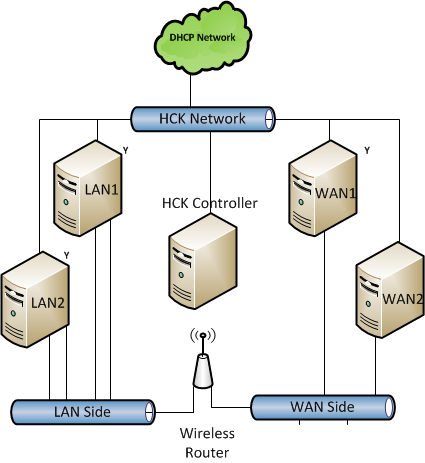
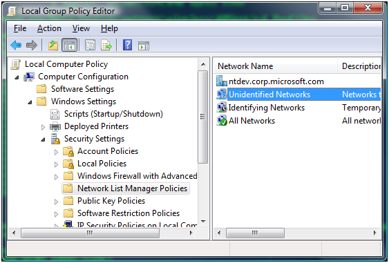
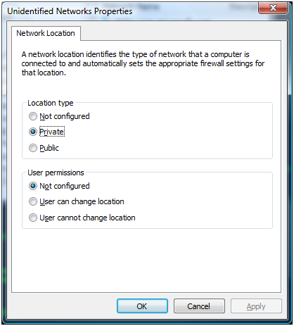
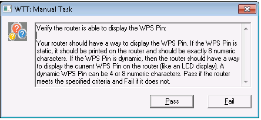

# Wireless Router Testing Prerequisites

This section describes the tasks that you must complete before you test a wireless router by using the Windows Hardware Lab Kit (Windows HLK):

-   [Hardware requirements](#bkmk-hck-wrouter-hr).

-   [Software requirements](#bkmk-hck-wrouter-sr).

-   [Test computer configuration](#bkmk-hck-wrouter-tc).

**In this section:**

-   [Troubleshooting Wireless Router Testing](troubleshooting-wireless-router-testing.md)

## Hardware requirements

The following hardware is required for wireless router testing.

-   Basic Windows HLK test setup (Controller, Studio, and client systems). See [Windows HLK Getting Started](..\getstarted\windows-hlk-getting-started.md)

-   Four test computers. Each test computer must meet the Windows HLK prerequisites. See [Windows HLK Prerequisites](..\getstarted\windows-hlk-prerequisites.md) for more information.

-   At least two 100-megabit switches (more may be required depending on the number of available Ethernet ports on the DUT).

## Software requirements

The following software is required to run the Device.Networking tests:

-   The latest Windows HLK filters and software updates.

-   Windows 7 client x86 for Windows 7 certification or Windows 8 x86 client for Windows 8 certification.

## Test computer configuration

Among the four test computers, there are three individual configurations. The test computers are designated as LAN1, LAN2, WAN, and SERVER. All system requirements are in addition to minimum system requirements for Windows Vista, Windows 7 or and Windows 8. The following network schematic illustrates how each is connected in the network:

>[!NOTE]
>  
In the above illustration, **Y** indicates a computer that is wirelessly connected to the router.

 

Before you being to test your wireless router, configure each test computer and the machine poll according to the procedures described in the next sections.

### Wireless router

The wireless router should have its DHCP server enabled. You will need to set the WAN port to this static IP address: 17.1.1.1. The wireless router should be in a controlled environment with its wireless network open (no security enabled). UPnP™ should be enabled, even if not by default. The 5 GHz radio (if equipped) should be turned off.

### Configuring LAN1 and LAN2

The test configuration requires:

1.  Three 10/100 Ethernet adapters (one of which must support QoS 802.1p).

2.  One 802.11a/b/g wireless adapter (the wireless adapter must use an NDIS 6.0-compliant native Wi-Fi driver with WMM support).

3.  Support for QueryPerformanceFrequency and QueryPerformanceCounter APIs (for the Wi-Fi performance test). This requirement is typically supported in modern systems.

The test computers identified as LAN1 and LAN2 have an identical setup procedure. Please replicate the following steps for each machine:

1.  Connect two of the Ethernet cards to the LAN side of the wireless router via Ethernet cable. One of these two must be QoS 802.1p capable.

2.  Connect the third Ethernet card to the HLK network.

3.  Open the network connections folder. This can be done by clicking **Manage Network Connections** in the **Network Center** in the **Control Panel**.

4.  Rename the network connections such that:

    -   The connection to the HLK network is named **DTM**.

    -   The connection to the LAN side of the router with the QoS capable interface is named **LAN\_P**.

    -   The non QoS capable interface connected to the LAN side is named **LAN**.

    -   The wireless connection is named **Wireless**.

5.  Ensure all of the connections are marked Private in the **Network Sharing Center**.

6.  Make sure Network Discovery is enabled in the firewall for all connection types.

7.  Enable QoS 802.1p on the LAN\_P connection (for more information, see the card manual).

8.  The wireless connection needs be associated with the router's wireless network.

9.  Run configuration Jobs: "Setup Machine LAN1" and "Setup Machine LAN2" for Machine Lan1 and Machine2 respectively. These jobs will set Static IP addresses and setup machine dimensions for each machine as follows:

    <table>
    <colgroup>
    <col width="33%" />
    <col width="33%" />
    <col width="33%" />
    </colgroup>
    <thead>
    <tr class="header">
    <th>Interface</th>
    <th>LAN1</th>
    <th>LAN2</th>
    </tr>
    </thead>
    <tbody>
    <tr class="odd">
    <td>
LAN
</td>
    <td>
192.168.0.10
</td>
    <td>
192.168.0.20
</td>
    </tr>
    <tr class="even">
    <td>
LAN_P
</td>
    <td>
192.168.0.11
</td>
    <td>
192.168.0.21
</td>
    </tr>
    <tr class="odd">
    <td>
Wireless
</td>
    <td>
192.168.0.12
</td>
    <td>
192.168.0.22
</td>
    </tr>
    <tr class="even">
    <td>
DTM
</td>
    <td>
IP Address assigned by DHCP
</td>
    <td>
IP Address assigned by DHCP
</td>
    </tr>
    </tbody>
    </table>

     

10. For each machine, run **ipconfig** at a command prompt to verify that each interface has correctly assigned IP address.

11. To ensure IP connectivity on all interfaces try to ping other addresses. If firewall is enabled, then open the ping exception via: **netsh firewall set icmpsettings 8**.

12. Make sure that all network connections are set to **Private** in the **Network Center** in the **Control Panel**.

    In order to ensure that your test network remains set to Private, you can set a policy to do this automatically by running **gpedit.msc** (as an Administrator) and modifying the settings for "Unidentified Networks":

    

    

### Configuring WAN1

The system requirements for WAN1 are as follows:

-   Windows 7 client x86 for Windows 7 certification or Windows 8 x86 client for Windows 8 certification.

-   Two 10/100 Ethernet adapters.

-   One 802.11b/g wireless adapter (the adapter must use NDIS 6.0 compliant native Wi-Fi driver with WMM support.

The test computer identifies as WAN should be setup using the following steps:

1.  Connect one Ethernet card to the WAN side of the wireless router. Because most routers only have one port for the WAN interface, a switch may be used (as shown in the diagram).

2.  Connect the other Ethernet card to the HLK network.

3.  Open the network connections folder (this can be done by clicking **Manage Network Connections** in the **Network Center** in the **Control Panel**.

4.  Rename network connections such that:

    1.  The connection to the DTM network is named **Test**.

    2.  The connection to the WAN side of the router is named **WAN**.

    3.  The wireless connection is named **Wireless**.

5.  The wireless connection needs be associated with the router's wireless network.

6.  Run configuration Job: **Setup Machine WAN1**. These jobs will set static IP addresses and setup machine dimensions as follows:

    <table>
    <colgroup>
    <col width="50%" />
    <col width="50%" />
    </colgroup>
    <thead>
    <tr class="header">
    <th>Interface</th>
    <th>WAN1</th>
    </tr>
    </thead>
    <tbody>
    <tr class="odd">
    <td>
Wireless
</td>
    <td>
192.168.0.30
</td>
    </tr>
    <tr class="even">
    <td>
WAN
</td>
    <td>
17.1.1.10
</td>
    </tr>
    <tr class="odd">
    <td>
DTM
</td>
    <td>
IP Address assigned by DHCP
</td>
    </tr>
    </tbody>
    </table>

     

7.  Run **ipconfig** at a command prompt to verify that each interface has a correctly assigned IP address.

8.  Ensure IP connectivity on all interfaces. If firewall is enabled, then open the ping exception via: **netsh firewall set icmpsettings 8**.

9.  Ensure that all network connections are set to **Private** in the **Network Center** in the **Control Panel**.

### Configuring WAN2

The test computer identified as WAN2 should be setup using the following steps:

This computer should have Windows 7 client x86 or Windows 8 client x86 and three 10/100 Ethernet adapters.

1.  Connect two of the Ethernet adapters to the WAN side of the router. A switch may be needed to accomplish this.

2.  Connect the remaining Ethernet adapter to the HLK network.

3.  Open the network connections folder. This can be done by clicking Manage Network Connections in the Network Center in the Control Panel.

4.  Rename network connections such that:

    1.  The connection to the HLK network is named **HLK**.

    2.  The connections to the WAN side of the router are named **WAN1** and **WAN2** respectively.

5.  Run configuration Job: Setup Machine WAN2. These jobs will set static IP addresses and setup machine dimensions as follows:

    <table>
    <colgroup>
    <col width="50%" />
    <col width="50%" />
    </colgroup>
    <thead>
    <tr class="header">
    <th>Interface</th>
    <th>WAN2</th>
    </tr>
    </thead>
    <tbody>
    <tr class="odd">
    <td>
WAN1
</td>
    <td>
17.1.1.20
</td>
    </tr>
    <tr class="even">
    <td>
WAN2
</td>
    <td>
17.1.1.21
</td>
    </tr>
    <tr class="odd">
    <td>
HLK
</td>
    <td>
IP address assigned by DHCP
</td>
    </tr>
    </tbody>
    </table>

     

6.  Run **ipconfig** at a command prompt to verify that each interface has correctly assigned IP address.

7.  Ensure IP connectivity on all interfaces. If firewall is enabled, then open the ping exception via: **netsh firewall set icmpsettings 8**.

8.  Ensure that all network connections are set to **Private** in the **Network Center** in the **Control Panel**.

### Machine pool configuration

Proper setup of the machine pool is vital. When the machine pool is not properly configured, scheduled jobs will stay in the status "Scheduler". Configuration of the machine pool allows the Windows HLK controller to assign each individual task to the correct machine. For each of the four machines in the pool, a configuration job will have to be run. This job will set "dimensions" on that machine that will describe its role in the network.

To run the configurations job, complete the following steps:

1.  Open up HLK Manager.

2.  Choose **Explorers** and then choose **Job Monitor**.

3.  On the left side, select the proper machine pool.

4.  Right click the machine and select **Schedule**.

5.  Select **Browse**, and then select the job **Setup Machine XYZ** found under **WDK Tests\\Networking\\Routers\\Configuration**. (Where **XYZ** correspond to LAN1, LAN2, WAN1, and WAN2).

6.  Click **Start**.

Make sure that the test computer is in the ready state before you begin your testing. If a test requires parameters to be set before it is run, a dialog box will be displayed for that test. Review the specific test topic for more information.

Some Windows HLK tests require user intervention. When running tests for a submission, it is a best practice to run the automated tests in a block separately from manual tests. This prevents a manual test from interrupting completion of an automated test.

### Running the tests

In order to receive certification for a wireless router, you must create a submission which contains all of the run tests. There are three steps to doing this: creating a new Project, running the tests, and creating a submission package to send to Microsoft.

1.  Open HLK Studio.

2.  In the **Project** tab click **Create project** – name your project something descriptive.

3.  In the **Selection** tab select your machine pool from the dropdown. The section below that should populate with all the available devices.

4.  Choose **Device Manager** in the left column.

5.  Scroll through the list and locate the router you are testing.

6.  There may be more than one listed. Select the one that is listed for the LAN1 machine AND the one that states it’s a WDKVirtualDevice\_&lt;number&gt; for the Device Instance ID.

7.  On the **Tests** tab you should see all the tests for the router if you only see a few go back to the **Selection** tab and make sure you have the correct device selected.

8.  Check the tests you wish to run and click **Run Selected**.

9.  A secondary window will pop up asking for additional parameters. The parameters break down as follows:

    -   Data\_BSSID = the BSSID of the router

    -   Data\_DevicePIN = the WPS PIN of the router

    -   ProfileFile = the profile used to connect to the router (see the sustained throughput tests)

    -   UUID = the UUID of the router (used for the pnpx test)

10. Once the parameters are filled in you must ensure you have the correct machines selected in the Machine Set section.

    -   To do this simply click the offending **Test name** and select from the drop down each **Role** and then check the box next to the machine that corresponds to that role.

11. Once the **Parameters** and **Machine Set** are set click **OK**.

12. Test will schedule to run.

13. Once the tests complete and pass, choose the **Package** tab and click the **Create Package** button in the lower right to create the .HLKX package for submission.

Some of the tests have special requirements that must be fulfilled before you can run them. Below is a list of those requirements for each specific test or test category. Please pay close attention as failure to do so may result in unexpected failures.

## WCN tests

All WCN tests start with prefix “WCN”. The automated tests can be run in any order; the only requirement is that they should be scheduled one at a time.

Before running the tests, make sure the device is plugged in and it is in a configurable state. All of the tests try to configure the device. If the device does not support being configured when it is already configured then the router will need to be reset to a configurable state before running a test.

The WCN Tests uses the UPnP protocol as the underlying transport to configure the device, so ensure the firewall doesn’t block UPnP traffic (firewall can be disabled from **Control Panel**) and SSDP service is not disabled or stopped.

All the jobs require the routers BSSID and WPS PIN. The wireless network BSSID is usually the MAC address of the wireless interface. Available wireless network BSSIDs can be viewed by executing the command **netsh wlan show networks mode=bssid** on the LAN1 machine. Static WPS pins should be 8 digits and dynamic WPS pins should be 8 or 4 digits.

There should be no wireless profiles on the LAN machines and the machines should not be associated with any wireless networks, before starting the WCN wireless tests. You may see a pop-up on the machine saying the computer could not connect to a particular network. This is expected, please ignore the pop-up.

### WCN display WPS pin test

The following test verifies that a Wireless AP properly displays the WPS PIN. When the test is executed you will see the following dialog box on one of the LAN computers. Select Pass or Fail accordingly.

**Feature Path:** $\\WDK Tests\\Networking\\Routers\\WCN

-   WCN Wireless Verify the router has a WPS Pushbutton

### Proxy test

The following test verifies that a wireless AP is capable of proxying wireless EAP WPS messages to Ethernet UPnP and vice versa. A router with this functionality allows a Microsoft WCN-capable computer connected to the wireless AP via Ethernet to act as a WPS registrar. The test will act as a WPS registrar on the Ethernet side of the router and a WPS enrollee on the Wireless EAP side of the router. The test will send a WPS M1 message to the AP under test over wireless EAP. The test expects to receive the same WPS M1 message via Ethernet UPnP through the AP under test. The test will then send a WPS M2D message over Ethernet UPnP to the AP under test. The test expects to receive the same WPS M2D message via Wireless EAP through the AP under test

**Feature Path:** $\\WDK Tests\\Networking\\Routers\\WCN Wireless

WCN Wireless M1-M2D Proxy Functionality – Windows 7 only

WCN Wireless Test Proxy Functionality WPS10h Only V2 – Windows 8 only

WCN Wireless Test Proxy Functionality WPS20 Only V2 – Windows 8 Only

### Push button auth tests

The following logo tests verify that a Wireless AP is capable of using push button authentication in a Wireless EAP WPS session. The test acting as the registrar will initiate a Wireless EAP WPS configuration session with the AP under test using PIN for authentication. The test will comply with the WPS Protocol and confirm the AP is also using all required attributes in its messages. During the configuration session the test will configure the AP under test to use WPA2PSK AES for its wireless security settings. After completing the Wireless EAP in-band WPS configuration session, the test will wait up to 60 seconds for the AP under test to reboot and apply settings. To confirm the AP under test is properly implementing the wireless settings, the test will use a wireless profile to connect to the AP under test, verify connectivity, and disconnect from the AP under test. The logo test will then act as an enrollee and prompt the user to push the ‘WPS Button’. After the user unblocks the logo test by pushing any key, the logo test will establish a Wireless EAP WPS session with the Wireless AP under test using Push Button Authentication (AKA PBC).

**Feature Path:** $\\WDK Tests\\Networking\\Routers\\WCN Wireless

-   WCN Wireless Push Button Auth (Push Button Test) – Windows 7 only

-   WCN Wireless Push Button Auth (Push Button Test) v2 – Windows 8 Only

### Registrar discovery test

The Registrar Discovery Test verifies that a Wireless AP is capable of being discovered through an EAP WPS M1-M2D message exchange. The test will act as a registrar and respond to the Wireless AP’s M1 request message with a M2D response message. The test expects the Wireless AP to respond to the M2D response message with a NACK request message. The test will then respond with a NACK response. The Wireless AP should end the EAP session with an EAP-Fail message.

****Feature Path: $\\WDK Tests\\Networking\\Routers\\WCN Wireless

-   WCN Wireless Registrar Discovery

### Compare probe response and M1 message test

The compare probe response and M1 message test will verify that the probe response and M1 message are identical.

**Feature Path:** $\\WDK Tests\\Networking\\Routers\\WCN Wireless

-   WCN Wireless Compare Probe Response and M1 messages

### IGD data tests

The IGD Data tests verify the routers ability to route UDP and TCP traffic across the WLAN and LAN networks.

### IGD data connection test (verify UPnP is enabled)

Test adds port mappings to router using UPnP interface and then verifies port mapping by sending traffic from WAN machine to LAN machine. Test fails if router doesn’t not properly implement UPnP port mapping interface.

### IGD data connection test (verifies IGD type is cone or restricted)

Test determines router’s NAT type. Test passes if NAT type is cone or restricted. Test fails if NAT type is symmetric

### IGD data connection test (verifies ECN does not trigger router reboot)

Test establishes TCP connection through router with Explicit Congestion Notification (ECN) enabled. Test fails if connection is not established.

### IGD data transmission UDP test

Test streams UDP data through the router for 8 minutes. Test fails if more than 4 packets are dropped.

### IGD data transmission test for Windows scaling

Test performs TCP Windows Scaling checks between a LAN machine and a WAN machine. The test sets the LAn machines scaling factor to 8, sets the WAN machines scaling factor to 3, and restricts auto-tuning. The test fails if TCP connections and data transfers are not properly executed between two machines.

### IGD data transmission test for ECN streaming

Test sends and receives data over TCP through router with Explicit Congestion Notification (ECN) enabled. Test fails if data is not properly transmitted and received.

### IGD byte counters tests

These tests can be identified by the presence of “TotalBytesSent” or “TotalBytesReceived” in their names. The tests should be run one at a time. Although the sequence is not important it is recommended that the Basic logo tests are ran first.

>[!IMPORTANT]
>  
Before running the tests, please perform the following on each LAN-side machine. This is required to make sure that the LAN-side machines can resolve the correct IP address of the WAN machine.

-   The user logged on to the console of the machines has administrator privileges.

-   UPnP is enabled on the IGD.

 

### Wi-Fi performance test

Before running a particular WiFi performance job with a specific wireless configuration (SSID, PHY setting, security settings) one has to setup the tested device properly before the test is started. Because the tests cover different wireless settings it’s not possible to schedule all WiFi performance jobs at once. It is possible though to group these jobs based on the given wireless configuration.

It’s generally good idea to validate connectivity for a given wireless configuration before the test is started. It means applying a given wireless profile at a machine (L1 or L2) and try if you’re able to connect using this profile. The used wireless profiles are stored in \\\\&lt;your HLK controller&gt;\\Tests\\x86fre\\nttest\\NetTest\\wireless\\apcert\\profiles.

For the Windows 7 and Windows 8 certification, there are only two available wireless performance tests. Both use the SSID WINDOWS\_LOGO and the pass phrase “Nativewifi”. It should also be noted that the Windows 7 wireless performance tests MUST be conducted over open air and not in a shielded room. Details are in the following table.

<table>
<colgroup>
<col width="20%" />
<col width="20%" />
<col width="20%" />
<col width="20%" />
<col width="20%" />
</colgroup>
<thead>
<tr class="header">
<th>Test Case</th>
<th>SSID</th>
<th>PHY</th>
<th>Wireless Security</th>
<th>Security Key</th>
</tr>
</thead>
<tbody>
<tr class="odd">
<td>
Sustained Throughput-802.11G_WPA2-PSK
</td>
<td>
WINDOWS_LOGO
</td>
<td>
802.11g
</td>
<td>
WPA2-PSK
</td>
<td>
Nativewifi
</td>
</tr>
<tr class="even">
<td>
Sustained Throughput-802.11N_WPA2-PSK
</td>
<td>
WINDOWS_LOGO
</td>
<td>
802.11n
</td>
<td>
WPA2-PSK
</td>
<td>
Nativewifi
</td>
</tr>
</tbody>
</table>

 

**Test Case and Wireless Profile Mapping Table:**

<table>
<colgroup>
<col width="50%" />
<col width="50%" />
</colgroup>
<thead>
<tr class="header">
<th>Test Case</th>
<th>SSID</th>
</tr>
</thead>
<tbody>
<tr class="odd">
<td>
Sustained Throughput-802.11G_WPA2-PSK
</td>
<td>
802_11n_wpa2-psk.xml
</td>
</tr>
<tr class="even">
<td>
802_11n_wpa2-psk.xml
</td>
<td>
802_11n_wpa2-psk.xml
</td>
</tr>
</tbody>
</table>

 

### XBOX Live router certification tool (2NIC) and 24-Hour UDP traffic test

This test sets up and executes the 2 NIC router certification test. It will start a server machine and a client machine and performs a series of network tests over Ethernet to ensure correctness in the router.

## Trademarks

UPnP™ is a certification mark of the UPnP™ Implementers Corporation.

 

 

