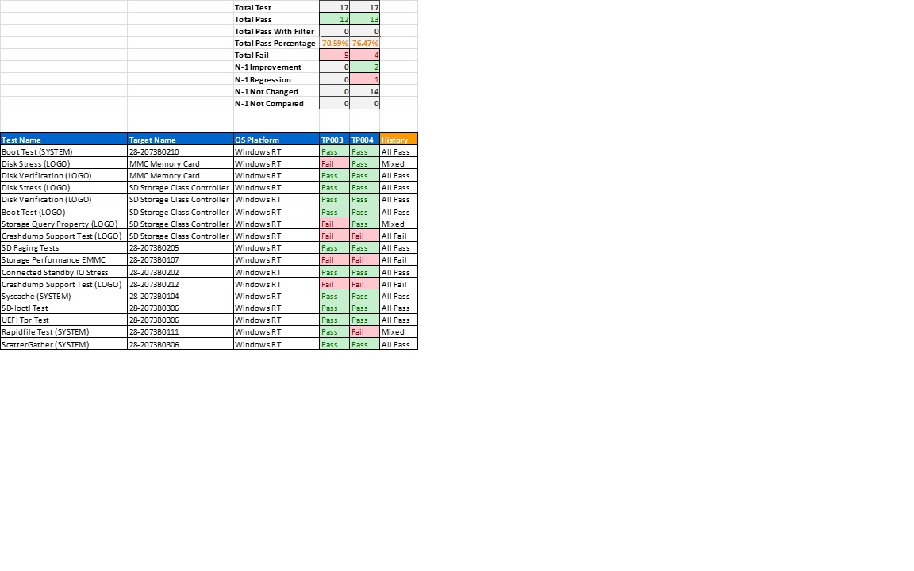

# Analyze test results in Excel


Using Management Tool PowerShell command, you can generate the aggregated list of test results for the project. You can then analyze the aggregated results in Excel.

## <span id="Aggregate_the_list_of_test_results"></span><span id="aggregate_the_list_of_test_results"></span><span id="AGGREGATE_THE_LIST_OF_TEST_RESULTS"></span>Aggregate the list of test results


There are two ways to aggregate the list of test results for a project.

1.  Using the XML-based output files. An example of how you can merge XML-based test results from the Windows PowerShell session that is open on your Controller or test server is shown. In both examples, the use of the master.xml file is optional.

    ``` syntax
    dir -s "c:\temp\*.xml" | Merge-HwCertTestCollectionFromXml -ValidationXmlPath "C:\temp\master.xml" | Export-HwCertTestCollectionToXml -Output "C:\Temp\merged_1.xml"  -TestPassIdentifier “TP003”
    dir -s "c:\temp\*.xml" | Merge-HwCertTestCollectionFromXml -ValidationXmlPath "C:\temp\master.xml" | Export-HwCertTestCollectionToXml -Output "C:\Temp\merged_2.xml"  -TestPassIdentifier “TP004”
    ```

2.  Using the project, .hlkx output files. An example of how you can merge .hlkx output files from the Windows PowerShell session that is open on your Controller or test server is shown.

    ``` syntax
    dir -s "c:\temp\*.hlkx" | Merge-HwCertTestCollectionFromPackage -ValidationXmlPath "C:\temp\master.xml" | Export-HwCertTestCollectionToXml -Output "C:\Temp\merged_1.xml" -TestPassIdentifier “TP003”
    dir -s "c:\temp\*.hlkx" | Merge-HwCertTestCollectionFromPackage -ValidationXmlPath "C:\temp\master.xml" | Export-HwCertTestCollectionToXml -Output "C:\Temp\merged_2.xml" -TestPassIdentifier “TP004”
    ```

The aggregated list of test results (C:\\temp\\merged.xml) includes information for the full list of tests, not just the filtered list of tests. Because of this if any of the required tests were never run, the aggregated list of tests results will show that a required test was not run. Additionally, because all test results are merged, running multiple test runs with the same TestPassIdentifier attribute name value could create inconsistent results reporting. Instead, use a different name for each test pass.

## <span id="Generate_an_Excel_spreadsheet_from_the_aggregated_results"></span><span id="generate_an_excel_spreadsheet_from_the_aggregated_results"></span><span id="GENERATE_AN_EXCEL_SPREADSHEET_FROM_THE_AGGREGATED_RESULTS"></span>Generate an Excel spreadsheet from the aggregated results


Once you have created an aggregated list of test results, you can generate an Excel spreadsheet by using commands in the Windows PowerShell session on the Controller or test server. An example of the commands that will create the Excel spreadsheet report is given below.

``` syntax
New-HwCertTestCollectionExcelReport ("C:\Temp\merged_1.xml", "C:\Temp\merged_2.xml" ) -ExcelPath 'c:\temp\report.xls' -ResultCount 1 
```

Where ResultCount is defined as the maximum number of the most recent results, stored in the Excel report for each test.

An example of the output created after running the commands to create an Excel spreadsheet report is shown below.



The resulting Excel report will contain the following headings:

-   Total Test – The total number of tests in this test pass.

-   Total Pass – The total number of results in this test pass

-   Total Pass With Filter – The total number of passes with an errata filter applied to the test.

-   Total Pass Percentage – Percentage of passing tests (Total Pass / Total Test).

-   Total Fail – The total number of fails in this test pass (Total Test – Total Pass).

-   N-1 Improvement – Between this test pass and the previous test pass (column to the left), how many new passes were achieved.

-   N-1 Regression - Between this test pass and the previous test pass (column to the left), how many new fails were encountered.

-   N-1 Not Changed – Between this test pass and the previous test pass (column to the left), how many tests did not have a change in result outcome.

-   N-1 Not Compared - Between this test pass and the previous test pass (column to the left), how many tests were not compared due to the test was only available in only one of the test passes.

 

 


