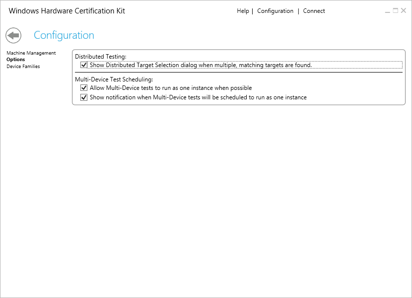
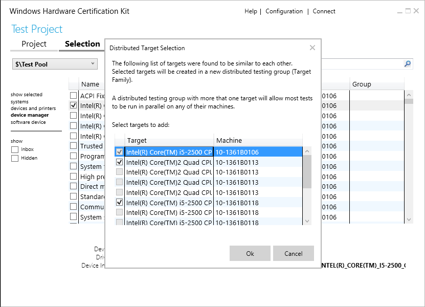

# Configuration Page - Distributed and Multi-Device Options

The Configuration Options page lets you configure target selection for distributed testing and multi-device support.

## Distributed Testing

By default, the HCK tries to enable distributed testing by combining similar selected targets. In HCK 2.0, this was accomplished by selecting each target individually and letting the HCK combine the targets together under the same target family. When checked, this feature provides a dialog to allow you to select all similar targets at the same time (rather than one at a time).

When the first target is selected, the UI will do a pre-scan of all targets to see if there are any similar targets that can be combined under the same target family for distributed testing. If there are other (non-selected) targets that are similar, the **Distributed Target Selection** dialog will appear and allow you to select one or more additional targets.

Additionally, the dialog lets you know if the target you selected would be added to an existing target family. If there is an existing target family and there are tests running, you have the option to check the **Reschedule queued distributable tests to include selected targets** option. This is known as *dynamic pool growth*. When this option is checked, the HCK will attempt to reschedule any queued (non-running) tests to the newly added target (machine).

For more information about how targets are matched and the selection dialog, see [Select targets for distributed testing](select-targets-for-distributed-testing.md).

To enable distributed testing:

1.  In Windows HCK Studio, click **Configuration**.

2.  From the left-pane, select **Options**.

3.  Select **Distributed Testing** checkbox.

The feature is now configured. When you create a new project and select a target to test, the kit will prompt you if distributed testing is supported for that target. You have the option of specifying what computers to use for distributed testing.

## Multi-Device Test Scheduling

This feature lets you run single instances of tests across multiple targets in a multi-device object. This feature is designed to reduce test time, especially for multi-function devices with many dev nodes, such as a multi-function printer. The following are limitations of the feature:

-   Test must support multi-device scheduling. This is indicated by the multi-device symbol ().

-   Tests are identical but are associated with different targets on the same test device. You cannot consolidate different test.

-   Only one log file is generated for each group of test. The log file contains the results for all targets under test.

-   When one instance of the test fails against a single device node, all instances report failure. To troubleshoot specific dev node test failures, it may be necessary to either run tests one at a time, or disable multi-device testing to identify the root cause of the failure.

To enable multi-device scheduling:

1.  In Windows HCK Studio, click **Configuration**.

2.  From the left-pane, select **Options**.

3.  Select **Allow Multi-Device Tests to run as one instance when possible** checkbox.

Additionally, selecting **Show notification when Multi-Device tests will be scheduled to run as one instance**, will display a dialog after scheduling tests that gives a summary of tests scheduled in a multi-device fashion. This dialog will only show if **Allow Multi-Device Tests to run as one instance when possible** is checked.

## Deselecting Dev Nodes on Eligible Devices

In addition to multi-device testing, you can further reduce test time on certain devices like multi-function printers, storage devices, and mobile broadband devices by deselecting some device nodes. Removing device nodes reduces the number of test run against the device. An eligible device must meet the following criteria:

-   The device exposes a child node of the parent type: USB Composite Device or Internal USB Hub.

    AND

-   The child node **ONLY** exposes DevFund types (i.e. only displays feature of type “Device.Devfund.\*”)

The parent nodes themselves (USB Composite Device or Internal USB Hub) must be tested and may not be deselected.

[Download the video (MP4)](http://content4.catalog.video.msn.com/e2/ds/3942b58c-c0ab-4c92-add7-578bc34979f0.mp4)

**Part 1: Identify eligible devices that can be deselected.**

1.  From your test client, open Device Manager, select **View&gt;Devices by connection**.

2.  Find the parent nodes: **USB Composite Device** or **Internal USB Hub** node that represents your device.

3.  For each potential eligible device (child node) found, follow the instructions in **Part 2** to determine if the child node meets the criteria and how to exclude it from testing.

**Part 2: Determine if the device meets the criteria.**

1.  On your controller, open HCK Studio and create a project for the device.

2.  Switch to the **Selection** tab and choose the **Device Manager** option in the left pane. HCK Studio displays a list of targets found on your device.

3.  Right-click on each target name identified in **Part 1** and select **Add/Modify Feature**.

4.  Scroll through the list of features associated with that target to determine if the target can be excluded from testing.

    -   If *Device.Devfund* features are the **ONLY** features selected (grey check mark), then this target can be deselected. Close the list box and deselect the target from the list. You will be prompted to confirm the deletion. Choose **Yes**.

    -   If the list contains other non-Devfund features, then this target **cannot** be deselected.

5.  Repeat **Steps 3** and **4** until all eligible devices are deselected.

    You can switch to the **Test** tab and schedule and run tests.

 

 

