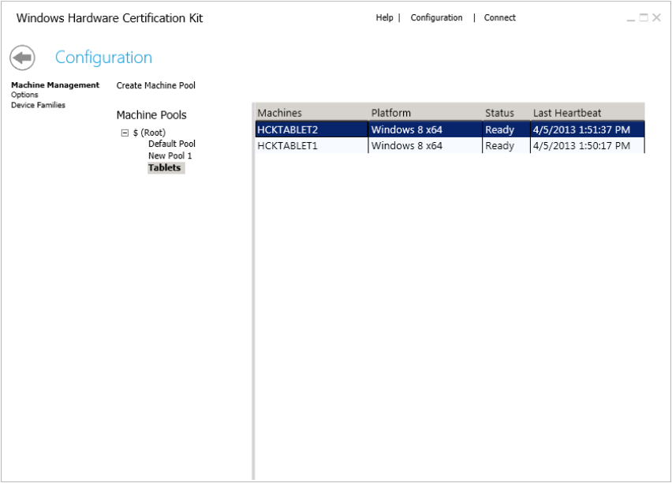

# Configuration Page - Machine Management

The Configuration page lets you manage your test clients and machine pools. A *machine pool* is a logical grouping of one or more test computers. After you install Windows HCK Client on each test computer, the computers are automatically added to the default pool. Before you can work with a test computer, you must move it to a working machine pool.

Every project needs a machine pool. A machine pool can be used for multiple projects, but each project can only be associated with one machine pool.

## Create a machine pool

1.  In Windows HCK Studio, click **Configuration**.

2.  Select existing machine pool and click **Create Machine Pool** or right-click an existing machine pool, and select **Create Machine Pool**.

    The new pool is named "New Pool 1" by default. You can change that by typing a different name and then pressing Enter.

3.  Click **Default Pool**, and then confirm that each test computer appears in the main pane. If you've installed the Client software on multiple test computers, you can add any of them to the pool.

    >[!NOTE]
    >  
    A computer can't be in more than one pool at a time.

     

4.  Select the test computer, and then drag it to the newly created pool.

5.  Under **Machines**, right-click the test computer, click **Change Machine Status**, and then click **Ready**.

    The **Status** column changes to **Ready**.

    >[!WARNING]
    >  
    You cannot schedule a test against a computer with status equal to **NotReady**. A computer cannot be set to ready while in the Default pool.

     

6.  Repeat for each test computer that you want to include in the pool.

7.  Click the Back arrow to return to the main area of Windows HCK Studio.

After all of the test computers are assigned to a pool, you're ready to select targets and run tests against those computers.

## Delete a test computer

There are several options for deleting a test computer from your HCK environment. You can delete a test computer from a project for reallocation to other projects or completely remove it from your environment.

If you are upgrading your Test Server to a newer version, you must uninstall and reinstall HCK Client on each test computer.

1.  Within a project on the Selection tab, unselect the targets associated with the test computer. This will disassociate the test computer from the project. The test computer is now available to other projects.

2.  Uninstall the HCK Client from the test computer.

3.  Delete the test computer from the machine pool.

>[!NOTE]
>  
If you do not uninstall HCK Client after deleting a test computer from the machine pool, the test computer will reappear in the machine pool. Once you uninstall HCK Client, the association between tests and results are broken. The package will contain the test results, but no log files associated with that client.

 

## Reinstalling Clients

If you need to reinstall HCK Client on a test computer, the test results will be lost. To preserve the test data, create a package before removing the test client. Create a new project and merge the package. For more information on merging, see [Merge packages](merge-packages.md) topic.

 

 

