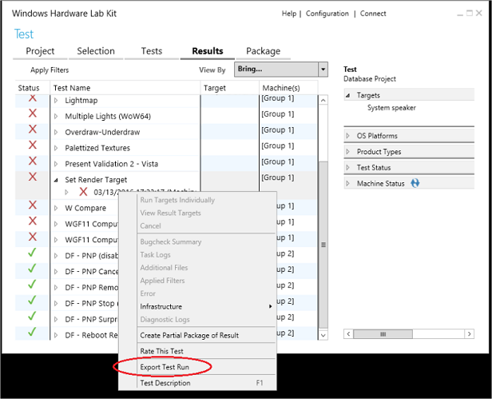
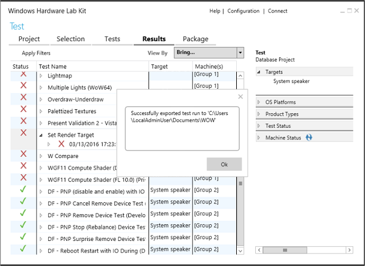

# Exporting a Failed HLK Job


You can now export a failed job so that it can be run on a machine outside of the full HLK environment. For driver developers, this feature allows standalone execution of the test to simplify the process of reproducing failures.

An exported test environment closely simulates a dedicated HLK environment. This does not guarantee identical test execution, however. A user might need to handle any of the following circumstances:

-   Reboots are not handled by the test infrastructure. The user will have to manually restart the system in many cases.
-   There may be cases where the test reboots the system through the HLK Client infrastructure within a test task. These reboots may not be captured in the batch file as prompts or reboots during standalone execution, for example.
-   Non-uniquely named log files written to the same location by different tasks might result in some of these files being overwritten.
-   Parameters written to the batch file may differ when running on different systems. As an example, hardware instance IDs can differ for the same hardware and driver when moved to a different system, and the user will have to look up the corresponding target value (from Device Manager, for example) and update the batch file with the correct value.
-   Tests that depend on an associated configuration job to configure the system may not be prepared correctly as HLK only exports the test job itself.

Not all results can be exported. The following list describes the limitatons on the tests and test results that are exportable.

-   Tests must have been executed and complete with a a passed, failed, or cancelled status.
-   The test run must successfully return infrastructure logs from the client system. These files are necessary to export the test.
-   Only single machine tests can be exported. Tests that require multiple machines to execute are not exportable.
-   Tests must be run using the HLK desktop client. Test runs on Windows core or Proxy Mobile Client systems are not exportable.
-   Tests tagged as non-exportable due to known infrastructure issues or other reasons are not exportable.

1.  In the **Results** tab in HLK Studio, right-click on the failed result, and select **Export Test Run**.

    

2.  A save dialog appears. Save the exported job to a flash drive or other external location so that you can take the exported test to another machine. The same test cannot be exported to the same location more than once. A dialog will confirm that the export completed.

    

3.  The test binaries and a batch file required to execute the test on a standalone system are exported to the specified directory. The exported test is saved in a subdirectory with the name and architecture of the failed job. Infrastructure components that must be installed to run the test is saved in a subdirectory called **Infrastructure** along with the name of the architecture to which the infrastructure is targeted.

    >[!NOTE]
    >  Infrastructure components should be installed only once on the target system. You do not need to reinstall these components for each failed job.

    As an example, saving a failed x64 job titled **Set Render Target** on the root of drive E:\\ exports the job folder and the infrastructure installer using the following folder structure:

``` syntax
E:.
├───Infrastructure(X64)
└───Set_Render_Target(X64)
    ├───CoreClr
    ├───MinTe
    │   └───CoreClr
    ├───NetFx2.0
    ├───NetFx4.5
    ├───verifysupportfiles
    │   ├───CoreClr
    │   ├───MinTe
    │   │   └───CoreClr
    │   ├───NetFx2.0
    │   └───NetFx4.5
    └───[windir]
        └───system32 
```

    The exported test package contains several files and subfolders, including the following:

    -   readme1st.txt - contains information for how to run the exported test
    -   run.cmd - batch file that is used to run the test
    -   binaries and other files required to run the test
    -   setup(*architecture*).exe – install executable that is used to install the infrastructure

4.  Take the exported test folder to the new machine for testing. The path should not contain any spaces, as this will cause some tests to fail.

5.  Execute (save folder)\\Infrastructure(*architecture*)\\setup(*architecture*).exe to install the infrastructure components before running the test. The infrastructure installer will display a dialog box that indicates whether the install of the components was successful.

    >[!NOTE]
    >  Infrastructure components should be installed only once on the target system. You do not need to reinstall these components for each failed job.

    >[!NOTE]
    >  The architecture of the installer and the job must match the architecture of the target system on which it is installed.

     

6.  Within the batch file in the (*save folder*)\(*job name*)(*architecture*) folder, you can make any necessary changes to the batch file to run on your test machine. As examples, you might make the following changes:

    -   Commenting out lines that do not contribute to job failure
    -   Changing parameter values to match the machine on which the exported test is run. For example, the instance ID of the same hardware often differs on two separate systems, so this would need to be updated before running the exported test.
    -   Adding commands to connect a debugger

    >[!NOTE]
    >  If a task shows the error message "This test cannot be run as it might reboot the machine.", you must edit run.cmd, and append **/rebootstatefile=(some\_file\_name)** to the command line of the failing task, as shown in the example below:
    ``` syntax
    cmd /c TE.exe /inproc /enablewttlogging /appendwttlogging devfund_pcirootportsurpriseremovetest_wlk_certification.dll 
    /p:"MultiDeviceHardwareIdSdelQueryHardwareID=!MultiDeviceHardwareIdSdelQueryHardwareID!" 
    /p:"MultiDeviceInstanceIdSdelWDKDeviceID=!MultiDeviceInstanceIdSdelWDKDeviceID!" /p:"DQ=!DQ!" 
    /p:"TestCycles=!TestCycles!" /p:"IOPeriod=!IOPeriod!" /p:"WDTFREMOTESYSTEM=!WDTFREMOTESYSTEM!" 
    /p:"Wpa2PskAesSsid=!Wpa2PskAesSsid!" /p:"Wpa2PskPassword=!Wpa2PskPassword!" 
    /p:"DriverVerifierAdditionalDrivers=!DriverVerifierAdditionalDrivers!" 
    /p:"DriverVerifierExcludedFlags=!DriverVerifierExcludedFlags!" 
    /p:"DriverVerifierCustomizeConfiguration=!DriverVerifierCustomizeConfiguration!" 
    /rebootStateFile=rebootstatefile.xml
    ```

     

7.  Once you are finished with modifications, start a command prompt with administrative privileges, change to the test directory, and execute run.cmd. Each task in the batch file is associated with a task number that can be used as a starting point when running the batch file. By default, execution pauses in between tasks. The following execution modes are supported:

    -   "Run" with no parameters starts execution at the beginning of the batch file, with a pause in between each task.
    -   "Run 5" will start the batch file and skip to task 5.
    -   "Run FAST" starts the batch file in fast mode (no pause in between tasks) at the beginning.
    -   "Run 5 FAST" will start the batch file in fast mode (no pause in between tasks) at task 5.
    -   "RebootResume" will start the batch file from the last reboot from the last execution of the script. The FAST flag is also supported.
    -   "RerunLast" will start the batch file from the command that was running when the batch file last exited. This command can be used to re-run a task multiple times by pressing Control+C to exit the script during the task and running rerunlast.cmd to re-run the previous command. The FAST flag is also supported.

8.  Once you identify and fix the issue that is causing the test to fail, you can deploy the fix and verify that the job succeeds within the HLK environment.

    >[!NOTE]
    >  You cannot import successful results back into the HLK environment. You must re-run the job from within the environment.

     

 

 


