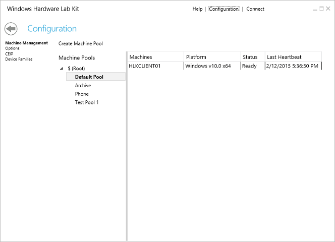

# HLK Studio - Configuration Page

The HLK **Configuration** Page contains the following:

-   **Machine Management** – use this option to create and manage machines and machine pools, and to configure Windows HLK Client Kernel Debugger settings.

-   **Options** – use this option to manage distributed target selections and multi-device testing.

-   **Device Families** – use this option to manage device families.

On this tab, you can perform the following tasks:

-   [Create a machine pool](..\getstarted\step-3-create-a-machine-pool.md)

-   [Manage machines](configuration-page---machine-management.md)

-   [Manage device families](configuration-page---device-families.md)

-   [Manage distributed and multi-device options](configuration-page---distributed-and-multi-device-options.md)

-   [Manually configure HLK Client kernel debugger settings](..\user\manually-configure-hlk-client-kernel-debugger-settings.md)

 

 

