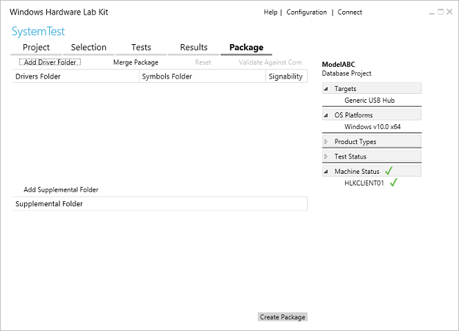

# HLK Studio - Package Tab

The **Package** tab lets you package test results into a single HLK package (.hlkx file). Depending on your scenario, you can:

-   Create a submission package to get your device certified.

-   Create a package that you can merge with other packages later.

-   Create a package that can be shared with others (for example, troubleshooting with customer support).

-   Create driver only packages.

-   Merge packages.

>[!IMPORTANT]
>  
To submit a package for certification, your package must be digitally signed.

 

On this tab, you can do the following tasks:

-   [Digitally sign an .hlkx package](digitally-sign-an-hlkx-package.md)

-   [Create a driver only update package](create-a-driver-only-update-package.md)

-   [Add driver and supplemental content to your package](add-driver-and-supplemental-content-to-your-package.md)

-   [Merge packages](merge-packages.md)

## Related topics

[Getting Started: Create a submission package](..\getstarted\step-8-create-a-submission-package.md)

[HLK Signing with an HSM](hlk-signing-with-an-hsm.md)

 

 

