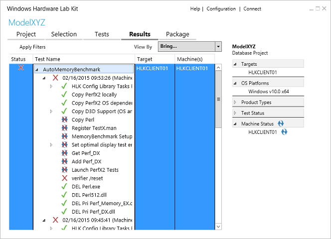
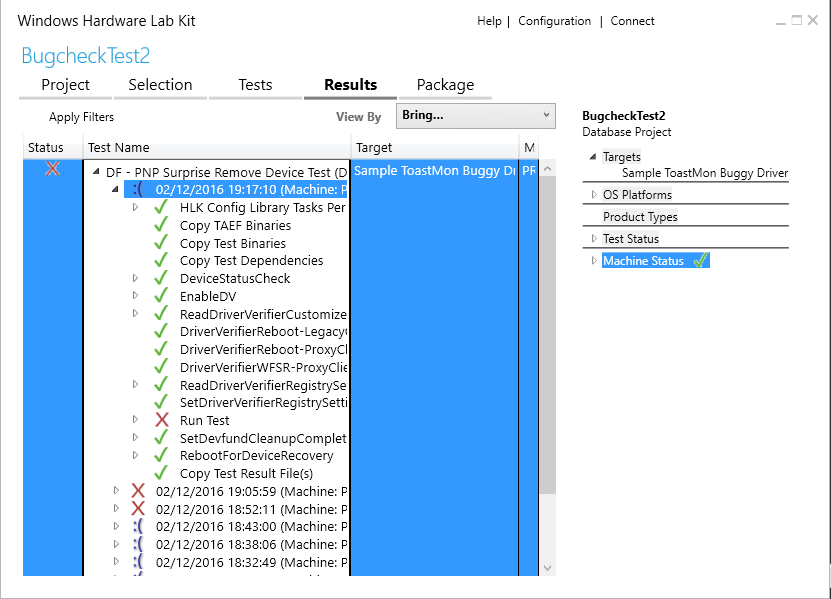
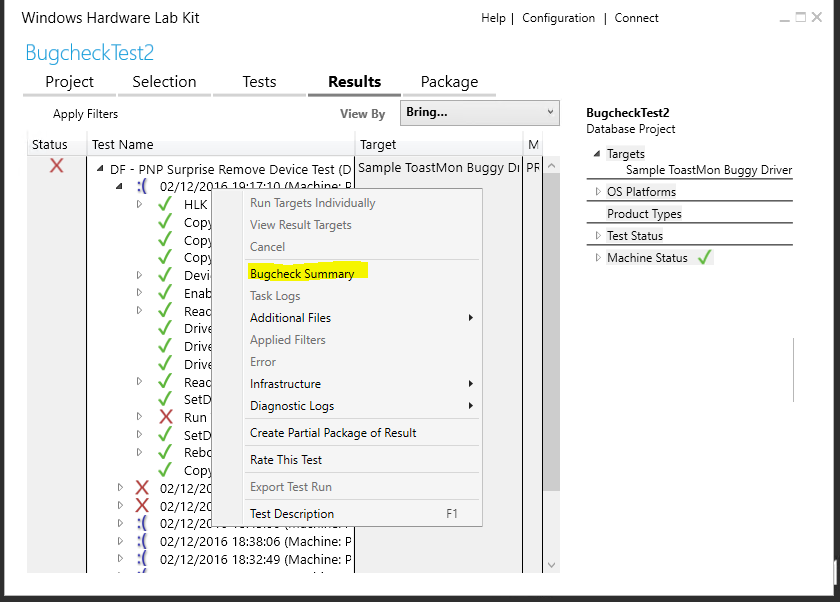
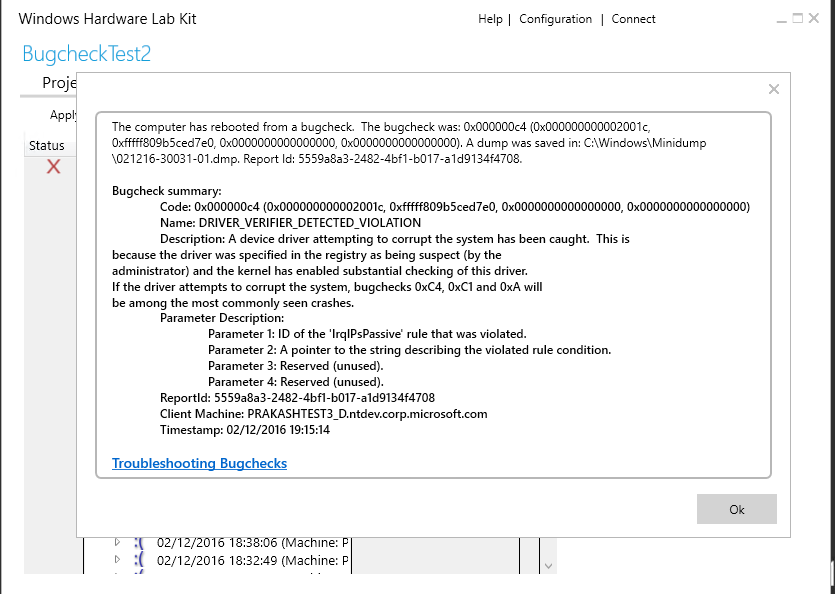

# HLK Studio - Results Tab

**Figure 1 Results Tab**

The **Results** tab displays detailed information about each test. When each test completes, the **Status** column updates with the result: **Pass** or **Fail**. You can expand any test in the **Test Name** column to see more information about that test.

The following list describes the **Results** Tab:

-   If you run a test more than one time, the HLK displays the results for each test run.

-   If you delete a test result, you must restart HLK Studio to refresh the test results.

>[!NOTE]
>  
Any test that could be schedules as a multi-device test displays by using the multi-device icon. Multi-device-specific menu options let you reschedule a multi-device test to run as multiple non-multi-device test run equivalents, and let you see the system and targets against which the tests were scheduled. If a test run fails when it is run in multi-device mode and you suspect that one device that was consolidated into the single result is causing the failure, you can use this option to schedule each test device in its own test run (that is, without consolidating multiple devices into a single test run), to scope the failure down to a single device under test.

 

## Test status

In the **Detailed Test** pane, the **Status** column shows you the status of each test that has run or is running.

<table>
<colgroup>
<col width="33%" />
<col width="33%" />
<col width="33%" />
</colgroup>
<thead>
<tr class="header">
<th>Status Icon</th>
<th>Meaning</th>
<th>Description</th>
</tr>
</thead>
<tbody>
<tr class="odd">
<td></td>
<td>Queued</td>
<td>The test is queued but not running. If the test is in this mode for a long time, it can indicate a network infrastructure or Windows HLK infrastructure problem. In most cases, this does not indicate an issue with the test itself.</td>
</tr>
<tr class="even">
<td></td>
<td>Running</td>
<td>The test is running. On the <strong>Tests</strong> tab, the <strong>Length</strong> column indicates the expected test runtime. This information is also available in the test reference topic for the specific test. If a device encounters issues during testing, the tests can run for three to four times the expected runtime.</td>
</tr>
<tr class="odd">
<td></td>
<td>Passed</td>
<td>The test passed.</td>
</tr>
<tr class="even">
<td></td>
<td>Passed with Filters</td>
<td>The test passed.</td>
</tr>
<tr class="odd">
<td></td>
<td>Failed</td>
<td>The test failed.</td>
</tr>
<tr class="even">
<td></td>
<td>Failed with Filters</td>
<td>The test failed.</td>
</tr>
<tr class="odd">
<td></td>
<td>Failed due to system crash</td>
<td>
The system crashed during the test run. You can right-click on this test to view Bugcheck information.

For more information about reviewing system crashes, see [Troubleshooting Windows HLK Test Failures (system crashes)](troubleshooting-windows-hlk-test-failures.md#sysx).
</td>
</tr>
<tr class="even">
<td></td>
<td>Canceled</td>
<td>A user canceled the test, or a task has been canceled because the preceding task failed.</td>
</tr>
</tbody>
</table>

>[!NOTE]
>  
If a filter is applied to a child library job, when all the tasks of the library job are filtered, the child library job itself can still show as unfiltered. This does not impact the submission package.

 

## Test failures with system crashes

In the list of test results on the Results tab, a system crash icon () is shown for each test that fails due to a system crash.

>[!NOTE]
>  This feature is available only for Desktop client and server machines.

 

When you right-click on one of these tests, the context menu now contains a Bugcheck Summary menu item.

Click on this menu item to display the Bugcheck Summary dialog. The dialog contains Bugcheck information along with a link to additional help documentation.

>[!NOTE]
>  
If a crash dump file is available, the dialog contains a link to help documentation for working with crash debug information.

If a crash dump file is not present, the dialog contains instructions on how to enable crash dump collection. You'll need to re-run the test to obtain the crash dump file.

 

For more information on system crashes, including how to analyze crash dump files, see [Troubleshooting Windows HLK Test Failures (system crashes)](troubleshooting-windows-hlk-test-failures.md#sysx).

## Exporting failed HLK jobs

You can now export a failed job and re-run it on a machine that does not have the HLK Client installed. For more information, see [Exporting a Failed HLK Job](exporting-a-failed-hlk-job.md).

## Diagnostic log files

In the case of a test failure, you can view the available diagnostic log files by right-clicking the target machine name in the **Test Name** column and then clicking **Diagnostic logs**, as shown in *Figure 3 Diagnostic Log Files*:

**Figure 3 Diagnostic Log Files**

The displayed logs can be the following types, depending on the test:

-   **Kernel crash dumps**. Kernel crash dumps are disabled by default. To collect kernel crash dumps, see [Manually Configure HLK Client Kernel Debugger Settings](..\user\manually-configure-hlk-client-kernel-debugger-settings.md).

-   **Event logs**. Windows HLK collects all of the warning, error, and critical events that occurred during the test run:

    -   System

    -   Application

-   **Setup logs**:

    -   Setup API. Windows HLK collects Setup API logs if they are available on a client machine during a test run. Windows HLK does not check to see if the file stamps for Setup API log files are in the same range as the test run.

    -   Setup DEV

-   **UMDF Diagnostic logs**

    For machines that are running a client operating system version Windows 8 or later, the Windows HLK Infrastructure enables [Microsoft Application Verifier](http://go.microsoft.com/fwlink/p/?linkid=313882) on the UMDF host process (**Wudfhost.exe**) by using all basic tests and checks. The basic Application Verifier checks for the following:

    -   Exceptions

    -   Handles

    -   Heaps

    -   Leak Locks

    -   Memory

    -   SRWLock

    -   Threadpool TLS

    If the UMDF driver fails any of these checks during device testing, an Application Verifier log is created that records the type of failure and the stack trace at the point where the failure occurs. Multiple Application Verifier logs are generated if the driver causes exceptions that crash **WudfHost.exe**. We recommend that you fix all reported failures for your UMDF driver.

    If the client machine is running under a kernel debugger, enabling Application Verifier on **Wudfhost.exe** causes a debug break when an error or exception occurs. You can use the [!avrf](http://go.microsoft.com/fwlink/p/?linkid=313881) extension to help analyze Application Verifier breaks. In addition, UMDF debugger extensions can be used to debug UMDF drivers; see [Using UMDF Debugger Extensions](http://go.microsoft.com/fwlink/p/?linkid=313884) for more information. The following diagnostic logs are copied to the controller for diagnosing UMDF driver failures.

    -   **Application Verifier logs**

        Application Verifier logs in the form **appverif\_WUDFHost.exe.\*.dat** can be viewed by using an Application Verifier UI client. You can use the Application Verifier tool that is installed on the client machines. Copy logs to the directory **%VERIFIER\_LOG\_PATH%\\AppVerifierLogs** before you run **Appverif.exe - VERIFIER\_LOG\_PATH**. The path variable is already set to **%systemdrive%** on the Windows HLK client. You can also add symbol paths to resolve the symbols in the stack frames where the errors or exceptions have occurred.

        >[!NOTE]
        >  
        The logs are generated in binary format and are architecture-specific. To view the logs, you must use an Application Verifier tool on a client that has the same architecture as the computers on which the logs were generated. See the Application Verifier tool Online Help for more information.

         

    -   **UMDF crash dumps**

        UMDF dump files are of the form **UM\_&lt;guid&gt;.dmp** and are created whenever a UMDF driver causes the Host Process to terminate.

## Related topics

[Getting Started: View test results and log files](..\getstarted\step-7-view-test-results-and-log-files.md)

[Analyze test results in Excel](analyze-test-results-in-excel.md)

 

 

