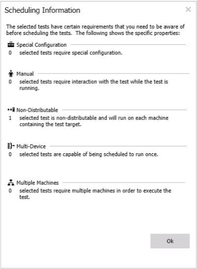
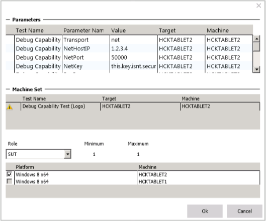

# HLK Studio - Tests Tab

The **Tests** tab displays all of the tests that are associated with the features that are found on a device. You can schedule a test by selecting its corresponding checkbox. You can press **F1** key on any test name to get more information about that test.

You can filter and sort the test results by the following criteria:

-   Level (Basic, Functional, Reliability, Certification, Experiences, Optional)

-   Name

-   Type (manual, distributed, special configuration)

-   Length

>[!NOTE]
>  
A grayed-out test indicates one of the following states:

-   The machine with the selected target is unavailable (debug mode or missing, etc.)

-   The project is opened from a package, which means the date is read-only.

 

## Test Type Definition

The Type column provides additional information about each test. Some tests require additional configuration and/or manual interaction. Use this information in addition to **F1** key to plan your testing strategy.

The **View Details** option defines each icon and displays the number of tests are found for each type. It is important that you review this information before you schedule any test, especially special configuration tests that require additional configuration before they can be run.

-   **Special Configuration** – this test requires hardware or software configuration changes before it is run; you must read the test documentation to determine what steps are needed.

-   **Manual** – this test requires manual interaction with the test on the target system while the test is running; you must read the test documentation to determine what input is required.

-   **Non-Distributable** – this test is required to run on each target in the target family.

## Test Parameters

Some tests require additional parameters before they can be run. When you select a test that supports parameters, the following parameter dialog appears:

>[!NOTE]
>  
The parameter dialog displays only when you schedule (run) the test. If you schedule multiple tests that require parameter input, the parameter dialog displays all the parameters. For additional help on each parameter value, click the **F1** key.

 

## Related topics

[Getting Started: Select and run tests](..\getstarted\step-6-select-and-run-tests.md)

 

 

