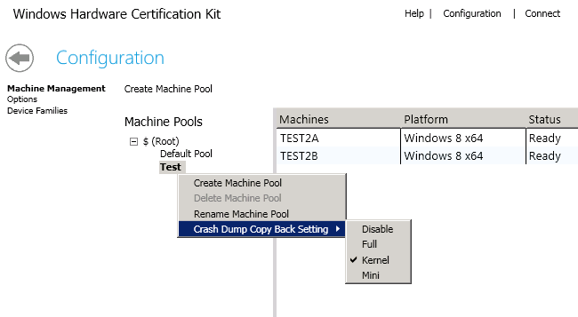

# Manually Configure HLK Client Kernel Debugger Settings

During driver development, you might want to debug crashes in the kernel. To do this, you must enable kernel debugging.

From the computer on which you installed the debugger, follow these steps:

1.  Click **Start**, point to **Programs**, point to **Debugging Tools for Windows**, and click **Debugging Help**.

2.  Click the **Search** tab in the **Debugging Tools for Windows** window, type **"Kernel-Mode Setup"** (including quotes), and click **Search**.

3.  Read the topic **Kernel-Mode Setup**.

## Configure HLK Crashdump collection settings

You can also configure the kernel crash dump collection setting in HLK Studio. This setting will force a setting of the kernel dump type on the client system when a crash occurs. When a crashed occurs, HLK will copy back the dump file and associate it with the underlying test.

>[!NOTE]
>  
System and UMDF crash dump are not collected by default. You must enable this feature for each machine pool, and you must choose one of three dump types, which are *Mini*, *Kernel*, and *Full*. If server disk size is not an issue, we recommend that you use Full dumps. For more information about dump types, see [Varieties of Kernel-Mode Dump Files](http://go.microsoft.com/fwlink/p/?linkid=313314).

 

The steps to configure this setting are as follows:

1.  From HLK Studio, click **Configuration** option.

2.  Select a machine pool on which to apply the kernel crash dump setting.

3.  Right click on the machine pool.

4.  Select the dump setting from the following options:

    1.  Disable

    2.  Full

    3.  Kernel

    4.  Mini

The crash dump collection setting is set on all machines in the specified machine pool, but it is not set for machines in any child machine pools. If you select **Disable**, the machine’s crash dump settings will persist on the client machine, but the crash dump collection for Windows HLK is disabled.

 

 

