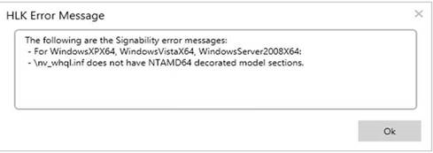

# Troubleshooting Windows HLK Studio and Windows HLK Manager


This topic describes how to troubleshoot issues with the Windows Hardware Lab Kit (Windows HLK) Studio and Windows HLK Manager.

For help with problems that occur during Windows HLK Studio and Windows HLK Manager setup, see [Troubleshooting Windows HLK Setup](troubleshooting-windows-hlk-setup.md).

**In this topic:**

-   [Archive is no longer supported](#archive)

-   [An error message displays that is not specific to the failure](#nonspecific)

-   [Failed to start the task: Failed to GetUserToken](#getusertoken)

-   [Show all context menu command causes UI to become unresponsive when large (GB+) files are present](#gbplus)

-   [System name is wrong in the machine pool](#sysname)

-   [Test does not recover after a critical error](#criterr)

-   [Test fails without an error](#withouterr)

-   [Test list does not update after configuration changes](#testlist)

-   [Unsupported scenario](#unsupp)

-   [Windows HLK Studio crashes if updates are applied to the Controller](#updates)

-   [Unable to determine the identify of domain error](#iddomain)

-   [During packaging, the Signability test reports errors when attempting to sign for down level operating systems](#signability)

## <span id="archive"></span><span id="ARCHIVE"></span>Archive is no longer supported


The archive state, available in HLK Manager, and the Archive pool should not be used under any circumstances.

## <span id="nonspecific"></span><span id="NONSPECIFIC"></span>An error message displays that is not specific to the failure


An error message appears that is not specific to the failure; it is the general error message that displays when the UI encounters an exception it has not specifically handled:

**HLK Failure**

**HLK Studio encountered a critical failure and needs to exit now.\\n\\nPlease see Event Viewer for more details.**

An exception is listed in the event log; however, the listed exception is not specific to the failure.

A workaround for this problem is to create a new project and restart testing again. The old project is corrupted.

You might be able to delete the results that are generated by the logical machine set (LMS) jobs that created this condition, but the names of the jobs are not the same for each instance.

## <span id="getusertoken"></span><span id="GETUSERTOKEN"></span>Failed to start the task: Failed to GetUserToken


If the Windows HLK Client computer that is running the test does not have an active user logged in to an available session, this error message might appear:

**Failed to Start the Task" : "Failed to GetUserToken for…**

If you get this error, make sure that the Windows HLK Client computer is not locked or logged off.

## <span id="gbplus"></span><span id="GBPLUS"></span>Show all context menu command causes UI to become unresponsive when large (GB+) files are present


The **Show all** context menu command makes a copy of the log files to which the location points. Kernel and full dump files can be very large and can take a very long time to be copied. When the **Show all** command is used with very large files, the UI becomes unresponsive as it waits for the copy to complete.

The best way to get to a large kernel, log or dump file, is to go to the actual location where the file exists. To get to a dump file, open the DiagnosticLogManifest\* file. (This is one of the logs that is populated by the client to the Diagonistic Logs context menu in the **Results** tab.) The contents are similar to the following:

``` syntax
<?xml version="1.0" encoding="utf-8"?>
<DiagnosticLogs>
  <DiagnosticLog Type="EventLog" Source="C:\Windows\TEMP\Working_b225172c-b7fc-4d9d-9a3e-393dc674b0b4\EventLog\Application.evt" Destination="\\10-1361B0111\HLKLogs\DiagnosticLogs\2a513b38-27df-4681-b0cf-de44148c4923\6a860085-3a5b-48ee-bab4-9adfd23950d4\Application.evt" />
  <DiagnosticLog Type="EventLog" Source="C:\Windows\TEMP\Working_b225172c-b7fc-4d9d-9a3e-393dc674b0b4\EventLog\System.evt" Destination="\\10-1361B0111\HLKLogs\DiagnosticLogs\2a513b38-27df-4681-b0cf-de44148c4923\6a860085-3a5b-48ee-bab4-9adfd23950d4\System.evt" />
  <DiagnosticLog Type="KernelModeCrashDump" Source="C:\Windows\TEMP\Working_b225172c-b7fc-4d9d-9a3e-393dc674b0b4\KernelModeCrashDump\KM_f4330059-0cd4-435c-8ad5-ee226c842409.dmp" Destination="\\10-1361B0111\HLKLogs\DiagnosticLogs\2a513b38-27df-4681-b0cf-de44148c4923\6a860085-3a5b-48ee-bab4-9adfd23950d4\KM_f4330059-0cd4-435c-8ad5-ee226c842409.dmp" />
```

In this content, you can find the node: **DiagnosticLog Type="KernelModeCrashDump"**. You can take the value of the **Destination** attribute to get to the actual location of the dump file on the controller.

## <span id="sysname"></span><span id="SYSNAME"></span>System name is wrong in the machine pool


If the name for a system in the machine pool appears to be randomly generated (for example, RHOQNQHEE77U2), try restarting the Windows HLK Client and Windows HLK Studio. If the problem remains, create a new project.

## <span id="criterr"></span><span id="CRITERR"></span>Test does not recover after a critical error


A test system encounters a critical error, or blue screen, during a test. After rebooting, the test system does not start the next test, and both the test system and the test remain in a **Running** mode. You cannot cancel the test in Windows HLK Studio; Windows HLK Manager fails.

In Windows HLK Manager, select and right-click the test and then select **Delete**. This action deletes the result and forces the test to run again.

>[!NOTE]
>  
Cancelling a running job requires the running test to check with the Windows HLK Controller to see if it has been canceled. Because this job is no longer running on the Windows HLK Client, selecting **Cancel** has no effect.

 

Putting the test machine into a reset state, and continuing on to the next test does not resolve the problem because the running test will never send a message that the test has finished.

A test should recover within a few minutes after a test machine is rebooted from a blue screen event, but if a test fails and causes an unstable state, we recommend that you review the client logs.

## <span id="withouterr"></span><span id="WITHOUTERR"></span>Test fails without an error


Jobs that cancel because they exceed the set time-out do not return a task log or display an error in Windows HLK Studio. To see if a job failed because it timed out, check the job result error messages in Windows HLK Manager. A time-out message is similar to the following:

Result Errors

**\# Message Time Source Machine Name Root Cause**

**1 3/8/2012 1:32:36 PM Execution Agent 10-1361B1222 Failed the Job "timeout"**

**Job Failed And Rest of the Tasks Canceled because Task "timeout task" Failed with Failure Action FailAndStop**

## <span id="testlist"></span><span id="TESTLIST"></span>Test list does not update after configuration changes


If you select a test target and then make a change to a test computer's configuration, such as changing the video card, the list of tests for the test target does not update.

To get an updated test list after making a configuration change, deselect the test target, and then select it again. This action creates a new list of tests based on the test target.

## <span id="unsupp"></span><span id="UNSUPP"></span>Unsupported scenario


Tests fail if you installed Windows HLK Studio on a computer that is joined to a domain and then removed from the domain to join a workgroup.

To continue the test submission in this scenario, change the Windows HLK Studio computer back to its original domain, or uninstall and reinstall Windows HLK Controller and Windows HLK Studio so that all computers are either joined to a domain or are part of a workgroup.

## <span id="updates"></span><span id="UPDATES"></span>Windows HLK Studio crashes if updates are applied to the Controller


Windows HLK Studio crashes and exits when an attempt is made to rerun jobs from Windows HLK Studio. In this case, the jobs have results before a service build update is applied.

For example:

1.  Install servicing build 8324.3

2.  Run all of the jobs under for a specific feature

3.  Install servicing build 8324.4

4.  Select one of the jobs to run. Windows HLK Studio crashes with an error

If the Windows HLK is installed, and a service build update for that version must be applied, all instances of Windows HLK Studio and Windows HLK Manager must to be shut down on the Windows HLK Controller and restarted only when the update procedure is complete. This includes any remote systems that have installed Windows HLK Studio from the Windows HLK Controller.

This prevents submission and content data that is displayed in Windows HLK studio from getting out of sync with updated data on the Windows HLK Controller and causing it to crash during certain operations that access the missing, updated, or new data.  The Windows HLK manager can also, in some cases, lock files in memory that are updated and cause it to fail. (These are generally .pck files.)

To prevent this, all instances of Windows HLK Studio and Windows HLK Manager must be shut down on the Windows HLK Controller, and on any remote systems that have installed Windows HLK Studio from the Windows HLK Controller, before you install a service build update and apply QFEs. Restart Windows HLK Studio and Windows HLK Manager after the update procedure is complete.

## <span id="iddomain"></span><span id="IDDOMAIN"></span>Unable to determine the identify of domain error


When signing some (large) packages using Windows PowerShell, you might see an exception such as "Unable to determine the identity of domain". When this exception occurs, please use the managed API (see [http://msdn.microsoft.com/en-us/library/windows/hardware/jj123504.aspx\#BKMK\_CS\_SignPackage](http://msdn.microsoft.com/en-us/library/windows/hardware/jj123504.aspx)) as a work-around."

## <span id="signability"></span><span id="SIGNABILITY"></span>During packaging, the Signability test reports errors when attempting to sign for down level operating systems


When running the Signability test for down level operating systems (Windows Vista, Windows 2000, Windows XP, or Windows Server 2008), if the driver is not targeted for these operating systems, the test will report errors.

This error can appear in the following ways:

-   In HLK Studio, after creating a driver submission package, right-clicking on the added driver folder and choosing **Signability Results** displays a dialog box similar to the following:

    

-   If using the object model, you might see this issue when calling PackageWriter.AddDriver. ‘errorMessages’ might contain errors for non-targeted down level operating systems. Despite this error, the call to PackageWriter.AddDriver will succeed.

These errors should be treated as warnings and can be safely ignored. You can still submit the package to the hardware dashboard.

## <span id="related_topics"></span>Related topics


[Troubleshooting the Windows HLK Environment](troubleshooting-the-windows-hlk-environment.md)

 

 


